Ćwiczenia 10 -- Ubuntu serwer -- prawa do plików, chown
Zaloguj się na swoje konto imienXYZ, gdzie XYZ oznacza kod klasy i
grupy, np. jank3t1
Jeśli nie masz konta, sudo adduser imienXYZ
1.  Dodaj swoje konto do grupy sudo: *sudo usermod twoje_konto -G sudo*
2.  Sprawdzenie czy jesteśmy w grupie sudo: *id konto*
3.  Załóż katalog **cwicz_upr**, a następnie nadaj mu uprawnienia:
dla właściciela rwx,
dla grupy r-x,
dla pozostałych r\--.
4.  cd cwicz_upr
5.  mkdir cwicz1
6.  Ustaw przynależność katalogu cwicz1 do grupy weba, którą należy
    założyć z numerem     gid=543.
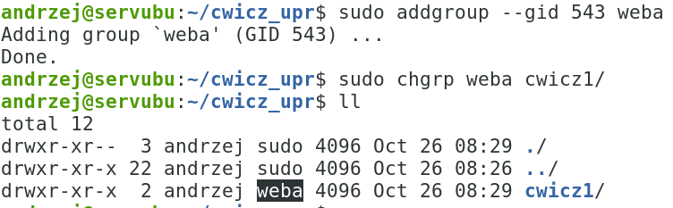
7.  Przejdź do katalogu cwicz1 i utwórz w nim plik prog1.sh, który po
    uruchomieniu     wyświetla napis: „program pierwszy działa!!!".
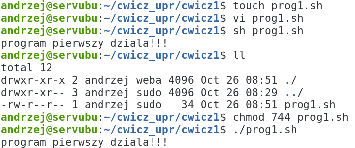
.
8.  Dla pliku prog1.sh ustaw prawa rw**s**r-x---x
9.  Skopiuj prog1.sh na prog2.sh. Plik prog2.sh po uruchomieniu
     wyświetla napis: „program drugi działa!!!".
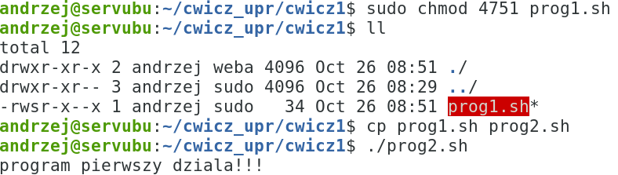
10. Dla prog2.sh ustaw uprawnienia jak dla prog1.sh z wyjątkiem bitu s,
    który ma być     ustawiony dla grupy.

11. W katalogu cwicz1 utwórz katalog cwicz2 z prawami: rwxr-xr-**t**.
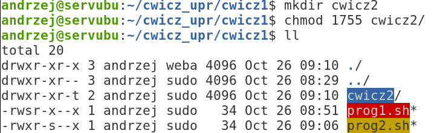
12. W katalogu cwicz2 utwórz plik prog3.sh nadając prawa:
dla właściciela: wszystkie
dla grupy: wx
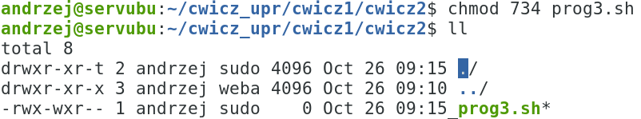
 dla pozostałych: r
13. Ustaw właściciela pliku **prog1.sh** na **root**, a następnie
    przypisz go do grupy **sudo**.
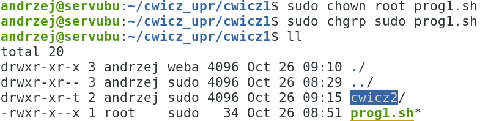
14. 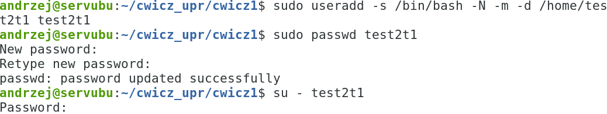
    Załóż konto testXYZ i zaloguj się na
    nie w celu przetestowania.
15. Ustaw właściciela pliku **prog2.sh** na **testXYZ**, a następnie
    przypisz go do grupy **w1**.
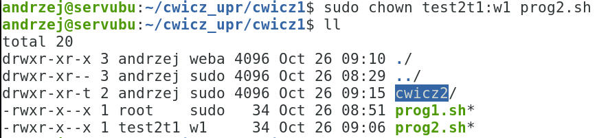
16. Ustaw właściciela pliku **prog3.sh** na **test9**, a następnie
    przypisz go do grupy **w2**.
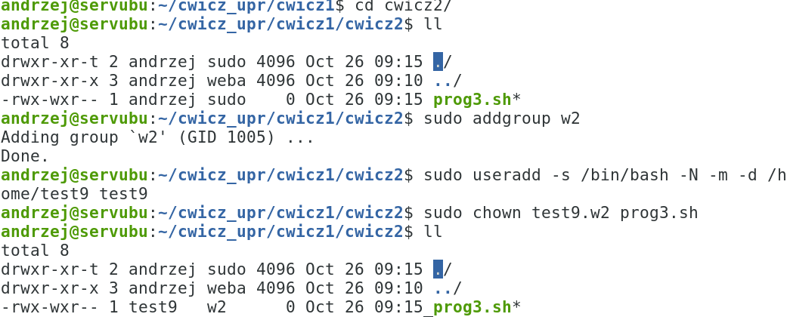
17. Sprawdź możliwość modyfikacji plików użytkownika **test9** w
    katalogu **cwicz2** będąc zalogowanym na koncie **testXYZ** i
    własnym koncie.
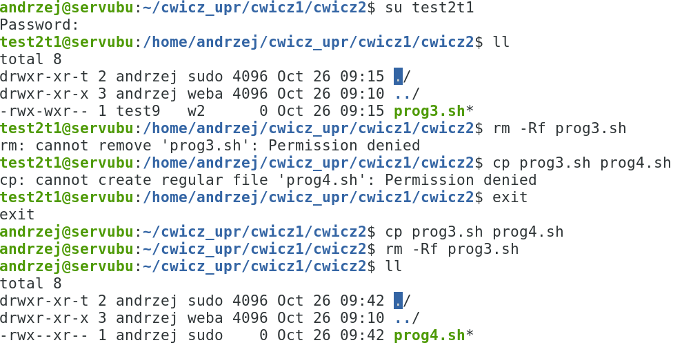
18. Wyszukanie wszystkich plików w katalogu /usr/bin z bitem s dla
    właściciela:

19. Usuń utworzone konta i grupy:
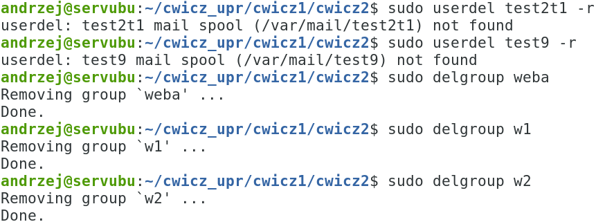
20. *sudo shutdown now* ( na koniec zajęć)
