# Ćwiczenia 10 -- Ubuntu serwer -- prawa do plików, chown

Zaloguj się na swoje konto imienXYZ, gdzie XYZ oznacza kod klasy i
grupy, np. jank3t1
Jeśli nie masz konta, sudo adduser imienXYZ

1. Dodaj swoje konto do grupy sudo: *sudo usermod twoje_konto -G sudo*

1. Sprawdzenie czy jesteśmy w grupie sudo: *id konto*

1. Załóż katalog **cwicz_upr**, a następnie nadaj mu uprawnienia:
   dla właściciela rwx,
   dla grupy r-x,
   dla pozostałych r\--.

1. Przejdź do katalogu: cd cwicz_upr

1. Stwórz katalog:

   ```bash
   mkdir cwicz1
   ```

1. Ustaw przynależność katalogu cwicz1 do grupy weba, którą należy
    założyć z numerem     gid=543.

   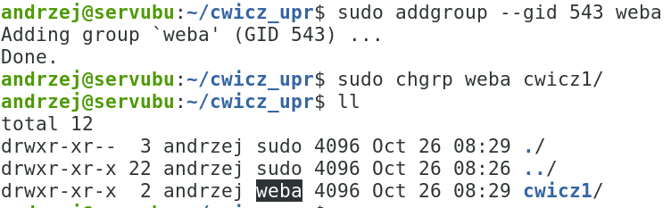

1. Przejdź do katalogu cwicz1 i utwórz w nim plik prog1.sh, który po
    uruchomieniu     wyświetla napis: „program pierwszy działa!!!".

   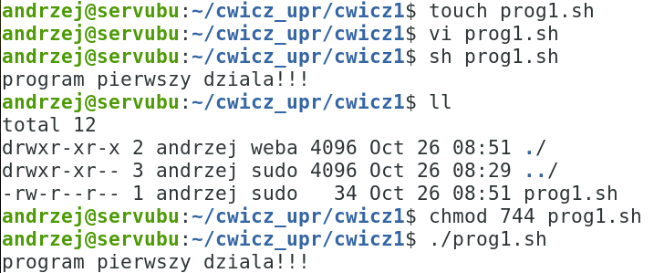

1. Dla pliku prog1.sh ustaw prawa rw**s**r-x---x

1. Skopiuj prog1.sh na prog2.sh. Plik prog2.sh po uruchomieniu
     wyświetla napis: „program drugi działa!!!".

   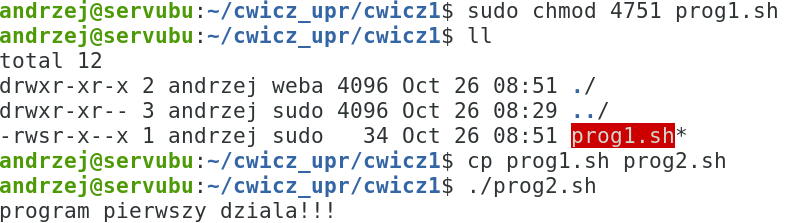

1. Dla prog2.sh ustaw uprawnienia jak dla prog1.sh z wyjątkiem bitu s,
    który ma być     ustawiony dla grupy.

   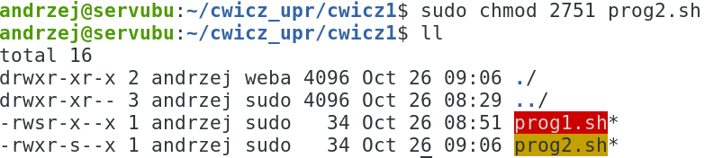

1. W katalogu cwicz1 utwórz katalog cwicz2 z prawami: rwxr-xr-**t**.

   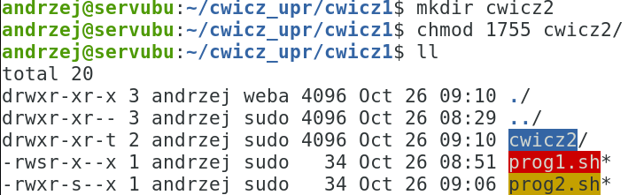

1. W katalogu cwicz2 utwórz plik prog3.sh nadając prawa:
   dla właściciela: wszystkie
   dla grupy: wx

   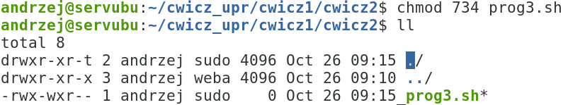

   dla pozostałych: r

1. Ustaw właściciela pliku **prog1.sh** na **root**, a następnie
    przypisz go do grupy **sudo**.

   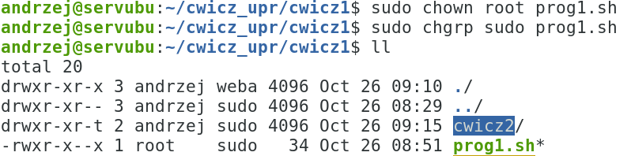

1. Załóż konto testXYZ i zaloguj się na
    nie w celu przetestowania.

   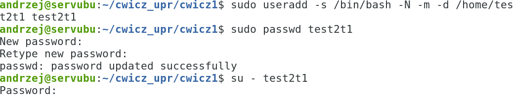

1. Ustaw właściciela pliku **prog2.sh** na **testXYZ**, a następnie
    przypisz go do grupy **w1**.

   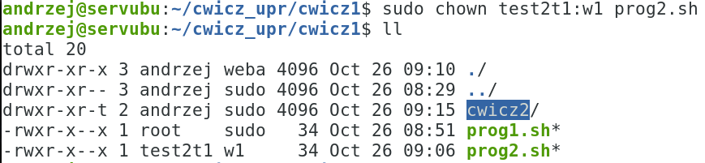

1. Ustaw właściciela pliku **prog3.sh** na **test9**, a następnie
    przypisz go do grupy **w2**.

   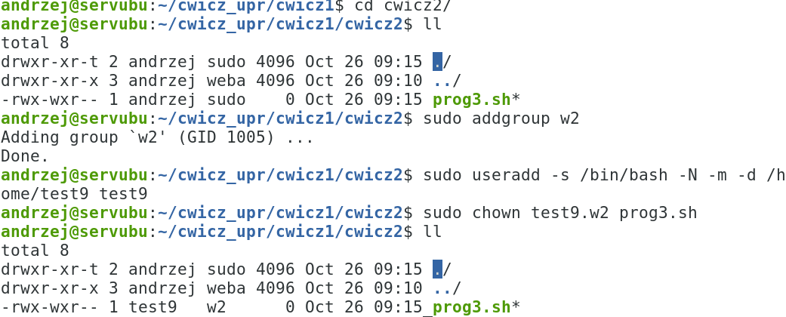

1. Sprawdź możliwość modyfikacji plików użytkownika **test9** w
    katalogu **cwicz2** będąc zalogowanym na koncie **testXYZ** i
    własnym koncie.

   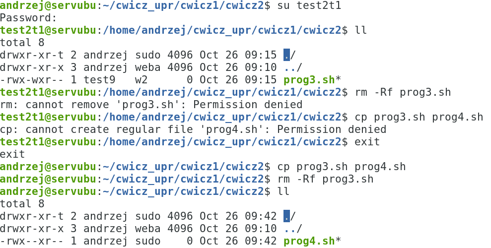

1. Wyszukanie wszystkich plików w katalogu /usr/bin z bitem s dla
    właściciela:

   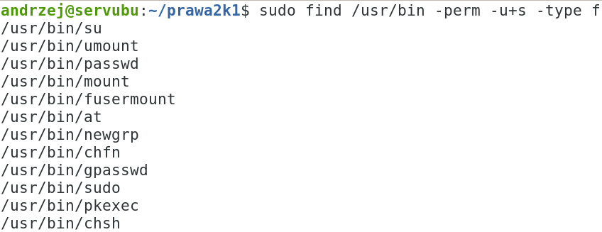

1. Usuń utworzone konta i grupy:

   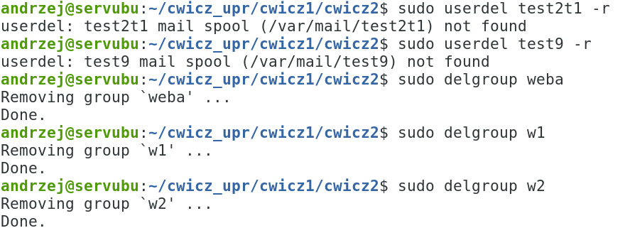

1. Na koniec zajęć: 
   ```bash
   sudo poweroff
   ```
