# Ćwiczenia 11 -- firewall, budowa i konfiguracja
  </p>

1.  Zaloguj się na swoje konto.
2.  Na pierwszym terminalu:
    
3.  Na 5 terminalu : 
 ```bash
    man iptables
 ```
4.  Wyczyścić wszystkie reguły w tablicy filter i nat oraz mangle

5. 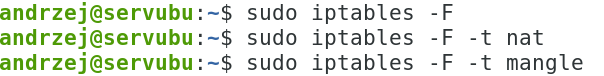

5.  Sprawdź stan zapory.

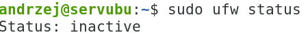

6.  Ustawić dolne karty i ping do sąsiada. (Powinien działać)

7.  Ustaw politykę na DROP w tablicy filter dla łańcuchów `INPUT` i
    `FORWARD`

 

8.  Ustaw politykę na `ACCEPT` w tablicy filter dla łańcucha `OUTPUT`

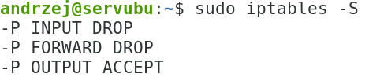

Sprawdzenie:    


9.  Dopuścić połączenia związane i
    ustanowione. Dopuścić ruch dla aplikacji działających na maszynie
    lokalnej. (loopback lo)

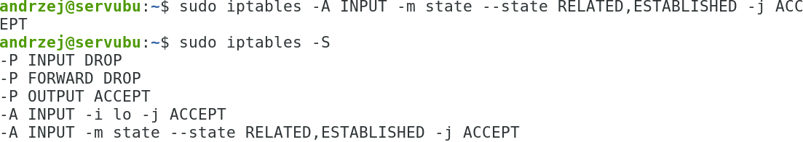

10. Otworzyć możliwość sprawdzenia
    poleceniem ping (icmp echo reply request , kody 0 i 8) dla adresów z
    podsieci lokalnej.

    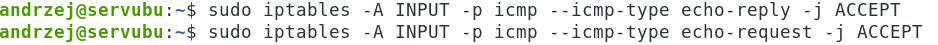
    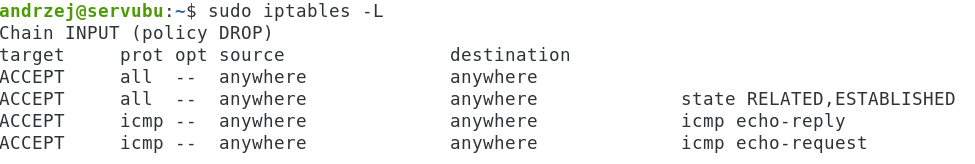

11. Sprawdź połączenie ssh:

    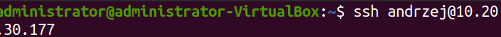

12. Na serwerze musi być zainstalowany
    pakiet openssh-server. Sprawdź działanie usługi ssh:

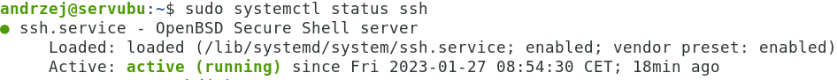

13. Otwórz port 22, na którym ma słuchać
    serwer ssh.

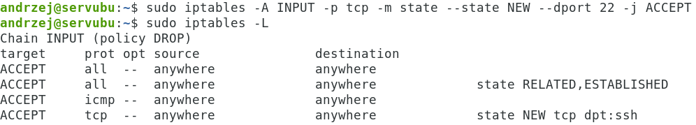

14. Sprawdź połączenie na tym porcie z komputera sąsiada.

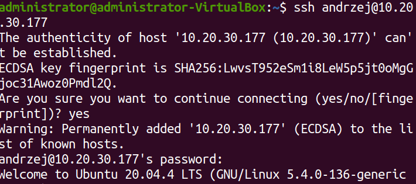

15. Zapisz ustawienia w pliku
    _*/home/twoje_konto/iptables_rules_ddmmrrrr_hh:mm*_

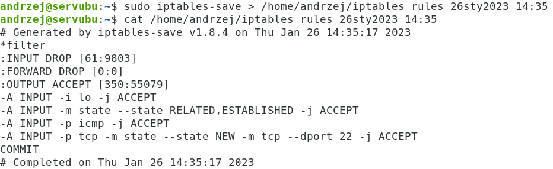

16. Ruch wychodzący do portu 80 i 443 TCP ma być zablokowany.

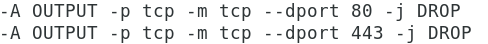

17. Test w przeglądarce: lynx zsmeie.torun.pl (strona nie powinna się
    ładować)

18. Przywrócić ruch wychodzący po portach 80, 443.

 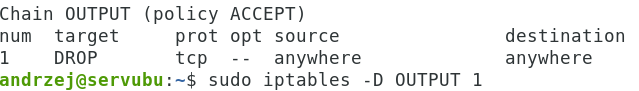

19. Test w przeglądarce: lynx zsmeie.torun.pl (strona powinna się
    ładować)
20. Dopuścić ruch dla serwerów DNS dla cloudflare.  
Dla iptables:  

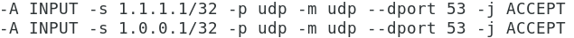  

Sprawdzenie:  


21. Zapisz ustawienia w pliku
    /home/twoje_konto/iptables_rules_ddmmrrrr_hh:mm


22. Otworzyć port dla pracy serwera ftp-data, ftp, tftp, mysql,
    postfix(4 porty), dhcp i dhcpv6, http, https
> 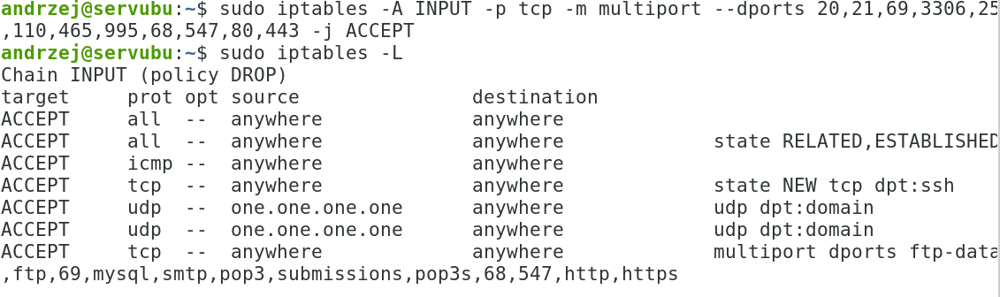
23. Zapisz ustawienia w pliku
    /home/twoje_konto/iptables_rules_ddmmrrrr_hh:mm
24. Zbuduj nat źródłowy dla sieci 10.11.12.0/24
> 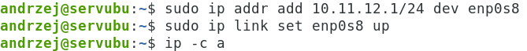
>
> 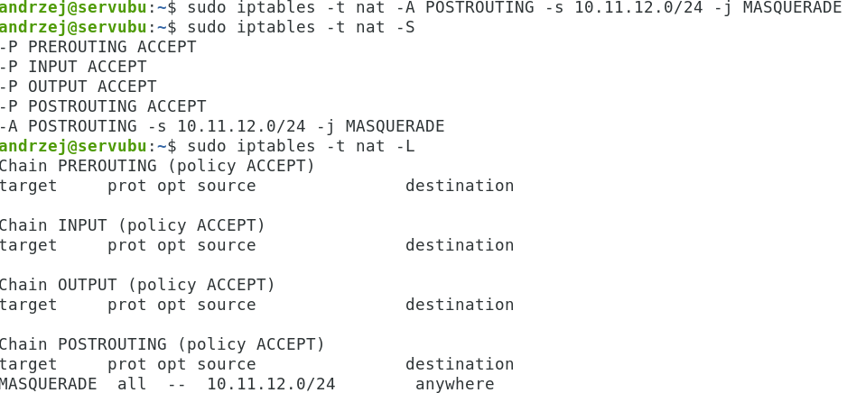
25. 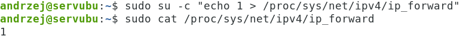
    Włącz forwardowanie pakietów tak, aby
    działało tylko do najbliższego restartu.
26. Wyczyścić wszystkie reguły w tablicy filter
> 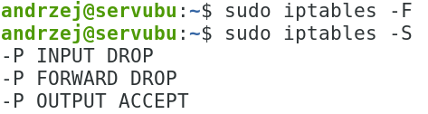
27. 
    Przywróć reguły z pliku:
28. 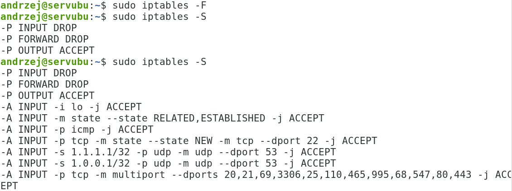
    Sprawdzenie:
29. Zablokować ruch do Rosji i Chin. Zainstaluj pakiet dla whois.
> Sprawdź działanie:
>
> 
>
> 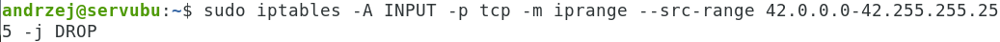
30. Monitorować ruch narzędziem tcpdump. ( W drugim terminalu uruchomić
    ping do dowolnej strony)
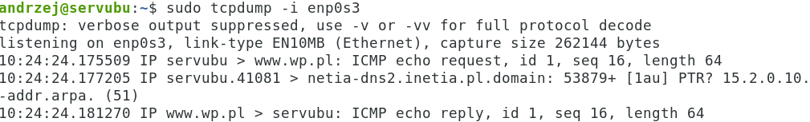
31. Monitorować ruch narzędziem wireshark na stacji ubuntu-desktop dla
    karty dolnej.
> Instalacja:
> 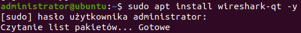
>
> Uruchomienie na stacji:
> 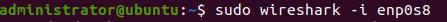
>
> Niebieska płetwa:
>
> 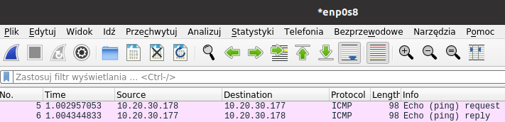
>
> Zapisz ruchu do pliku o nazwie test.pcapng.
>
> 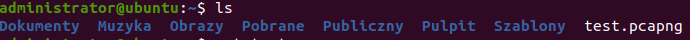
32. Monitorować ruch narzędziem zen-map z poziomu stacji windows.
> 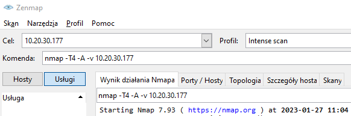
33. 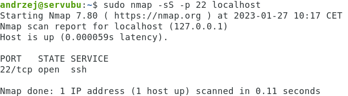
    Sprawdzić otwarte porty na maszynie z
    pomocą narzędzia nmap np. port 22 dla ssh.
34. Sprawdzić otwarte porty na maszynie z pomocą narzędzia netcat.
Na stacji ubuntu:
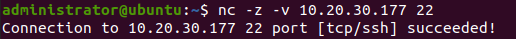
35. Sprawdź pozostałe otwarte porty na swoim serwerze.
36. KONIEC.
