# Ćwiczenia 11 -- firewall, budowa i konfiguracja

  </p>

1. Zaloguj się na swoje konto.
1. Na pierwszym terminalu:

   

1. Na 5 terminalu :

 ```bash
    man iptables
 ```

1. Wyczyścić wszystkie reguły w tablicy filter i nat oraz mangle

   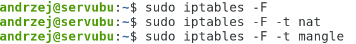

1. Sprawdź stan zapory.

   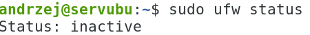

1. Ustawić dolne karty i ping do sąsiada. (Powinien działać)

1. Ustaw politykę na DROP w tablicy filter dla łańcuchów `INPUT` i
    `FORWARD`

   

1. Ustaw politykę na `ACCEPT` w tablicy filter dla łańcucha `OUTPUT`

   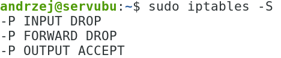

   Sprawdzenie:

   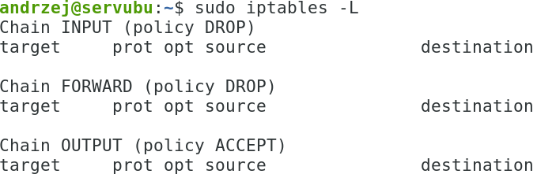

1. Dopuścić połączenia związane i
    ustanowione. Dopuścić ruch dla aplikacji działających na maszynie
    lokalnej. (loopback lo)

   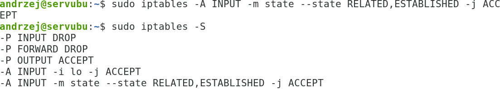

1. Otworzyć możliwość sprawdzenia
    poleceniem ping (icmp echo reply request , kody 0 i 8) dla adresów z
    podsieci lokalnej.

    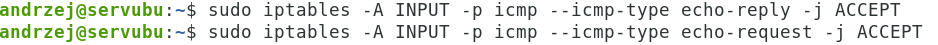
    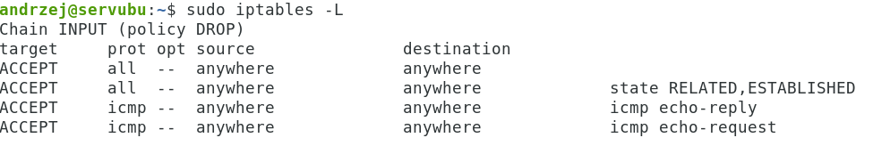

1. Sprawdź połączenie ssh:

    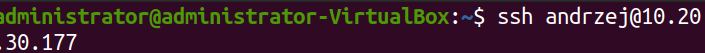

1. Na serwerze musi być zainstalowany
    pakiet openssh-server. Sprawdź działanie usługi ssh:

    ```bash
    sudo apt install openssh-server -y
    ```

   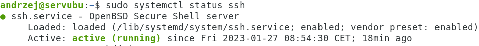

1. Otwórz port 22, na którym ma słuchać serwer ssh.

    ```bash
    sudo iptables -A INPUT -p tcp -m state --state NEW --dport 22 -j ACCEPT
    ```

   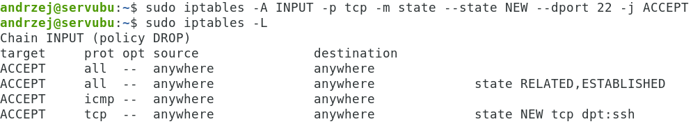

1. Sprawdź połączenie na tym porcie z komputera sąsiada.

   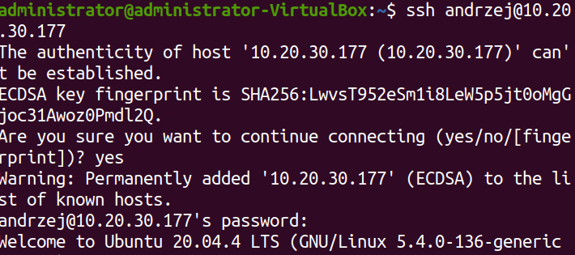

1. Zapisz ustawienia w pliku
    _*/home/twoje_konto/iptables_rules_ddmmrrrr_hh:mm*_

   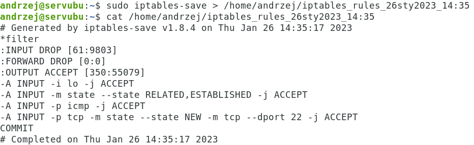

1. Ruch wychodzący do portu 80 i 443 TCP ma być zablokowany.

   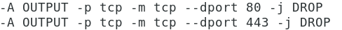

1. Test w przeglądarce: lynx zsmeie.torun.pl (strona nie powinna się
    ładować)

1. Przywrócić ruch wychodzący po portach 80, 443.

   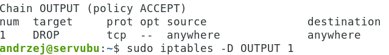

1. Test w przeglądarce: lynx zsmeie.torun.pl (strona powinna się
    ładować)

1. Dopuścić ruch dla serwerów DNS dla cloudflare.  
   Dla iptables:  

   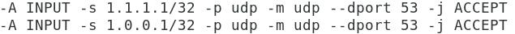  

   Sprawdzenie:  

   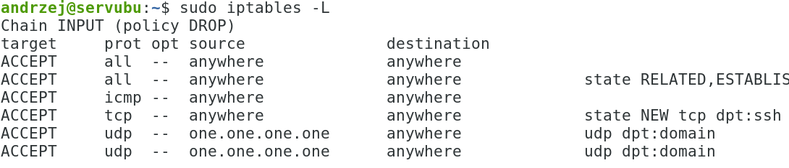

1. Zapisz ustawienia w pliku  _*/home/twoje_konto/iptables_rules_ddmmrrrr_hh:mm*_

   

1. Otworzyć port dla pracy serwera:

    - ftp-data,
    - ftp,
    - tftp,
    - mysql,
    - postfix(4 porty),
    - dhcp
    - dhcpv6,
    - http,
    - https

    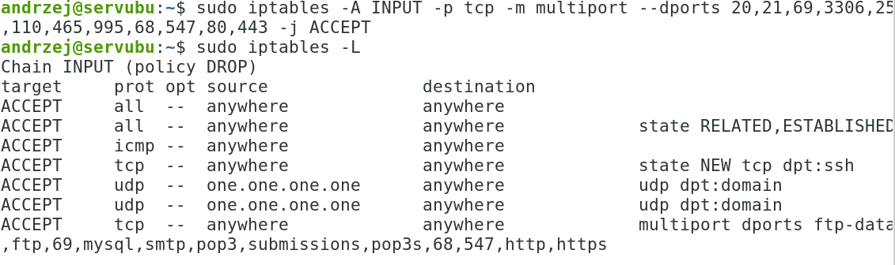

1. Zapisz ustawienia w pliku _*/home/twoje_konto/iptables_rules_ddmmrrrr_hh:mm*_

1. Zbuduj nat źródłowy dla sieci **10.11.12.0/24**

   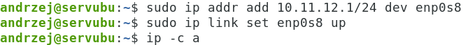

   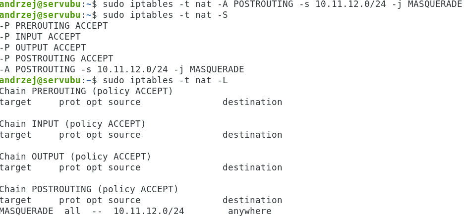

1. Włącz forwardowanie pakietów tak, aby działało tylko do najbliższego restartu.

   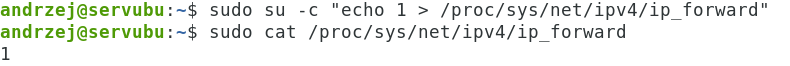

1. Wyczyścić wszystkie reguły w tablicy filter

   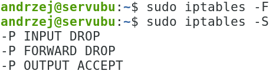

1. Przywróć reguły z pliku:

   

1. Sprawdzenie:

   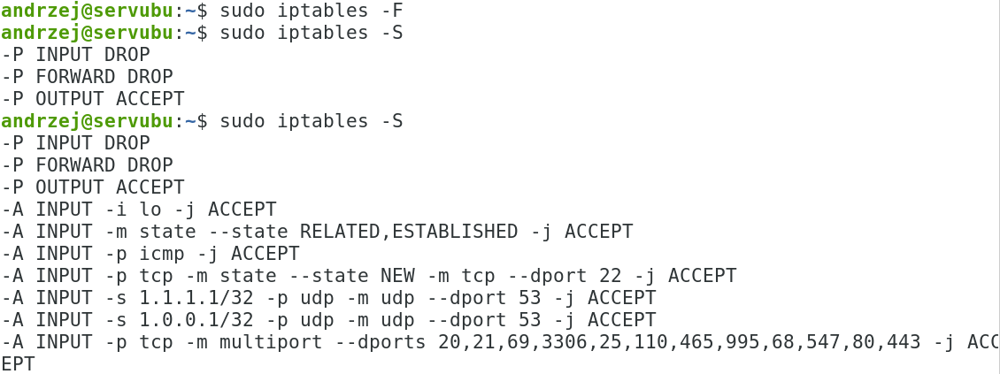

1. Zablokować ruch do Rosji i Chin. Zainstaluj pakiet dla whois.

   Sprawdź działanie:

     

   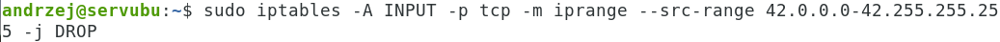

1. Monitorować ruch narzędziem tcpdump. ( W drugim terminalu uruchomić
    ping do dowolnej strony)

   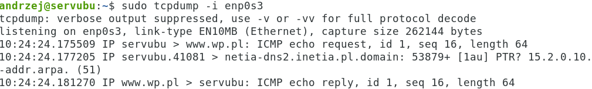

1. Monitorować ruch narzędziem wireshark na stacji ubuntu-desktop dla
    karty dolnej.

   Instalacja:

   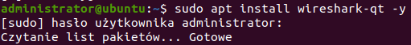  

   Uruchomienie na stacji:  

   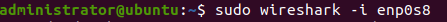  

   Niebieska płetwa:  

   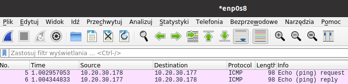  

   Zapisz ruchu do pliku o nazwie test.pcapng.  

   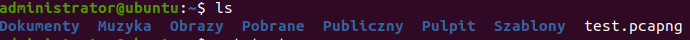

1. Monitorować ruch narzędziem zen-map z poziomu stacji windows.  

   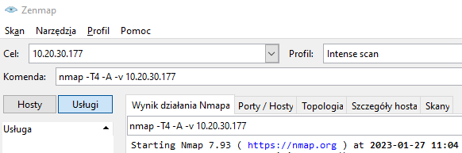

1. Sprawdzić otwarte porty na maszynie z
    pomocą narzędzia nmap np. port 22 dla ssh.

   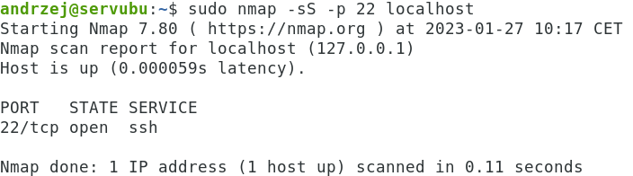

1. Sprawdzić otwarte porty na maszynie z pomocą narzędzia netcat.
   Na stacji ubuntu:

   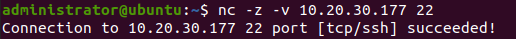

1. Sprawdź pozostałe otwarte porty na swoim serwerze.

2. KONIEC. 🔚
