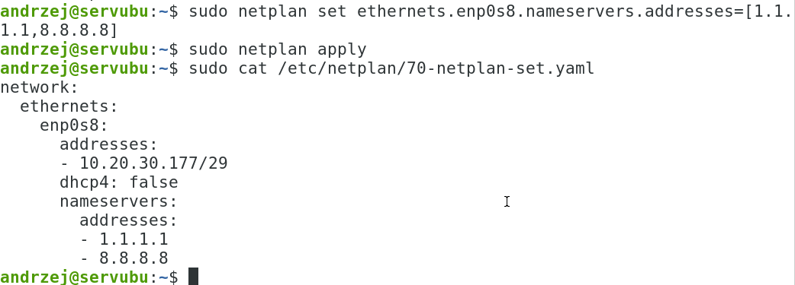
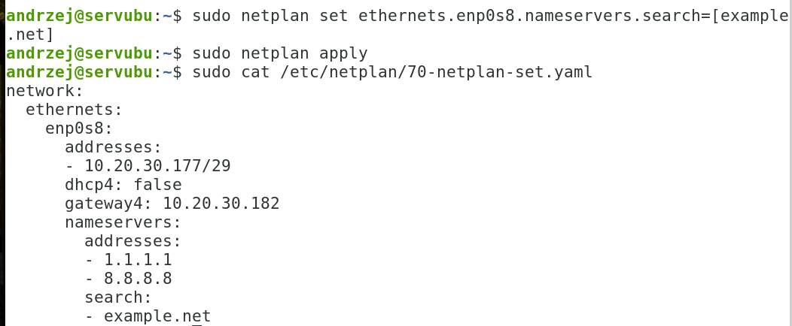

Ćwiczenia 12 - Przyłączenie serwera ubuntu do sieci
Założenia: edycja plików, konfiguracja statyczna, usługa
systemd-networkd, narzędzie **netplan**
Zaloguj się na swoje konto. Jeśli nie masz konta, sudo adduser imienXYZ,
gdzie XYZ oznacza kod klasy i grupy, np. jank3t1
1)  Dodaj swoje konto do grupy sudo: *sudo usermod twoje_konto -G sudo*
<!-- -->
1)  Sprawdzenie czy jesteśmy w grupie sudo: *id konto*
2)  Uruchom dwa okna terminala.
3)  Utwórz katalog kopie w swoim katalogu domowym i przejdź do niego.
4)  Wykonaj kopię pliku /etc/netplan/00-installer-config.yaml lub innego
    \*.yaml
5)  W systemie sprawdź, jakie istnieja karty: ip -c a
w sali 70 powinny być: **eno1** (dolna karta) i **enp4s0** (górna
karta),
w virtualbox dla sieci wewnętrznej mamy: enp0s8
6)  W drugim terminalu sprawdzaj ustawienia sieci poleceniami:
    a)  ip -c a -- do sprawdzenia nazw kart i ich konfiguracji
    b)  ip -c r -- do sprawdzenia bramki (via)
7)  Zapoznaj się z poleceniem netplan:
    a)  cat /etc/netplan/00-installer-config.yaml
    b)  netplan help i netplan info
8)  Zmień nazwę karty dolnej:
    zmień nazwę karty z eno1 na 2xgry poleceniami, za x i y podaj swoją
    klasę i grupę np. 2tgr1:
    sudo ip link set eno1 down
    ip -c a
    sudo ip link set eno1 name 2tgr1
    ip -c a
    sudo ip link set 2tgr1 up
    ip -c a
    przywróć nazwę karty na eno1 !!!
9)  Sprawdzaj na bieżąco konfigurację netplan: **sudo netplan get all**
10) Usuń wszystkie pliki \*.yaml z katalogu /etc/netplan
11) 
    **Pierwszy sposób:** dodaj adres ip i maskę dla
    dolnej karty, sąsiad na drugi komputerze podaje ip 178
12) Powinien powstać plik 70-netplan-set.yaml
13) Dodaj dwa serwery dns:

14) Dodaj bramkę:

15) Dodać domenę:

16) Zatrzymaj usługę sieci systemd-networkd: *sudo systemctl stop
    systemd-networkd*,
a następnie włącz: *sudo systemctl start systemd-networkd*.
17) Wykonaj ping do drugiego komputera podłączonego do switcha.
18) Zachowaj swoje pliki \*.yaml
19) Usuń wszystkie pliki \*.yaml z katalogu /etc/netplan
20) **Drugi zalecany sposób** poprzez edycję pliku \*.yaml, np. sudo mc
    /etc/netplan i F4 na pliku lub sudo mcedit
    /etc/netplan/00-installer-config.yaml

lub po nowemu bramka:

21) Dodaj pozycję dla karty sieciowej enp4s0 (górna karta) z opcją
    dhcp4: true
22) Dodaj do obu kart pozycję: optional: true
23) Zmień nazwę połączenia sieciowego dolnej karty na 3xgry, gdzie x to
    oznaczenie klasy, a y oznaczenie grupy:
**Zalecana metoda**: dodaj do pliku yaml: set-name: 3xgry oraz match:

24) **Dla każdej z poniższych sieci sprawdzić komunikację z sąsiednim
    komputerem.**
25) Ustaw na dolnej karcie sieciowej następujące parametry sieci:
  ------- --------------- ------------------- --------------- ----------------- -------------
    Nr      ip(pierwszy       Sieć dla 3      Bramka( ostatni       dnsy        Sprawdzenie z
   sieci  adres w sieci)  pierwszych, klient  adres w sieci)                     sąsiadem na
                            dla 9 kolejnych
     1     172.16.21.225   172.16.21.224/28    172.16.21.238   2.2.2.2 8.8.8.8  ubuntu server
     2     10.25.50.129     10.25.50.128/29    10.25.50.134    8.8.4.4 5.5.5.5  ubuntu server
     3        oblicz       192.168.70.64/27       oblicz        158.75.22.164      windows
                                                                   8.8.7.7
     4        oblicz       198.51.100.212/30      oblicz      1.1.1.1, 1.0.0.1     windows
     5        oblicz       203.0.113.237/28       oblicz      1.1.1.2, 1.0.0.2     ubuntu
                                                                                   desktop
     6        oblicz         192.0.2.85/29        oblicz       208.67.222.222,     ubuntu
                                                               208.67.220.220      desktop
     7        oblicz        10.11.12.172/26       oblicz       2.2.2.2 8.8.8.8     windows
     8        oblicz       192.168.0.235/28       oblicz       8.8.4.4 5.5.5.5     windows
     9        oblicz        172.19.17.88/27       oblicz        158.75.22.164      windows
                                                                   8.8.7.7
    10        oblicz        10.40.80.114/29       oblicz      1.1.1.1, 1.0.0.1     ubuntu
                                                                                   desktop
    11        oblicz       192.168.11.46/30       oblicz      1.1.1.2, 1.0.0.2     ubuntu
                                                                                   desktop
    12        oblicz       172.20.30.126/25       oblicz       208.67.222.222,     ubuntu
                                                               208.67.220.220      desktop
  ------- --------------- ------------------- --------------- ----------------- -------------
Sprawdź połączenie z bramką dla każdej z powyższych sieci. ( ping ip
bramki )
Sprawdź połączenie z internetem dla każdej z powyższych sieci. ( ping
adres ).
26) Zmień nazwę komputera na sala70XYZ, gdzie XYZ to kod klasy i grupy.
np. hostnamectl set-hostname sala70XYZ
27) Przywrócić domyślne ustawienia na kartach na stacjach linux i
    windows.
28) \*( tylko dla chętnych ) Konfiguracja stacji ubuntu za pomocą nmcli.
29) \*( tylko dla chętnych ) Zmiana nazwy połączenia (np. Można ustawić
    graficznie w zakładce tożsamość lub
nmcli i goto connection, set id nowa nazwa )
30) Na serwerze ubuntu pozostawić konfigurację, uwaga karta enp0s3 na
    pracowni to eno1:

31) Start serwera powinien wykonać się bez opóźnień.
32) Wykonaj po restarcie testowy ping do adresu zsmeie.torun.pl
33) KONIEC.
