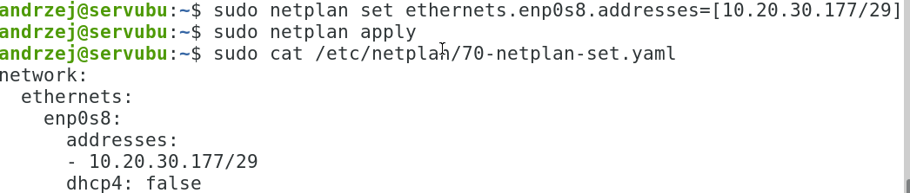
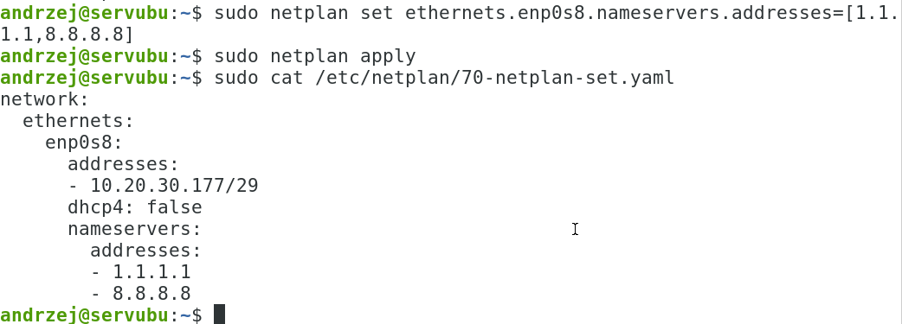
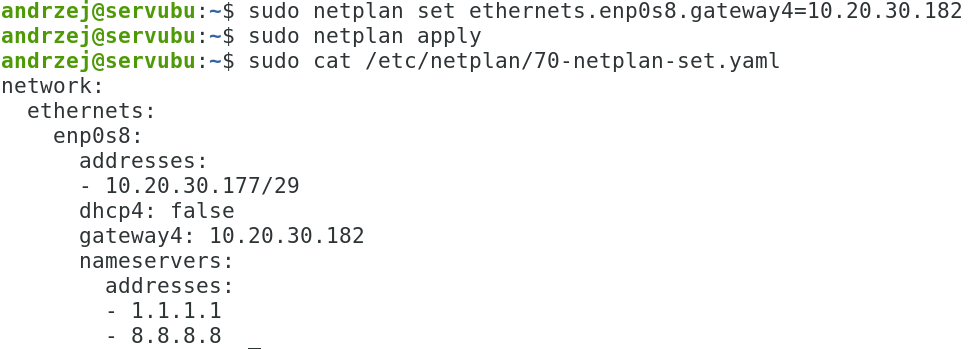
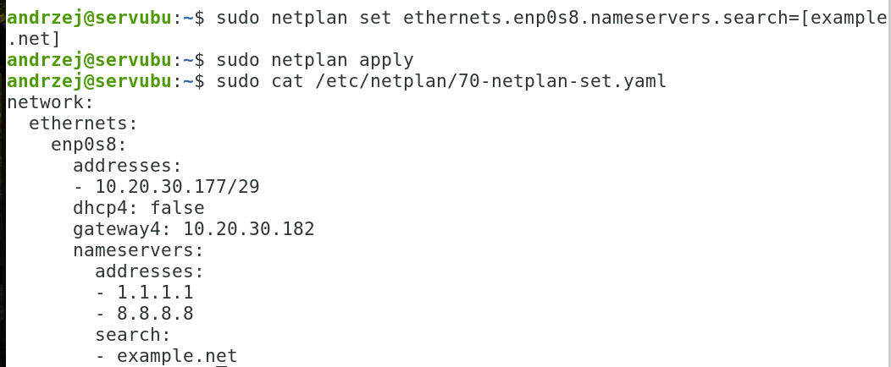
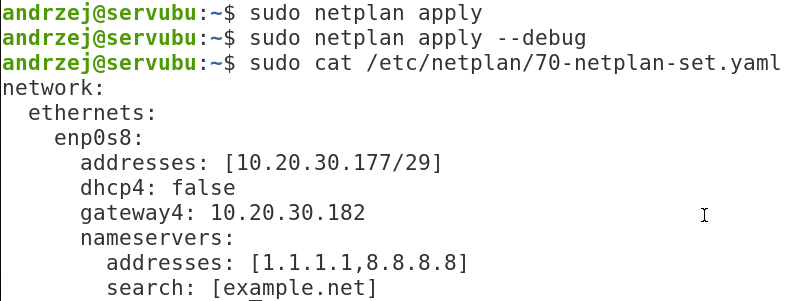
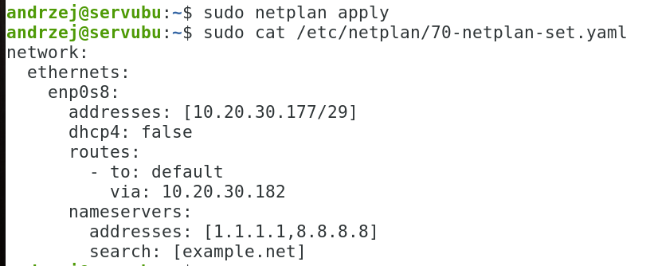
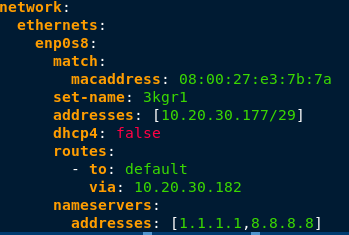
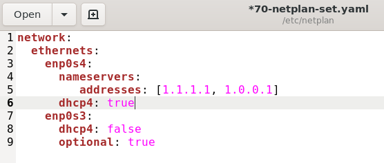

# Ćwiczenia 12 - Przyłączenie serwera ubuntu do sieci

💡Założenia:

- edycja plików,
- konfiguracja statyczna,
- usługa systemd-networkd,
- narzędzie **netplan**

Zaloguj się na swoje konto. Jeśli nie masz konta, sudo adduser imienXYZ,
gdzie XYZ oznacza kod klasy i grupy, np. jank3t1

Dodaj swoje konto do grupy sudo:

```bash
sudo usermod twoje_konto -G sudo 
```

1. Sprawdzenie czy jesteśmy w grupie sudo: *id konto*

1. Uruchom dwa okna terminala.
1. Utwórz katalog kopie w swoim katalogu domowym i przejdź do niego.
1. Wykonaj kopię pliku /etc/netplan/00-installer-config.yaml lub innego
    \*.yaml

1. W systemie sprawdź, jakie istnieja karty:

   ```bash
   ip -c a
   ```

   w sali 70 powinny być: **eno1** (dolna karta) i **enp4s0** (górna karta),
   w virtualbox dla sieci wewnętrznej mamy: enp0s8

1. W drugim terminalu sprawdzaj ustawienia sieci poleceniami:

    a) ```bash ip -c a``` -- do sprawdzenia nazw kart i ich konfiguracji

    b)  ```bash ip -c r``` -- do sprawdzenia bramki (via)

1. Zapoznaj się z poleceniem netplan:

    a)  `cat /etc/netplan/00-installer-config.yaml`

    b)  `netplan help` i `netplan info`

1. Zmień nazwę karty dolnej:
    zmień nazwę karty z eno1 na 2xgry poleceniami, za x i y podaj swoją
    klasę i grupę np. 2tgr1:

   ```bash
    sudo ip link set eno1 down
    ip -c a
    sudo ip link set eno1 name 2tgr1
    ip -c a
    sudo ip link set 2tgr1 up
    ip -c a
   ```

    przywróć nazwę karty na eno1 !!!

1. Sprawdzaj na bieżąco konfigurację netplan:

   ```bash
     sudo netplan get all
   ```

1. Usuń wszystkie pliki \*.yaml z katalogu /etc/netplan
1. Pierwszy sposób: dodaj adres ip i maskę dla
   dolnej karty, sąsiad na drugi komputerze podaje ip 178

   

1. Powinien powstać plik 70-netplan-set.yaml

1. Dodaj dwa serwery dns:

   

1. Dodaj bramkę:

   

1. Dodać domenę:

   

1. Zatrzymaj usługę sieci systemd-networkd:

   ```bash
   sudo systemctl stop systemd-networkd
   ```

   a następnie włącz:

   ```bash
   sudo systemctl start systemd-networkd
   ```

1. Wykonaj ping do drugiego komputera podłączonego do switcha.

1. Zachowaj swoje pliki \*.yaml

1. Usuń wszystkie pliki \*.yaml z katalogu /etc/netplan

1. **Drugi zalecany sposób** poprzez edycję pliku \*.yaml, np. sudo mc
    /etc/netplan i <kbd>F4</kbd> na pliku lub sudo mcedit
    /etc/netplan/00-installer-config.yaml

   

   lub po nowemu bramka:

   

1. Dodaj pozycję dla karty sieciowej enp4s0 (górna karta) z opcją
    dhcp4: true

1. Dodaj do obu kart pozycję: optional: true

1. Zmień nazwę połączenia sieciowego dolnej karty na 3xgry, gdzie x to
    oznaczenie klasy, a y oznaczenie grupy:
   **Zalecana metoda**: dodaj do pliku yaml: set-name: 3xgry oraz match:

   

1. **Dla każdej z poniższych sieci sprawdzić komunikację z sąsiednim
    komputerem.**

1. Ustaw na dolnej karcie sieciowej następujące parametry sieci:
<!-- markdownlint-disable MD013 -->
      | Nr sieci | ip(pierwszy adres w sieci)   | klient dla 9 kolejnych     | Bramka( ostatni adres w sieci)  | DNSy                                | Sprawdzenie z sąsiadem na |
      |:---------|:-----------------------------|:---------------------------|:--------------------------------|:------------------------------------|:--------------------------|
      | 1        | 172.16.21.225                | 172.16.21.224/28           | 172.16.21.238                   | 2.2.2.2 8.8.8.8                     | ubuntu server             |
      | 2        | 10.25.50.129                 | 10.25.50.128/29            | 10.25.50.134                    | 8.8.4.4 5.5.5.5                     | ubuntu server             |
      | 3        | oblicz                       | 192.168.70.64/27           | oblicz                          | 158.75.22.164, 8.8.7.7              | windows                   |
      | 4        | oblicz                       | 198.51.100.212/30          | oblicz                          | 1.1.1.1, 1.0.0.1                    | windows                   |
      | 5        | oblicz                       | 203.0.113.237/28           | oblicz                          | 1.1.1.2, 1.0.0.2                    | ubuntu desktop            |
      | 6        | oblicz                       | 192.0.2.85/29              | oblicz                          | 208.67.222.222, 208.67.220.220      | ubuntu desktop            |
      | 7        | oblicz                       | 10.11.12.172/26            | oblicz                          | 2.2.2.2 8.8.8.8                     | windows                   |
      | 8        | oblicz                       | 192.168.0.235/28           | oblicz                          | 8.8.4.4 5.5.5.5                     | windows                   |
      | 9        | oblicz                       | 172.19.17.88/27            | oblicz                          | 158.75.22.164, 8.8.7.7              | windows                   |
      | 10       | oblicz                       | 10.40.80.114/29            | oblicz                          | 1.1.1.1, 1.0.0.1                    | ubuntu desktop            |
      | 11       | oblicz                       | 192.168.11.46/30           | oblicz                          | 1.1.1.2, 1.0.0.2                    | ubuntu desktop            |
      |  12      | oblicz                       |   172.20.30.126/25         | oblicz                          | 208.67.222.222,208.67.220.220       | ubuntu desktop            |

   ✅ Sprawdź połączenie z bramką dla każdej z powyższych sieci.
   ( ping ip bramki )

   ✅ Sprawdź połączenie z internetem dla każdej z powyższych sieci.
   ( ping adres ).

1. Zmień nazwę komputera na sala70XYZ, gdzie XYZ to kod klasy i grupy, np.:

   ```bash
   hostnamectl set-hostname sala70XYZ
   ```

1. Przywrócić domyślne ustawienia na kartach na stacjach linux i
    windows.

1. \*( tylko dla chętnych ) Konfiguracja stacji ubuntu za pomocą nmcli.

1. \*( tylko dla chętnych ) Zmiana nazwy połączenia (np. Można ustawić
    graficznie w zakładce tożsamość lub
   nmcli i goto connection, set id nowa nazwa )

1. Na serwerze ubuntu pozostawić konfigurację, uwaga karta enp0s3 na
    pracowni to eno1:

   

1. Start serwera powinien wykonać się bez opóźnień.

1. Wykonaj po restarcie testowy ping do adresu `zsmeie.torun.pl`

1. KONIEC.📶
