Ćwiczenia 13 -Instalacja i konfiguracja serwera SAMBA
Założenia: praca w parach. Konfiguracja klient -- serwer. Ubuntu
server + stacje:
> windows i ubuntu desktop
Zachowaj na koniec zajęć plik konfiguracyjny smb.conf w swoim katalogu
domowym!!!
1)  Zaloguj się na konto administrator i dodaj swoje konto do grupy
    sudo:
> *sudo usermod nazwa_konta -G sudo*
2)  Na stacji windows otwórz stronę samba.org z dokumentacją.
3)  Zaloguj się na swoje konto na minimum pięciu terminalach. (Alt+F2,
    Alt+F3, ...
na logi, na edycję pliku ,na komendy, , na restart usługi, na
dokumentację )
4)  Sprawdź zawartość logów poleceniem na 1 terminalu: *sudo journalctl
    -f (preferowana metoda)*
*lub sudo journalctl -u smbd \--since today (klawisz Page Down)*
5)  Sprawdzić połączenie z internetem, ewentualnie pobrać ustawienia z
    serwera dhcp na górną kartę enp4s0
poleceniem: sudo dhclient enp4s0
6)  Przed przystąpieniem do pracy trzeba odinstalować serwer samby:
sudo apt *remove samba-common \--purge -y*
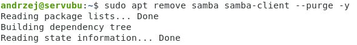
7)  Zainstaluj serwer samba: *sudo apt install samba samba-client -y*
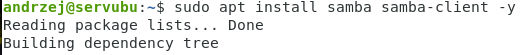
8)  Sprawdź czy jest zainstalowana paczka w systemie: *sudo apt list
    \--installed \| grep samba*
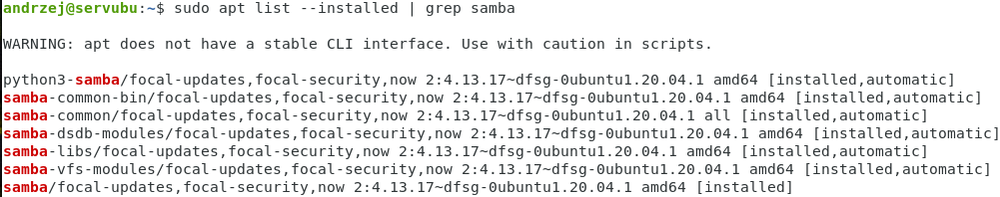
9)  Po instalacji założyć w swoim katalogu domowym katalog samba z
    podkatalogami:
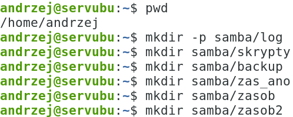
10) Skopiuj plik /etc/samba/smb.conf na nazwę
    /etc/samba/smb.conf.twoje_imie oraz drugą kopię do swojego katalogu
    domowego /home/twoje_konto/samba/backup ( cp -p)
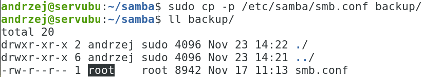
11) Otwórz plik smb.conf w vi lub nano lub mcedit ( przykładowe
    polecenie: *sudo vi /etc/samba/smb.conf* )
12) Edytuj plik /etc/samba/smb.conf zgodnie z wykładem:
<!-- -->
a)  podaj nazwę serwera jako swoje imię
b)  ustaw plik logów i poziom logów na 6
c)  ustaw pracę samby na dolnej karcie sieciowej oraz lo
d)  itd.
<!-- -->
13) Dodatkowe przykładowe plik z których możesz skorzystać znajduje się
    w:

14) Ustaw kartę sieciową dolną **( w sali 70: eno1 lub enp3s0** ), górna
    to enp4s0 tak, aby serwer SAMBA mógł na niej pracować, użyj komendy
    ip, np.:
sudo ip addr add 10.20.30.177/29 dev enp0s8
sudo ip link set enp0s8 up
ip a
Lub skorzystaj z netplan: ( UWAGA: poniższa konfiguracja dla virtualbox)

15) Ustaw dolną kartę na stacji windows.
16) Podaj na jakim interfejsie pracuje usługa SAMBY
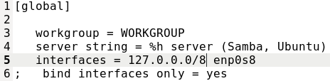
17) Zrestartuj usługę smbd i nmbd poleceniem:
*sudo systemctl restart smbd nmbd*
18) W logach nie może być błędów, szukamy wpisu:

19) Sprawdź status usługi
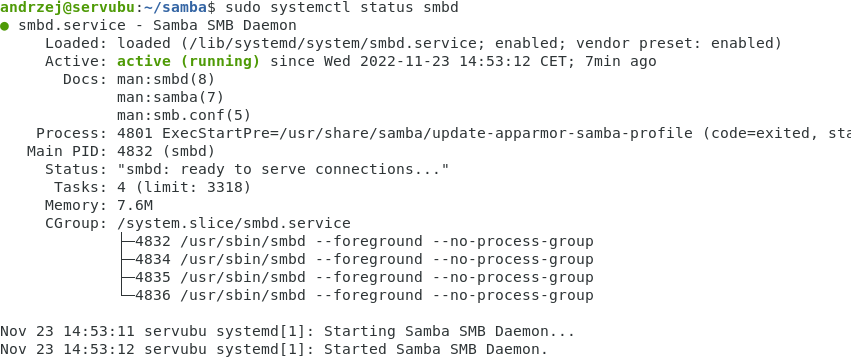
20) Sprawdź konfigurację narzędziem testparm
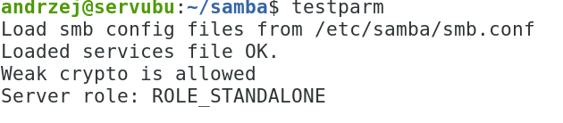
21) Jeśli wystąpią błędy podczas uruchamiania to popraw plik
    /etc/samba/smb.conf, i zrestartuj usługę.
22) Sprawdź czy istnieje proces dla serwera samby poleceniem: *ps aux \|
    grep smbd*

oraz
*htop -\> F3 wpisać smbd i enter, wyjście q*

23) Utwórz w sambie konto root: **pdbedit --a --u root** z hasłem
    ZAQ!2wsx
24) Utwórz w sambie konto twoje_imię: **pdbedit --a --u twoje_imię** z
    hasłem ZAQ!2wsx ( w poniższych marek)
25) Udostępnij zasób anonimowy na końcu pliku smb.conf o nazwie
    \[zas_ano\] dla użytkownika nobody
> Dodaj wpis guest ok = yes w zasobie
>
> 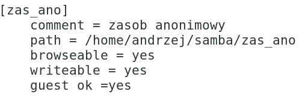
26) Przetestuj mapowanie zasobu na stacji windows i ubuntu desktop.
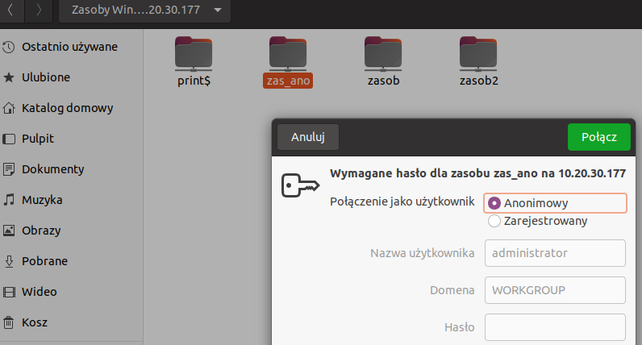
27) Utwórz w nim katalog lub plik
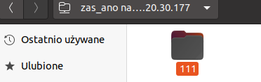
28) Zawartość na serwerze, zwróć uwagę na właściciela i grupę
    utworzonych plików, katalogów:

29) Udostępnij zasób, nie anonimowy na końcu pliku smb.conf:
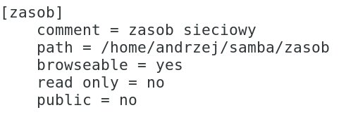
30) Przetestuj mapowanie zasobu na stacji windows i ubuntu desktop.
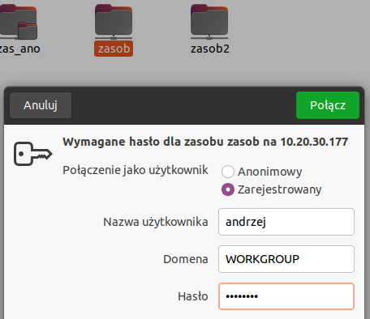
31) Utwórz w nim katalog lub plik
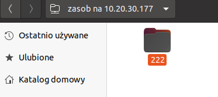
32) Zawartość na serwerze, zwróć uwagę na właściciela i grupę
    utworzonych plików, katalogów:
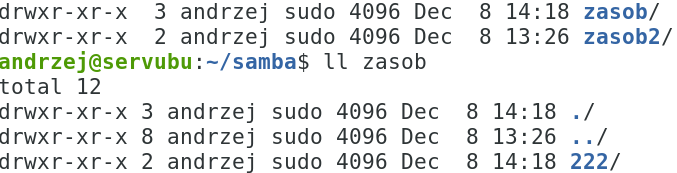
33) Udostępnij zasób tylko dla siebie oraz wszystkich w grupie smbusers
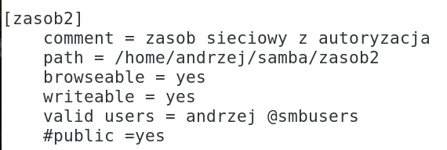
34) Dodaj dwa konta
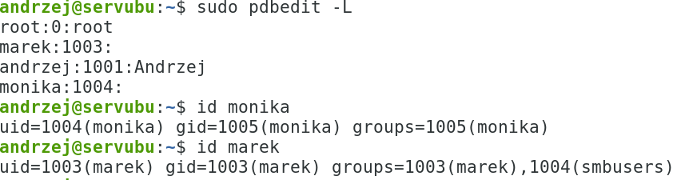
35) Przetestuj mapowanie zasobu na stacji windows i ubuntu desktop.
(po lewej brak możliwości zalogowania się spoza grupy smbusers, po
prawej konto marka )
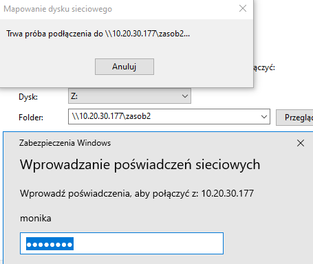
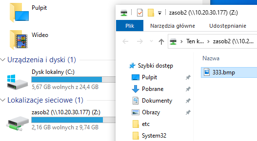
36) Zawartość na serwerze, zwróć uwagę na właściciela i grupę
    utworzonych plików, katalogów:
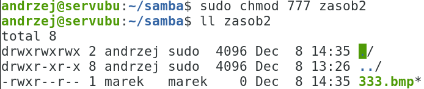
37) Sprawdź czy zasób jest widoczny
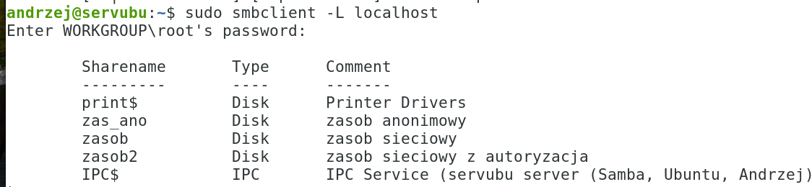
38) Na stacji windows zamapuj zasob pod literę M:
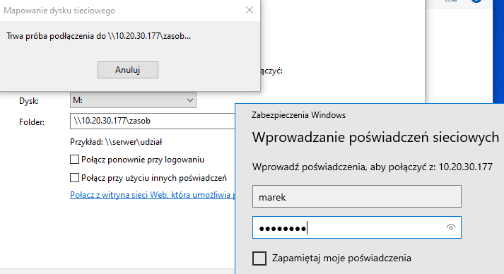
39) Efekt końcowy:
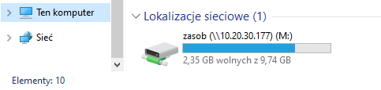
40) Dodaj na stacji do zasobu plik i katalog:
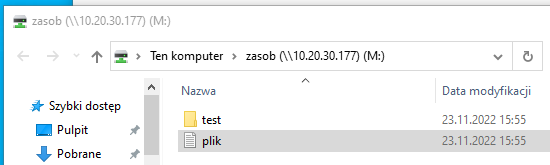
41) Sprawdź zawartość zasobu na serwerze:
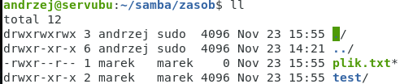
42) Dla powyższego zawartość sekcji \[global\]:
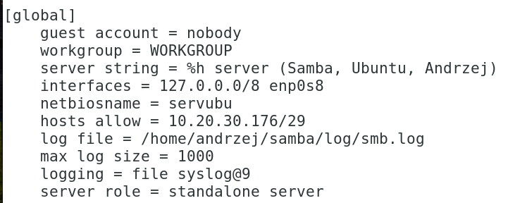
43) Na kliencie ubuntu desktop wydaj komendę: smbclient
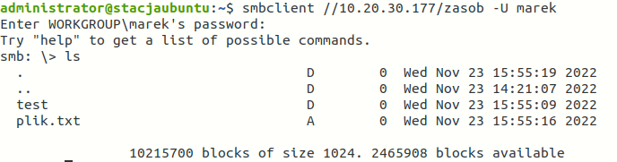
44) Na kliencie ubuntu desktop uruchom przeglądarkę plików i sprawdź
    zasób:
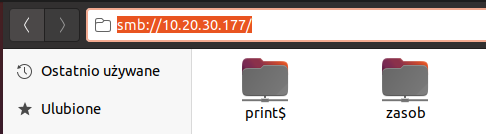
I klikamy w zasób
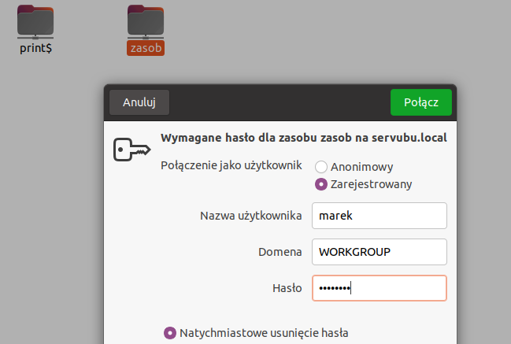
45) Sprawdź połączenia:
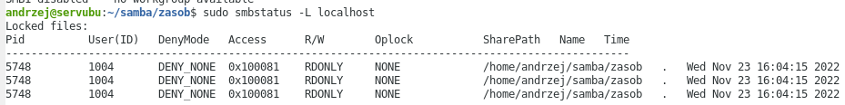
46) Dodaj zasób 3
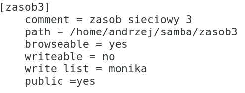
47) Test z konta monika:
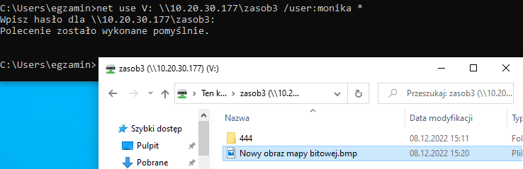
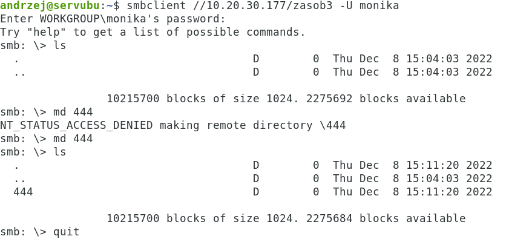
48) Test z konta marek:
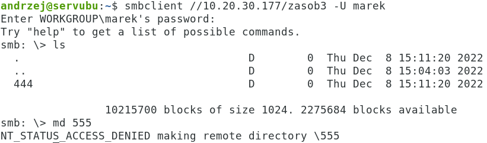
49) Dodatkowe zadania:
<!-- -->
a)  Zezwól na korzystanie z samby tylko z jednego ip, przetestuj
    działanie
b)  Zezwól na korzystanie z samby dla danej sieci z wyłączeniem jednego
    ip, przetestuj działanie
c)  Zarchiwizuj plik smb.conf 7-zipem w zasobie3
d)  Zarchiwizuj katalog /usr/share/doc
> 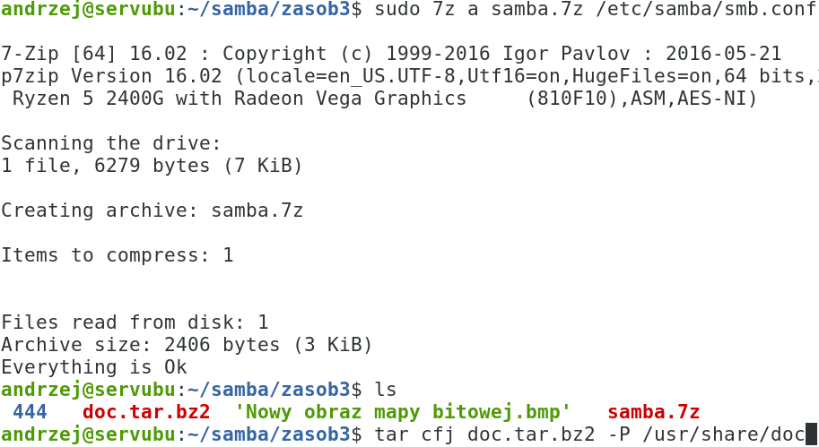
e)  Ukryj w zasobie drugim pliki z rozszerzeniem txt
f)  Pokaż w zasobie drugim pliki ukryte ( rozpoczynające się od .)
g)  zmień porty na których słucha serwer samba lub wpisz jawnie 445 i
    139
h)  utwórz różne pliki konfiguracyjne dla dwóch komputerów
<!-- -->
50) Przywrócić konfigurację netplan na dhcp.
51) Koniec.
