# Ćwiczenia 13 -Instalacja i konfiguracja serwera SAMBA

Założenia:

- praca w parach.
- konfiguracja klient -- serwer.
  - Ubuntu server + stacje:
    - windows i ubuntu desktop

Zachowaj na koniec zajęć plik konfiguracyjny smb.conf w swoim katalogu
domowym!!!

1. Zaloguj się na konto administrator i dodaj swoje konto do grupy sudo:

   ```bash
   sudo usermod nazwa_konta -G sudo
   lub 
   sudo adduser nazwa_konta sudo 
   ```

1. Na stacji windows otwórz stronę samba.org z dokumentacją.

1. Zaloguj się na swoje konto na minimum pięciu terminalach. (Alt+F2,
    Alt+F3, ...
na logi, na edycję pliku ,na komendy, , na restart usługi, na
dokumentację )

1. Sprawdź zawartość logów poleceniem na 1 terminalu:

   ```bash
   sudo journalctl -f 
   ```

   preferowana metoda

   lub

   ```bash
   sudo journalctl -u smbd --since today 
   ```

1. Sprawdzić połączenie z internetem, ewentualnie pobrać ustawienia z
    serwera dhcp na górną kartę enp4s0 poleceniem:

   ```bash
   sudo dhclient enp4s0
   ```

1. Przed przystąpieniem do pracy trzeba odinstalować serwer samby:

   ```bash
   sudo apt remove samba-common --purge -y
   ```

   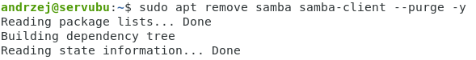

1. Zainstaluj serwer samba:

   ```bash
   sudo apt install samba samba-client -y
   ```

   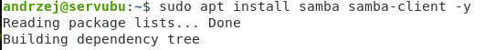

1. Sprawdź czy jest zainstalowana paczka w systemie:

   ```bash
   sudo apt list --installed | grep samba
   ```

   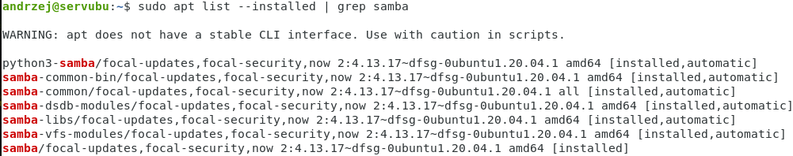

1. Po instalacji założyć w swoim katalogu domowym katalog samba z
    podkatalogami:

   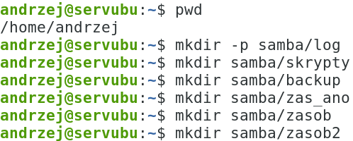

1. Skopiuj plik `/etc/samba/smb.conf` na nazwę
    `/etc/samba/smb.conf.twoje_imie` oraz drugą kopię do swojego katalogu
    domowego /home/twoje_konto/samba/backup ( cp -p)

   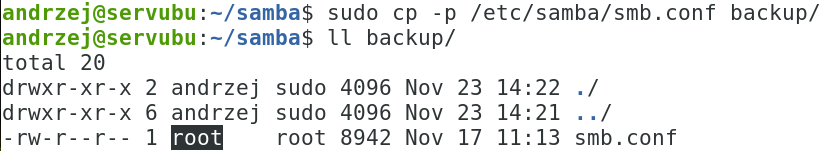

1. Otwórz plik smb.conf w vi lub nano lub mcedit, przykładowe
    polecenie:

   ```bash
   sudo vi /etc/samba/smb.conf
   ```

1. Edytuj plik /etc/samba/smb.conf zgodnie z wykładem:

    - podaj nazwę serwera jako swoje imię
    - ustaw plik logów i poziom logów na 6
    - ustaw pracę samby na dolnej karcie sieciowej oraz lo
    - itd.

1. Dodatkowe przykładowe plik z których możesz skorzystać znajduje się w:

   

1. Ustaw kartę sieciową dolną **( w sali 70: eno1 lub enp3s0** ), górna
    to enp4s0 tak, aby serwer SAMBA mógł na niej pracować, użyj komendy
    ip, np.:

   ```bash
   sudo ip addr add 10.20.30.177/29 dev enp0s8
   sudo ip link set enp0s8 up
   ip -c a
   ```

   lub skorzystaj z netplan, zalecana metoda: ( UWAGA: poniższa konfiguracja dla virtualbox)

   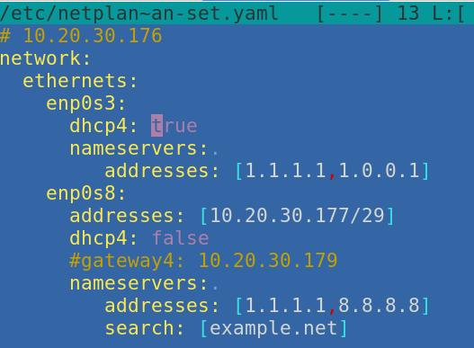

1. Ustaw dolną kartę na stacji windows.

1. Podaj na jakim interfejsie pracuje usługa SAMBY

   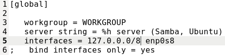

1. Zrestartuj usługę smbd i nmbd poleceniem:

   ```bash
   sudo systemctl restart smbd nmbd
   ```

1. W logach nie może być błędów, szukamy wpisu:

   

1. Sprawdź status usługi

   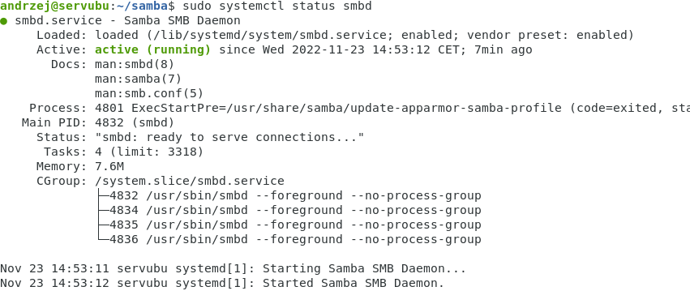

1. Sprawdź konfigurację narzędziem testparm

   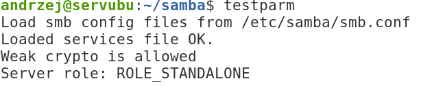

1. Jeśli wystąpią błędy podczas uruchamiania to popraw plik
    `/etc/samba/smb.conf`, i zrestartuj usługę.

1. Sprawdź czy istnieje proces dla serwera samby poleceniem:

   ```bash
   ps aux | grep smbd
   ```

   

   oraz

   *htop -\> F3 wpisać smbd i enter, wyjście q*

   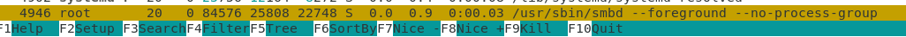

1. Utwórz w sambie konto root: **pdbedit --a --u root** z hasłem `ZAQ!2wsx`

1. Utwórz w sambie konto twoje_imię:

   ```bash
   pdbedit --a --u twoje_imię
   ```

    z hasłem `ZAQ!2wsx` ( w poniższych marek)

1. Udostępnij zasób anonimowy na końcu pliku smb.conf o nazwie
    \[zas_ano\] dla użytkownika nobody

> Dodaj wpis guest ok = yes w zasobie
>
> 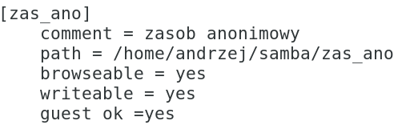

1) Przetestuj mapowanie zasobu na stacji windows i ubuntu desktop.
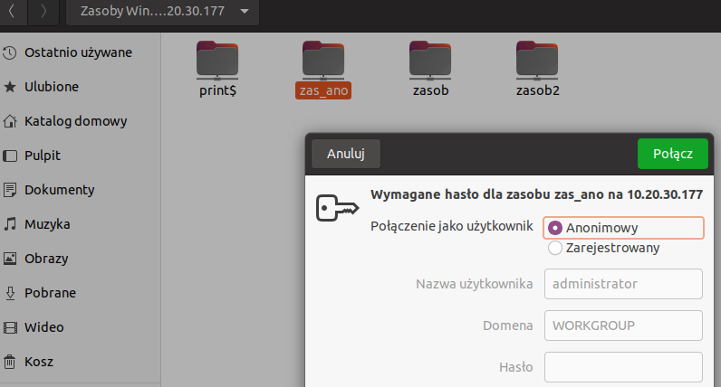
2) Utwórz w nim katalog lub plik
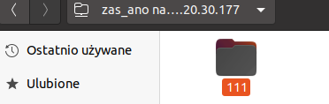
3) Zawartość na serwerze, zwróć uwagę na właściciela i grupę
    utworzonych plików, katalogów:
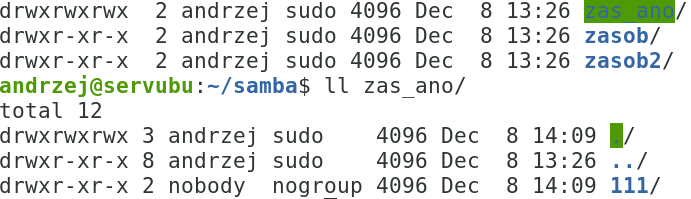
4) Udostępnij zasób, nie anonimowy na końcu pliku smb.conf:
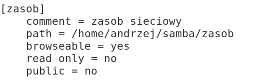
5) Przetestuj mapowanie zasobu na stacji windows i ubuntu desktop.
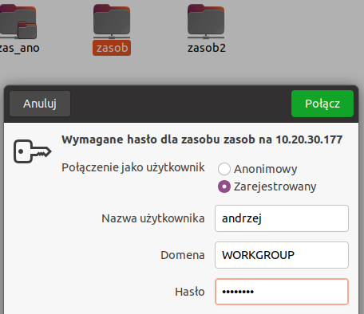
6) Utwórz w nim katalog lub plik
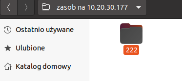
7) Zawartość na serwerze, zwróć uwagę na właściciela i grupę
    utworzonych plików, katalogów:
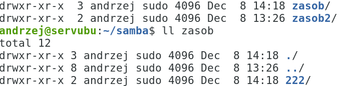
8) Udostępnij zasób tylko dla siebie oraz wszystkich w grupie smbusers
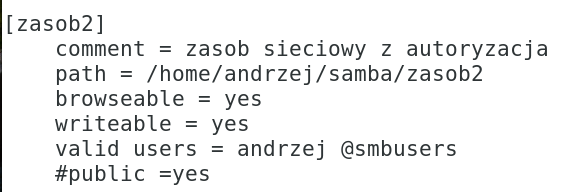
9) Dodaj dwa konta
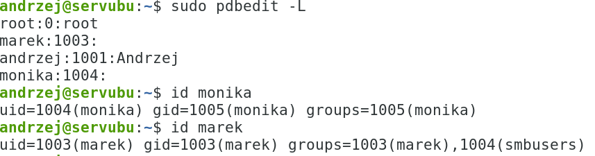
10) Przetestuj mapowanie zasobu na stacji windows i ubuntu desktop.
(po lewej brak możliwości zalogowania się spoza grupy smbusers, po
prawej konto marka )
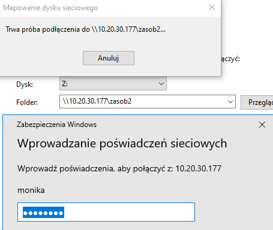
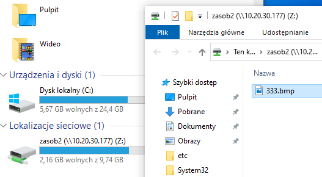
11) Zawartość na serwerze, zwróć uwagę na właściciela i grupę
    utworzonych plików, katalogów:
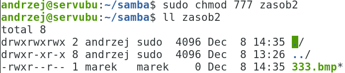
12) Sprawdź czy zasób jest widoczny
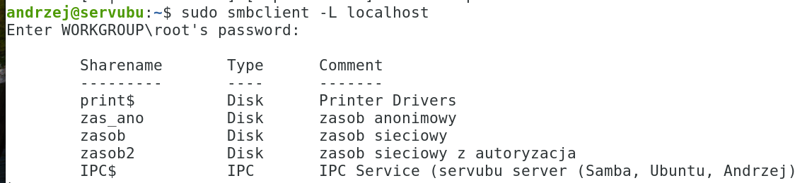
13) Na stacji windows zamapuj zasob pod literę M:
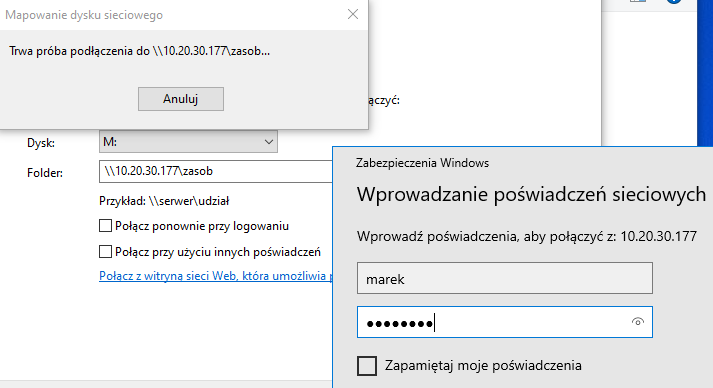
14) Efekt końcowy:
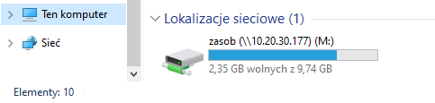
15) Dodaj na stacji do zasobu plik i katalog:
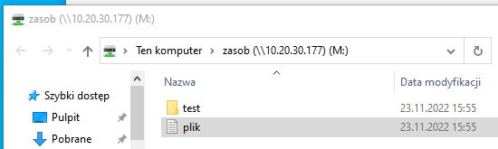
16) Sprawdź zawartość zasobu na serwerze:
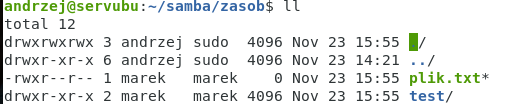
17) Dla powyższego zawartość sekcji \[global\]:
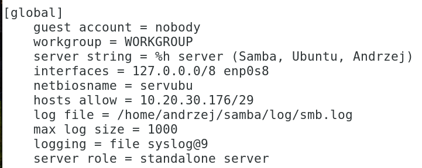
18) Na kliencie ubuntu desktop wydaj komendę: smbclient
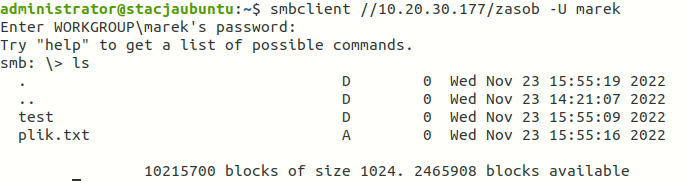
19) Na kliencie ubuntu desktop uruchom przeglądarkę plików i sprawdź
    zasób:
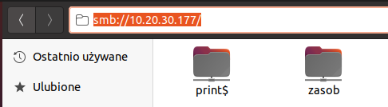
I klikamy w zasób
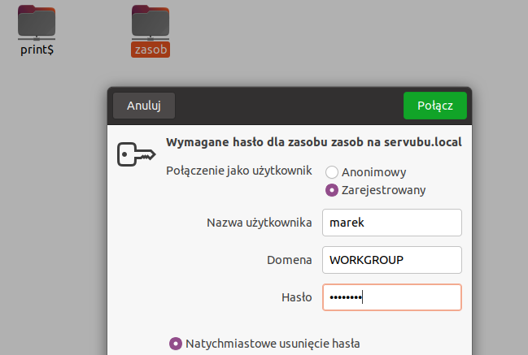
20) Sprawdź połączenia:
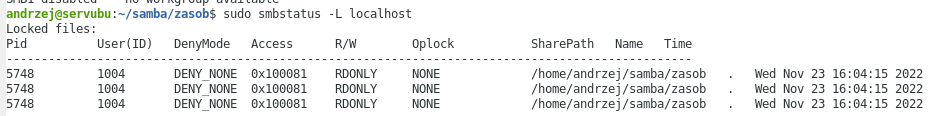
21) Dodaj zasób 3
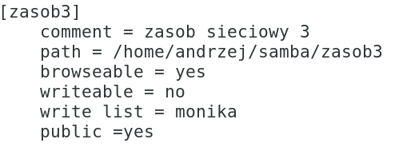
22) Test z konta monika:
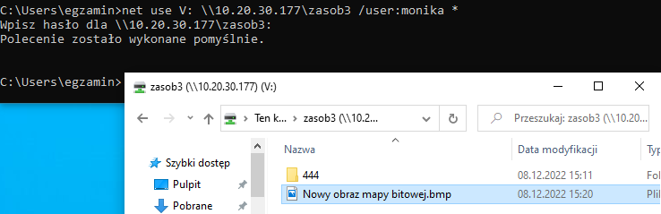
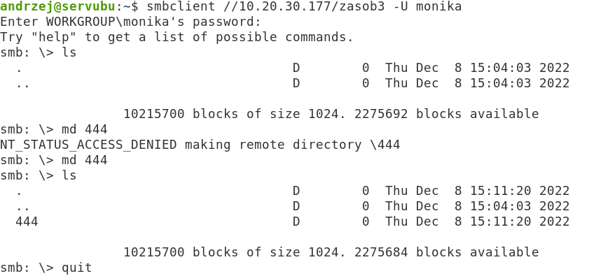
23) Test z konta marek:
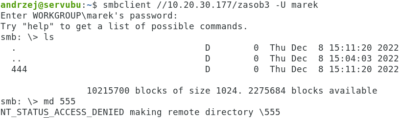
24) Dodatkowe zadania:
<!-- -->
a)  Zezwól na korzystanie z samby tylko z jednego ip, przetestuj
    działanie
b)  Zezwól na korzystanie z samby dla danej sieci z wyłączeniem jednego
    ip, przetestuj działanie
c)  Zarchiwizuj plik smb.conf 7-zipem w zasobie3
d)  Zarchiwizuj katalog /usr/share/doc
> 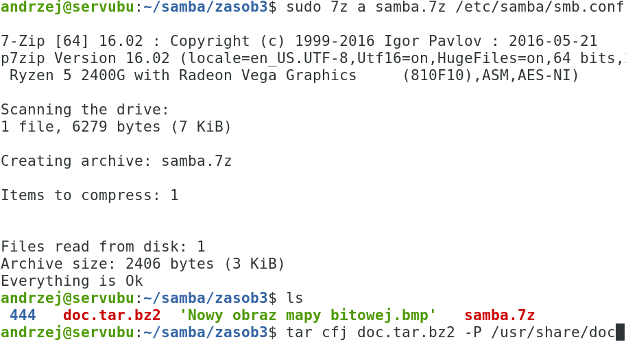
e)  Ukryj w zasobie drugim pliki z rozszerzeniem txt
f)  Pokaż w zasobie drugim pliki ukryte ( rozpoczynające się od .)
g)  zmień porty na których słucha serwer samba lub wpisz jawnie 445 i
    139
h)  utwórz różne pliki konfiguracyjne dla dwóch komputerów
<!-- -->
1) Przywrócić konfigurację netplan na dhcp.
2) Koniec.
