Ćwiczenia 14 -Instalacja i konfiguracja serwera SAMBA
Założenia: praca w parach. Konfiguracja klient -- serwer. Ubuntu
server + stacje:
> windows i ubuntu desktop
Zachowaj na koniec zajęć plik konfiguracyjny smb.conf w swoim katalogu
domowym!!!
**Zadanie 1**
1)  Zaloguj się na konto administrator i dodaj swoje konto do grupy
    sudo:
> *sudo usermod nazwa_konta -G sudo*
2)  Na stacji windows otwórz stronę samba.org z dokumentacją.
3)  Zaloguj się na swoje konto na minimum pięciu terminalach. (Alt+F2,
    Alt+F3, ...
na logi, na edycję pliku ,na komendy, , na restart usługi, na
dokumentację )
4)  Sprawdzić połączenie z internetem, ewentualnie pobrać ustawienia z
    serwera dhcp na górną kartę enp4s0
poleceniem: sudo dhclient enp4s0
5)  Przed przystąpieniem do pracy trzeba odinstalować serwer samby:
sudo apt *remove samba samba-client \--purge -y*
6)  Zainstaluj potrzebne pakiety: *sudo apt install -y acl attr samba
    samba-dsdb-modules samba-vfs-modules smbclient winbind
    libpam-winbind libnss-winbind libpam-krb5 krb5-config krb5-user
    dnsutils chrony net-tools*
7)  Dodaj wpis dla 10.11.12.14 w /etc/hosts:
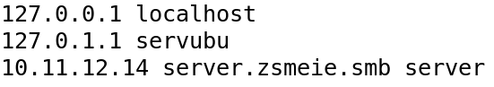
8)  
     Zmień nazwę serwera ubuntu na server:
9)  Sprawdź konfigurację:

10) Przesuń plik smb.conf do swojego katalogu domowego.
11) Dodatkowe
12) Ustaw kartę sieciową dolną **( w sali 70: eno1**), górna to enp4s0
    tak, aby serwer SAMBA mógł na niej pracować, użyj komendy ip, np.:

Lub skorzystaj z netplan: ( UWAGA: poniższa konfiguracja dla virtualbox)
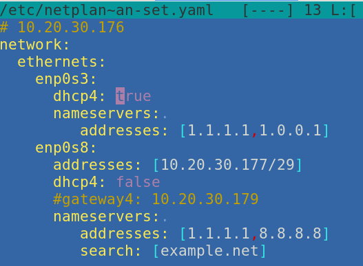
13) Skonfiguruj sambę do roli Active Directory DC.
14) Otwórz dokumentację:
    <https://wiki.samba.org/index.php/Setting_up_Samba_as_an_Active_Directory_Domain_Controller>
15)
16) Zainstaluj pakiety:
17) 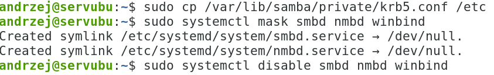
    Wyłączenie aktualnych usług
18) Włączenie nowej usługi
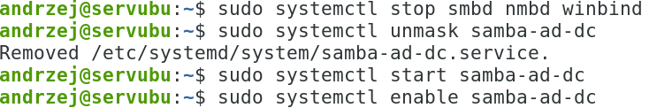
19) Sprawdzenie statusu:
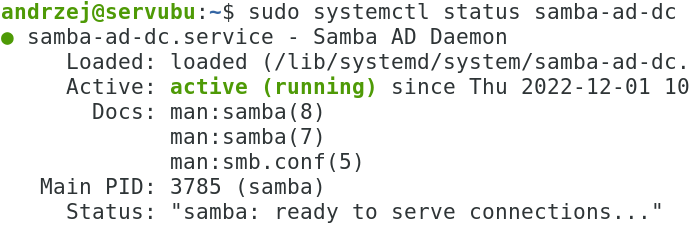
20) Ustawienie wpisów w resolv.conf
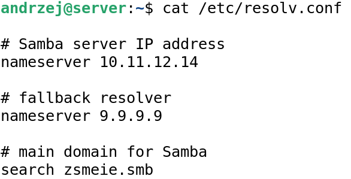
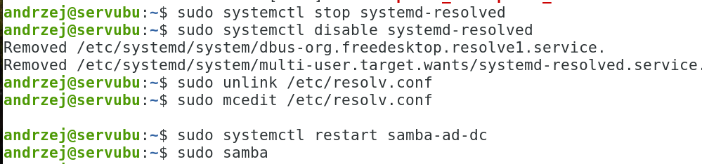

21) Test zalogowania na konto administracyjne
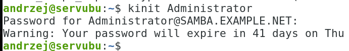
22) 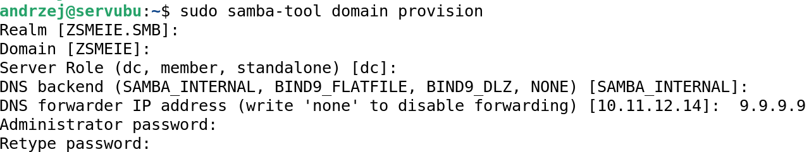
    Uruchom: sudo samba-tool domain
    provision
23) Skopiuj plik konfiguracyjny kerberos:
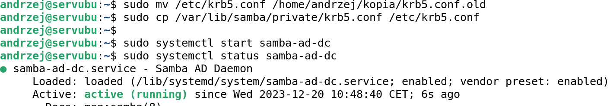
24) Opcjonalnie skonfiguruj chrony:
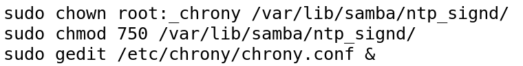
Zawartość:
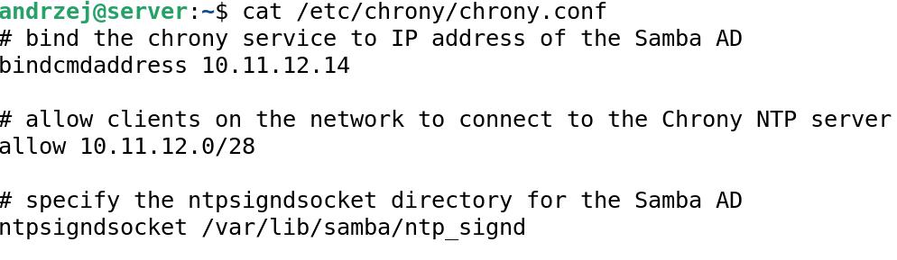
25) Restart usługi i sprawdzenie stanu:

26) Sprawdzenie adresów:
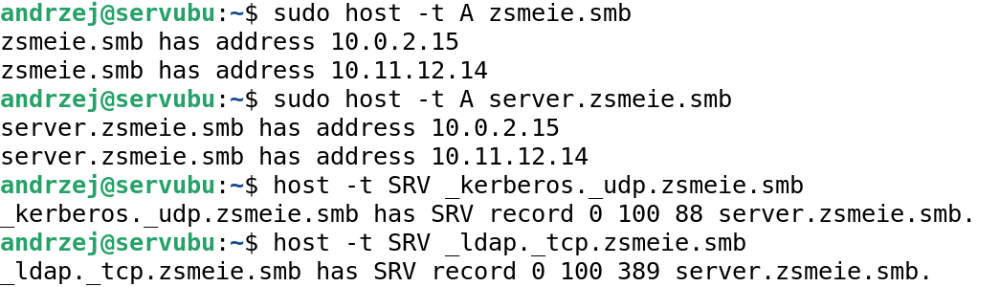
27) Sprawdzenie udziałów:
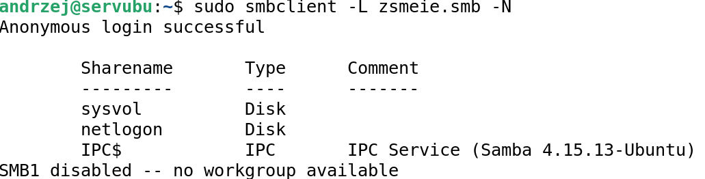
28) Założyć konto dla siebie i sprawdzić listę:
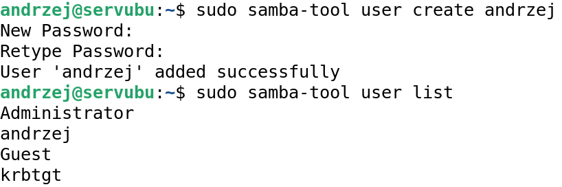
29) Test serwera:
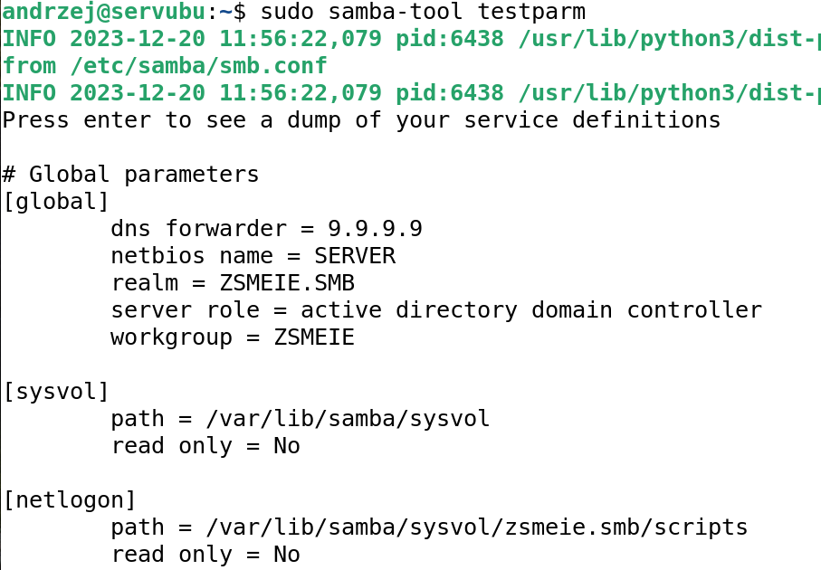
30) Na stacji windows ustaw kartę sieciową:
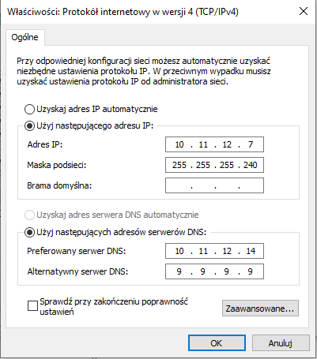
31) Przyłącz stację Windows do domeny, którą ustawisz na sambie.
Lub w power shell : add-computer
> 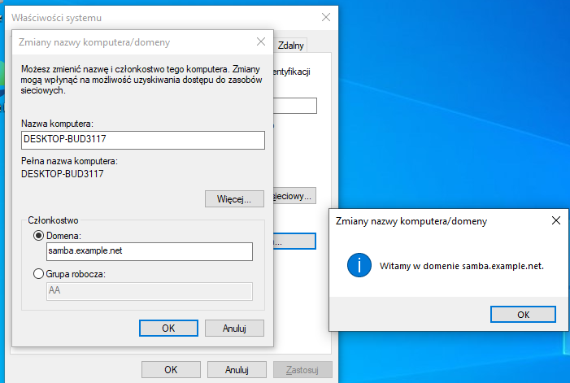
32) Zaloguj się na konto Administratora: ( poniżej polecenie set)
33) Zainstaluj RS link:
<https://techcommunity.microsoft.com/t5/windows-11/how-to-install-or-uninstall-rsat-in-windows-11/m-p/3273590>
lub w power shell:
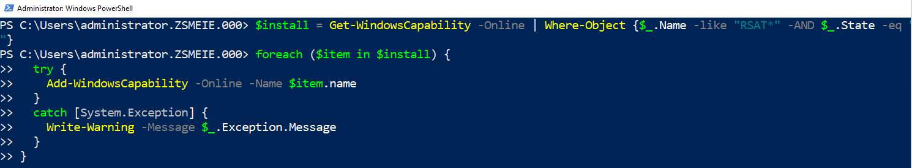
34) Dodaj w windows 10,11,12 w mmc przystawkę do zarządzania
    użytkownikami w AD, utwórz konto Iza:
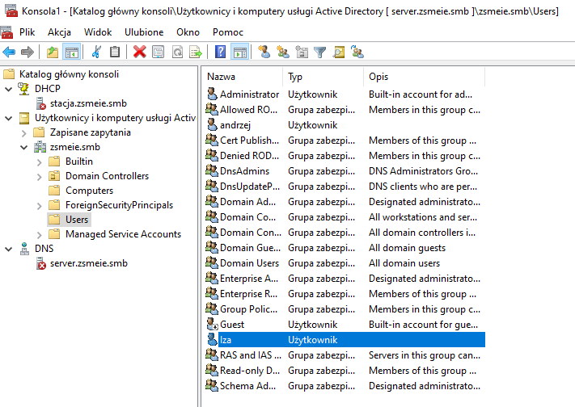
35) Sprawdzenie zasobów z samby:
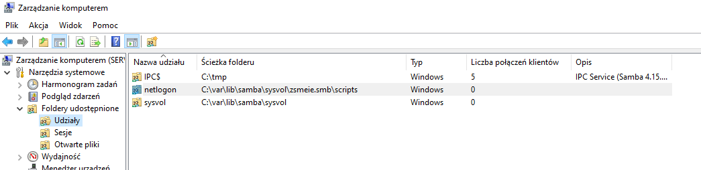
36) Zamapuj utworzone wcześniej zasoby.
37) Stwórz profil mobilny.
38) Koniec
