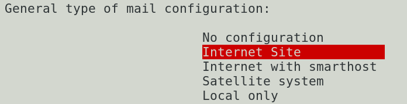
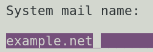
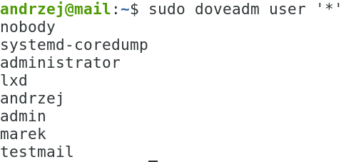
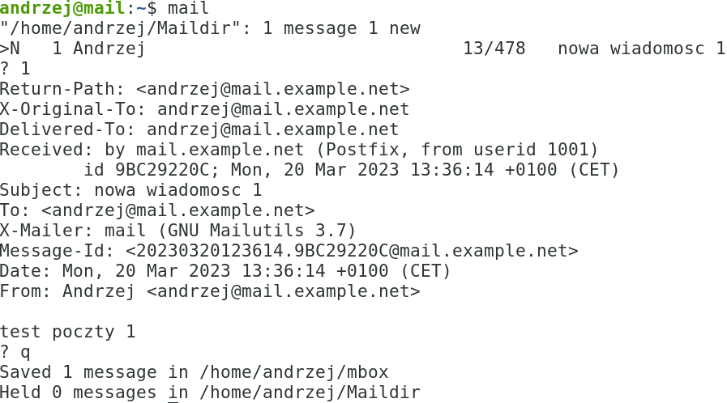
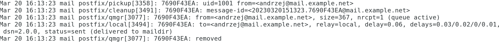
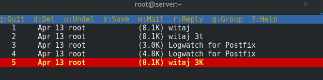
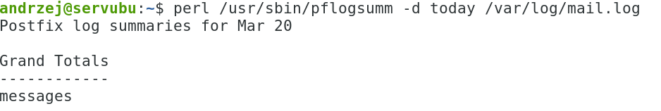
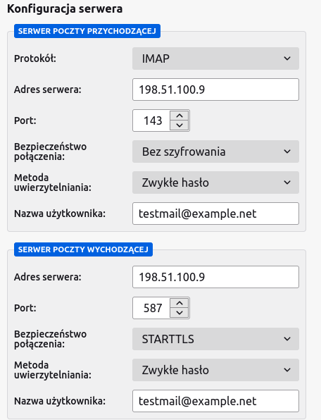
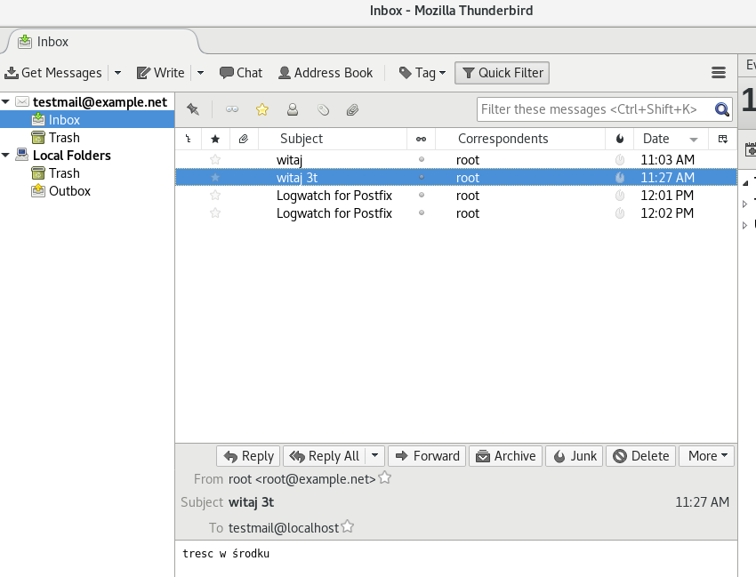
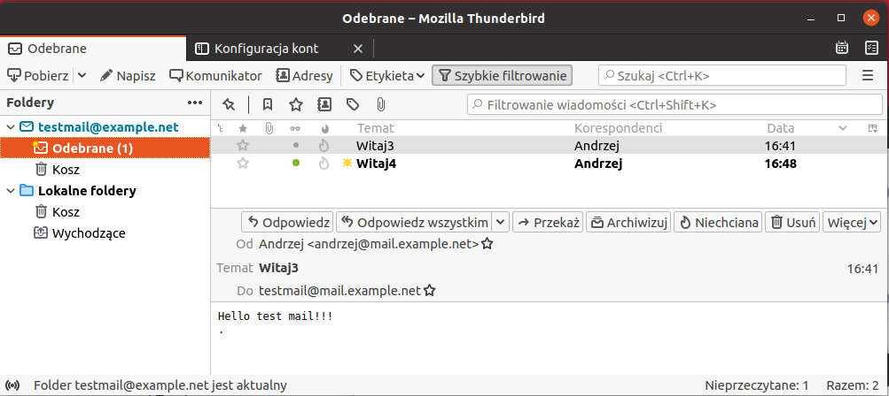

Ćwiczenia 15 -- instalacja i konfiguracja serwera poczty
1.  Zaloguj się na swoje konto.
2.  Ustaw nazwę serwera na mail z pomocą hostnamectl
3.  Ustaw nazwę serwera na mail.example.net mail w /etc/hosts, po edycji
    sudo hostname -f
4.  Skonfiguruj postfix (domena example.net, sieć 198.51.100.0/24, ip
    serwera to numer stanowiska)
5.  Zainstaluj pakiety: sudo apt install postfix -y
> Wybierz
> 
>
> Oraz
> 
6.  W przypadku pomyłki można powtórzyć konfigurację postfiksa:
> 
7.  Edytuj plik sudo mcedit /etc/postfix/main.cf, sprawdź ewentualnie
    dodaj opcje, dopisz pozycje
    a)  myhostname = mail.example.net
    b)  mydomain = example.net
    c)  myorigin = \$mydomain
    d)  inet_interfaces = all
    e)  inet_protocols = ipv4
    f)  mydestination = \$myhostname, example.net, mail.example.net,
        localhost.\$mydomain, localhost, \$mydomain
    g)  mynetworks = 127.0.0.0/8, 198.51.100.0/24 🡨 dodaj swoją sieć
    h)  home_mailbox = Maildir/
    i)  message_size_limit = 10485760
    j)  mailbox_size_limit = 1073741824
    k)  smtpd_sasl_type = dovecot
    l)  smtpd_sasl_path = private/auth
    m)  smtpd_sasl_auth_enable = yes
    n)  smtpd_sasl_security_options = noanonymous
    o)  smtpd_sasl_local_domain = \$myhostname
    p)  smtpd_recipient_restrictions = permit_mynetworks,
        permit_auth_destination, permit_sasl_authenticated, reject
8.  
    Odkomentuj wiersz w
    /etc/postfix/master.cf
9.  Uruchom usługę na stałe: sudo systemctl enable postfix.
10. Zrestartuj usługę: sudo systemctl restart postfix
11. Zainstaluj pakiety: sudo apt install dovecot-imapd dovecot-pop3d
    dovecot-core dovecot-lmtpd -y
12. Skonfiguruj dovecot
    a)  vi /etc/dovecot/dovecot.conf
    b)  protocols = imap pop3 lmtp
    c)  listen = \*, ::
    d)  vi /etc/dovecot/conf.d/10-auth.conf
> disable_plaintext_auth = no
>
> auth_mechanisms = plain login
e)  vi /etc/dovecot/conf.d/10-mail.conf
> mail_location = maildir:\~/Maildir
f)  vi /etc/dovecot/conf.d/10-master.conf
> unix_listener /var/spool/postfix/private/auth
>
> mode = 0666
>
> user = postfix
>
> group = postfix
>
>
g)  vi /etc/dovecot/conf.d/10-ssl.conf
> ssl = no
13. Zrestartuj usługe dovecot: sudo systemctl restart dovecot
14. Ustaw zaporę:
> sudo ufw enable
>
> sudo ufw allow 143,587 ,993, 995/tcp
>
> sudo ufw reload
>
> sudo ufw status
15. Zainstaluj clienta poczty: sudo apt install mailutils -y
16. [echo](https://www.server-world.info/en/command/html/echo.html)
    \'export MAIL=\$HOME/Maildir\' \>\> /etc/profile.d/mail.sh
17. Załóż konto w systemie o nazwie testmail
18. Zrestartuj serwer.
19. 
    Sprawdź dostępne konta:
20. Wyślij wiadomość testową: echo „treść wiadomości" \| mail -s „Tytuł
    np. witaj" twoje_konto
21. Odczytaj wiadomość w kliencie poczty **mail**

22. Sprawdź logi: sudo journalctl -f

23. Wyślij wiadomość testową 2: mail -s „Witaj" twoje_konto
> potem podajemy treść maila
>
> w nowym wierszu . (piszemy kropkę i enter Ctrl+D )
24. Sprawdź pocztę w kliencie poczty **mutt**
Z programu mutt:
> 
25. Zainstaluj pakiet: sudo apt install pflogsumm -y
26. 
    Sprawdź logi poczty: perl
    /usr/sbin/pflogsumm -d today /var/log/mail.log
27. Wyślij wiadomość do testmail poleceniem:
> perl /usr/sbin/pflogsumm -e -d today /var/log/maillog \| mail -s
> \'Logwatch for Postfix\' testmail
28. Ustaw crontaba:
crontab -e
\# send mail log summary every 5 minutes to root
\*/5 \* \* \* \* perl /usr/sbin/pflogsumm -e -d today /var/log/maillog
\| mail -s \'Logwatch for Postfix\' root
29. Otwórz porty na zaporze: imap (143), starttls (587), ssl/tls (465).
30.
31. Skonfiguruj na stacjiubuntu klienta poczty thunderbird dla konta
    <testmail@example.net>
32. Ustawienia:
> 
>
> 
>
> Widok skrzynki na stacji:
>
> 
33. Doinstaluj amavisd, clamav i spamassassina: sudo apt install
    clamav-daemon amavisd-new spamassassin -y
> 
34. Sprawdź działanie usług.
35. Zainstaluj serwer apache z roundcube.
36. Skonfiguruj szyfrowanie poczty, wygeneruj certyfikat.
37. KONIEC.
