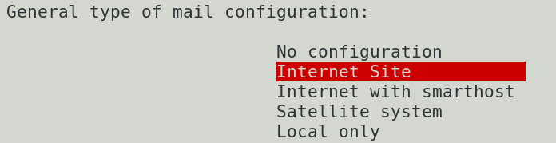
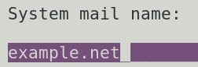
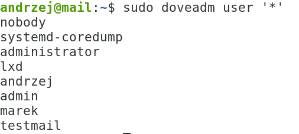
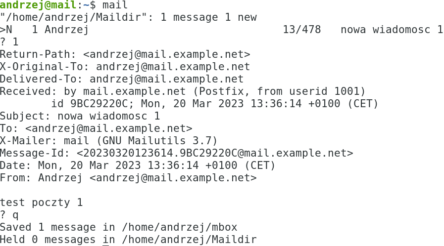
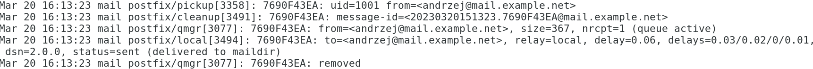
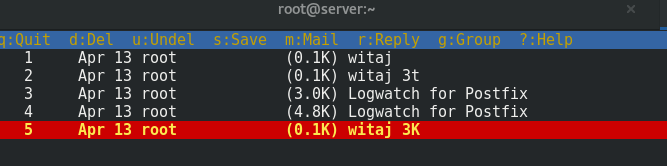
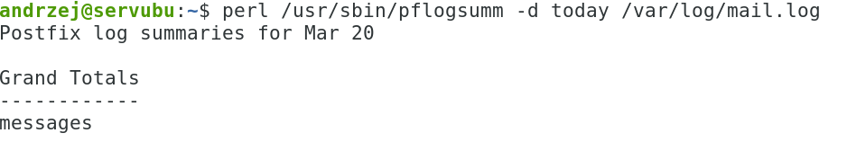
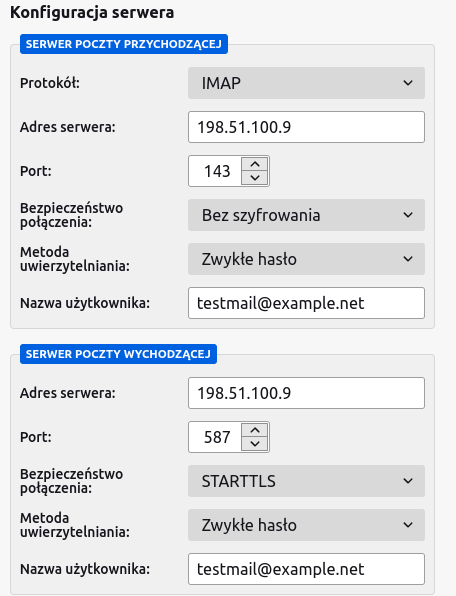
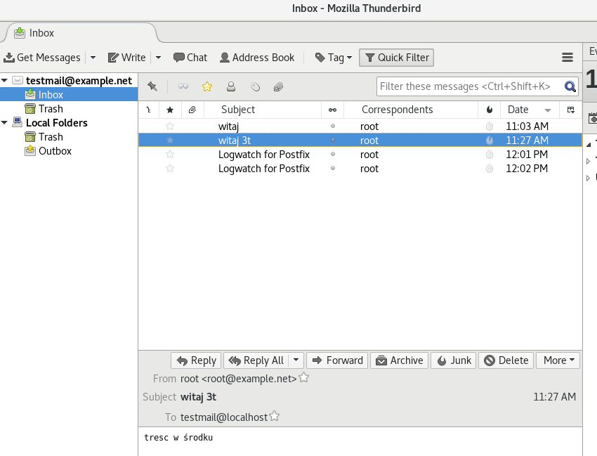
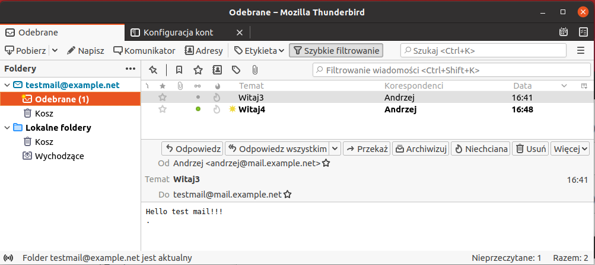

# Ćwiczenia 15 -- instalacja i konfiguracja serwera poczty

1. Zaloguj się na swoje konto.

1. Ustaw nazwę serwera na mail z pomocą hostnamectl

1. Ustaw nazwę serwera na `mail.example.net mail` w **/etc/hosts**, po edycji

    ```bash
    sudo hostname -f
    ```

1. Skonfiguruj serwer postfix:
   - domena example.net,
   - sieć 198.51.100.0/24,
   - ip serwera to numer stanowiska

1. Zainstaluj pakiety:

   ```bash
   sudo apt install postfix -y
   ```

   Wybierz:

   

   Oraz

   

1. W przypadku pomyłki można powtórzyć konfigurację postfiksa:

   

   ```bash
   sudo dpkg-reconfigure postfix 
   ```

1. Edytuj plik main.cf :

   ```bash
   sudo mcedit /etc/postfix/main.cf
   ```

   , sprawdź ewentualnie dodaj opcje, dopisz pozycje:
   - myhostname = mail.example.net
   - mydomain = example.net
   - myorigin = \$mydomain
   - inet_interfaces = all
   - inet_protocols = ipv4
   - mydestination = \$myhostname, example.net, mail.example.net,
        localhost.\$mydomain, localhost, \$mydomain
   - mynetworks = 127.0.0.0/8, 198.51.100.0/24 🡨 dodaj swoją sieć
   - home_mailbox = Maildir/
   - message_size_limit = 10485760
   - mailbox_size_limit = 1073741824
   - smtpd_sasl_type = dovecot
   - smtpd_sasl_path = private/auth
   - smtpd_sasl_auth_enable = yes
   - smtpd_sasl_security_options = noanonymous
   - smtpd_sasl_local_domain = \$myhostname
   - smtpd_recipient_restrictions = permit_mynetworks,
        permit_auth_destination, permit_sasl_authenticated, reject

1. Odkomentuj wiersz w /etc/postfix/master.cf

   

1. Uruchom usługę na stałe:

   ```bash
   sudo systemctl enable postfix
   ```

1. Zrestartuj usługę:

   ```bash
   sudo systemctl restart postfix
   ```

1. Zainstaluj pakiety:

   ```bash
   sudo apt install dovecot-imapd dovecot-pop3d dovecot-core dovecot-lmtpd -y
   ```

1. Skonfiguruj usługę dovecot:

    - vi /etc/dovecot/dovecot.conf

       - protocols = imap pop3 lmtp
       - listen = \*, ::

    - vi /etc/dovecot/conf.d/10-auth.conf

       - disable_plaintext_auth = no
       - auth_mechanisms = plain login

    - vi /etc/dovecot/conf.d/10-mail.conf

       - mail_location = maildir:\~/Maildir

    - vi /etc/dovecot/conf.d/10-master.conf

       - unix_listener /var/spool/postfix/private/auth
       - mode = 0666
       - user = postfix
       - group = postfix

    - vi /etc/dovecot/conf.d/10-ssl.conf
       - ssl = no

1. Zrestartuj usługe dovecot:

   ```bash
   sudo systemctl restart dovecot
   ```

1. Ustaw zaporę:

   ```bash
   sudo ufw enable
   sudo ufw allow 143,587 ,993, 995/tcp
   sudo ufw reload
   sudo ufw status
   ```

1. Zainstaluj clienta poczty:

   ```bash
   sudo apt install mailutils -y
   ```

1. Wykonaj komendę:

   ```bash
   echo 'export MAIL=$HOME/Maildir' >> /etc/profile.d/mail.sh
   ```

1. Załóż konto w systemie o nazwie: `testmail`

1. **Zrestartuj serwer!!!**

1. Sprawdź dostępne konta:

   

1. Wyślij wiadomość testową:

   ```bash
   echo „treść wiadomości" | mail -s „Tytuł np. witaj" twoje_konto
   ```

1. Odczytaj wiadomość w kliencie poczty **mail**:

   

1. Sprawdź logi:

   ```bash
   sudo journalctl -f
   ```

   

1. Wyślij wiadomość testową 2:

   ```bash
   mail -s „Witaj" twoje_konto
   ```

   potem podajemy treść maila

   w nowym wierszu . (piszemy kropkę i enter `Ctrl+D` )

1. Sprawdź pocztę w kliencie poczty **mutt**

   Z programu mutt:

   

1. Zainstaluj pakiet pflogsumm:

   ```bash
   sudo apt install pflogsumm -y
   ```

1. Sprawdź logi poczty:

   ```bash
   perl /usr/sbin/pflogsumm -d today /var/log/mail.log
   ```

   

1. Wyślij wiadomość do testmail poleceniem:

   ```bash
   perl /usr/sbin/pflogsumm -e -d today /var/log/maillog | mail -s 'Logwatch for Postfix' testmail
   ```

1. Ustaw crontaba:

   ```bash
   crontab -e
   # send mail log summary every 5 minutes to root
   */5 * * * * perl /usr/sbin/pflogsumm -e -d today /var/log/maillog | mail -s 'Logwatch for Postfix' root
   ```

1. Otwórz porty na zaporze:

   - imap (143),
   - starttls (587),
   - ssl/tls (465).

1. Skonfiguruj na stacji ubuntu klienta poczty thunderbird dla konta
    <testmail@example.net>

1. Ustawienia:

   

   

   Widok skrzynki na stacji:

   

1. Doinstaluj pakiety dla amavisd, clamav i spamassassina:

   ```bash
   sudo apt install clamav-daemon amavisd-new spamassassin -y
   ```

   

1. Sprawdź działanie usług.

1. Zainstaluj serwer apache z roundcube.

1. Skonfiguruj szyfrowanie poczty, wygeneruj certyfikat.

1. KONIEC.🔚
