> 
1.  Na stacji otwórz stronę: httpd.apache.org/docs/
2.  Zaloguj się na swoje konto.
3.  Wydaj komendę: *sudo apt purge apache2*
4.  Zainstaluj pakiety: sudo apt install apache2 openssl libssl-dev
    links lynx -y
5.  Sprawdź status serwer komendą: *systemctl status apache2*
6.  Sprawdź poprawność konfiguracji: sudo apache2ctl configtest
7.  Sprawdź na pierwszym terminalu logi: *journalctl -f*
8.  Sprawdź czy istnieje proces dla serwera komendą: ps aux \| grep
    apache
<!-- -->
a)  Uruchomić przeglądarkę i sprawdzić na 3 sposoby działanie wpisując:
> lynx localhost \| links 127.0.0.1 \| lynx ip serwera
>
> (pomoc: ip addr add 10.11.12.13/24 dev enp3s0 \| ip link set enp3s0
> up**)**
9.  Analogicznie przetestuj serwer linksowy ze stacji, jeśli nie działa
    dostosuj zaporę, należy otworzyć port **80** lub dodać usługę: sudo
    ufw allow 'Apache Full'
> 
>
> 
10. Sprawdź połączenie z pomocą **wireshark**. ( filtruj ruch po http)
11. Popraw wygląd swojej strony. ( Stwórz plik: /var/www/html/index.html
    ) Sprawdź w przeglądarce.
12. Dodać możliwość tworzenia stron www przez użytkowników systemowych:
    np.
    <http://localhost/>[\~twoje_konto](https://localhost/~twoje_konto) (
    wskazówki: utwórz katalog public_html w swoim katalogu domowym)
> 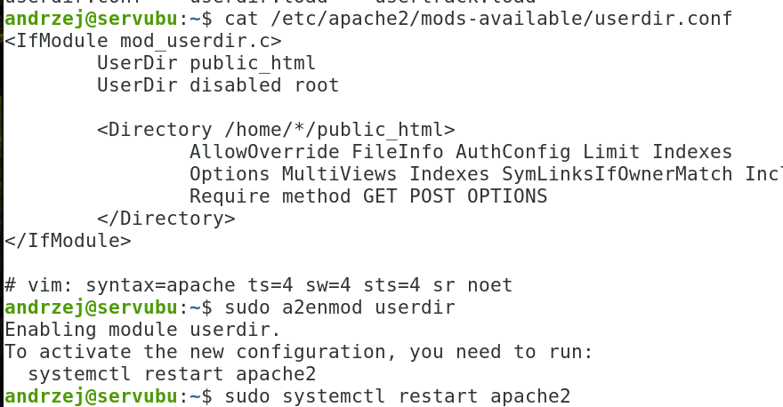
13. Przetestuj stronę ( lynx localhost/\~twoje_konto ):
> 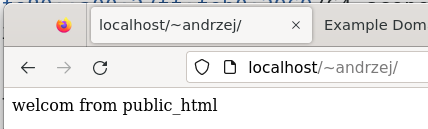
14. Zmodyfikuj następujące parametry pracy serwera, za każdym razem
    sprawdzamy działanie w przeglądarce:
    a)  Nasłuchiwanie na porcie 81 ( **/etc/apache2/ports.conf** ),
> 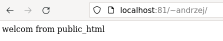
b)  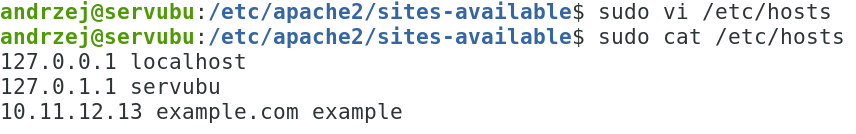
    Ustaw ServerName
    [www.example.com:81](http://www.example.com:81/)
    (/etc/apache2/sites-available/000-default.conf)
> 
c)  Plik strony w lokalizacji /var/www/twoje_konto/html/index.html
    (zawartość strony nowa)
> 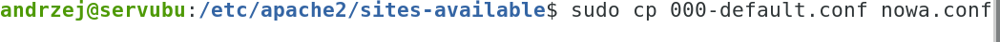
>
> 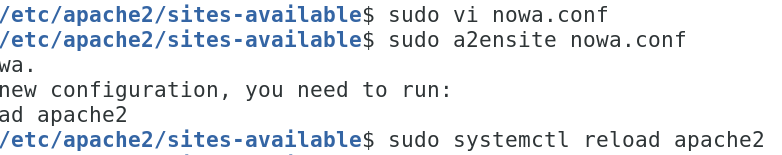
>
> Pamiętaj o bezpieczeństwie, o skopiowaniu sekcji ( shift + insert
> kopiowanie pomiędzy terminalami)
>
> \<Directory „/var/www/html"\> ... \</Directory\>
>
> 
>
> 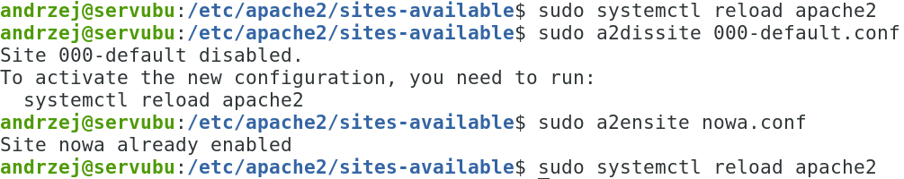
>
> 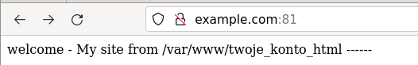
d)  Zmień wpis dla administratora strony www
> 
e)  Zezwól na czytanie poza index.html na inne dokumenty: index.php
    **egzamin.html i egz.php** ( pamiętaj, aby utworzyć te pliki)
    (podpowiedź:
    <https://httpd.apache.org/docs/2.4/mod/mod_dir.html#directoryindex>
> 
>
> 
f)  Zmień poziom logów z warn na info lub debug (
    /etc/apache2/apache2.conf ),
> 
g)  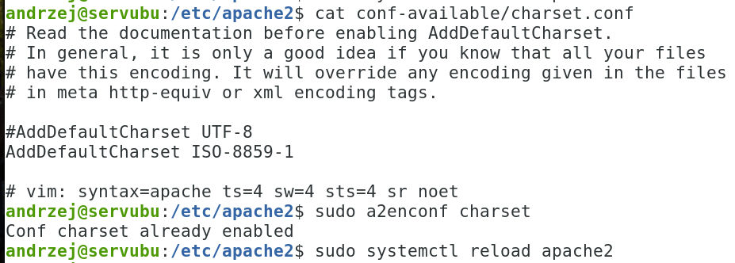
    Zmień domyślny content z UTF-8 na ISO-8859-1
h)  Zmodyfikuj komunika 404 ( wsk. ErrorDocument 404 )
i)  Utwórz 2 serwery wirtualne (skopiuj plik 000-default.conf na
    /etc/apache2/sites-available/www1-example-com.conf,
> pamiętaj o stworzeniu plików index.html i przeładowaniu serwera*: sudo
> systemctl reload apache2*
>
> pomoc:
> [http://httpd.apache.org/docs/2.4/vhosts/](http://httpd.apache.org/docs/2.4/vhosts/)
> ):
>
> 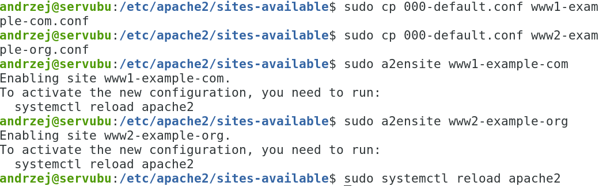
>
> 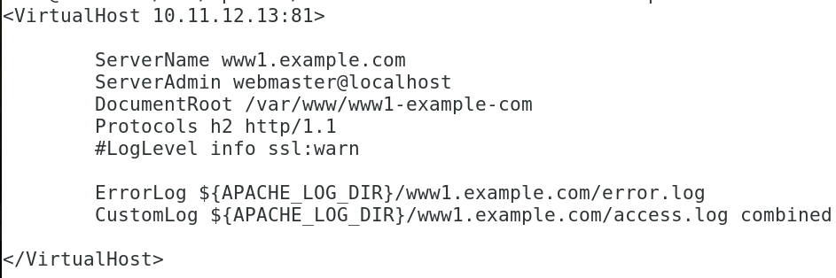
>
> 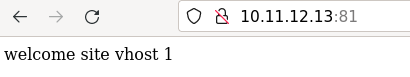
>
> 
>
> 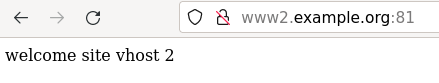
j)  Sprawdź stronę poleceniem curl. np. curl http://10.11.12.13:81 -sSI
> 
k)  
    Sprawdź konfigurację serwera
    poleceniem: *sudo apache2ctl -S*
l)  Dodaj jeszcze dwa serwery wirtualne, ale oparte o nazwy, wykorzystaj
    poniższą podpowiedź:
> 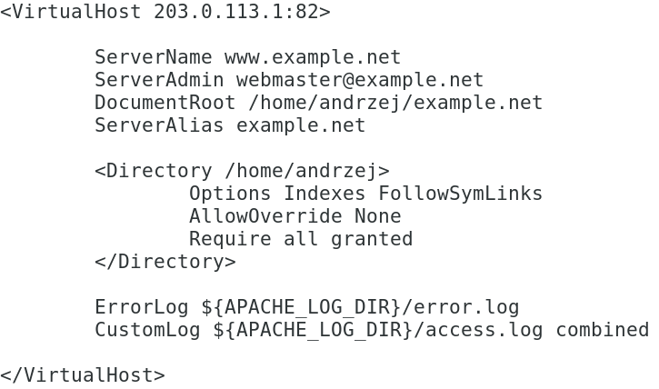
>
> 
>
> \<VirtualHost \*:83\>
>
> ServerName other.example.com
>
> DocumentRoot \"/www/ other.example.com \"
>
> \</VirtualHost\>
>
> Przywróć nasłuchiwanie serwera na port 81!!!
>
> **Druga część dla połączeń szyfrowanych:**
15. 
    Sprawdź czy istnieją certyfikaty dla
    serwera:
16. 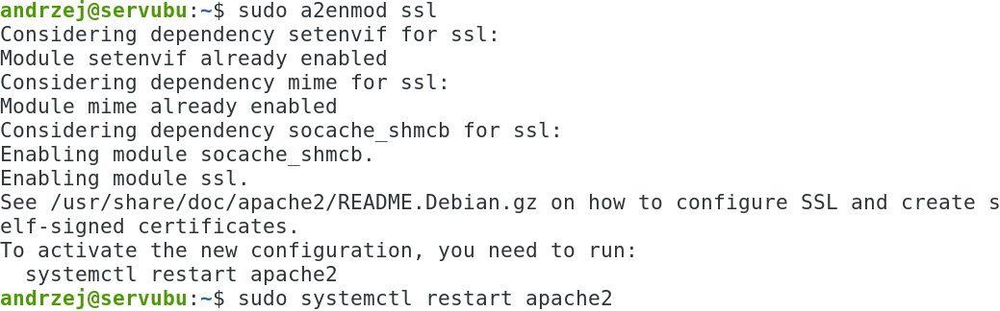
    Włącz obsługę ssl: **sudo a2enmod ssl**
17. Uruchomić przeglądarkę i sprawdzić na 3 sposoby działanie wpisując
    [https://**localhost**](https://localhost/) **-k \| 127.0.0.1 \| ip
    serwera. Sprawdź też localhost:443**
> 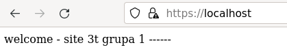
>
> 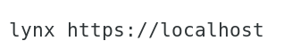
18. 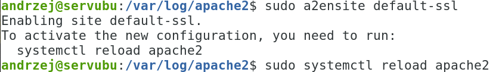
    Jeżeli są problemy z uruchomieniem
    stron to:
19. Sprawdź aktywne połączenia ze swoim serwerem komendą: netstat \|
    grep lub ss -l \| grep
20. Analogicznie przetestuj serwer apache ze stacji, jeśli nie działa
    dostosuj zaporę, należy otworzyć port **443 lub dodać usługę**)
21. Sprawdź połączenie z pomocą **wireshark**. ( filtruj ruch po https)
22. Sprawdź zawartość logów.
23. Dodać możliwość tworzenia stron www przez użytkowników systemowych:
    np.
    [**https**://localhost/\~twoje_konto](https://localhost/~twoje_konto)
    ( wskazówka: public_html )
24. Utwórz serwer wirtualny, który:
<!-- -->
a)  Działa na ip 10.11.12.13 i porcie 443
b)  Pliki stron znajdują się w lokalizacji /var/www/ssl/twoje_konto
c)  Ustaw obsługę protokołu **HTTP/2** ( wsk.
    [http://httpd.apache.org/docs/2.4/howto/http2.html](http://httpd.apache.org/docs/2.4/howto/http2.html)
    )
<!-- -->
25. Przykładowa realizacja:
> 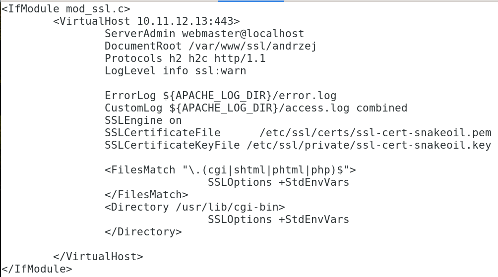
26. Przetestuj działanie w przeglądarce:
> 
>
> 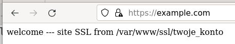
27. Utwórz **drugi** serwer wirtualny, który:
<!-- -->
a)  Działa na ip zgodnie z RFC 5737 - IPv4 Address Blocks Reserved for
    Documentation (<https://tools.ietf.org/html/rfc5737> ) i porcie 443
> Wskazówka: możesz skorzystać z 198.51.100.0/24 (TEST-NET-2)
b)  Pliki stron znajdują się w lokalizacji /var/www/ssl/2/twoje_konto
c)  Nazwa strony: example.net
d)  Ustaw poziom logów na notice lub crit
<!-- -->
28. Sprawdź oba serwery wirtualne.
29. Dla strony: <https://198.51.100.1/> użyj sprawdzenia w
    chrome-\>zbadaj-\>Lighthouse-\>raport
30. Sprawdź stronę https://10.11.12.13 za pomocą curl czy obsługuje
    HTTP2.
> Przykład curl -I \--http2 https://google.pl
31. Dla wirtualnych hostów pracujących na porcie 81 wykonaj
    przekierowanie ruchu do https.
32. Dodatkowe zadanie: dla ip 192.0.2.1 i portu 443 ( RFC 5737
    192.0.2.0/24 (TEST-NET-1)) wygeneruj własny certyfikat w oparciu o
    materiały z wykładu.
33. Zastosuj ServerAlias
    <http://httpd.apache.org/docs/2.4/mod/core.html#serveralias> dla
    nowego wirtual hosta.
34. Wykonaj kopię edytowanych plików.
35. KONIEC
