# Ćwiczenia 15 -- instalacja i konfiguracja serwera www - apache  


1. Na stacji otwórz stronę: httpd.apache.org/docs/

1. Zaloguj się na swoje konto.

1. Wydaj komendę:

   ```bash
   sudo apt remove apache2 --purge -y 
   ```

1. Zainstaluj pakiety:

   ```bash
   sudo apt install apache2 openssl libssl-dev links lynx -y
   ```

1. Sprawdź status serwer komendą:

   ```bash
   sudo systemctl status apache2
   ```

1. Sprawdź poprawność konfiguracji:

   ```bash
   sudo apache2ctl configtest
   ```

1. Sprawdź na pierwszym terminalu logi:

   ```bash
   sudo journalctl -f
   ```

1. Sprawdź czy istnieje proces dla serwera komendą:

   ```bash
   sudo ps aux | grep apache
   ```

1. Uruchomić przeglądarkę i sprawdzić na 3 sposoby działanie wpisując:

   ```bash
   lynx localhost 
   links 127.0.0.1
   lynx ip serwera
   ```

   wskazówka:

   ```bash
   ip addr add 10.11.12.13/24 dev enp3s0 | ip link set enp3s0 up 
   ```

1. Analogicznie przetestuj serwer linksowy ze stacji, jeśli nie działa
    dostosuj zaporę, należy otworzyć port **80** lub dodać usługę:

   ```bash
   sudo ufw allow 'Apache Full'
   ```

   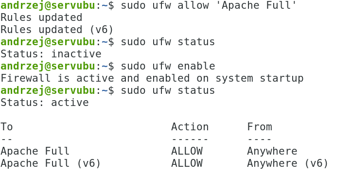

   ```bash
   sudo ufw status verbose
   ```

   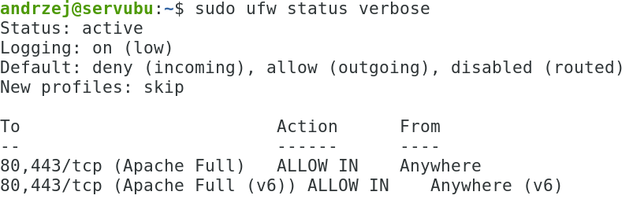

1. Sprawdź połączenie z pomocą **wireshark**. ( filtruj ruch po http)

1. Popraw wygląd swojej strony. Stwórz plik: /var/www/html/index.html

   Sprawdź w przeglądarce.

1. Dodać możliwość tworzenia stron www przez użytkowników systemowych:
    np.
    <http://localhost/>[\~twoje_konto](https://localhost/~twoje_konto)

    wskazówki:
    - utwórz katalog public_html w swoim katalogu domowym
    - włącz moduł userdir

   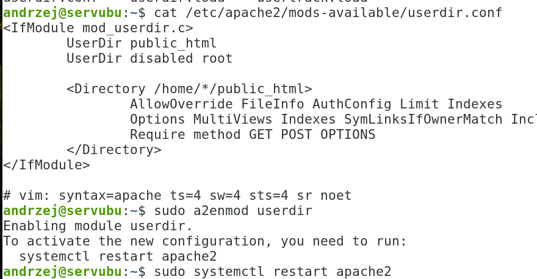

1. Przetestuj stronę narzędziem curl na serwerze:

   ```bash
   curl localhost/~twoje_konto 
   ```

   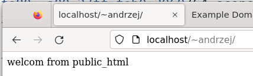

1. Zmodyfikuj następujące parametry pracy serwera, za każdym razem
    sprawdzamy działanie w przeglądarce:

    - nasłuchiwanie na porcie 81 ( **/etc/apache2/ports.conf** ),

       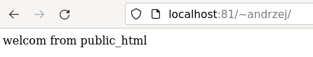

    - wpisy w pliku hosts:

       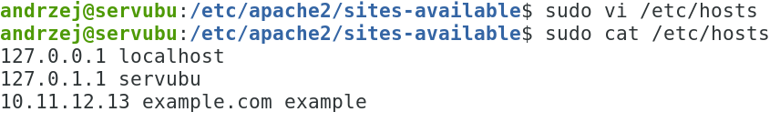

    - ustaw ServerName:

       [www.example.com:81](http://www.example.com:81/)

       /etc/apache2/sites-available/000-default.conf

       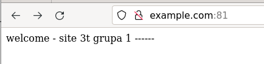

   - plik strony w lokalizacji /var/www/twoje_konto/html/index.html
    (zawartość strony nowa)

       

       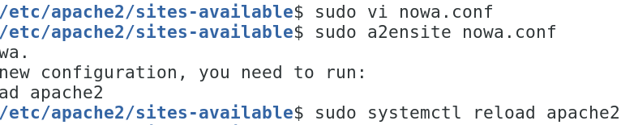

       Pamiętaj o bezpieczeństwie, o skopiowaniu sekcji ( shift + insert
       kopiowanie pomiędzy terminalami)

       \<Directory „/var/www/html"\> ... \</Directory\>

       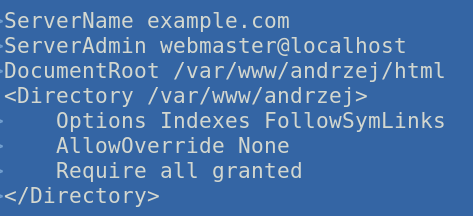

       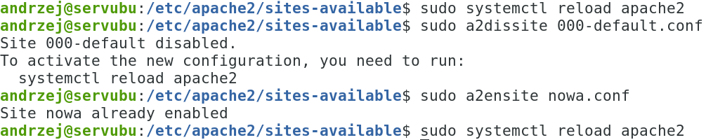

       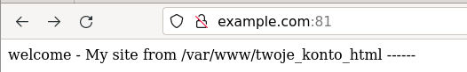

   - zmień wpis dla administratora strony www

      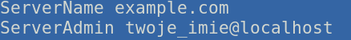

   - zezwól na czytanie poza index.html na inne dokumenty:
      - index.php
      - egzamin.html
      - egz.php ( pamiętaj, aby utworzyć te pliki)

         podpowiedź:  <https://httpd.apache.org/docs/2.4/mod/mod_dir.html#directoryindex>

        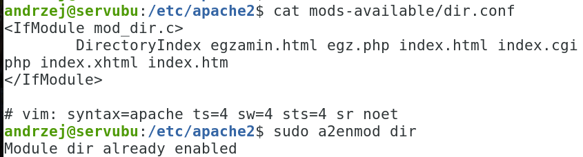

        

   - Zmień poziom logów z warn na info lub debug (
    /etc/apache2/apache2.conf ),

      

   - Zmień domyślny content z UTF-8 na ISO-8859-1

     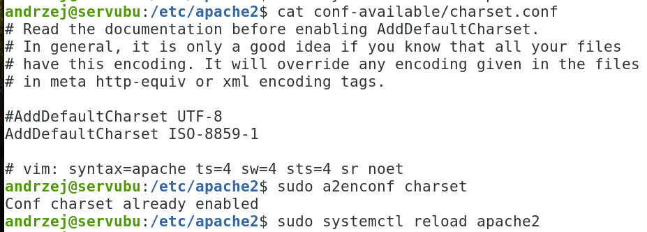

   - Zmodyfikuj komunika 404 ( wsk. ErrorDocument 404 )

   - Utwórz 2 serwery wirtualne:
     skopiuj plik 000-default.conf na:

     /etc/apache2/sites-available/www1-example-com.conf,

     pamiętaj o stworzeniu plików index.html i przeładowaniu serwera:

     ```bash
      sudo systemctl reload apache2
     ```

       pomoc: [http://httpd.apache.org/docs/2.4/vhosts/](http://httpd.apache.org/docs/2.4/vhosts/)

      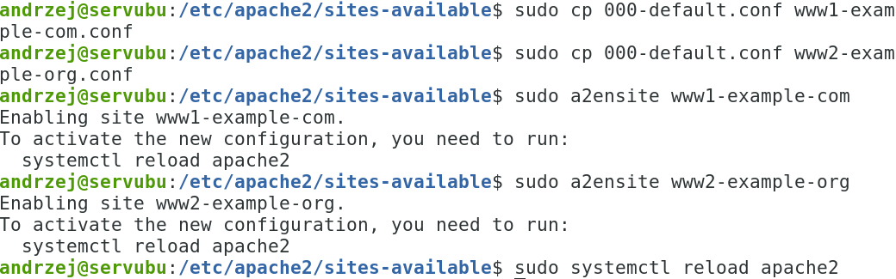

      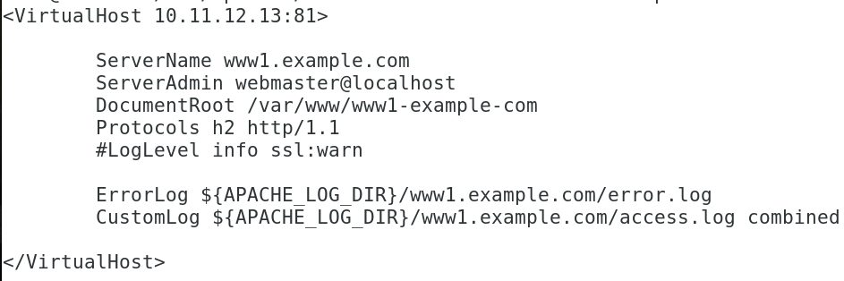

      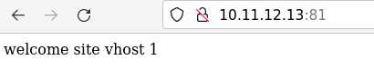

      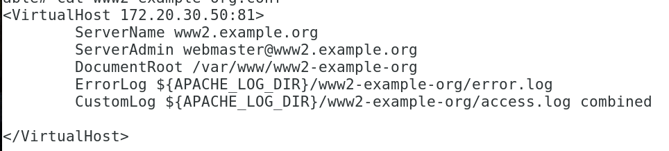

      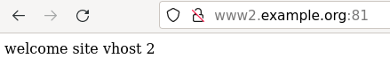

   - Sprawdź stronę poleceniem curl. np.:

     ```bash
     curl http://10.11.12.13:81 -sSI
     ```

     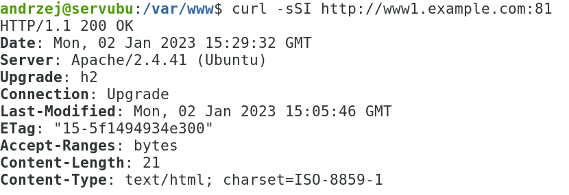

   - Sprawdź konfigurację serwera poleceniem:

     ```bash
     sudo apache2ctl -S
     ```

     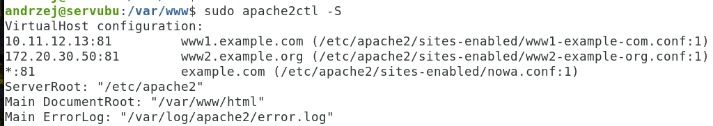

   - Dodaj jeszcze dwa serwery wirtualne, ale oparte o nazwy, wykorzystaj
     poniższą podpowiedź:

     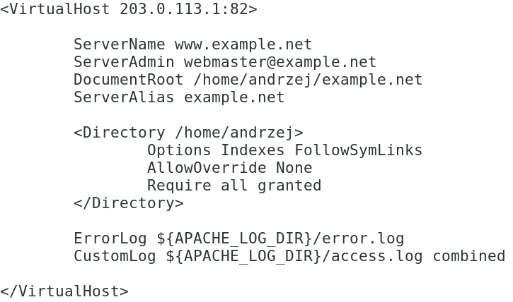

     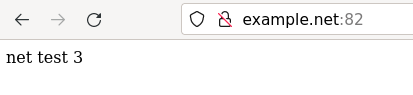

     \<VirtualHost \*:83\>

      ServerName other.example.com

      DocumentRoot \"/www/ other.example.com \"

      \</VirtualHost\>

      Przywróć nasłuchiwanie serwera na port 81!!!

    **Druga część dla połączeń szyfrowanych:**

1. Sprawdź czy istnieją certyfikaty dla
    serwera:

    

1. Włącz obsługę ssl: **sudo a2enmod ssl**

    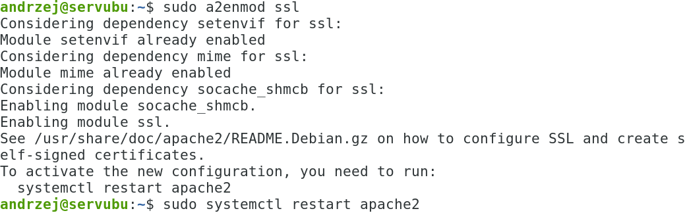

1. Uruchomić przeglądarkę i sprawdzić na 3 sposoby działanie wpisując

    ```bash
    curl https://localhost -k  
    curl https://127.0.0.1 -k 
    curl https://ip-serwera -k
    curl localhost:443 -k 
    ```

    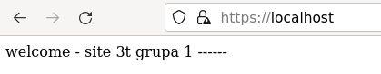

    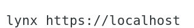

1. Jeżeli są problemy z uruchomieniem stron to:

    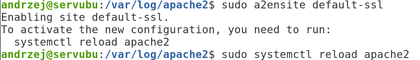

1. Sprawdź aktywne połączenia ze swoim serwerem komendą:

    ```bash
    netstat | grep lub ss -l | grep
    ```

1. Analogicznie przetestuj serwer apache ze stacji, jeśli nie działa
    dostosuj zaporę, należy otworzyć port **443 lub dodać usługę**)

1. Sprawdź połączenie z pomocą **wireshark**. ( filtruj ruch po https)

1. Sprawdź zawartość logów.

1. Dodać możliwość tworzenia stron www przez użytkowników systemowych:
    np.

    [**https**://localhost/\~twoje_konto](https://localhost/~twoje_konto)
    ( wskazówka: public_html )
1. Utwórz serwer wirtualny, który:
<!-- -->
a)  Działa na ip 10.11.12.13 i porcie 443
b)  Pliki stron znajdują się w lokalizacji /var/www/ssl/twoje_konto
c)  Ustaw obsługę protokołu **HTTP/2** ( wsk.
    [http://httpd.apache.org/docs/2.4/howto/http2.html](http://httpd.apache.org/docs/2.4/howto/http2.html)
    )
<!-- -->
1. Przykładowa realizacja:

> 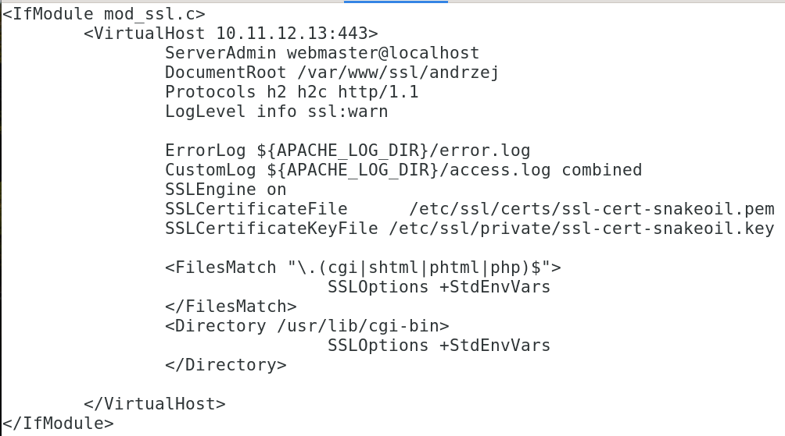

1. Przetestuj działanie w przeglądarce:

> 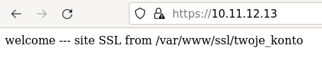
>
> 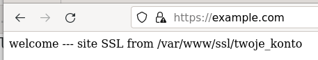

1. Utwórz **drugi** serwer wirtualny, który:
<!-- -->
a)  Działa na ip zgodnie z RFC 5737 - IPv4 Address Blocks Reserved for
    Documentation (<https://tools.ietf.org/html/rfc5737> ) i porcie 443
> Wskazówka: możesz skorzystać z 198.51.100.0/24 (TEST-NET-2)
b)  Pliki stron znajdują się w lokalizacji /var/www/ssl/2/twoje_konto
c)  Nazwa strony: example.net
d)  Ustaw poziom logów na notice lub crit
<!-- -->
1. Sprawdź oba serwery wirtualne.
2. Dla strony: <https://198.51.100.1/> użyj sprawdzenia w
    chrome-\>zbadaj-\>Lighthouse-\>raport
3. Sprawdź stronę <https://10.11.12.13> za pomocą curl czy obsługuje
    HTTP2.

> Przykład curl -I \--http2 <https://google.pl>

1. Dla wirtualnych hostów pracujących na porcie 81 wykonaj
    przekierowanie ruchu do https.
2. Dodatkowe zadanie: dla ip 192.0.2.1 i portu 443 ( RFC 5737
    192.0.2.0/24 (TEST-NET-1)) wygeneruj własny certyfikat w oparciu o
    materiały z wykładu.
3. Zastosuj ServerAlias
    <http://httpd.apache.org/docs/2.4/mod/core.html#serveralias> dla
    nowego wirtual hosta.
4. Wykonaj kopię edytowanych plików.
5. KONIEC

---

Wykaz zadań egzaminacyjnych dla Apache:

| rok  | miesiąc  | nr. zadania | witryna |
|:----:|:--------:|:-----------:|:-------:|
| 2022 | czerwiec | 2           | www     |
| 2023 | styczeń  | 4           | www     |

---
