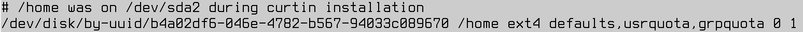
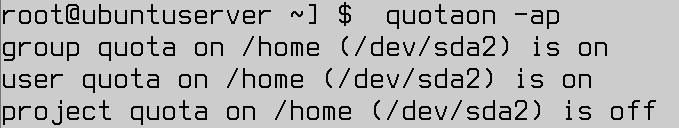
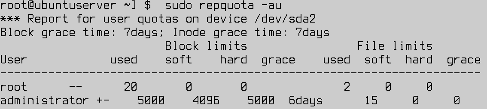
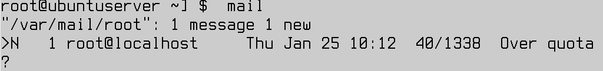
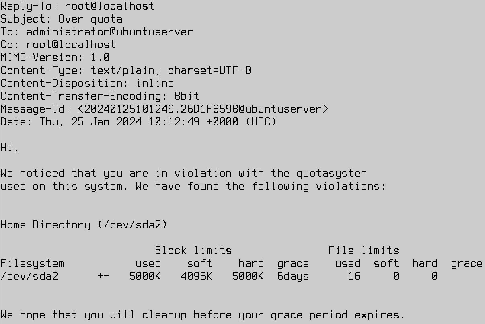

Ćwiczenia 17 -- konfiguracja quoty na ubuntu serwer
Praca na stacji windows z programem virtualbox
1.  Zaimportuj w virtualbox na stacji windows plik ubuntu_server1 do
    QUOTY 1600x1200.ova ( ctrl+i )
2.  Sklonuj zaimportowaną maszynę.
3.  Dla klona zmień nazwę na twoje imię.
4.  Uruchom zaimportowaną maszynę wirtualną nazwaną twoim imieniem.
    Możesz poprawić widok → tryb przeskalowany.
5.  Sprawdź układ partycji na dysku, w szczególności czy /home jest na
    osobnej partycji, np. lsblk i blkid.
6.  Zainstaluj quotę: sudo apt install quota quotatool -y ( dpkg
    \--configure -a)
7.  Ustaw hasło dla konta root i zaloguj się na nie.
8.  Usuń konto administratora.
9.  Odmontuj katalog home: umount /home
10. vi /etc/fstab
    
11. Zamontuj katalog home: mount -o usrquota,grpquota /dev/sda2 /home
12. Włącz quotę dla katalogu home: quotacheck -ugm /home
13. Zreastartuj serwer.
14. Wyświetl staus: quotaon -ap
    
15. Skonfiguruj quotę dla dwóch użytkowników
    a)  Zosi na 25MB
    b)  Marka na 20MB
16. Na kontach Zosia i Marek poleceniem quota możesz sprawdzić aktualne
    przydziały.
17. Wyświetl raport:
    
18. Sprawdź przekroczenie quoty:
    
19. Zainstaluj pakiet mailutils, odpowiedź tylko lokanie.
20. Wydaj komendę warnquota.
21. Sprawdź mail z ostrzeżeniem o przekroczeniu quoty:
    
22. Zawartość maila
    
23. Spróbuj ustawić quotę dla użytkownika wojtek za pomocą polecenia
    setquota -ua soft hard 0 0.
24. Zmień domyślny czas dla quoty na 10 dni, np.: setquota -t 864000.
25. Stwórz quotę dla grupy **users**, która istnieje w systemie.
26. Stwórz konto o nazwie blazej dodając je na etapie tworzenia do grupy
    users.
27. Sprawdzić działanie quoty tworząc duży plik.
28. Sprawdź logi i maila.
29. KONIEC :)
