Instalacja i konfiguracja serwera DHCP +dhcpv6
Założenia: praca w parach. Konfiguracja klient -- serwer. Ubuntu
server + stacje:
> windows i ubuntu desktop
Zachowaj na koniec zajęć plik konfiguracyjny dhcpd.conf w swoim katalogu
domowym!!!
**Zadanie 1**
1)  Zaloguj się na konto administrator i dodaj swoje konto do grupy
    sudo:
> *sudo usermod nazwa_konta -G sudo*
2)  Odłącz stacje windows od internetu.
3)  Zaloguj się na swoje konto na minimum pięciu terminalach. (Alt+F2,
    Alt+F3, ...
na logi, na edycję pliku ,na komendy, , na restart usługi, na
dokumentację )
4)  Przed przystąpieniem do pracy trzeba odinstalować serwer dhcp:
sudo apt *remove isc-dhcp-server \--purge -y*
5)  Zainstaluj serwer DHCP. ( *sudo apt install isc-dhcp-server* )
6)  Sprawdź czy jest zainstalowana paczka w systemie: *sudo apt list
    \--installed \| grep dhcp*
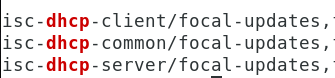
7)  Skopiuj plik /etc/dhcp/dhcpd.conf do swojego katalogu domowego
    /home/twoje_konto/
8)  Skonfiguruj plik /etc/dhcp/dhcpd.conf ( przykładowy plik znajduje
    się w:
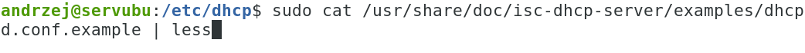
/usr/share/doc/isc-dhcp-server/examples/dhcpd.conf.example
otwórz go na 5 terminalu)
9)  Otwórz plik dhcpd.conf w vi lub nano lub mcedit ( przykładowe
    polecenie: *sudo vi /etc/dhcp/dhcpd.conf* )
10) Skonfiguruj serwer tak, aby:
<!-- -->
a)  był serwerem podrzędny
b)  automatyczne aktualizacje ddns ustaw na none
c)  poziom logów ustaw na 7
d)  określ domenę na „klasaXY.example.org"
e)  ustaw DNSy: 8.8.8.8, 8.8.4.4
f)  czas dzierżawy 1 minuta, maksymalny czas 3 minuty
g)  pracował na podsieci:
- złożonej z 8 adresów IP, którą wyznaczysz z sieci 172.21.194.128/25.
> Klient powinien uzyskać adres ip z końcówką 179 lub 181.
>
> 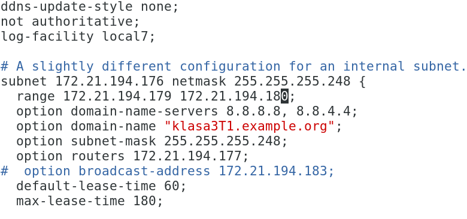
11) Ustaw kartę sieciową dolną **( w sali 70: eno1 lub enp3s0** ) tak,
    aby serwer DHCP mógł na niej pracować, użyj komendy ip, np.:

12) Podaj na jakim interfejsie pracuje usługa DHCP w pliku
    /etc/default/isc-dhcp-server:
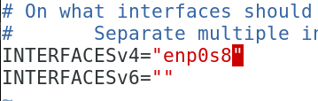
13) Zrestartuj usługę dhcp poleceniem:
*sudo systemctl restart isc-dhcp-server*
14) W logach nie może być błędów, szukamy wpisu:
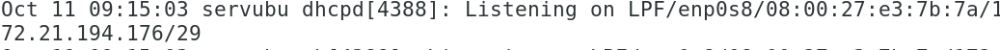
15) Jeśli wystąpią błędy podczas uruchamiania to popraw plik
    /etc/dhcp/dhcpd.conf, i zrestartuj usługę.
16) Sprawdź czy istnieje proces dla serwera DHCP poleceniem: *ps aux \|
    grep isc-dhcp-server*
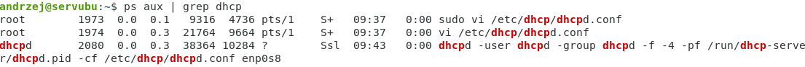
oraz
*htop -\> F3 wpisać dhcp i enter, wyjście q*
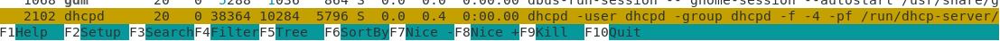
17) Sprawdź zawartość logów poleceniem na 4 terminalu: *sudo journalctl
    -f (preferowana metoda)*
*lub sudo journalctl -u isc-dhcp-server \--since today (klawisz Page
Down)*
18) Na kliencie windows pobierz ustawienia na dolną kartę z serwera
    dhcp.
19) 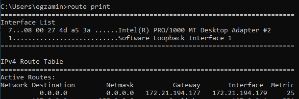
    Na stacji windows spradź ustawienia:
    *route print,*
*ipconfig /all*
*oraz graficznie*
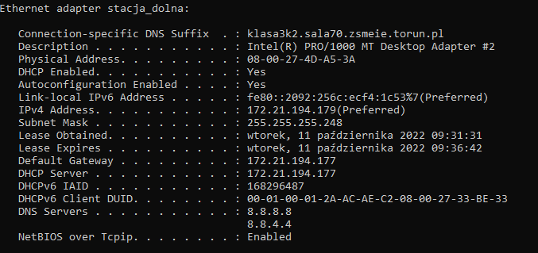
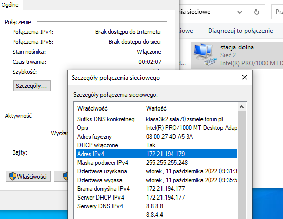
20) Sprawdź zawartość logów na serwerze:
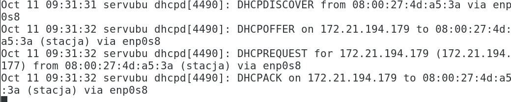
21) Wykonaj w sekcji host rezerwację dla stacji windows.
Dodaj DNS: 8.8.8.8 oraz 1.1.1.1 w sekcji host, a
domyślny czas dzierżawy ustaw na 2 minuty,
maksymalny czas dzierżawy ustaw na 6 minuty,
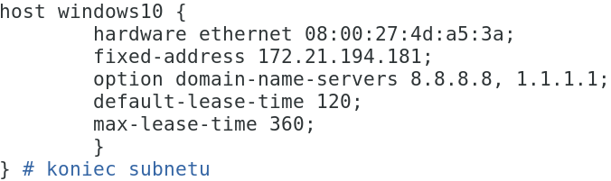
22) 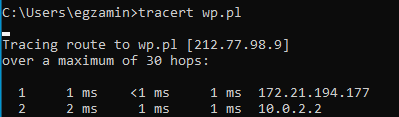
    Pobierz nowe ustawienia na stacji.
23) Zmień kolejność dnsów. Pobierz nowe ustawienia na stacji.
24) Sprawdzenie trasy ze stacji windows:
25) Na kliencie ubuntu desktop wydaj komendę: *ip a*, jeśli brakuje
    nowych ustawień wydaj komendę:
*dhclient* w celu pobrania ustawień.
26) Na kliencie ubuntu desktop wydaj komendy: *ip a, ip r, nmcli, route,
    resolvectl* w celu sprawdzenia konfiguracji. Efekt użycia polecenia
    nmcli:
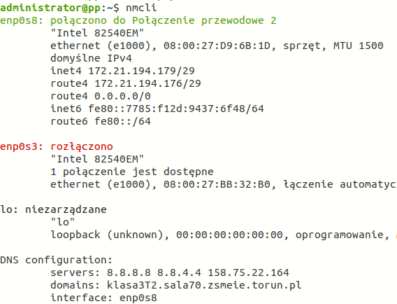
27) Sprawdzenie dnsów:
*systemd-resolve \--status \| grep \'DNS Servers\' -A2*
*lub resolvectl i cat /etc/resolv.conf*
28) Wykonaj w sekcji host rezerwację dla stacji ubuntu.
Dodaj DNSy: 8.8.8.8, 1.1.1.1, 1.0.2.1 w sekcji host, a
domyślny czas dzierżawy ustaw na 2 minuty,
maksymalny czas dzierżawy ustaw na 8 minut.
29) Pobierz nowe ustawienia na stacji.
30) Zmień kolejność dnsów. Pobierz nowe ustawienia na stacji.
31) Sprawdź czas dzierżawy: sudo cat /var/log/syslog \| grep dhcp
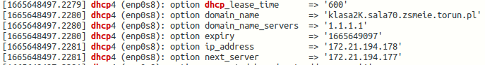
32) Sprawdzenie trasy ze stacji ubuntu: mtr strona
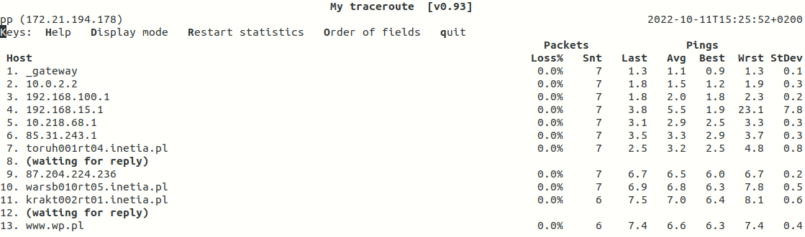
33) Włącz masquerade w celu przekazania internetu:
*/etc/sysctl.conf ustaw(odkomentuj)* *net.ipv4.ip_forward=1*
*net.ipv6.conf.default.forwarding=1 (dla wersji 6 , opcjonalnie)*
*sudo sysctl -p , sprawdź cat /proc/sys/net/ipv4/ip_forward*
*sudo iptables -t nat -A POSTROUTING -s 172.21.194.176/29 -j MASQUERADE*
Powyższe polecenia powinny wystarczyć!!! Jeżeli nie użyj dla iptables
poniższego:
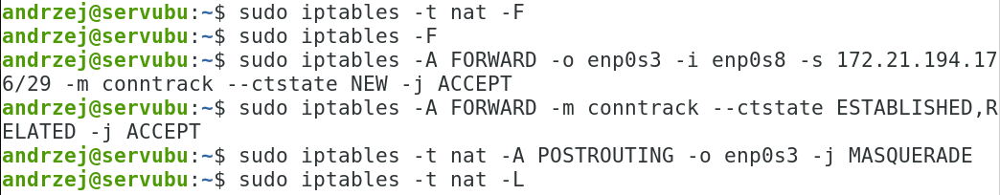
W powyższym karta enp0s3 to karta górna z dostępem do internetu, enp0s8
to karta dolna dla sieci lokalnej
34) Uruchom przeglądarkę na stacji roboczej w celu sprawdzenia dostępu
    do internetu.
35) Sprawdź listę dzierżaw na serwerze:
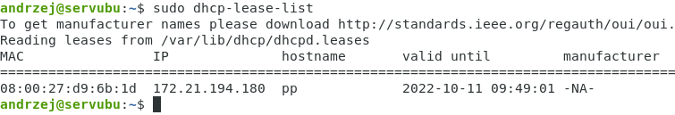
36) Zadanie 2: Skonfiguruj serwer tak, aby:
<!-- -->
a)  był serwerem podrzędny
b)  automatyczne aktualizacje ddns ustaw na none
c)  poziom logów ustaw na 5
d)  określ domenę na „klasaXY.example.net"
e)  ustaw DNSy: 1.1.1.1, 158.75.22.164, 8.8.4.4
f)  czas dzierżawy 1 minuta, maksymalny czas 10 minut
g)  pracował na dwóch podsieciach:
- złożonej z 32 adresów IP, którą wyznaczysz z sieci 10.20.30.192/26.
> Klient powinien uzyskać adres ip z końcówką 230 lub 238.
- złożonej z 16 adresów IP, którą wyznaczysz z sieci 192.168.70.64/27.
> Klient powinien uzyskać adres ip z końcówką 100 lub 101.
37) Na kliencie sprawdź pobrane ustawienia.
38) Skonfiguruj serwer do pracy w ipv6
39) Skopiowanie skryptu:

40) Skopiowanie pliku:
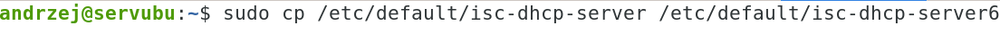
41) Konfiguracja /etc/default/isc-dhcp-server6:
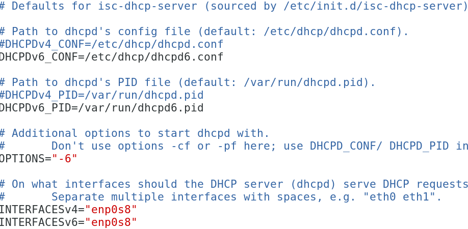
42) Plik konfiguracyjny
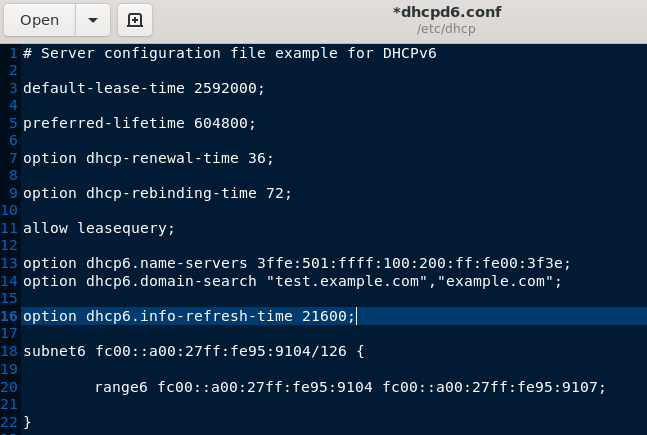
43) Ustawienie karty:
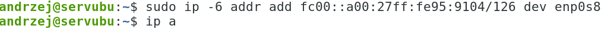
44) Uruchomienie
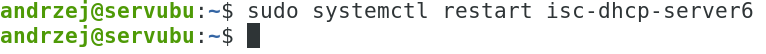
45) Sprawdzenie procesów:

46) Log:
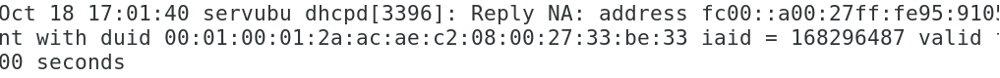
47) Ustawienia pobrane na stacji windows:
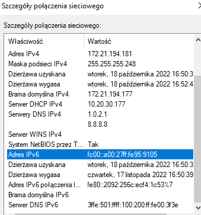
48) Ustawienia pobrane na stacji ubuntu:
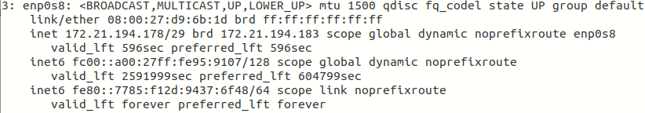
49) Graficznie:
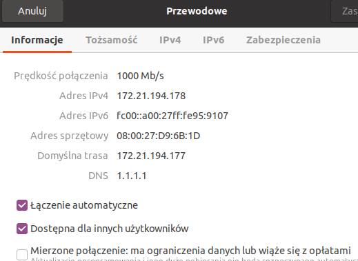
50) Log dla stacji ubuntu z serwera:
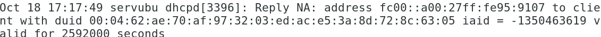
51) Sprawdzenie dzierżaw:
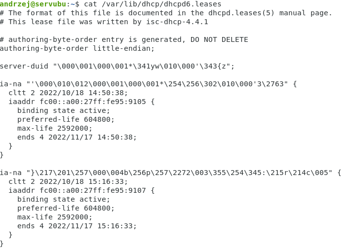
52) Dzierżawy dla wersji 4:
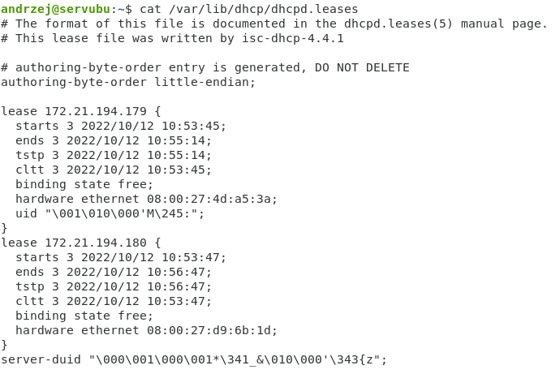
53) Koniec
