# Ćwiczenia 18 - serwer DHCP + DHCPv6

💡 Założenia:

- praca w parach.
- Konfiguracja klient -- serwer.
- Ubuntu server + stacje: windows i ubuntu desktop

1. Zaloguj się na konto administrator i dodaj swoje konto do grupy sudo:

```bash
sudo usermod nazwa_konta -G sudo
```

1. Na stacji windows od internetu.
1. Zaloguj się na swoje konto na minimum 6 terminalach:  

    <kbd>Alt</kbd>+<kbd>F1</kbd>, na komendy lub edycję pliku

    <kbd>Alt</kbd>+<kbd>F2</kbd>, na komendy

    <kbd>Alt</kbd>+<kbd>F3</kbd>, na edycję pliku

    <kbd>Alt</kbd>+<kbd>F4</kbd>, na dokumentację  

    <kbd>Alt</kbd>+<kbd>F5</kbd>, na restart usługi  

    <kbd>Alt</kbd>+<kbd>F6</kbd>, na logi

1. Przed przystąpieniem do pracy trzeba odinstalować serwer dhcp:

   ```bash
   sudo apt remove isc-dhcp-server --purge -y
   ```

1. Zainstaluj serwer DHCP.

   ```bash
   sudo apt install isc-dhcp-server
   ```

1. Sprawdź czy jest zainstalowana paczka w systemie:

   ```bash
   sudo apt list --installed | grep dhcp
   ```

   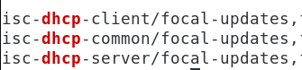

1. Skopiuj plik _**/etc/dhcp/dhcpd.conf**_ do swojego katalogu domowego **/home/twoje_konto/**
1. Skonfiguruj plik _**/etc/dhcp/dhcpd.conf**_ . Przykładowy plik znajduje się w:

   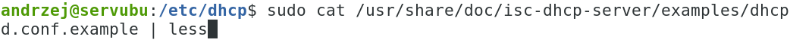

   _/usr/share/doc/isc-dhcp-server/examples/dhcpd.conf.example_
   otwórz go na 4 terminalu)

1. Otwórz plik dhcpd.conf w vi lub nano lub mcedit, np.:

   ```bash
    sudo mcedit /etc/dhcp/dhcpd.conf
   ```

1. Skonfiguruj serwer tak, aby:

   - był serwerem podrzędny
   - automatyczne aktualizacje ddns ustaw na none
   - poziom logów ustaw na 7
   - określ domenę na „klasaXY.example.org"
   - ustaw DNSy: 8.8.8.8, 8.8.4.4
   - czas dzierżawy 1 minuta, maksymalny czas 3 minuty
   - pracował na podsieci:
      - złożonej z 8 adresów IP, którą wyznaczysz z sieci 172.21.194.128/25.  
      - Klient powinien uzyskać adres ip z końcówką 179 lub 181.

   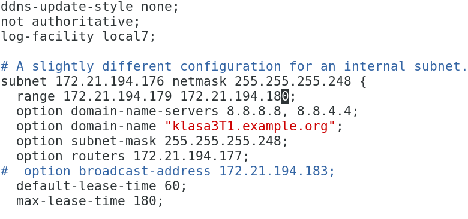

1. Ustaw kartę sieciową dolną **( w sali 70: eno1 lub enp3s0** ) tak,
    aby serwer DHCP mógł na niej pracować, użyj komendy ip, np.:

   

1. Podaj na jakim interfejsie pracuje usługa DHCP w pliku
    _**/etc/default/isc-dhcp-server**_:

   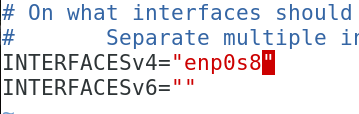

1. Zrestartuj usługę dhcp poleceniem:

   ```bash
   sudo systemctl restart isc-dhcp-server
   ```

1. W logach nie może być błędów, szukamy wpisu:

   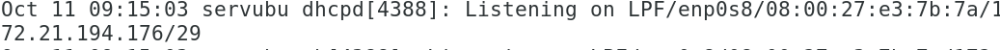

1. Jeśli wystąpią błędy podczas uruchamiania to popraw
plik _**/etc/dhcp/dhcpd.conf**_, i zrestartuj usługę.

1. Sprawdź czy istnieje proces dla serwera DHCP poleceniem:

   ```bash
    sudo ps aux | grep isc-dhcp-server
   ```

   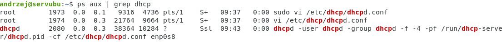

   oraz

   ```bash
   sudo htop -> F3 wpisać dhcp i enter, wyjście q
   ```

   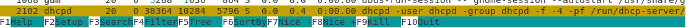

1. Sprawdź zawartość logów poleceniem na 6 terminalu:

   ```bash
    sudo journalctl -f (preferowana metoda)
   ```

   lub

   ```bash
   sudo journalctl -u isc-dhcp-server --since today (klawisz Page Down)
   ```

1. Na kliencie windows pobierz ustawienia na dolną kartę z serwera
    dhcp.

1. Na stacji windows spradź ustawienia:

    _route print,_  
    _ipconfig /all_

   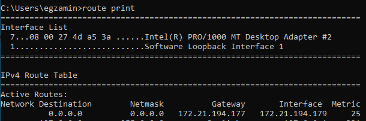

   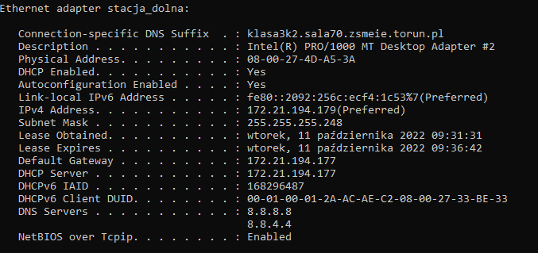

   oraz graficznie

   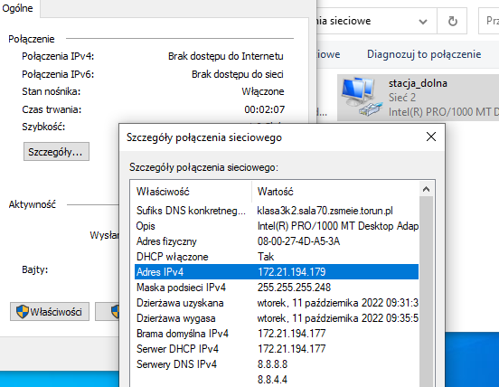

1. Sprawdź zawartość logów na serwerze:

   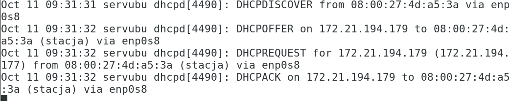

1. Wykonaj w sekcji host rezerwację dla stacji windows.  

   dolną daj DNS: `8.8.8.8` oraz `1.1.1.1` w sekcji host,
   a **domyślny** czas dzierżawy ustaw na 2 minuty,  
   **maksymalny** czas dzierżawy ustaw na 6 minuty,  

   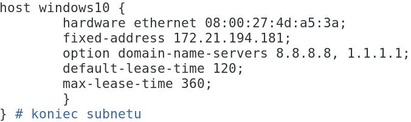

1. Pobierz nowe ustawienia na stacji, a następnie sprawdź trasę na windows

   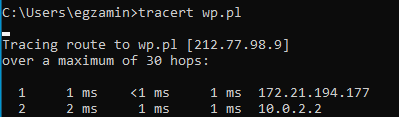

1. Zmień kolejność dnsów. Pobierz nowe ustawienia na stacji.

1. Sprawdzenie trasy ze stacji windows i linux.

1. Na kliencie ubuntu desktop wydaj komendę:

   ```bash
   ip -c a
   ```

   , jeśli brakuje nowych ustawień wydaj komendę:

   ```bash
   sudo dhclient 
   ```

   w celu ich pobrania.

1. Na kliencie ubuntu desktop wydaj komendy:

   ```bash
       ip a
       ip r 
       nmcli
       route
       resolvectl
   ```

   Efekt użycia polecenia nmcli:

   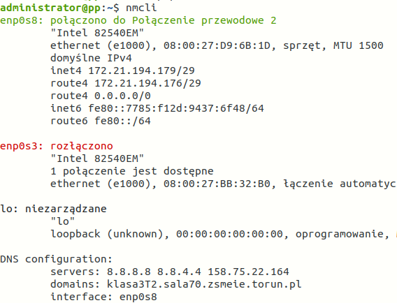

1. Sprawdzenie dnsów:

   ```bash
   systemd-resolve --status | grep 'DNS Servers' -A2
   ```

   lub

   ```bash
   sudo resolvectl 
   ```

   i

   ```bash
    cat /etc/resolv.conf
   ```

1. Wykonaj w sekcji host rezerwację dla stacji ubuntu.  
    Dodaj DNSy: `8.8.8.8`, `1.1.1.1`, `1.0.2.1` w sekcji host,
    a **domyślny** czas dzierżawy ustaw na 2 minuty,
    **maksymalny** czas dzierżawy ustaw na 8 minut.

1. Pobierz nowe ustawienia na stacji.

1. Zmień kolejność dnsów. Pobierz nowe ustawienia na stacji.

1. Sprawdź czas dzierżawy:

   ```bash
    sudo cat /var/log/syslog | grep dhcp
   ```

   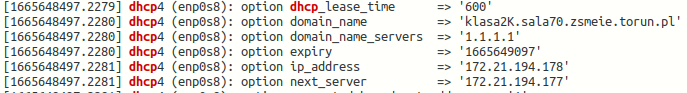

   lub

   ```bash
   sudo nmcli -f dhcp4 device show 
   ```

   poszukać frazy: _dhcp_lease_time_ wyrażone w sekundach:

   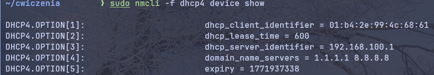

1. Sprawdzenie trasy ze stacji ubuntu:

   ```bash
   mtr wp.pl
   ```

   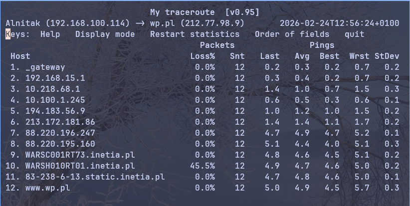

1. Włącz masquerade w celu przekazania internetu na stację:

   _*/etc/sysctl.conf*_ ustaw, odkomentuj:
   `net.ipv4.ip_forward=1`  
   `net.ipv6.conf.default.forwarding=1` (dla wersji 6 , opcjonalnie)  

   ```bash
   sudo sysctl -p 
   cat /proc/sys/net/ipv4/ip_forward
   ```

   ```bash
   sudo iptables -t nat -A POSTROUTING -s 172.21.194.176/29 -j MASQUERADE
   ```

   Powyższe polecenia powinny wystarczyć!!! Jeżeli nie użyj dla iptables
   poniższego:
   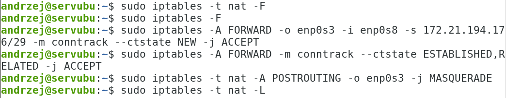
   W powyższym:  
   `enp0s3` to karta górna z dostępem do internetu,  
   `enp0s8` to karta dolna dla sieci lokalnej

1. Uruchom przeglądarkę na stacji roboczej w celu sprawdzenia dostępu
    do internetu.
1. Sprawdź listę dzierżaw na serwerze:

   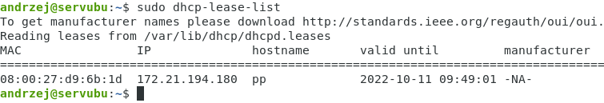

1. Zadanie 2: Skonfiguruj serwer tak, aby:

   - był serwerem podrzędny
   - automatyczne aktualizacje ddns ustaw na none
   - poziom logów ustaw na 5
   - określ domenę na „klasaXY.example.net"
   - ustaw DNSy: 1.1.1.1, 158.75.22.164, 8.8.4.4
   - czas dzierżawy 1 minuta, maksymalny czas 10 minut
   - pracował na dwóch podsieciach:
   - złożonej z 32 adresów IP, którą wyznaczysz z sieci 10.20.30.192/26.
     Klient powinien uzyskać adres ip z końcówką 230 lub 238.
   - złożonej z 16 adresów IP, którą wyznaczysz z sieci 192.168.70.64/27.
     Klient powinien uzyskać adres ip z końcówką 100 lub 101.

1. Na stacji roboczej sprawdź pobrane ustawienia.

---

1) Skonfiguruj serwer do pracy w ipv6
2) Skopiowanie skryptu:
   
3) Skopiowanie pliku:
   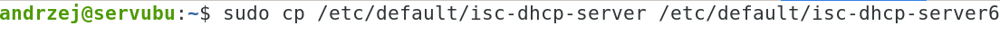
4) Konfiguracja /etc/default/isc-dhcp-server6:
   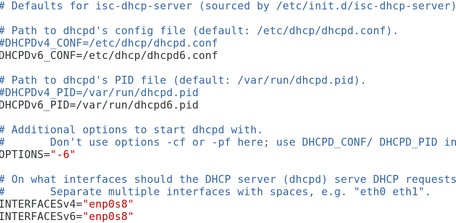
5) Plik konfiguracyjny
   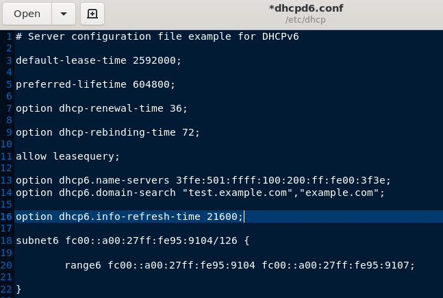
6) Ustawienie karty:
   
7) Uruchomienie
   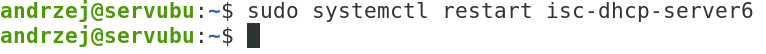
8) Sprawdzenie procesów:
   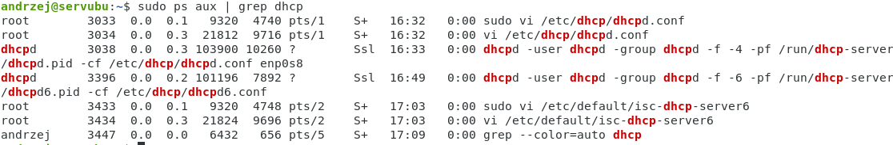
9) Log:
   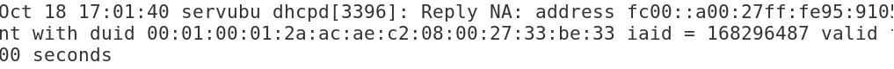
10) Ustawienia pobrane na stacji windows:
   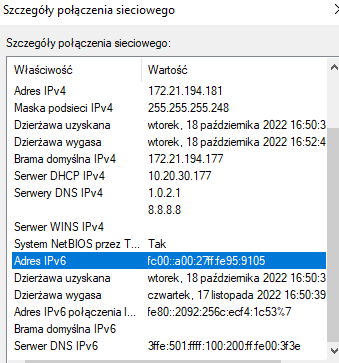
11) Ustawienia pobrane na stacji ubuntu:
   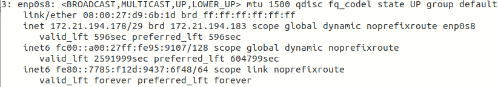
12) Graficznie:
   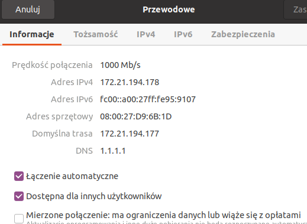
13) Log dla stacji ubuntu z serwera:
   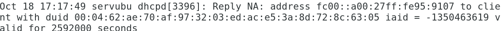
14) Sprawdzenie dzierżaw:
   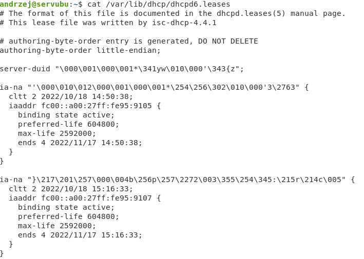
15) Dzierżawy dla wersji 4:
   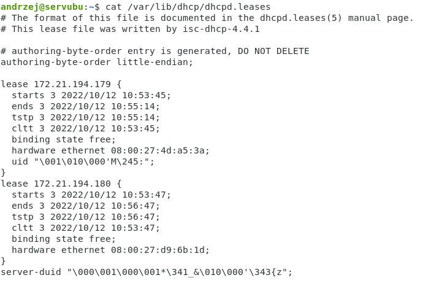
16) Koniec🔚
