Ćwiczenia 19 -- CUPS
1.  Zaloguj się na swoje konto.
2.  Na pierwszym terminalu:
> 
3.  Zainstaluj usługę cups: sudo apt install cups -y
4.  Sprawdzić stan usługi: sudo systemctl status cups
5.  W virtualbox dodaj kartę mostkową:
> 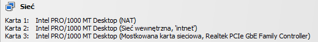
6.  Na 5 terminalu : man cupsd.conf
7.  Połącz się ze stacji windows do usługi cups.
8.  Serwer wpięty do sieci, natomiast stacja tylko do serwera.
> 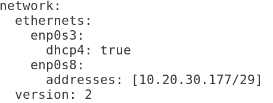
9.  Ustaw na serwerze dostęp zdalny:
> 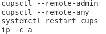
10. 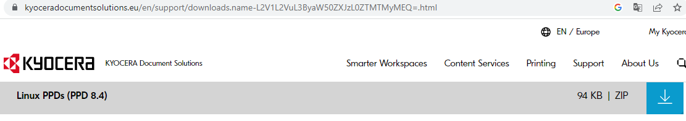
    Dodaj drukarkę kyocerę FS-1320D na
    serwerze, znajdź sterownik PPD tak jak na wykładzie
11. 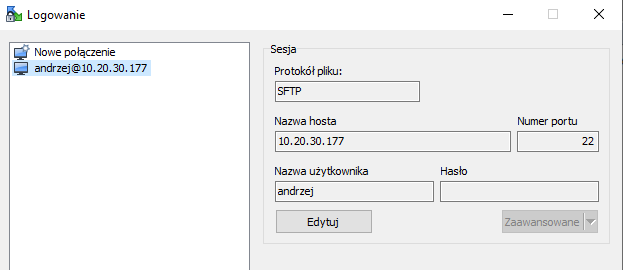
    Skopiuj sterownik ze stacji na serwer
    z użyciem winscp:
> 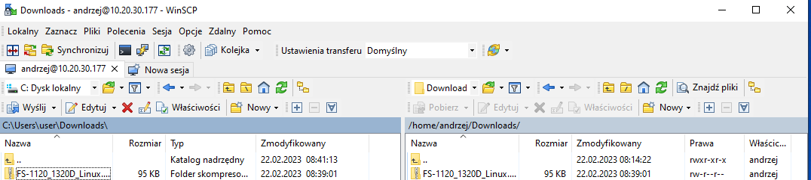
12. Wypakuj sterownik
> 
13. Zainstaluj drukarkę
14. 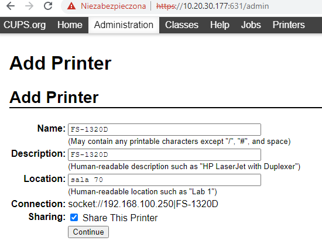
    Krok1 W lokalizacji podaj swoje imię
15. Krok 2
> 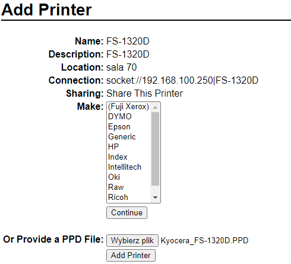
16. 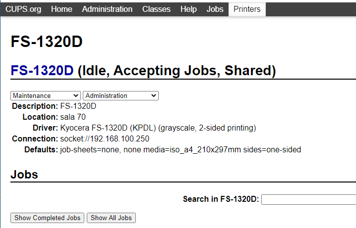
    Krok 3
17. 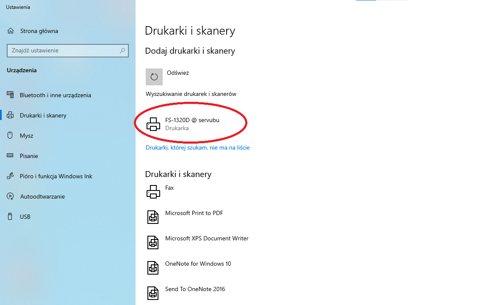
    Zainstaluj na stacji windows z udostępnienia
    drukarki.
18. Zainstaluj na stacji ubuntu z udostępnienia drukarki.
19. Ze stacji wydrukuj stronę testową podając nazwę komputera stacjaX,
    za X podaj numer stanowiska.
20. Sprawdź na swoim serwerze stan drukarek
> 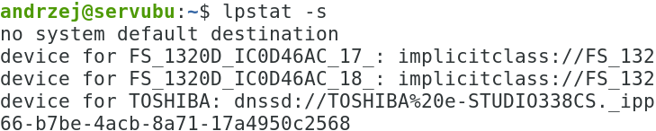
21. KONIEC.
