# Ćwiczenia 19 -- CUPS

💡Sprawdź najpierw, która drukarka jest do zainstalowania!!!

1. Zaloguj się na swoje konto.
1. Na pierwszym terminalu:

   

1. Zainstaluj usługę cups:

   ```bash
   sudo apt install cups -y
   ```

1. Sprawdzić stan usługi:

   ```bash
   sudo systemctl status cups
   ```

   ```text
   ● cups.service - CUPS Scheduler
     Loaded: loaded (/lib/systemd/system/cups.service; enabled; vendor preset: enabled)
     Active: active (running) since Wed 2026-03-18 14:47:33 CET; 12min ago
     TriggeredBy: ● cups.socket
             ● cups.path
       Docs: man:cupsd(8)
   Main PID: 813 (cupsd)
     Status: "Scheduler is running..."
      Tasks: 3 (limit: 9228)
     Memory: 11.4M
        CPU: 47ms
     CGroup: /system.slice/cups.service
             ├─ 813 /usr/sbin/cupsd -l
             ├─ 934 /usr/lib/cups/notifier/dbus dbus:// ""
             └─1132 /usr/lib/cups/notifier/dbus dbus:// ""

   Mar 18 14:47:32 servubu systemd[1]: Starting CUPS Scheduler...
   Mar 18 14:47:33 servubu systemd[1]: Started CUPS Scheduler.
   ```

1. W virtualbox dodaj kartę mostkową:

   

1. Na 5 terminalu :

   ```bash
   man cupsd.conf
   ```

   ```text
   cupsd.conf(5)                                   OpenPrinting                                   cupsd.conf(5)

   NAME
       cupsd.conf - server configuration file for cups

   DESCRIPTION
       The cupsd.conf file configures the CUPS scheduler, cupsd(8).  It is normally located in the /etc/cups
       directory.  Each line in the file can be a configuration directive, a blank line, or a comment.  Con‐
       figuration  directives  typically  consist of a name and zero or more values separated by whitespace.
       The configuration directive name and values are case-insensitive.  Comment lines  start  with  the  #
       character.

   ```

1. Połącz się ze stacji windows do usługi cups.
1. Serwer wpięty do sieci, posiada DHCP, natomiast stacja tylko do serwera.

   ```conf
   ddns-update-style none;
   authoritative;
   log-facility local7;

    subnet 198.51.100.224 netmask 255.255.255.248 {
      range 198.51.100.226 198.51.100.228;
      range 198.51.100.230 198.51.100.230;
      option domain-name-servers 1.1.1.1, 1.0.0.1;
      option domain-name "2k.example.org";
      option routers 198.51.100.225;
      default-lease-time 60;
      max-lease-time 120;

    host fantasia {
      hardware ethernet 08:00:27:45:b7:83;
      fixed-address 198.51.100.229;
    }

    }

   ```

1. Ustaw na serwerze dostęp zdalny:

   ```bash
   sudo cupsctl --remote-admin
   sudo cupsctl --remote-any
   ```

   

1. Dodaj drukarkę: Kyocera Ecosys PA4000x na serwerze.

1. Skopiuj sterownik ze stacji na serwer
    z użyciem winscp, uwzględnij adres ip serwera `198.51.100.225``:

   

   oraz plik KyoceraLinuxPackages-20240521.tar.gz

   

1. Wypakuj sterownik

   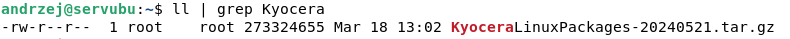

   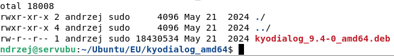

1. Zainstaluj drukarkę:

   ```bash
   sudo dpkg -i kyodialog_9.4-0_amd64.deb

   ```

1. Po instalacji na serwerze otwórz na stacji stronę cupsa:

   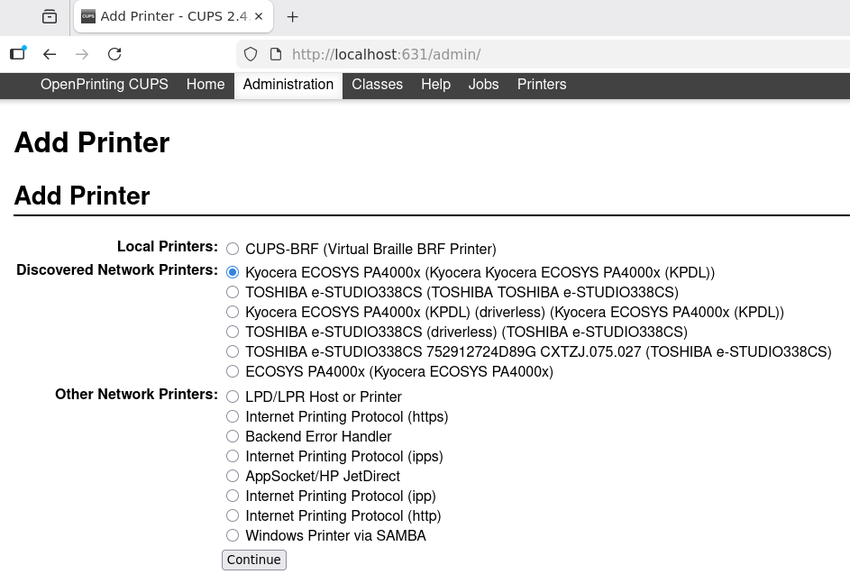

   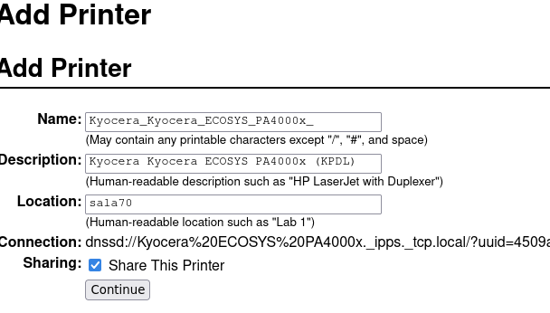

1. Krok 2

   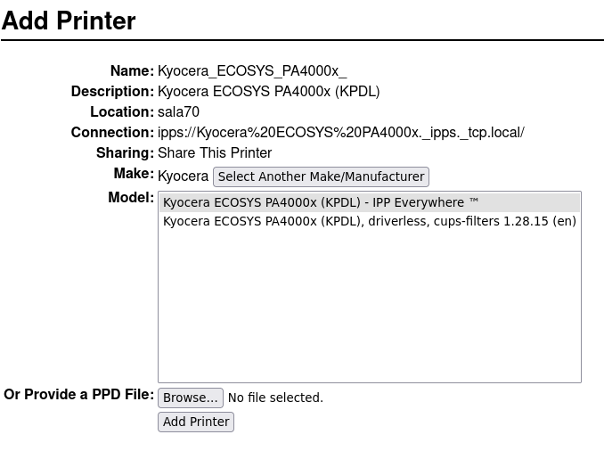

1. Widok drukarek zainstalowanych:

   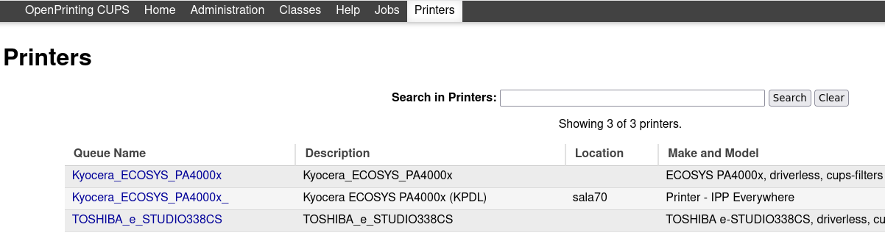

1. Krok 3

   

1. Zainstaluj na stacji windows z udostępnienia
    drukarki.

   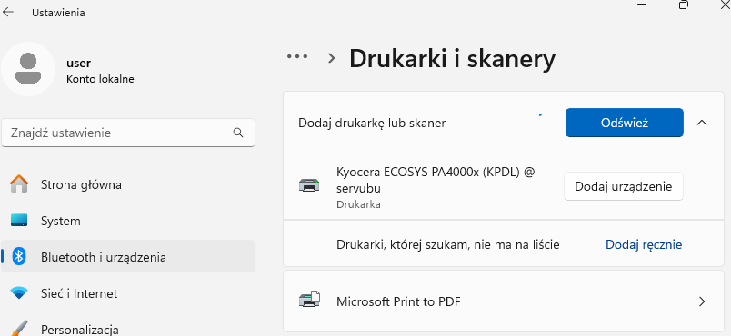

1. Wydrukuj stronę testową:

   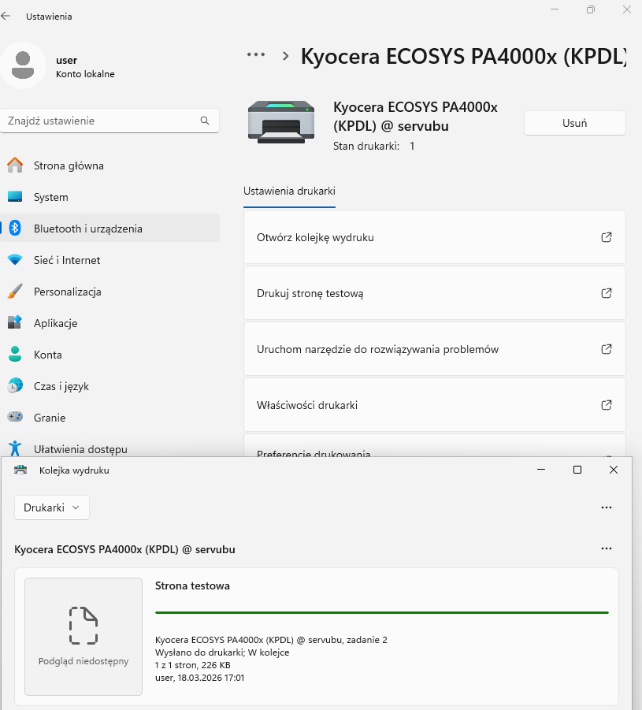

1. Lista zadań na serwerze:

   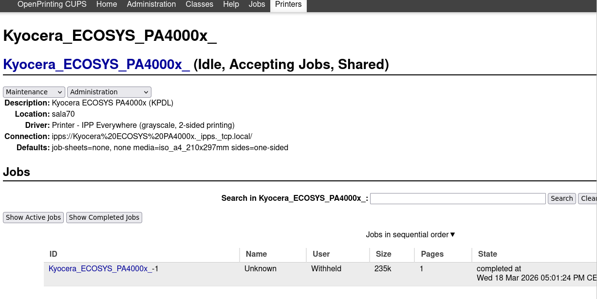

1. Zainstaluj na stacji ubuntu z udostępnienia drukarki.

   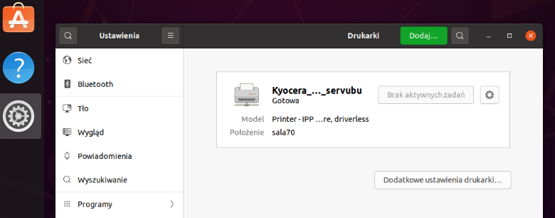

1. Ze stacji wydrukuj stronę testową:

   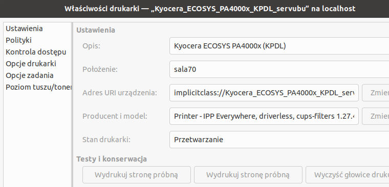

1. Sprawdź na swoim serwerze stan drukarek

   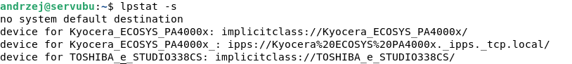

1. Ustaw na serwerze drukarkę domyślną, a następnie wydrukuj plik z pomocą polecenia:

   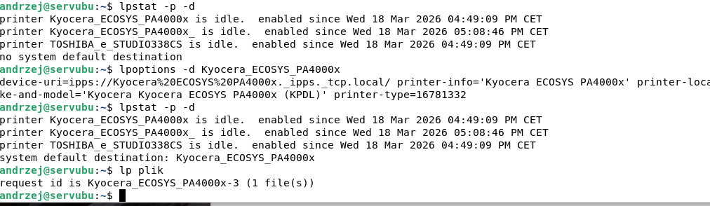

   lub

   ```bash
   echo "Test drukowania z serwera, stacji" | lp
   ```

1. Sprawdź zakończone zadania:

   

1. Sprawdzenie listy zadań z pomocą lpq:

   ```bash
   sudo apt install lpr
   ```

1. KONIEC.😀
