# Ćwiczenia 19 -- CUPS

1. Zaloguj się na swoje konto.
1. Na pierwszym terminalu:

   

1. Zainstaluj usługę cups:

   ```bash
   sudo apt install cups -y
   ```

1. Sprawdzić stan usługi: sudo systemctl status cups
1. W virtualbox dodaj kartę mostkową:

   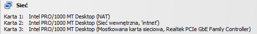

1. Na 5 terminalu : man cupsd.conf
1. Połącz się ze stacji windows do usługi cups.
1. Serwer wpięty do sieci, natomiast stacja tylko do serwera.

   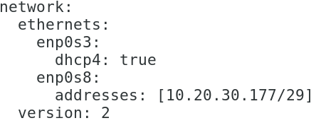

1. Ustaw na serwerze dostęp zdalny:

   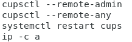

1. Dodaj drukarkę kyocerę FS-1320D na
    serwerze, znajdź sterownik PPD tak jak na wykładzie
   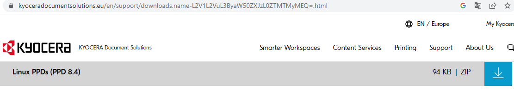
1. Skopiuj sterownik ze stacji na serwer
    z użyciem winscp:

   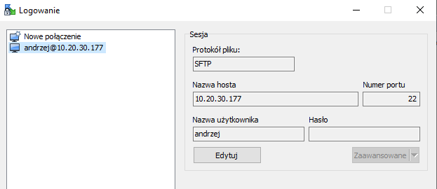

   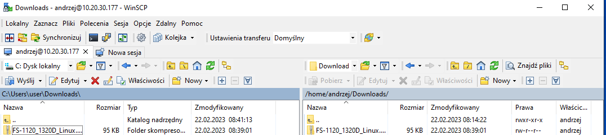

1. Wypakuj sterownik

   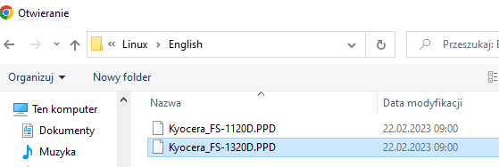

1. Zainstaluj drukarkę
1. Krok 1: W lokalizacji podaj swoje imię

   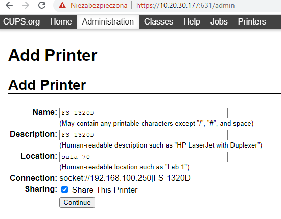
   
1. Krok 2

   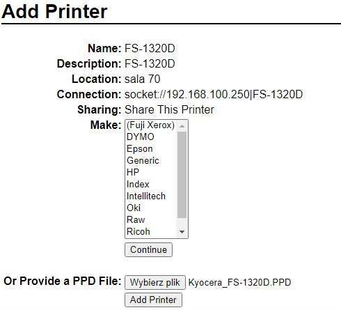

1. Krok 3

   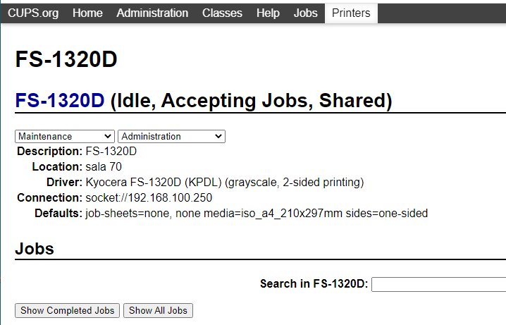

1. Zainstaluj na stacji windows z udostępnienia
    drukarki.

   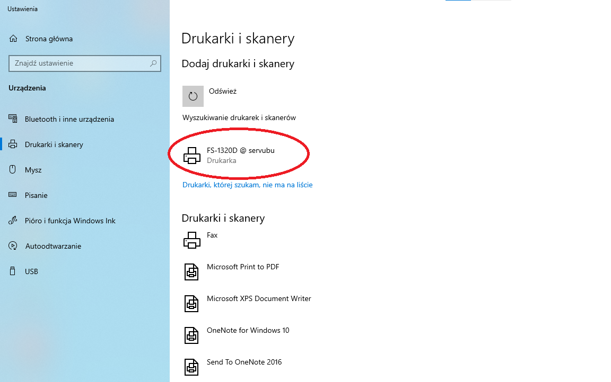

1. Zainstaluj na stacji ubuntu z udostępnienia drukarki.
1. Ze stacji wydrukuj stronę testową podając nazwę komputera stacjaX,
    za X podaj numer stanowiska.
1. Sprawdź na swoim serwerze stan drukarek

   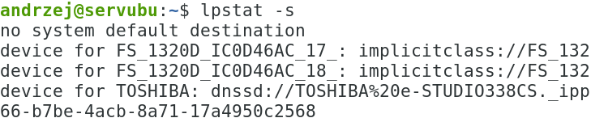

1. KONIEC.
