Ćwiczenia 20 -- instalacja i konfiguracja serwera DNS (BIND)
Uruchomić: ubuntu server → ubuntu desktop
1)  Zaloguj się na konto administrator i dodaj swoje konto do grupy
    sudo:
> *sudo usermod nazwa_konta -G sudo*
2)  Odłącz stacje od internetu.
3)  Zaloguj się na swoje konto na minimum pięciu terminalach. (Alt+F2,
    Alt+F3, ...
na logi, na edycję pliku ,na komendy, , na restart usługi, na
dokumentację )
4)  Przed przystąpieniem do pracy trzeba odinstalować serwer dns i
    usunąć pliki:
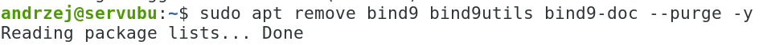
5)  
    Zainstaluj serwer DNS:
6)  Sprawdź czy jest zainstalowana paczka w systemie: *sudo apt list
    \--installed \| grep bind*
> 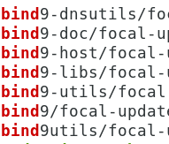
7)  Ustaw kartę dolną **enp3s0** na adres 10.20.30.177 z pomocą netplanu
> 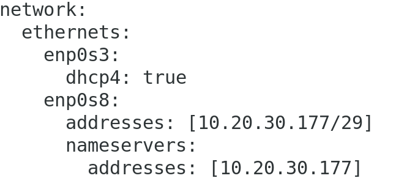
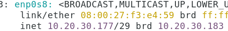
8)  Sprawdź poleceniem ping ze stacji komunikację z serwerem.
9)  Ustaw pracę usługi named na ipv4
> 
10) W katalogu /etc/bind/ w pliku named.conf.local dodaj strefy
> 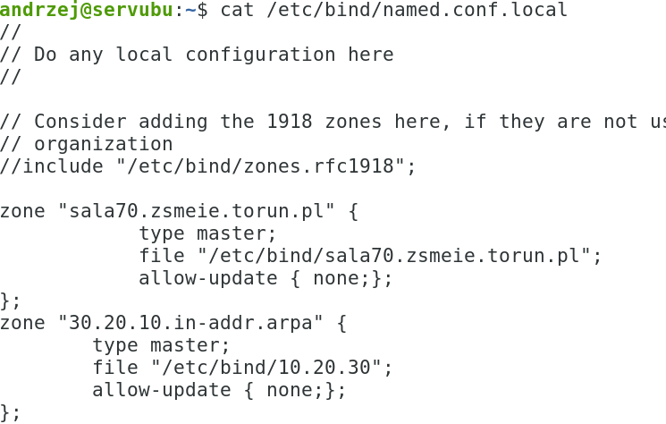
11) Dopisz do pliku konfiguracyjnego:
> 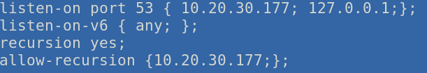
12) Utwórz plik strefy do przodu kopiując plik /etc/bind/db.empty lub
    db.local:
> 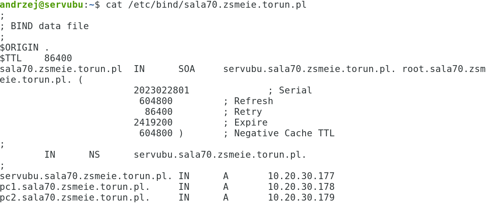
13) Utwórz plik strefy odwrotnej kopiując plik /etc/bind/db.127:
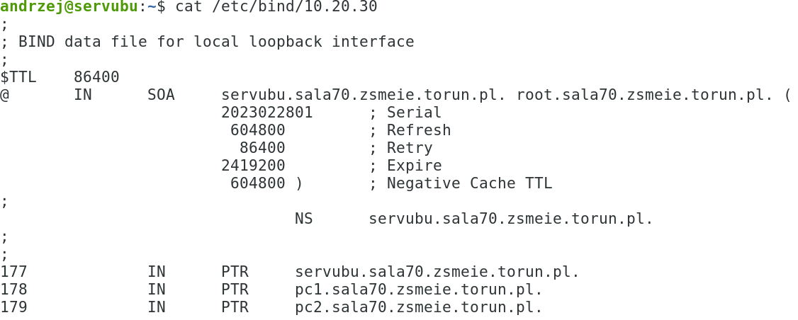
14) Zrestartuj usługę i sprawdź logi:
> 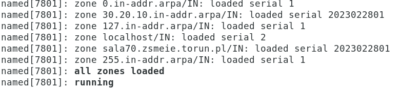
15) Sprawdź poprawność konfiguracji
> 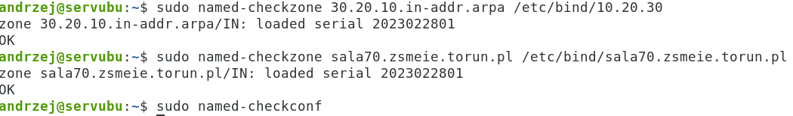
16) Sprawdź status
> 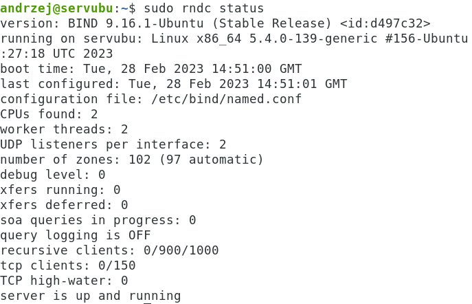
17) Dodaj wpisy do /etc/hosts
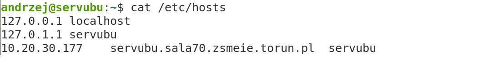
18) Dodaj do /etc/systemd/resolved.conf,
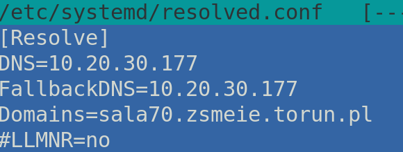
19) 
    a następnie zrestartuj usługę
20) Sprawdzenie ustawień:
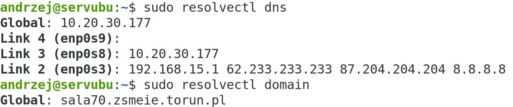
21) Sprawdź działanie serwera narzędziem dig sala70.zsmeie.torun.pl
22) Sprawdź działanie serwera narzędziem host ze stacji ubuntu
> 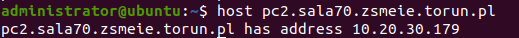
23) Sprawdź działanie serwera narzędziem dig ze stacji ubuntu (np.:
    **dig -t txt nazwa_rekordu** )
> 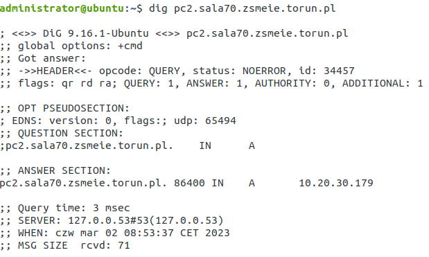
24) Sprawdź działanie serwera narzędziem nslookup ze stacji windows
    (np.: **nslookup -type=txt nazwa_reko.**)
> 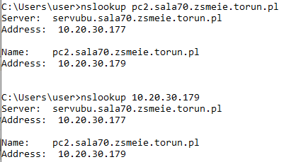
25) Dodaj alias na adres serwera o nazwie www lub ftp
> 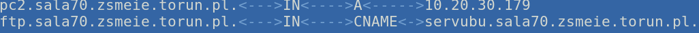
26) Sprawdzenie na stacji windows
> 
27) Sprawdzenie na stacji ubuntu ( np.: **dig -t txt nazwa_rekordu**)
> 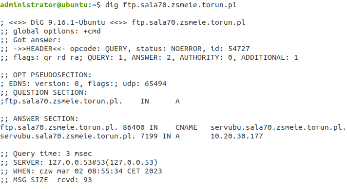
28) Dodaj 2 rekord poczty z priorytetami 5 i 10 o nazwach poczta i mail
> 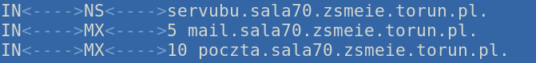
29) 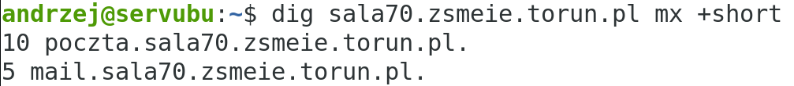
    Sprawdzenie:
> 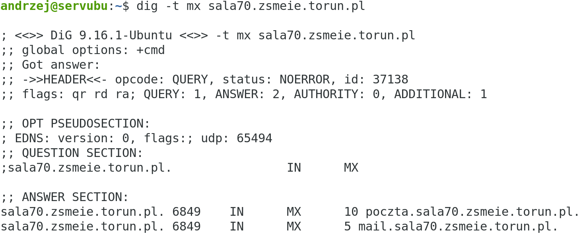
30) Wykonaj zapytania do strefy wstecznej:
> 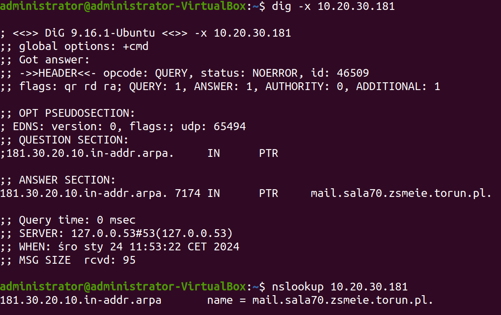
31) Dodaj rekord TXT i przetestuj na stacji jego działanie.
32) 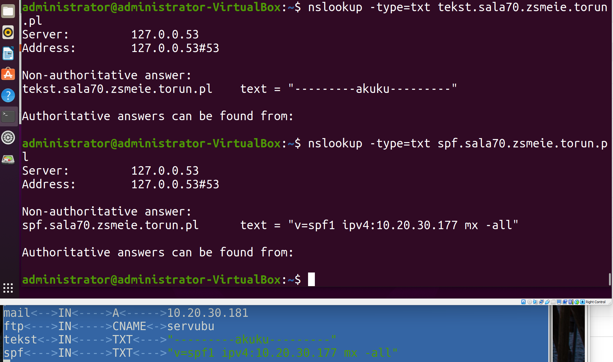
    Dodaj rekord AAAA i przetestuj na
    stacji jego działanie.
33) Dodaj rekord SPF i przetestuj na stacji jego działanie.
34) Stwórz środowisko chroot dla serwera DNS.
35) Przenieś pliki stref do środowiska chroot.
36) Uruchom serwer z opcją dla chroot.
37) Sprawdź logi i działanie serwera narzędziami: host, dig i nslookup.
38) 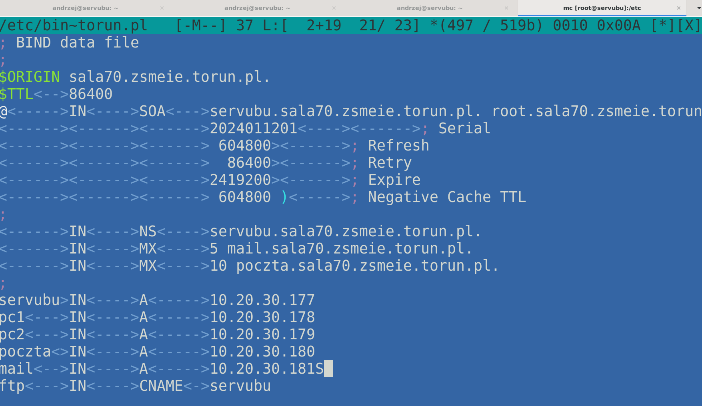
    Podsumowanie, strefa do przodu:
39) 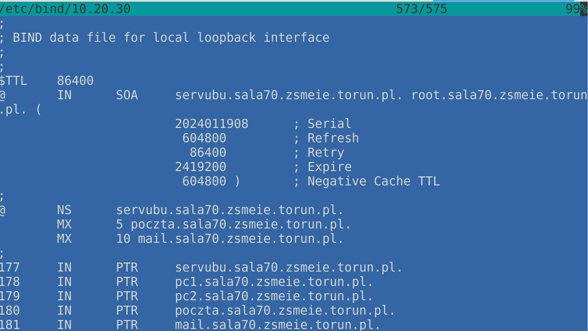
    Podsumowanie strefa do tyłu:
40) Odinstalować serwer:

41) Usunąć pliki stref.
42) Na stacji windows i ubuntu przywrócić ustawienie kart na dhcp.
43) Zainstalować serwer:

44) KONIEC 😊
