# Ćwiczenia 21 -- instalacja i konfiguracja serwera FTP - vsFTPd

1.  Zaloguj się na swoje konto.
2.  Wyłącz zaporę: sudo ufw reset
3.  Odinstaluj vsftpd: 
```bash
sudo apt remove vsftpd \--purge -y
```
4.  Usunąć katalog /ftp jeśli istnieje
5.  Zainstaluj serwer vsftpd: sudo apt install vsftpd -y
6.  Ustaw kartę podłączoną do switcha z pomocą netplanu na adres
    172.17.20.x/28, gdzie x oznacza numer stanowiska (1-16).
```yaml
addresses: [172.17.20.101/28]
```
7.  Edytuj plik konfiguracyjny np.: sudo mcedit /etc/vsftpd.conf
8.  Ustaw w pliku konfiguracyjnym opcję 
```text
listen=NO 
listen_ipv6=YES
```
9.  Ustaw baner powitalny jako string.
10. Włącz zaporę na serwerze:

 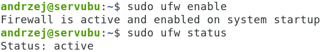

11. Otworzyć porty 20,21:

 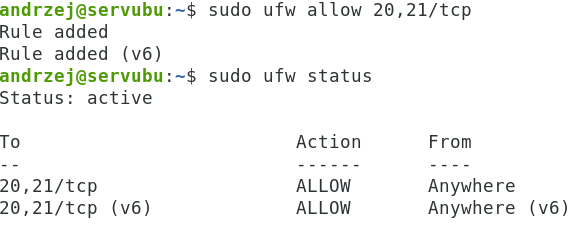

12. Uruchom serwer komendą: sudo systemctl restart vsftpd
13. Sprawdź czy istnieje proces dla serwera komendą:
```bash 
ps aux | grep vsftpd
```
14. Uruchom terminal z podglądem logów: 
 ```bash
  sudo journalctl -f
  ```
15. Utwórz plik tekstowy o nazwie twoje_imie.txt w katalogu **/srv/ftp**
16. Przetestuj działanie serwera logując
    się do niego anonimowo: [ftp 127.0.0.1]

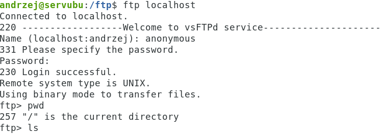

17. Przetestuj działanie serwera logując się do niego anonimowo ze
    stacji Windows: ftp ip_servera.

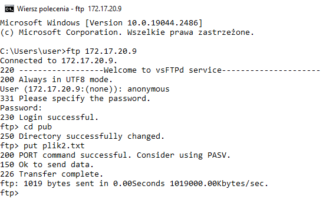

18. Aby listować zawartość katalogu ftp ustaw:

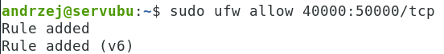
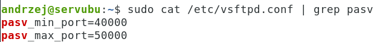


19. Przetestuj działanie serwera logując się do niego anonimowo ze
    stacji Windows w eksploratorze
[ftp://ipserwera](ftp://ipserwera/)
 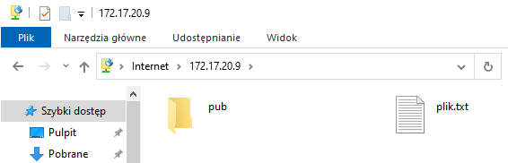

20. Ściągnij plik z katalogu pub komendą: get nazwa_pliku najpierw na
    serwerze potem na stacji.

 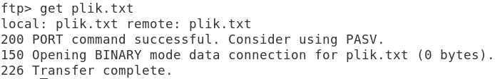

21. Sprawdź xferlog:

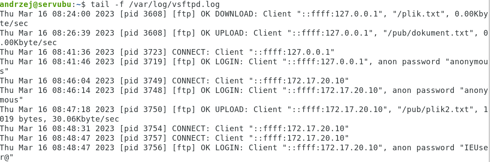
    
22. Upewnij się,że są odkomentowane pozycje:
 
 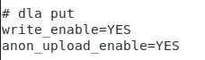

23. Skopiuj plik testowy na serwer ftp anonimowo komendą put z serwera i
    stacji.

 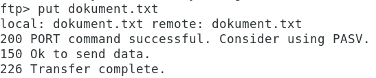

24. Ustaw baner z pliku. ( zadanie domowe )
25. Utwórz katalog /ftp a w nim katalog pub, następnie zmień domyślną
    lokalizację z /srv/ftp na katalog /ftp komendą:

 

26. Ustaw prawa i utwórz pliki jak poniżej:

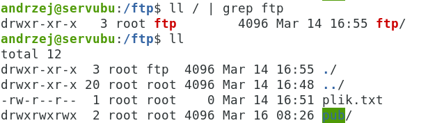

27. Analogicznie przetestuj komendy put i get oraz mput, mget dla nowej
    lokalizacji /ftp oraz /ftp/pub.
28. Sprawdź połączenie z pomocą wireshark.
    Sprawdź czy możesz utworzyć katalog jako anonymous.

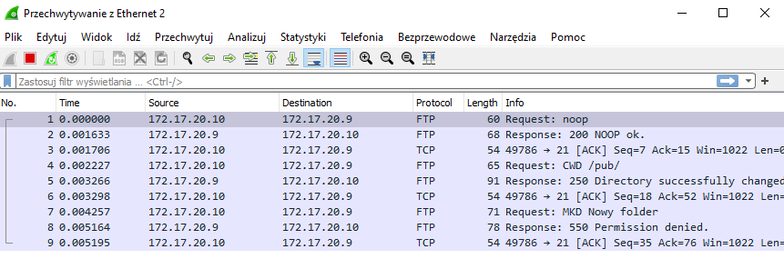

29. Zezwól na logowanie się tylko wybranym użytkownikom systemowym,
    pozwól im wyjść poza swój katalog domowy.

 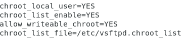

30. Przetestuj działanie serwera logując się na konto z listy oraz swoje
    konto systemowe: [ftp 172.17.20.x]

 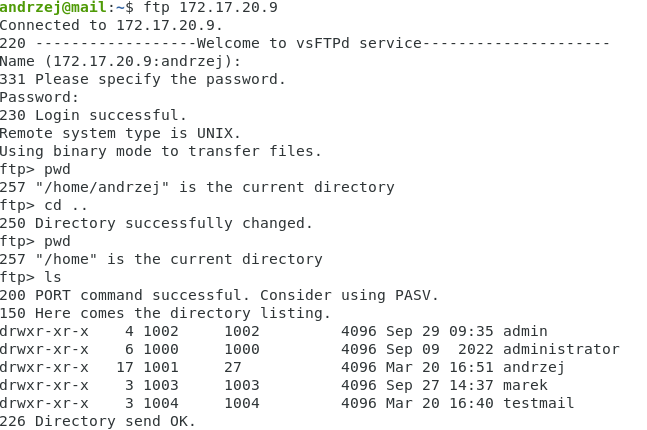

31. Zezwól na logowanie się tylko wybranym użytkownikom systemowym,
    **nie pozwól** im wyjść poza swój katalog domowy.

 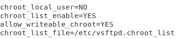

32. Przetestuj działanie serwera logując się na konto z listy oraz swoje
    konto systemowe: [ftp 172.17.20.x]

 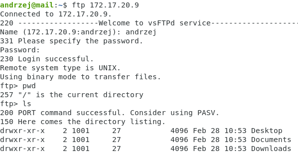

33. Zabroń dostępu do ftp dla konta z listy /etc/ftpusers
34. Przetestuj działanie serwera logując się na swoje konto systemowe:
    ftp 172.17.20.x
35. Sprawdź zawartość logów.
36. Zabroń dostępu do ftp dla użytkowników z pomocą:
```text
    userlist_file=/home/twoje_konto/...
    userlist_enable
    userlist_deny=YES | NO
```
37. Przetestuj działanie serwera logując się na konto z listy oraz swoje
    konto systemowe: [ftp 172.17.20.x]
38. Przetestuj działanie serwera w filezilli logując się na konto
    anonimowe i swoje:

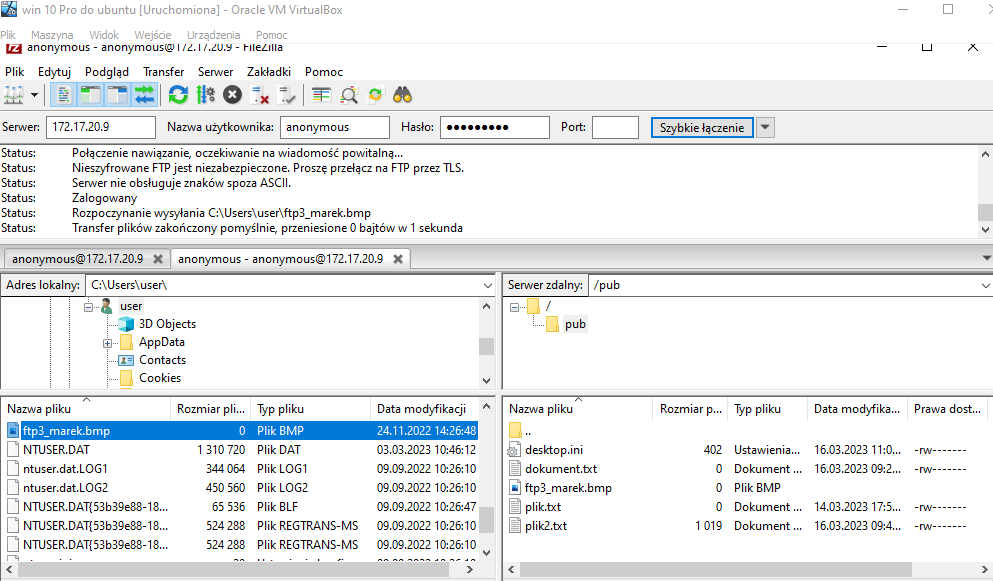

39. Sprawdź zawartość logów.
40. Logowanie po sftp: ( otwórz port 22)

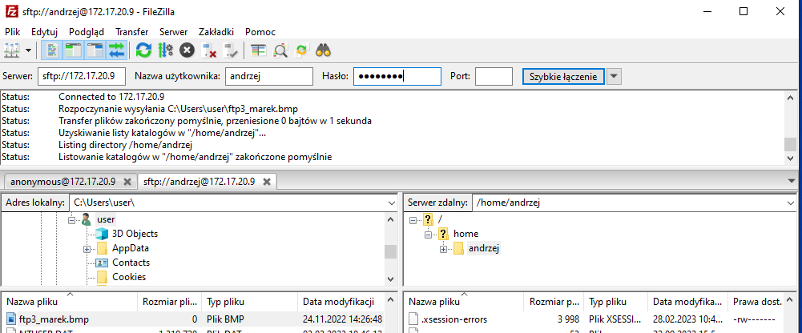

41. Skonfigurować serwer dla połączeń szyfrowanych, spróbuj najpierw
    ustawień domyślnych dla certyfikatów:

 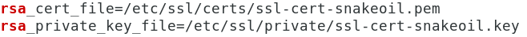

42. II sposób, samodzielna generacja certyfikatu, poniżej 1 polecenie:

```bash
sudo openssl req -x509 -nodes -days 365 -newkey rsa:2048 -keyout /etc/ssl/private/cert.pem -out /etc/ssl/private/cert.pem
 ```
43. W pliku vsftpd.conf

 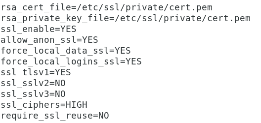

44. Otwórz port 990 na zaporze dla połączeń po TLS.
45. Z pomocą klienta ftp np. filezilli
    utwórz połączenie, skopiuj plik, ściągnij plik.

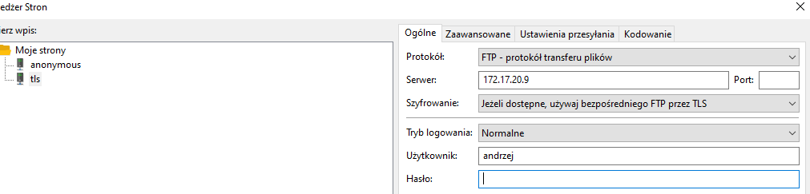

46. Wyświetli się certyfikat


47. Sprawdź połączenie z pomocą wireshark.

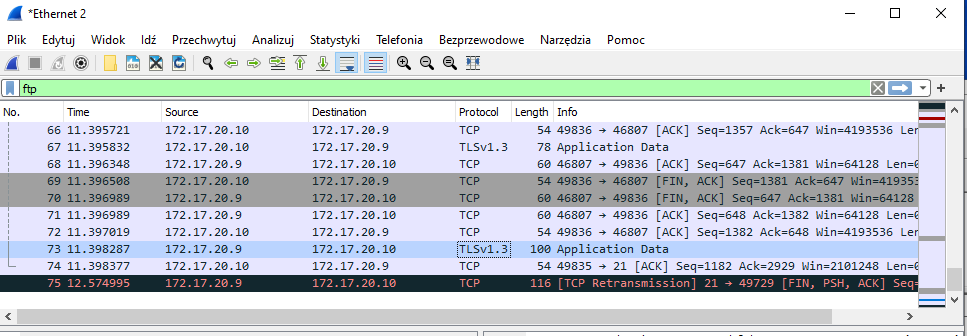

48. Sprawdź łączenie się klientem lftp po TLS

 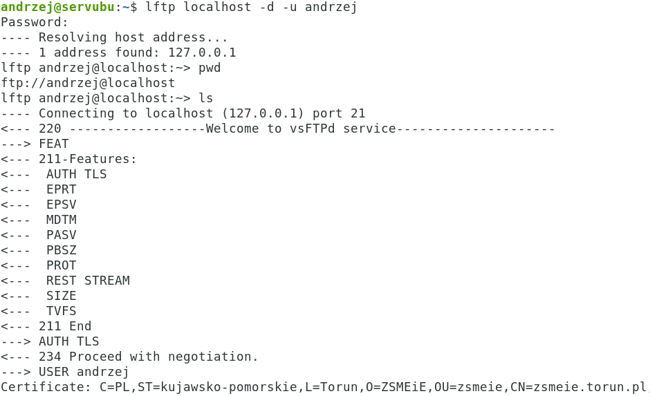

49. Wyłącz zaporę: 
```bash
  sudo ufw reset
```
50. Odinstaluj vsftpd: 
```bash
sudo apt remove vsftpd \--purge -y
```
51. Usunąć katalog /ftp jeśli istnieje
52. KONIEC.( lekcje 1-3).😀

---

53. Powtórzenie ( lekcje 4-6 ):
54. Przećwicz zachowanie serwera logując się na konta dla ustawienia
    userlist_deny=YES\|NO.
55. Zmień porty ftp serwera na 24. Sprawdź logowanie się do serwera ze
    stacji.
56. Zmień port ftp-data na 23. Sprawdź logowanie się do serwera ze
    stacji.
57. Ustaw maskę nowo tworzonych plików na 011 zarówno przez użytkowników
    systemowych jak i anonimowych.
58. Zabroń dostępu do plików z rozszerzeniem: png, jpg i bmp. Przetestuj
    ze stacji nowe ustawienia.
59. Ukryj pliki z rozszerzeniem: pdf, docx, xlsx. Przetestuj ze stacji
    nowe ustawienia.
60. Przetestuj ustawienia chown_username i chown_uploads.
61. Ustaw maksymalnie dwa połączenia z danego ip.
62. Ustaw maksymalnie trzech klientów, którzy mogą się połączyć z
    serwerem.
63. Ustaw prędkość przesyłania danych na 50KB.
64. Ustaw baner z pliku.
65. Przetestuj ustawienia anon_root oraz local_root.
66. Zabroń na stałe dostępu do serwera dla użytkownika Wojtek.
67. Zabroń wychodzenia poza katalog domowy wszystkim użytkownikom z
    wyjątkiem Moniki i Marka, plik listy utwórz w katalogu domowym.
68. Zabroń dostępu do ftp wszystkim użytkownikom z w wyjątkiem Beaty i
    Tomka, plik listy utwórz w katalogu domowym.
69. Zezwól na wychodzenie poza katalog domowy wszystkim użytkownikom z
    wyjątkiem Moniki i Marka, plik listy utwórz w katalogu domowym.
70. Zezwól na dostępu do ftp wszystkim użytkownikom z w wyjątkiem Beaty
    i Tomka, plik listy utwórz w katalogu domowym.
71. Włącz tryb tekstowy przesyłania danych na kliencie ftp.
72. Włącz tryb binarny przesyłania danych na kliencie ftp.
73. Ustaw timeout serwera na 5 minut.
74. Koniec.🔚
