Ćwiczenia 22 -- instalacja i konfiguracja serwera Apache
1.  Zaloguj się na swoje konto.
2.  Sprawdź czy zainstalowany jest pakiet openssl
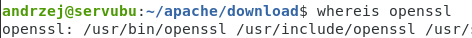
3.  Utwórz katalog /home/twoje_konto**/apache/**, a w nim podkatalog
    **download**
4.  Źródła można pobrać ze strony
    <https://dlcdn.apache.org/httpd/httpd-2.4.63.tar.bz2> narzędziem
    wget.
5.  Sumę kontrolną gpg pobieramy ze strony
    [https://downloads.apache.org/httpd/httpd-2.4.63.tar.bz2.asc](https://downloads.apache.org/httpd/httpd-2.4.54.tar.bz2.asc)
narzędziem wget.
6.  Sumę kontrolną pobieramy:
    [https://downloads.apache.org/httpd/httpd-2.4.63.tar.bz2.sha256](https://downloads.apache.org/httpd/httpd-2.4.54.tar.bz2.sha256)
    narzędziem curl.
> 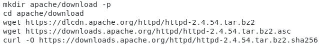
7.  Sprawdzić sumę kontrolną narzędziem sha256sum httpd-2.4.63.tar.bz2 i
    cat httpd-2.4.63.tar.bz2.sha256
lub shasum -a 256 -c httpd-2.4.63.tar.bz2.sha256
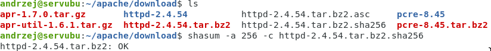
8.  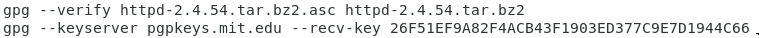
    Sprawdzić numer klucza (pierwsza
    poniższa komenda go wyświetli ) i go ściągnąć:
9.  gpg \--verify httpd-2.4.63.tar.bz2.asc httpd-2.4.63.tar.bz2
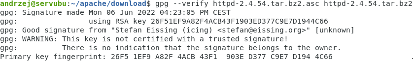
10. Sprawdzamy na stronie <https://people.apache.org/keys/committer/>
    odcisk palca.
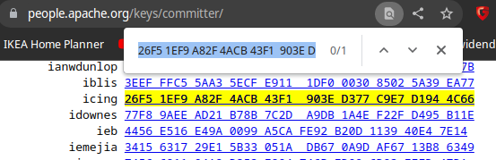
11. Rozpakować plik **httpd-2.4.63.tar.bz2** komendą tar.
12. następnie przejść do katalogu httpd-2.4.63
13. Wydać komendę:
**./configure \--prefix=/home/twoje_konto/apache
\--with-ssl=/usr/bin/openssl \--enable-ssl \--enable-so**
14. W przypadku braku APR zainstaluj potrzebne pakiety komendą:
sudo apt-get install libapr1-dev libaprutil1-dev -y
15. W przypadku braku kompilatora c: build-essential lub gcc i g++
16. W przypadku braku pcre3: zainstaluj pakiet pcre: **sudo apt install
    libpcre3-dev libpcre3 -y**
17. libssl-dev - \> openssl is too old
18. Wydać komendę: **make -j\$(nproc)**
19. Wydać komendę: **make install**
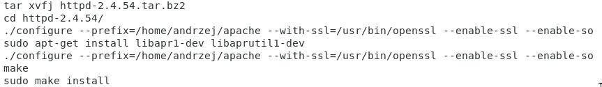
20. Sprawdź czy jest APR: apache/bin/**httpd -V**
21. Przejdź do katalogu /home/twoje_konto/apache i sprawdź czy powstały
    katalogi
22. 
    Uruchomić serwer komendą: sudo
    **bin/apachectl restart**
23. 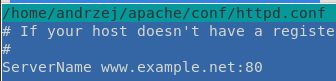
    Jeśli wystąpią błędy odkomentuj i zmień wpis
24. Sprawdź czy istnieje proces dla serwera komendą: ps aux \| grep
    apache
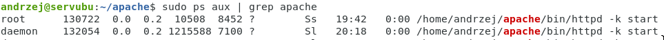
25. Uruchomić przeglądarkę i sprawdzić działanie wpisując: **localhost
    lub ip serwera**
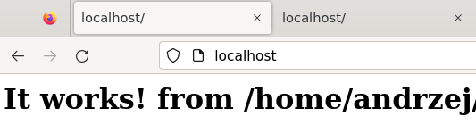
26. Sprawdź konfigurację poleceniem: apachectl configtest.
27. W chrome w górnym pasku DevTools kliknij i wybierz **Lighthouse**
28. Sprawdź działanie strony narzędziem curl:
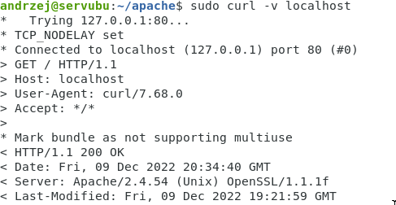
29. Sprawdź logi: cat \~/apache/logs/error_log i cat
    \~/apache/logs/access_log
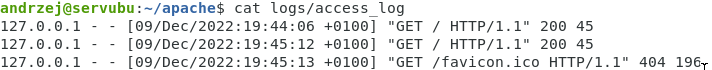
30. Jeśli nie działa serwer to sprawdź uprawnienia na katalogu
    /home/twoje_konto powinno być 751
31. Analogicznie przetestuj serwer linksowy sąsiada.(wpisz ip sąsiada w
    przeglądarce lub narzędziem curl -v ip)
32. Jeśli nie możesz skorzystać z serwera sąsiada to należy otworzyć
    porty **80 i 443**.
33. Sprawdź połączenie z pomocą wireshark.
34. Sprawdź zawartość logów.
35. Popraw wygląd swojej strony. ( plik: \~/apache/htdocs/index.html )
36. Wygeneruj certyfikat dla servera z pomocą openssl ( patrz wykład).
37. Klucz prywatny serwera:
38. 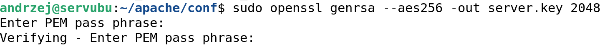
    Certyfikat:
39. Zdjęcie hasła:
> 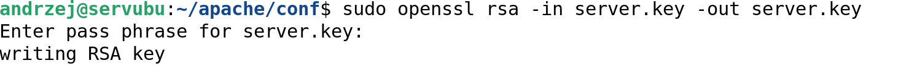
40. Odkomentuj linię: *Include conf/extra/httpd-ssl.conf* w pliku
    \~/apache/conf/httpd.conf
41. Zrestartuj serwer : sudo bin/apachectl restart
42. Uruchomić przeglądarkę i sprawdzić działanie wpisując:
    [https://localhost](https://localhost/)
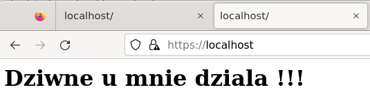
43. Sprawdź działanie strony narzędziem curl:
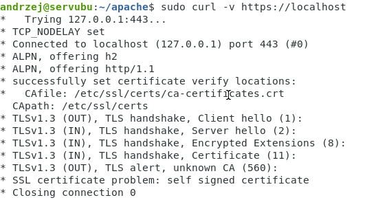
44. Powinien powstać plik \~/apache/logs/ssl_request_log
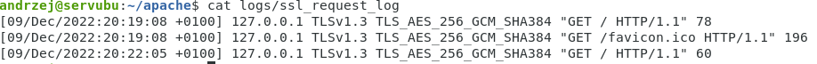
45. Sprawdź aktywne połączenia ze swoim serwerem komendą: netstat lub ss
    -anp \| grep 443
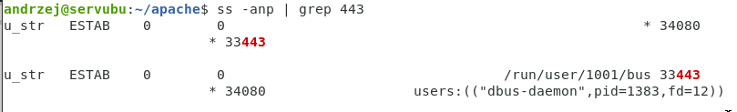
46. Sprawdź aktywne połączenia ze swoim serwerem

47. Dodać możliwość tworzenia stron www przez użytkowników systemowych:
    np. <https://localhost/~twoje_konto> ( wskazówka: public_html )
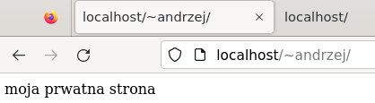
wskazówka 2:

wskazówka 3:
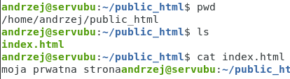
48. Dodatkowe:
<!-- -->
a)  Utwórz własne usługi dla apache: apache-twoje-imię
> \- Utwórz nowy plik serwisowy: sudo nano
> /etc/systemd/system/apache_imie.service
>
> \- Zawartość pliku apache_imie.service:
>
> 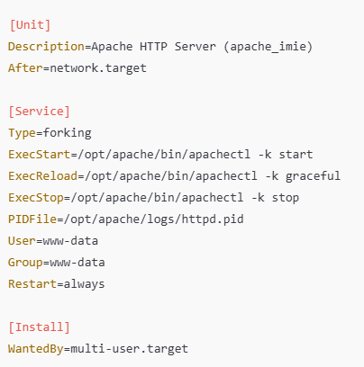
>
> \- nadaj uprawnienia i odświeź systemd:
>
> 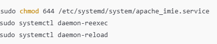
>
> \- Uruchom nową usługę: sudo systemctl start apache_imie
b)  dsd
<!-- -->
49. KONIEC
