Ćwiczenia 23 -- instalacja i konfiguracja usługi AD (Active Directory)
1.  Odłącz skrętki z gniazda naściennego.
2.  Z pomocą dwóch dodatkowych kabli podłącz **dolne karty** sieciowe na
    obu komputerach do switcha. ( w virtualbox dodaj drugą kartę)
    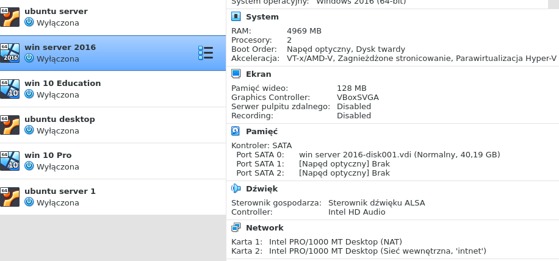
3.  Zaloguj się na konto administrator w systemie Windows Server.
4.  Ustaw nazwę komputera na serverxy, gdzie x oznacza nazwę klasy, a y
    numer grupy.
5.  Zrestartuj serwer.
6.  Zdeinstaluj tylko usługę AD, jeżeli jest zainstalowana, **nie usuwaj
    narzędzi.**
7.  Przywróć ustawienia na kartach sieciowych serwera na uzyskiwane w
    sposób automatyczny.
8.  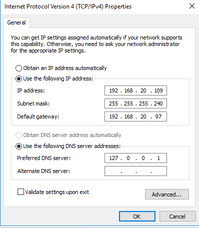
    Ustaw karty sieciowe następująco:
    a)  1 kartę, górną:
        nazwa: WAN
        ip: 192.168.20.1xx/28, gdzie xx oznacza numer stanowiska, np. 03
> bramka: 192.168.20.97
>
> 1 DNS: 8.8.8.8
>
> 2 DNS: 8.8.4.4
b)  2 kartę, dolną:
    nazwa: LAN
    ippodaj dla sieci:
    10.14.18.128/2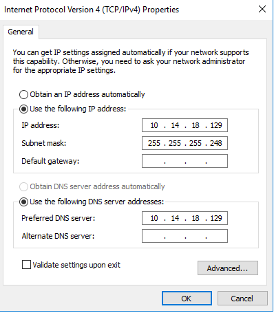
    9
brak bramki,
1 DNS 10.40.80.?
9.  Sprawdź ustawienia kart sieciowych w wierszu poleceń: ipconfig /all
    i polecenie route print.
10. Sprawdź ustawienia kart sieciowych w Menedżerze serwera - \> serwer
    lokalny.
11. Zainstaluj usługę AD: Active Directory Domain Services. Menedżer
    serwera → dodaj rolę
    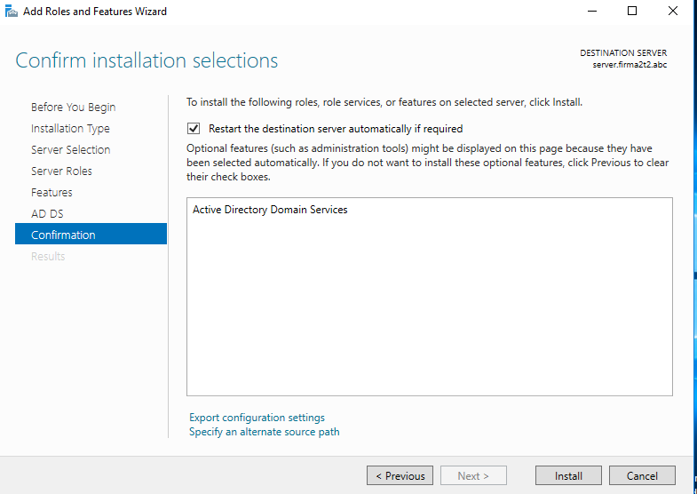
12. Skonfiguruj kontroler domeny na:
    a)  domena **firmaXYZ.abc** za zxy podaj kod twojej klasy i grupy
        np. 2k1
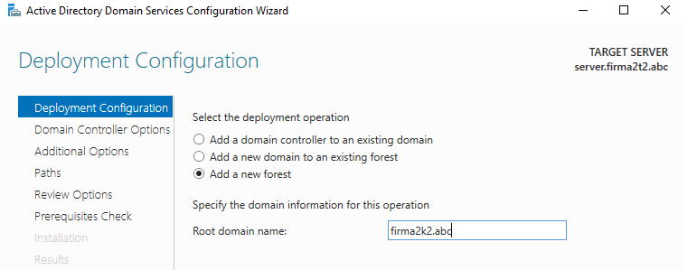
b)  funkcjonalność lasu i hasło usług katalogowych
    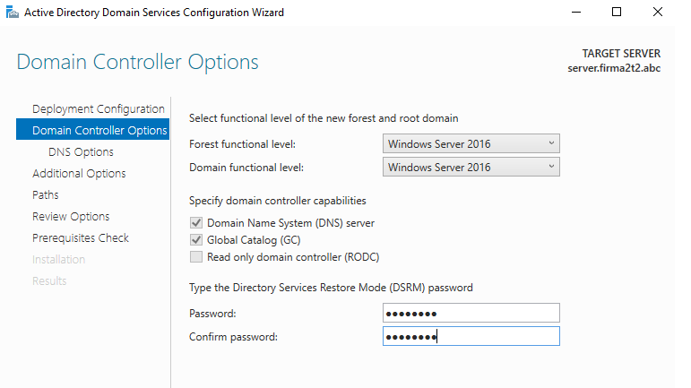
c)  delegowanie strefy dns
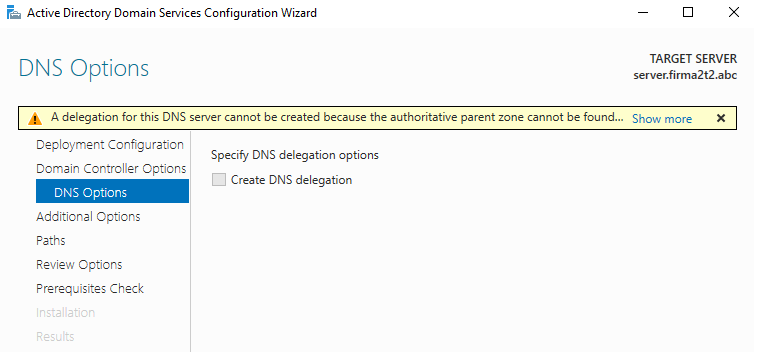
d)  nazwa netbios domyślna podpowiedź
    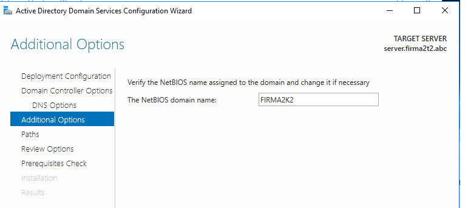
e)  lokalizacja bazy AD
f)  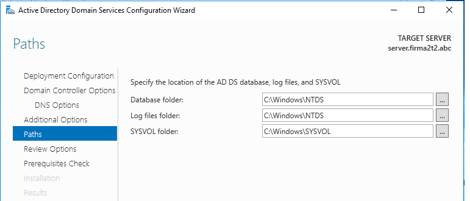
    instalacja
    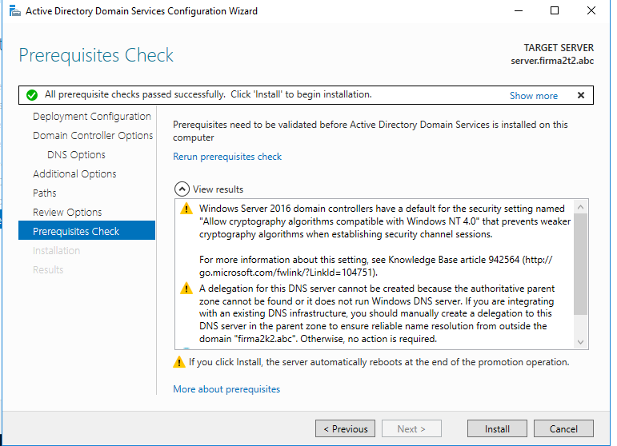
<!-- -->
13. Zrestartuj serwer.
14. Sprawdź czy działa przystawka Narzędzia - \> \'Użytkownicy i
    komputery usługi Active Directory\'.
15. Utwórz jednostkę organizacyjną o nazwie 3x lub 2x, gdzie x oznacza
    literę twojej klasy, **odznacz pole** chroń kontener przed
    przypadkowym usunięciem
16. W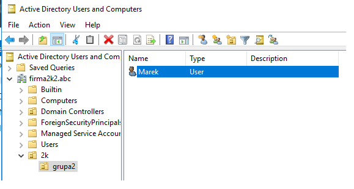
     jednostce 3x (2x) utwórz jednostkę
    organizacyjną grupax, gdzie x oznacza numer grupy.
17. W jednostce grupax utwórz konto o nazwie twoje imię z hasłem,
    skorzystaj z przystawki \'Użytkownicy i komputery usługi Active
    Directory\'.
Odznaczyć pozycję : użytkownik musi zmienić hasło przy następnym
logowaniu,
zaznaczyć dwa kolejne: użytkownik nie może zmienić hasła,
i hasło nigdy nie wygasa
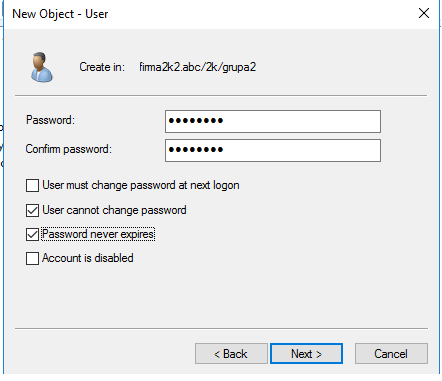
18. Uruchom stację roboczą.
19. Skonfiguruj **dolną kartę** na stacji i sprawdź połączenie z
    serwerem poleceniem ping z parametrem t oraz poleceniem tracert.
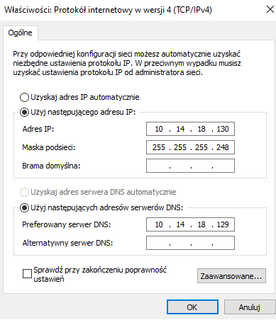
20. Przyłącz stację do domeny **firmaXYZ.abc**
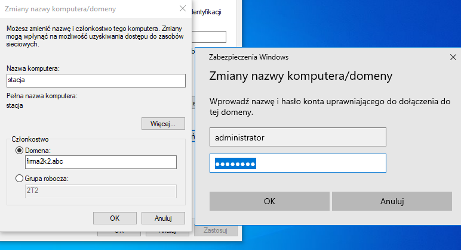

21. Zrestartuj stację roboczą po pomyślnym dołączeniu do domeny.
22. Zaloguj się na swoje konto założone w AD.
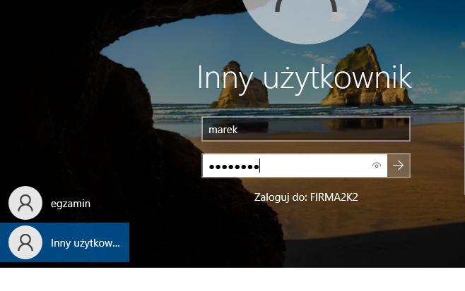
23. Sprawdź czy komputer został dodany do AD ( przystawka \'Użytkownicy
    i komputery usługi Active Directory\', kontener Komputery).
24. Sprawdź ustawienia domenowe na stacji: polecenie set, oraz
    właściwości systemu.
25. Udostępnij na serwerze katalog o nazwie **dane** z dysku c: ,
    Narzędzia - \> Zarządzanie komputerem - \> Foldery udostępnione - \>
    Udziały - \> Nowy udział
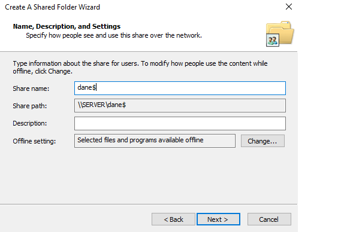
26. Na stacji roboczej zmapuj dysk sieciowy na udostępniony katalog pod
    literę dysku Y:
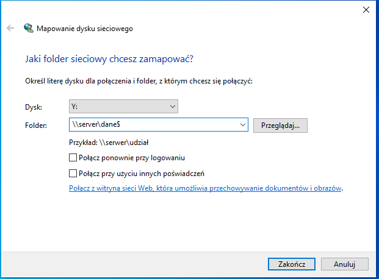
27. Napisz skrypt, który wykona montowanie zasobu sieciowego.
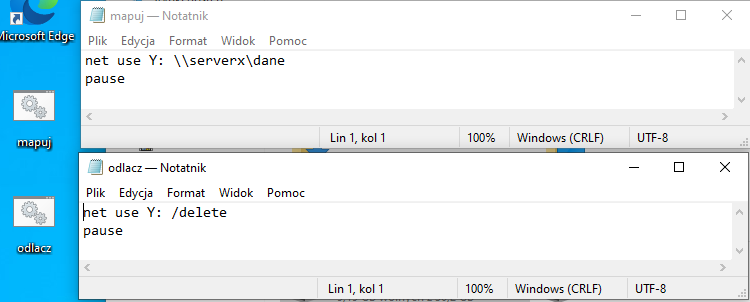
28. Na stacji zaloguj się na lokalne konto administratora i odłącz
    stację od domeny, podaj grupę roboczą jako kod klasy i grupy, np.
    2k2 .
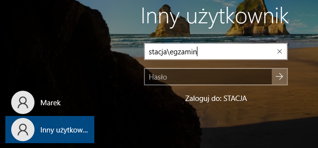
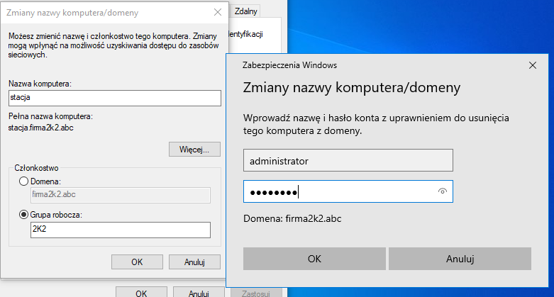
29. Po restarcie przywróć ustawienia na karcie sieciowej **stacji** na
    uzyskiwane w sposób automatyczny.
30. Na serwerze zatrzymaj udostępnianie folderu **dane**. Następnie usuń
    ten folder.
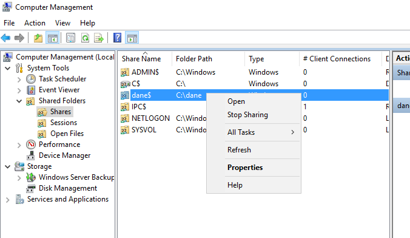
31. Na serwerze obniż poziom kontrolera domeny: Menedżer serwera → usuń
    rolę
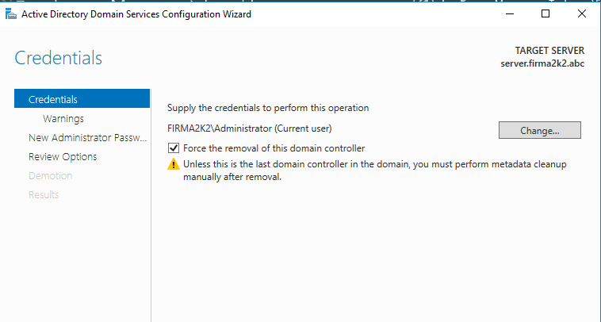
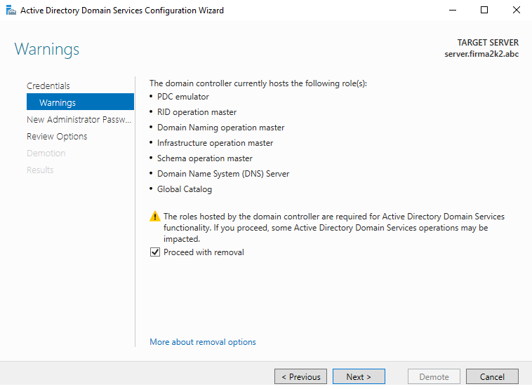
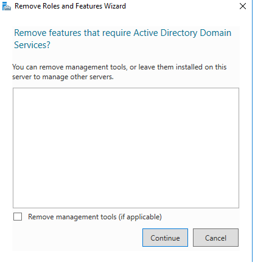
32. Odinstaluj tylko usługę AD, Menedżer serwera → dodaj rolę, jeżeli
    jest zainstalowana, **nie usuwaj narzędzi.**
33. Po obniżeniu poziomu i usunięciu roli AD, przywróć ustawienia na
    kartach sieciowych serwera na uzyskiwane w sposób automatyczny.
34. Na stacji Windows przywróć nazwę komputera na: osrodek, jeśli jest
    inna.
35. Na stacji i serwerze przywróć nazwy kart sieciowych na Ethernet i
    Ethernet 2.
