# Ćwiczenia 23 -- instalacja i konfiguracja usługi AD (Active Directory)

1. Odłącz skrętki z gniazda naściennego.

1. Z pomocą dwóch dodatkowych kabli podłącz **dolne karty** sieciowe na
    obu komputerach do switcha. ( w virtualbox dodaj drugą kartę)

   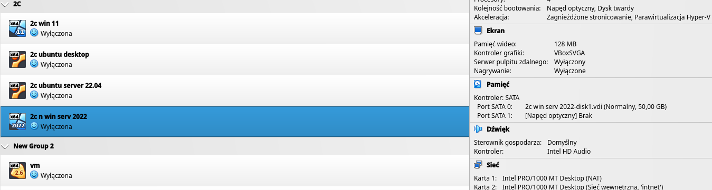

1. Zaloguj się na konto administrator w systemie Windows Server.

1. Ustaw nazwę komputera na serverxy, gdzie x oznacza nazwę klasy, a y
    numer grupy.

1. Zrestartuj serwer.

1. Zdeinstaluj tylko usługę AD, jeżeli jest zainstalowana, **nie usuwaj
    narzędzi.**

1. Przywróć ustawienia na kartach sieciowych serwera na uzyskiwane w
    sposób automatyczny.

1. Ustaw karty sieciowe następująco:
    - 1 kartę, górną:
        nazwa: WAN
        ip: 192.168.20.1xx/28, gdzie xx oznacza numer stanowiska, np. 03
    - bramka: 192.168.20.97
    - 1 DNS: 8.8.8.8
    - 2 DNS: 8.8.4.4

      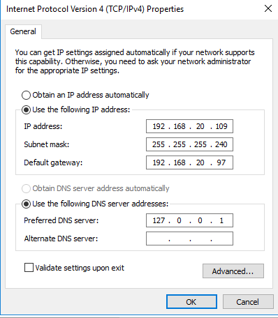

    - 2 kartę, dolną:
    - nazwa: LAN
    - ip podaj dla sieci: 10.14.18.128/2
    - brak bramki,
    - 1 DNS 10.40.80.?

       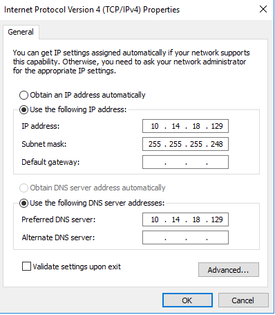

1. Sprawdź ustawienia kart sieciowych w wierszu poleceń:

   ```bash
   ipconfig /all
   ```

    i polecenie

   ```bash
    route print.
   ```

1. Sprawdź ustawienia kart sieciowych w Menedżerze serwera - \> serwer
    lokalny.

1. Zainstaluj usługę AD: Active Directory Domain Services. Menedżer
    serwera → dodaj rolę

    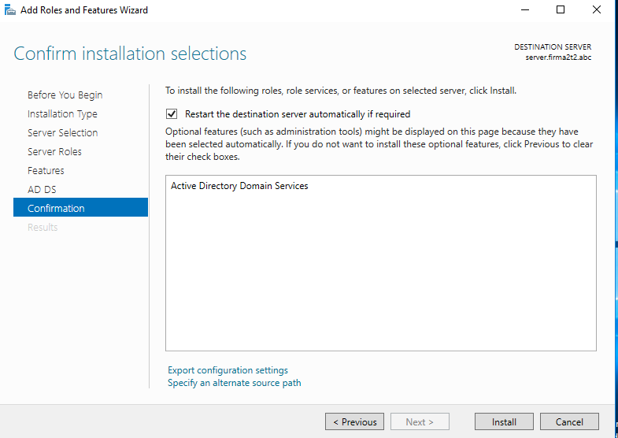

1. Skonfiguruj kontroler domeny na:
    - domena **firmaXYZ.abc** za zxy podaj kod twojej klasy i grupy
        np. 2k1
       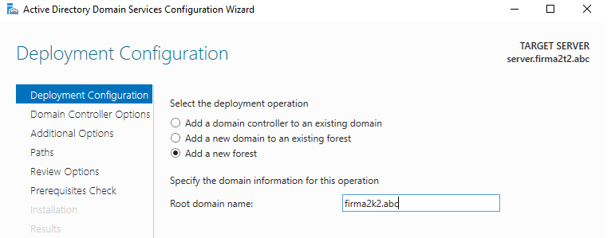
    - funkcjonalność lasu i hasło usług katalogowych
       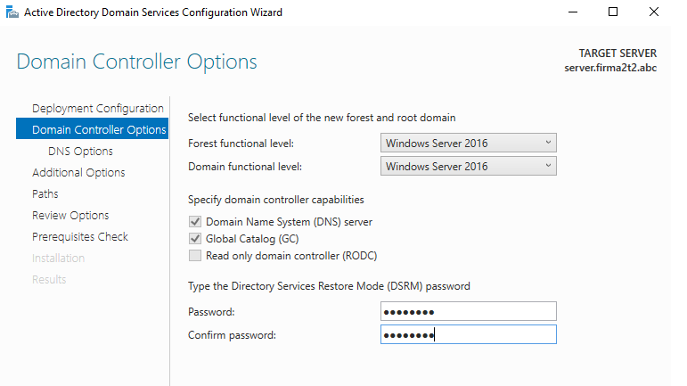
    - delegowanie strefy dns
       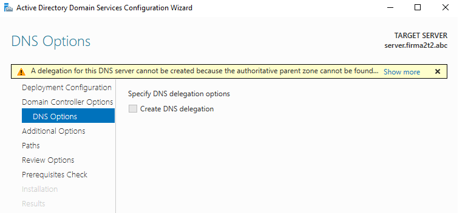
    - nazwa netbios domyślna podpowiedź
      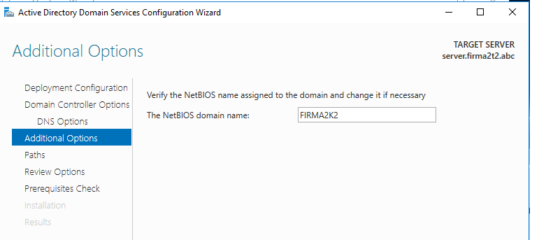
    - lokalizacja bazy AD
      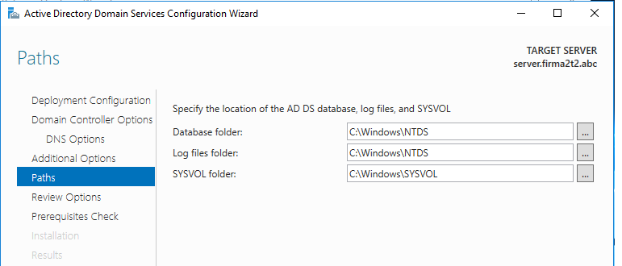
    - instalacja
       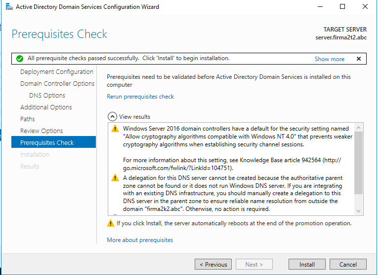

1. Zrestartuj serwer.

1. Sprawdź czy działa przystawka Narzędzia - \> \'Użytkownicy i
    komputery usługi Active Directory\'.

1. Utwórz jednostkę organizacyjną o nazwie 3x lub 2x, gdzie x oznacza
    literę twojej klasy, **odznacz pole** chroń kontener przed
    przypadkowym usunięciem

1. W jednostce 3x (2x) utwórz jednostkę
    organizacyjną grupax, gdzie x oznacza numer grupy.

   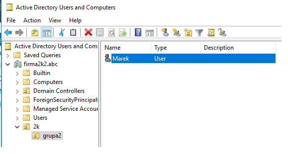

1. W jednostce grupax utwórz konto o nazwie twoje imię z hasłem,
    skorzystaj z przystawki \'Użytkownicy i komputery usługi Active
    Directory\'.

    Odznaczyć pozycję : użytkownik musi zmienić hasło przy następnym
    logowaniu,
    zaznaczyć dwa kolejne: użytkownik nie może zmienić hasła,
    i hasło nigdy nie wygasa

   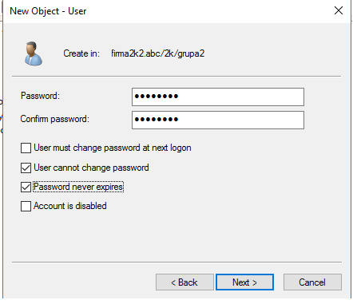

1. Uruchom stację roboczą.

1. Skonfiguruj **dolną kartę** na stacji i sprawdź połączenie z
    serwerem poleceniem ping z parametrem t oraz poleceniem tracert.

   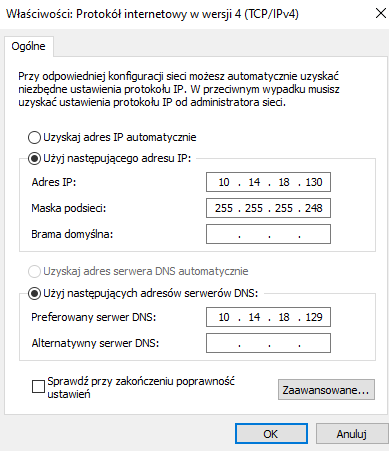

1. Przyłącz stację do domeny **firmaXYZ.abc**

   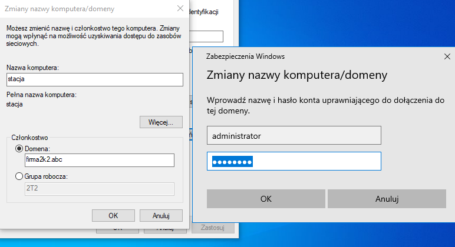

   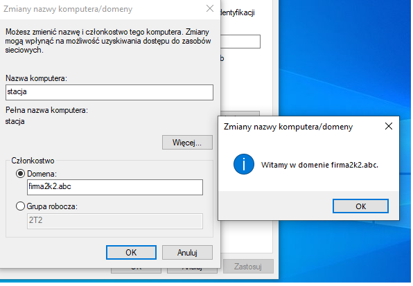

1. Zrestartuj stację roboczą po pomyślnym dołączeniu do domeny.

1. Zaloguj się na swoje konto założone w AD.

   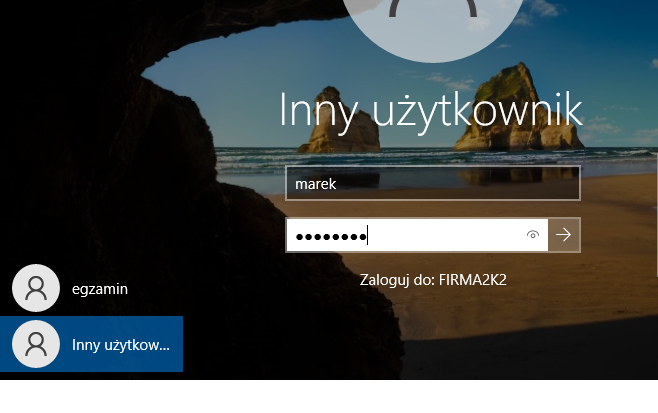

1. Sprawdź czy komputer został dodany do AD ( przystawka \'Użytkownicy
    i komputery usługi Active Directory\', kontener Komputery).

1. Sprawdź ustawienia domenowe na stacji: polecenie set, oraz
    właściwości systemu.

1. Udostępnij na serwerze katalog o nazwie **dane** z dysku c: ,
    Narzędzia - \> Zarządzanie komputerem - \> Foldery udostępnione - \>
    Udziały - \> Nowy udział

   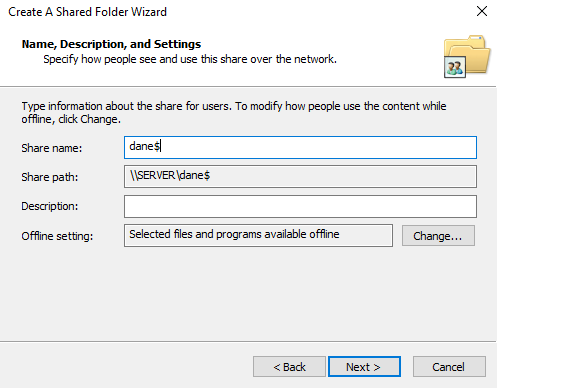

1. Na stacji roboczej zmapuj dysk sieciowy na udostępniony katalog pod
    literę dysku Y:

   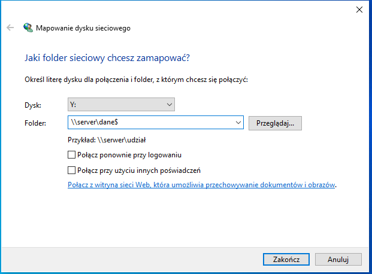

1. Napisz skrypt, który wykona montowanie zasobu sieciowego.

   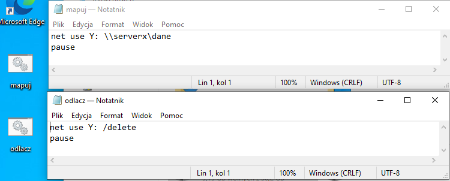

1. Na stacji zaloguj się na lokalne konto administratora i odłącz
    stację od domeny, podaj grupę roboczą jako kod klasy i grupy, np.
    2k2 .

   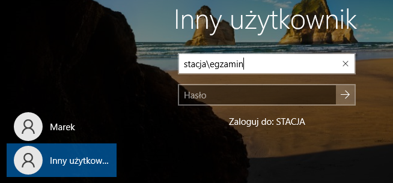

   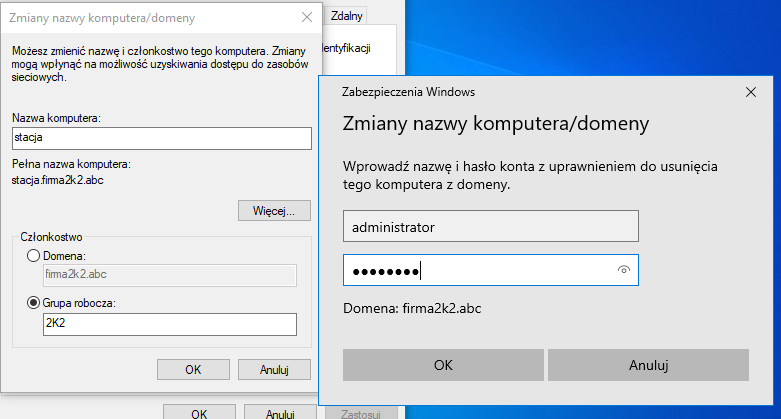

1. Po restarcie przywróć ustawienia na karcie sieciowej **stacji** na
    uzyskiwane w sposób automatyczny.

1. Na serwerze zatrzymaj udostępnianie folderu **dane**. Następnie usuń
    ten folder.

   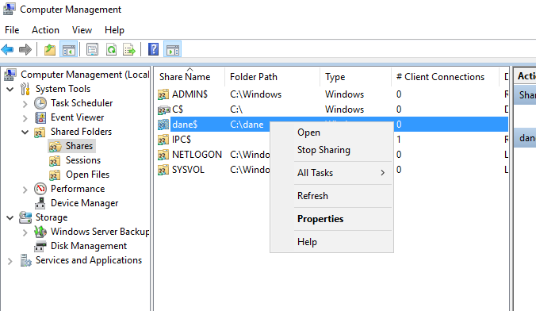

1. Na serwerze obniż poziom kontrolera domeny: Menedżer serwera → usuń
    rolę

   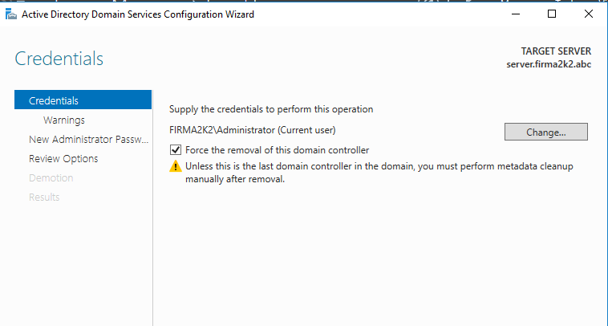

   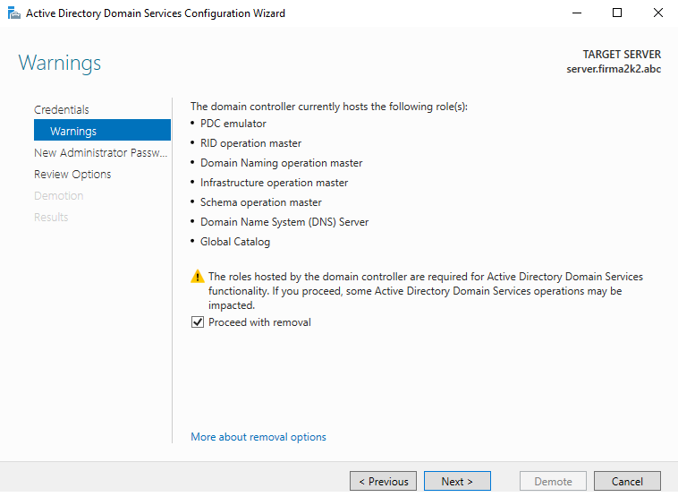

   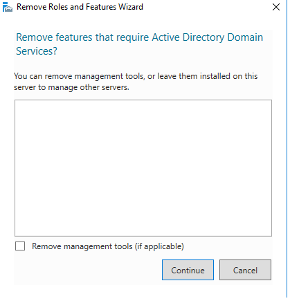

1. Odinstaluj tylko usługę AD, Menedżer serwera → dodaj rolę, jeżeli
    jest zainstalowana, **nie usuwaj narzędzi.**

1. Po obniżeniu poziomu i usunięciu roli AD, przywróć ustawienia na
    kartach sieciowych serwera na uzyskiwane w sposób automatyczny.

1. Na stacji Windows przywróć nazwę komputera na: stacja, jeśli jest
    inna.

1. Na stacji i serwerze przywróć nazwy kart sieciowych na Ethernet i
    Ethernet 2.
1. Koniec.🔚
