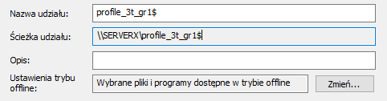
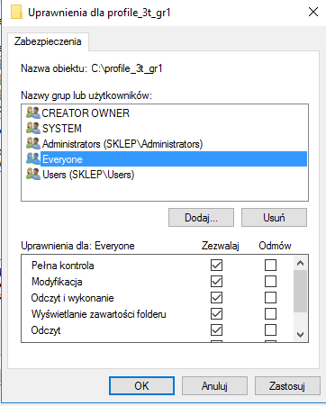
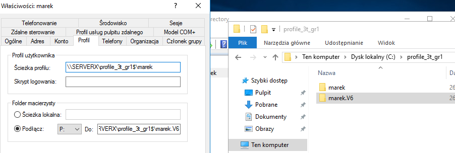
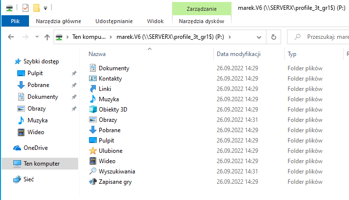
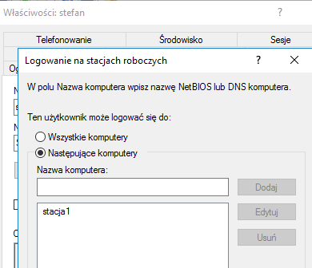
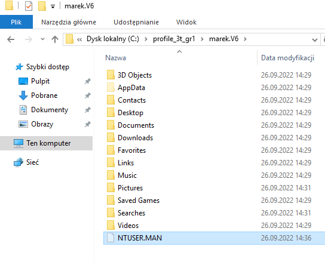
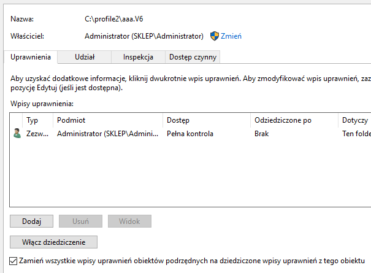

Ćwiczenia 24 -- Tworzenie profilu mobilnego i obowiązkowego
1.  Zaloguj się na konto administrator.
2.  Utwórz jednostkę organizacyjną w AD dla domeny zsmeieXYZ.abcd, gdzie
    *X*YZ oznacza kod twojej klasy, np. zsmeie2k1.abcd.
3.  Utwórz w jednostce ***3x*** podjednostkę o nazwie ***grx***, gdzie
    ***x*** oznacza numer twojej grupy.
4.  Przenieś swoje konto do lokalizacji zsmeie3x1.abcd/3x/grx.
5.  Dodaj stację roboczą do domeny.
6.  Utwórz na dysku c: katalog do przechowywania plików profili
    użytkowników domenowych o nazwie: profile_3x_grX, gdzie x oznacza
    literę twojej klasy, a X numer twojej grupy.
7.  W przystawce zarządzanie komputerem ( compmgmt.msc ) udostępnij
    folder profile_3x_grX jako ukryty, dodając na końcu znak dolara.
    Pamiętaj o kliknięciu w przycisk Dostosuj (Patrz punkt 8).
> 
8.  Udostępnij folder dla wszystkich pełna kontrola, oraz na zakładce
    \'zabezpieczenia\' dodaj grupę Wszyscy i dla niej też włącz opcję
    pełna kontrola.

9.  Załóż nowe konto. We właściwościach tego konta przejdź na zakładkę
    Profil, w pozycji ścieżka profilu ustaw ścieżkę UNC na swój serwer i
    udostępniony katalog dla profili oraz nazwę swojego konta ( np.
    [\\\\serverX\\profile_3t_gr1\$\\**%username%**](../../../../..//serverX/profile_3t_gr1$/%25username%25)
    ),
w pozycji podłącz wybierz P: i podłącz folder macierzysty: ( np.
[\\\\serverX\\profile_3t_gr1\$\\%username%](../../../../..//serverX/profile_3t_gr1$/%25username%25)
).
Po kliknięciu zastosuj otrzymamy poniższe. Dopisz V6 w folderze
macierzystym, w pozycji podłącz:

10. Zaloguj się na swoje konto w AD na stacji roboczej i sprawdź:
    a)  czy został zamapowany dysk sieciowy P: z zawartością twojego
        profilu.
    b)  Czy na serwerze zostały skopiowane pliki twojego profilu (
        utworzyć plik na pulpicie, zmienić tapetę)

11. Ustaw godziny logowania poza czasem ćwiczeń, sprawdź czy logowanie
    jest niemożliwe.

12. Przywróć możliwość zalogowania się w dniu ćwiczeń.
13. Ustaw możliwość logowania się tylko z określonej stacji.

14. Sprawdź czy logowanie jest niemożliwe.

15. Przywróć możliwość logowania się z każdej stacji roboczej.
16. Stwórz profil mandatory.

17. Sprawdź czy tapeta, i wybrane pliki **nie są** zachowywane.
18. Załóż drugie konto. Przećwicz na drugim koncie powyższe.
19. Na koniec, w podanej kolejności:
<!-- -->
a)  Odłącz stację od domeny
b)  zatrzymaj udostępnianie folderów
c)  usuń foldery z profilami
> 
d)  obniż poziom kontrolera domeny
