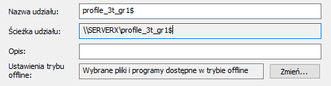
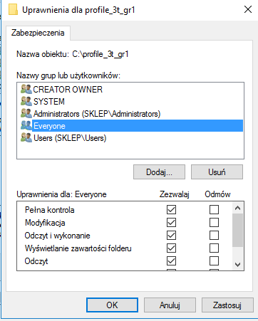
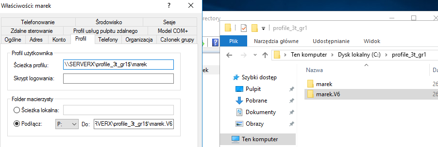
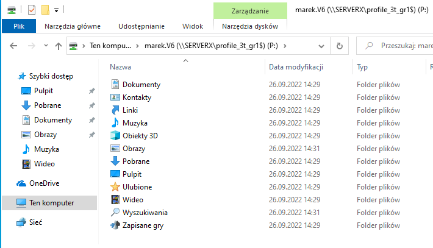
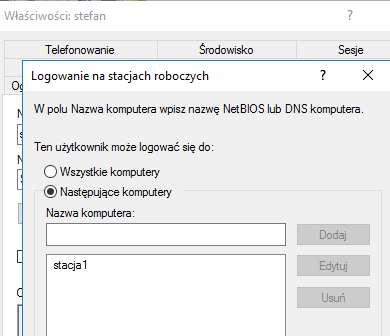
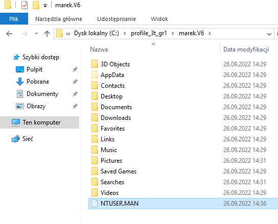
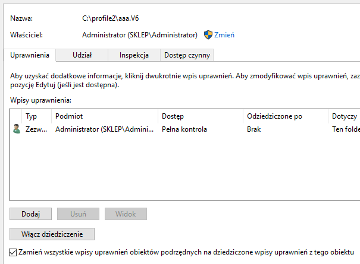

# Ćwiczenia 24 -- Tworzenie profilu mobilnego i obowiązkowego

1. Zaloguj się na konto administrator.

1. Utwórz jednostkę organizacyjną w AD dla domeny zsmeieXYZ.abcd, gdzie
    *X*YZ oznacza kod twojej klasy, np. zsmeie2k1.abcd.

1. Utwórz w jednostce ***3x*** podjednostkę o nazwie ***grx***, gdzie
    ***x*** oznacza numer twojej grupy.

1. Przenieś swoje konto do lokalizacji zsmeie3x1.abcd/3x/grx.

1. Dodaj stację roboczą do domeny.

1. Utwórz na dysku c: katalog do przechowywania plików profili
    użytkowników domenowych o nazwie: profile_3x_grX, gdzie x oznacza
    literę twojej klasy, a X numer twojej grupy.

1. W przystawce zarządzanie komputerem ( compmgmt.msc ) udostępnij
    folder profile_3x_grX jako ukryty, dodając na końcu znak dolara.
    Pamiętaj o kliknięciu w przycisk Dostosuj (Patrz punkt 8).

   

1. Udostępnij folder dla wszystkich pełna kontrola, oraz na zakładce
    \'zabezpieczenia\' dodaj grupę Wszyscy i dla niej też włącz opcję
    pełna kontrola.

   

1. Załóż nowe konto. We właściwościach tego konta przejdź na zakładkę
    Profil, w pozycji ścieżka profilu ustaw ścieżkę UNC na swój serwer i
    udostępniony katalog dla profili oraz nazwę swojego konta ( np.
    [\\\\serverX\\profile_3t_gr1\$\\**%username%**](../../../../..//serverX/profile_3t_gr1$/%25username%25)
    ),
   w pozycji podłącz wybierz P: i podłącz folder macierzysty: ( np.
   [\\\\serverX\\profile_3t_gr1\$\\%username%](../../../../..//serverX/profile_3t_gr1$/%25username%25)
   ).
   Po kliknięciu zastosuj otrzymamy poniższe. Dopisz V6 w folderze
   macierzystym, w pozycji podłącz:

   

1. Zaloguj się na swoje konto w AD na stacji roboczej i sprawdź:
    - czy został zamapowany dysk sieciowy P: z zawartością twojego
        profilu.
    - czy na serwerze zostały skopiowane pliki twojego profilu (
        utworzyć plik na pulpicie, zmienić tapetę)

   

1. Ustaw godziny logowania poza czasem ćwiczeń, sprawdź czy logowanie
    jest niemożliwe.

   

1. Przywróć możliwość zalogowania się w dniu ćwiczeń.

1. Ustaw możliwość logowania się tylko z określonej stacji.

   

1. Sprawdź czy logowanie jest niemożliwe.

   

1. Przywróć możliwość logowania się z każdej stacji roboczej.

1. Stwórz profil mandatory.

   

1. Sprawdź czy tapeta, i wybrane pliki **nie są** zachowywane.
1. Załóż drugie konto. Przećwicz na drugim koncie powyższe.
1. Na koniec, w podanej kolejności:
<!-- -->
a)  Odłącz stację od domeny
b)  zatrzymaj udostępnianie folderów
c)  usuń foldery z profilami
> 
d)  obniż poziom kontrolera domeny
