Ćwiczenia 27 -- Przekierowanie folderów pulpit i dokumenty.
1.  Zaloguj się na konto administrator na serwerze.
2.  Utwórz jednostkę organizacyjną w AD dla domeny zsmeie.abcd, o ile
    nie istnieje, o nazwie: ***3x***, gdzie ***x*** oznacza
literę twojej klasy.
3.  Utwórz w jednostce ***3x*** podjednostkę o nazwie ***grx***, gdzie
    ***x*** oznacza numer twojej grupy.
4.  Utwórz na dysku c: katalog do przechowywania twoich plików z pulpitu
    o nazwie: pulpity_3x_grX, gdzie x
oznacza literę twojej klasy, a X numer twojej grupy.
5.  W przystawce zarządzanie komputerem ( compmgmt.msc ) udostępnij
    folder pulpity_3x_grX jako ukryty,
dodając na końcu znak dolara. Pamiętaj o kliknięciu w przycisk Dostosuj
(Patrz punkt 8).
6.  Udostępnij folder dla wszystkich pełna kontrola, oraz na zakładce
    \'zabezpieczenia\' dodaj grupę Wszyscy i dla niej
również włącz opcję pełna kontrola.
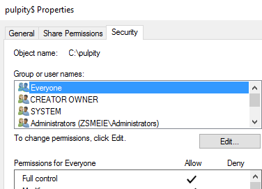
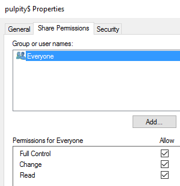
7.  Utwórz grupę zabezpieczeń na poziomie swojego konta o nazwie:
    pulpity_3x_grX, gdzie x oznacza literę twojej
klasy, a X numer twojej grupy.
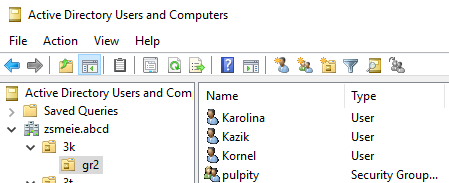
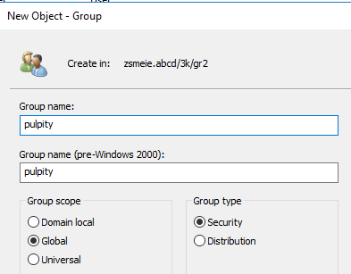
8.  We właściwościach swojego konta przejdź na zakładkę Członek grupy,
    następnie przycisk Dodaj i wybierz z listy
utworzoną w poprzednim punkcie grupę, poprzez kliknięcie w przyciski
zaawansowane i znajdź teraz. W efekcie
zostałeś dodany do tej grupy zabezpieczeń.
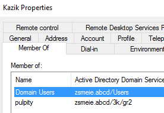
9.  Otwórz przystawkę Zarządzanie zasadami grupy i przejdź do jednostki
    organizacyjnej do której należysz, np.
zsmeie.abcd/3k/gr2.
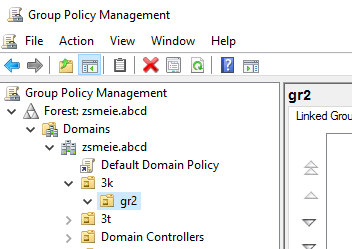
10. Prawym klawiszem myszy wybierz pozycję \'utwórz obiekt zasad grup
    ...\' , następnie nadaj mu nazwę, np.
przekierowanie folderów. Prawym klawiszem myszy na obiekcie wybierz
pozycję edytuj
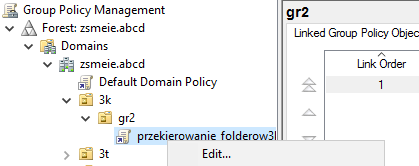
11. , otworzy się okno \'Edytor zarządzania zasadami
grupy\', następnie \'konfiguracja użytkownika\' → zasady → ustawienia
systemu windows → przekierowania
folderów → Dokumenty ( prawym klawiszem myszy wybrać właściwości) i
skonfigurować przekierowanie dla
grupy zabezpieczeń i folderu udostępnionego.
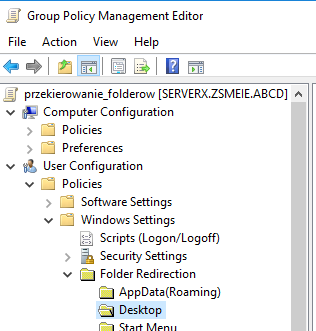
12. Ustawienia: Zaawansowane -- określaj lokalizację dla różnych grup
    użytkowników, następnie Dodaj.
13. Otworzy się okno \'Określenie grupy i lokalizacji\' , członkostwo
    grupy zabezpieczeń: wybrać swoją grupę,
lokalizacja folderu docelowego: utwórz folder dla każdego użytkownika w
ścieżce,
ścieżka katalogu głównego: np.
[\\\\serverx\\](file:///\\serverx\)pulpity\$ i OK.
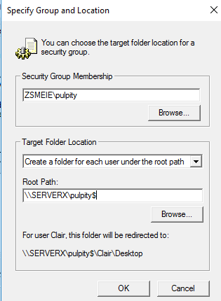
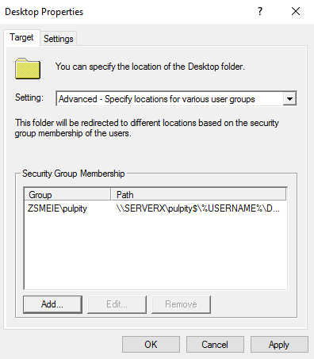
14. Na zakładce ustawienia zaznacz 4 pierwsze pozycje.
15. Zamknij okno edytora zasad grup !!!
16. Zaloguj się na swoje konto w AD na stacji roboczej i sprawdź, czy
    pliki z pulpitu zostaną przeniesione na
serwer do katalogu np.
c:\\pulpity_3k_gr2\\nazwa_twojego_konta\\Dokumenty.
Na serwerze:
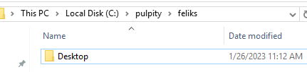
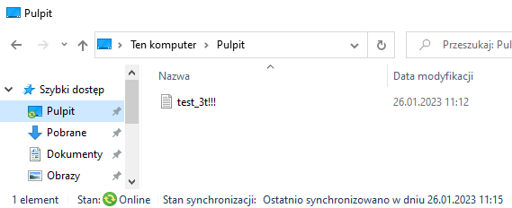
17. Zapisz plik raportu z GPO na pulpicie, pozycja Save Report.
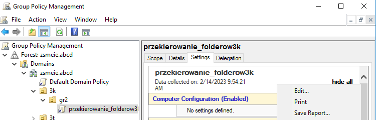
18. Na wypadek, gdyby nie działało przelogowanie
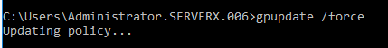
19. Wszystkie czynności powtórz dla katalogu dokumenty.
20. Wszystkie czynności powtórz dla katalogu Obrazy( bez patrzenia na
    kartkę).
21. Wybierz inne foldery do przećwiczenia.
22. Usuń wszystkie obiekty, konta, grupy, które utworzyłeś/aś.
23. KONIEC.
