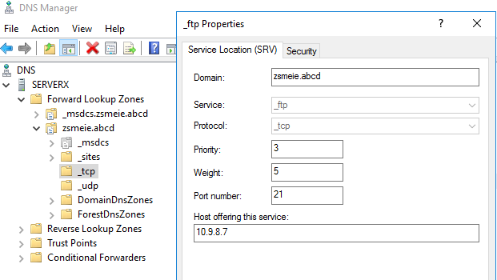
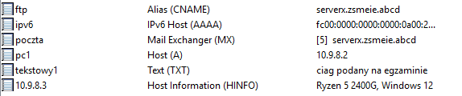
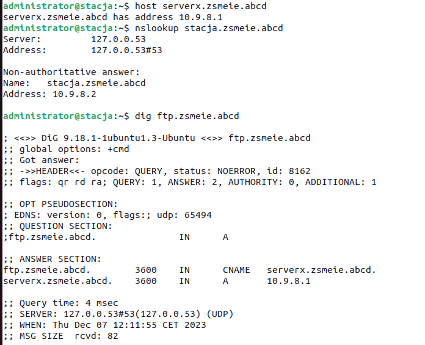
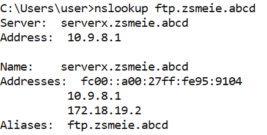
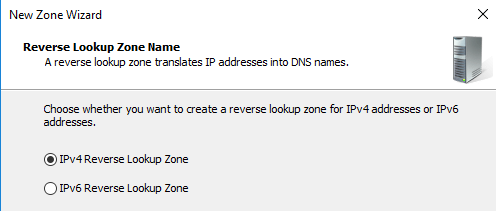
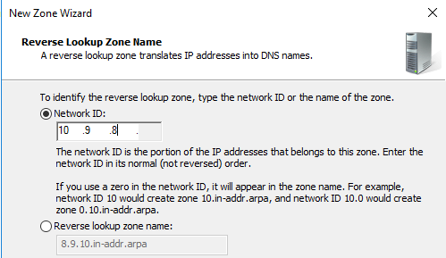
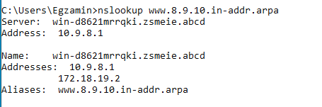
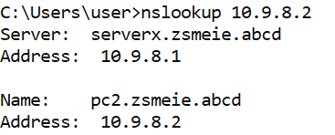
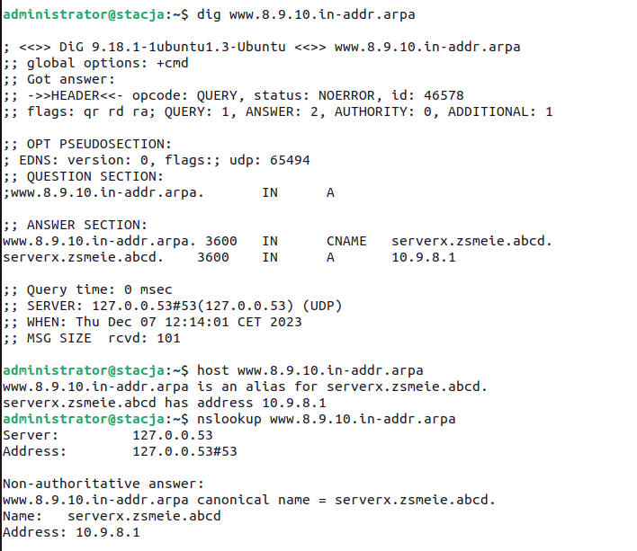
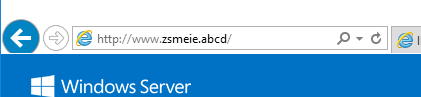

Ćwiczenia 29 -- konfiguracja usługi DNS
1.  Zaloguj się na swoje konto administrator.
2.  Sprawdź czy dolna i górna karta sieciowa ma następującą
    konfigurację:
    a)  ip: 10.9.8.1/26
> brak bramki,
>
> 1 DNS 10.9.8.1
b)  ip: 172.18.19.2/28
> bramka: 172.18.19.1,
>
> 1 DNS 8.8.8.8
3.  Sprawdź ustawienia kart sieciowych w wierszu poleceń: ipconfig /all
    i polecenie route print.
4.  Sprawdź czy jest zainstalowana rola AD i poprawnie skonfigurowana.
5.  Sprawdź w Menedżerze Serwera czy jest zainstalowana rola DNS. Jeśli
    tak to przejdź do następnego punktu.
6.  W strefie przeszukiwania do przodu dodaj następujące rekordy:
    a)  hosta ipv4 dla stacji o nazwie pc1
    b)  alias dla swojego serwera o nazwie ftp
    c)  poczty o priorytecie 5 i nazwie poczta
    d)  poczty o priorytecie 12 i nazwie mail
    e)  hosta ipv6 dla stacji o nazwie pc1
    f)  srv
> 
g)  txt
h)  inny przez Ciebie wybrany, np. HINFO
> 

7.  Przetestuj działanie DNS dla dodanych rekordów narzędziem nslookup
    na serwerze i stacji roboczej.
> 
8.  Przetestuj działanie dla dodanych rekordów narzędziami:
    nslookup, host i dig
    na stacji roboczej **ubuntu**.
9.  Dodaj strefę przeszukiwania wstecz.
> 
>
> 
>
> Kolejny krok:
>
> 
10. W strefie przeszukiwania wstecz dodaj następujące rekordy:
    a)  wskaźnika dla stacji pc1
    b)  wskaźnika dla twojego serwera
    c)  alias dla stacji o nazwie twoje_imie
    d)  alias dla serwera
    e)  srv
    f)  txt
    g)  inny przez Ciebie wybrany
11. Przetestuj działanie DNS dla dodanych rekordów narzędziem nslookup
    na serwerze i stacji roboczej.
> 

12. Przetestuj działanie dla dodanych rekordów narzędziami:
    nslookup, host i dig
    na stacji roboczej **ubuntu**.
    
13. Dodaj odpowiednie rekordy tak, aby w przeglądarce działała strona
    [**www.zsmeie.abcd**](http://www.zsmeie.abcd/)
> 
>
> 
14. Usuń strefę przeszukiwania **wstecznego.**
15. Usuń dodane przez Ciebie rekordy w strefie przeszukiwania do przodu.
16. Druga osoba wykonuje powyższe ćwiczenia.
