Ćwiczenia 2-3 -- Ubuntu serwer -- polecenia systemowe
Zaloguj się na swoje konto imienXYZ, gdzie XYZ oznacza kod klasy i
grupy, np. jank3t1
1.  Dodaj swoje konto do grupy sudo: *sudo usermod twoje_konto -G sudo*
2.  Sprawdzenie czy jesteśmy w grupie sudo: *id konto*
3.  Zainstaluj obsługę myszy w terminalu: *sudo apt install gpm -y*
4.  sudo su -c 'polecenie' ( np. sudo su --c 'cat /var/log/syslog \|
    more' lub sudo su --c 'cat /var/log/syslog \| less')
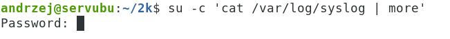
5.  su administrator i pwd, następnie exit
6.  su -- administrator i pwd, następnie exit
7.  sudo fdisk \--list lub sudo fdisk -l
8.  Wyświetl listę zainstalowanego oprogramowania: *sudo apt list
    \--installed*
9.  *sudo apt list \--installed \| grep coreutils* ( sprawdzenie czy
    paczka coreutils jest zainstalowana)
10. Porównaj wykonanie poleceń: *df* i *df -vh*

11. 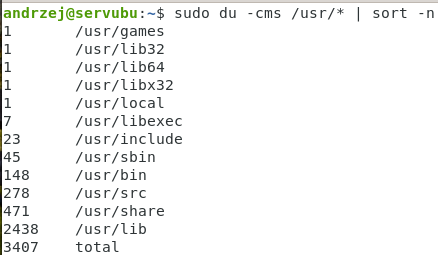
    du ( np. du --cms /usr/\* lub du --cms
    /usr/\* \| sort --nr ) du rosnąco i malejąco
12. krótki kurs nano ( *nano nazwa_pliku* , Ctrl+O zapis Ctrl+X wyjście)
13. Sprawdzenie czy plik powstał: ls i *cat nazwa_pliku*
14. krótki kurs vi ( vi nazwa_pliku ,
i lub insert -- tryb pisania,
Esc -- wyjście z trybu pisania,
:x -- zapis,
:q! -- wyjście bez zapisu
: set number -- numeracja wierszy po lewej ( :set nonumber)
W trypie komend:
yy -- skopiowanie bieżącego wiersza
nyy -- skopiowanie n wierszy
p -- wklejenie wiersza/y za aktualnym
dd -- kasuje cały wiersz, d5d kasuje 5 wierszy )
15. nano plik1 zapisz 4 wiersze
16. Sprawdź, który edytor jest domyślny w systemie: *sudo
    update-alternatives \--config editor*
17. cp plik1 plik2
18. dodaj w pliku pierwszym jeden znak i sprawdź
19. cmp plik1 plik2
20. diff plik1 plik2
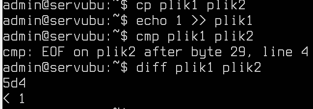
21. \> tworzenie nowego pliku, \>\> dopisywanie do istniejącego pliku
22. sudo find / -name \*bashrc lub find / -name \*bashrc \> w1.txt
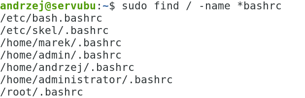
23. ls -al \~ \> list1.txt i ls -altr \~ \> list2.txt
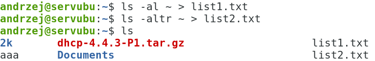
24. lsblk
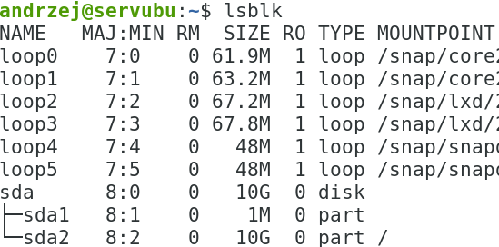
25. lscpu lub lscpu \| grep Model
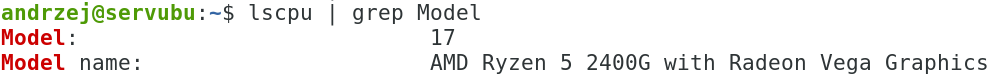
26. lsusb + grep na sprzęt,
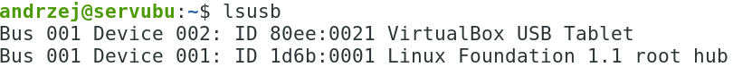
27. przykład dla lspci:
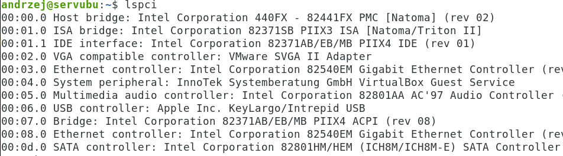
28. lshw -short lub lshw -html
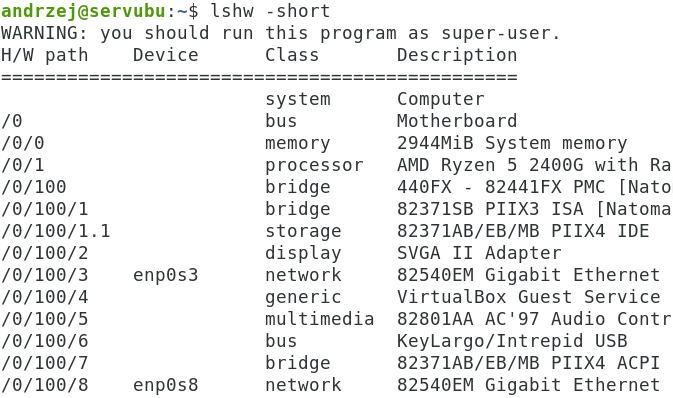
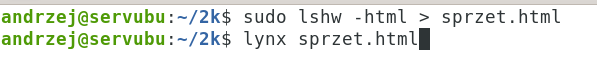
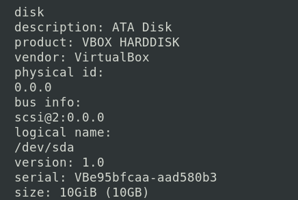
29. Sprawdzenie dnsów: *systemd-resolve \--status \| grep \'DNS
    Servers\' -A2*
*lub resolvectl*
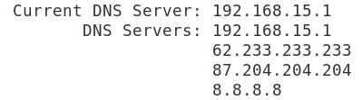
30. ps z opcjami aux lub -ef
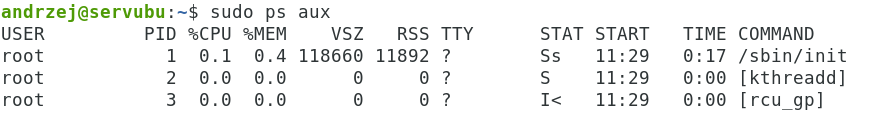
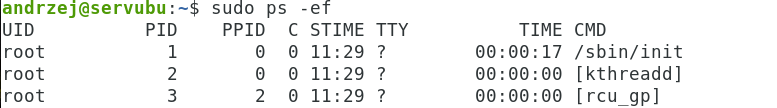
31. htop z przyciskami: F3, F6 oraz u (user) z opcjami p, e
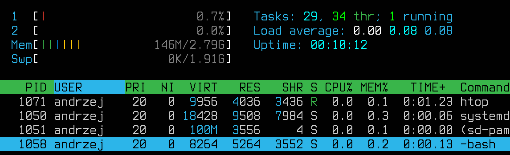
32. tree \> tree.txt i tree -d \> ttreed.txt\~
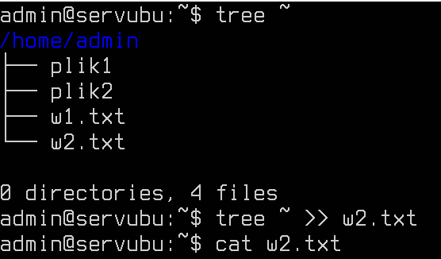
33. mkdir \~/cwiczenia7
34. cp li\*.txt \~/cwiczenia7/
35. cp -i \~/cwiczenia7/li\*.txt .
36. cp ?re\*.\* \~/cwiczenia7/
37. cat \*tr\*.txt \> tree4.txt
lub cat tree.txt \> tree3.txt, cat ttreed.txt \>\> tree3.txt
lub cat tree.txt ttreed.txt \> tree5.txt
38. diff tree3.txt tree4.txt
39. Tworzenie linków symbolicznych ( ln -s /ścieżka/plik nazwa_linku)
40. 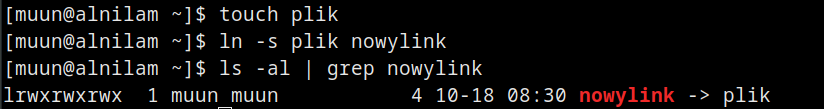
    sudo cp /etc/passwd passwd.kopia
41. cat passwd.kopia \| sort -t : -k3 -nr ( sortowanie po UID user id)
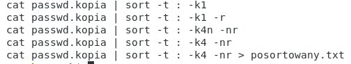
42. alias ( alias dla polecenia du) i usuwanie aliasów: unalias
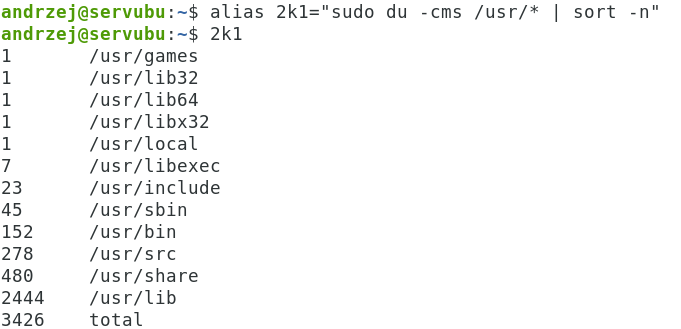
43. Wyświetlenie wszystkich aliasów + kasowanie
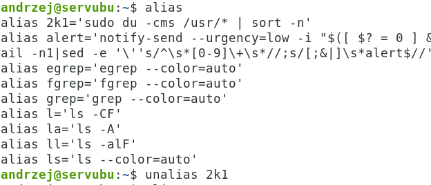
44. export - dodanie zmiennej
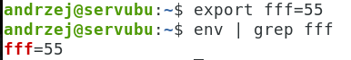
45. unset -- usunięcie zmiennej

46. PS1 + colory
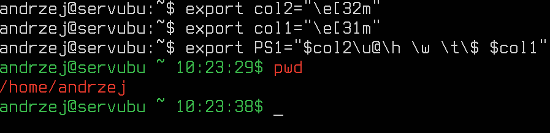
47. FTP + konto (podstawowe polecenia: get, put, mget, mput)
48. Piszemy ftp ftp.icm.edu.pl
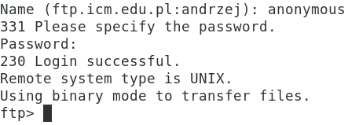
49. *sudo shutdown now* ( na koniec zajęć)
