# Ćwiczenia 2-3 -- Ubuntu serwer -- polecenia systemowe

Zaloguj się na swoje konto imienXYZ, gdzie XYZ oznacza kod klasy i
grupy, np. jank3t1

1. Dodaj swoje konto do grupy sudo:

    ```bash
    sudo usermod twoje_konto -G sudo
    ```

1. Sprawdzenie czy jesteśmy w grupie sudo:

   ```bash
   id konto
   ```

1. Zainstaluj obsługę myszy w terminalu:

   ```bash
   sudo apt install gpm -y
   ```

1. sudo su -c 'polecenie'
   ( np. sudo su --c 'cat /var/log/syslog \| more' lub
   sudo su --c 'cat /var/log/syslog \| less')

   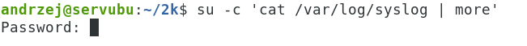

1. su administrator i pwd, następnie exit

1. su - administrator i pwd, następnie exit

1. sudo fdisk \--list lub sudo fdisk -l

1. Wyświetl listę zainstalowanego oprogramowania:

   ```bash
   sudo apt list --installed
   ```

   lub
   sprawdzenie czy paczka coreutils jest zainstalowana

   ```bash
   sudo apt list --installed | grep coreutils
   ```

1. Porównaj wykonanie poleceń: *df* i

   ```bash
   df -vh
   ```

   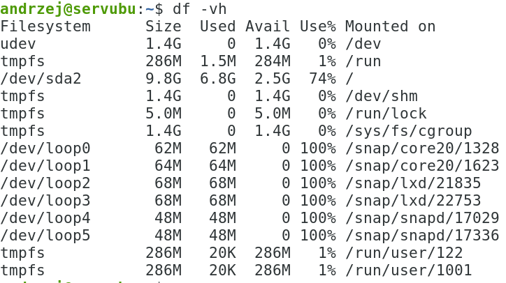

1. Polecenie  du, np.

   ```bash
   du --cms /usr/*
   ```

   lub du rosnąco i malejąco

   ```bash
   du --cms /usr/\* | sort --nr  
   ```

    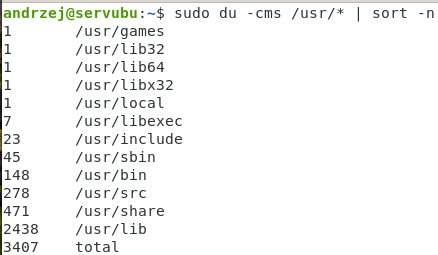

1. krótki kurs nano ( *nano nazwa_pliku* , Ctrl+O zapis Ctrl+X wyjście)

1. Sprawdzenie czy plik powstał: ls i *cat nazwa_pliku*

1. krótki kurs vi ( vi nazwa_pliku ,

      i lub insert -- tryb pisania,

      Esc -- wyjście z trybu pisania,

      :x -- zapis,

      :q! -- wyjście bez zapisu

      : set number -- numeracja wierszy po lewej ( :set nonumber)

      W trypie komend:

      yy -- skopiowanie bieżącego wiersza

      nyy -- skopiowanie n wierszy

      p -- wklejenie wiersza/y za aktualnym

      dd -- kasuje cały wiersz, d5d kasuje 5 wierszy )

1. nano plik1 zapisz 4 wiersze
1. Sprawdź, który edytor jest domyślny w systemie:

   ```bash
   sudo update-alternatives --config editor
   ```

   lub

   ```bash
   select-editor
   ```

1. Kopiowanie plików:

   ```bash
   cp plik1 plik2
   ```

1. dodaj w pliku pierwszym jeden znak i sprawdź

1. Porównanie plików:

   ```bash
   cmp plik1 plik2
   ```

1. Drugi sposób na porównanie:

   ```bash
   diff plik1 plik2
   ```

   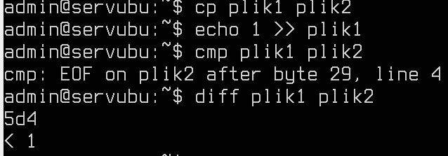

1. Przekierowania:

   \> tworzenie nowego pliku,

   \>\> dopisywanie do istniejącego pliku

1. Szukanie:

   ```bash
   sudo find / -name \*bashrc lub find / -name \*bashrc \> w1.txt
   ```

   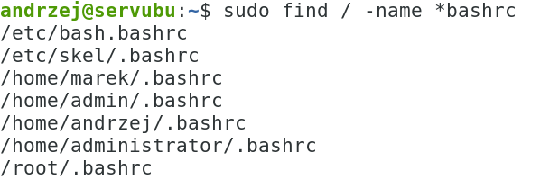

1. Sposoby na listowanie:

   ```bash
   ls -al ~ > list1.txt  
   ls -altr ~ > list2.txt
   ```

   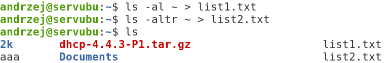

1. Polecenie: lsblk

   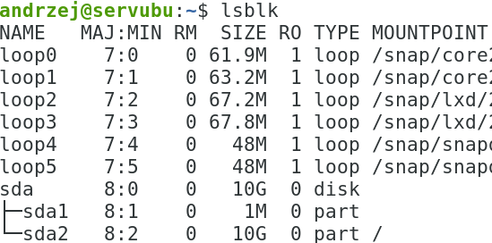

1. Info. o procesorze:

   ```bash
   lscpu 
   lub 
   lscpu | grep Model
   ```

   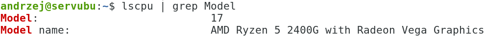

1. lsusb + grep na sprzęt,

   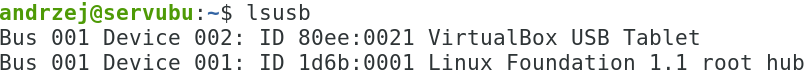

1. przykład dla lspci:

   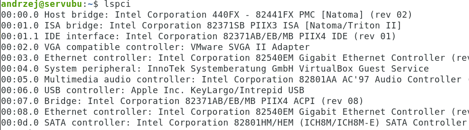

1. Informacje o sprzęcie:

   ```bash
   lshw -short 
   lub 
   lshw -html
   ```

   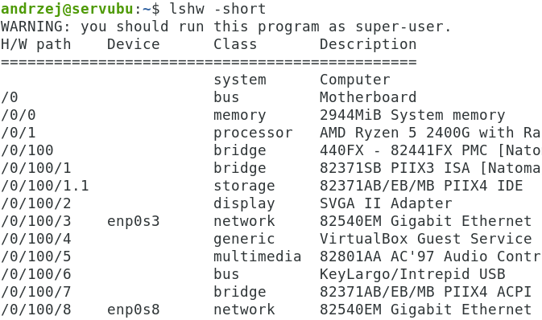

   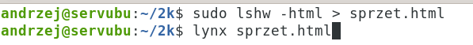

   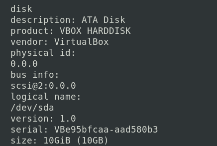

1. Sprawdzenie dnsów:

   ```bash
   systemd-resolve --status | grep 'DNS Servers' -A2
   ```

   lub

   ```bash
   resolvectl
   ```

   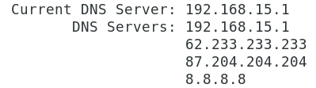

1. Procesy systemowe:

   ```bash
   ps z opcjami aux lub -ef
   ```

   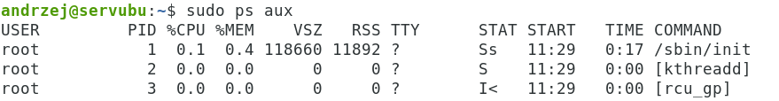

   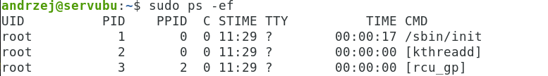

1. htop z przyciskami: F3, F6 oraz u (user) z opcjami p, e
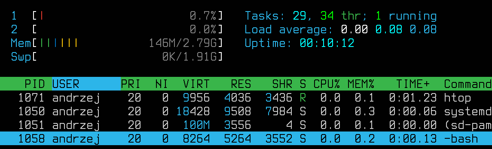
1. tree \> tree.txt i tree -d \> ttreed.txt\~
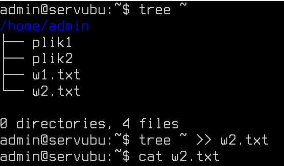
1. mkdir \~/cwiczenia7
1. cp li\*.txt \~/cwiczenia7/
1. cp -i \~/cwiczenia7/li\*.txt .
1. cp ?re\*.\* \~/cwiczenia7/
1. cat \*tr\*.txt \> tree4.txt
lub cat tree.txt \> tree3.txt, cat ttreed.txt \>\> tree3.txt
lub cat tree.txt ttreed.txt \> tree5.txt
1. diff tree3.txt tree4.txt
1. Tworzenie linków symbolicznych ( ln -s /ścieżka/plik nazwa_linku)
1. 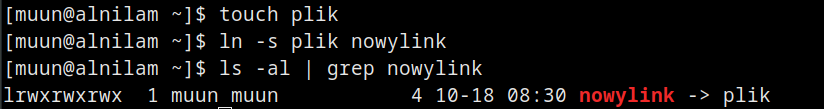
    sudo cp /etc/passwd passwd.kopia
1. cat passwd.kopia \| sort -t : -k3 -nr ( sortowanie po UID user id)
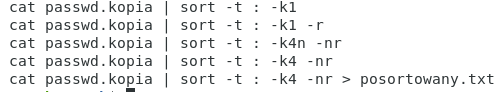
1. alias ( alias dla polecenia du) i usuwanie aliasów: unalias
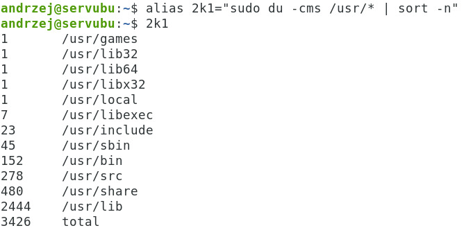
1. Wyświetlenie wszystkich aliasów + kasowanie
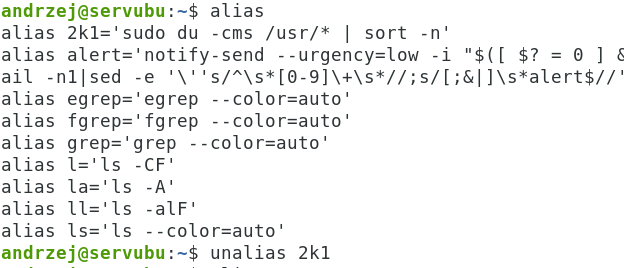
1. export - dodanie zmiennej
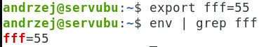
1. unset -- usunięcie zmiennej

1. PS1 + colory
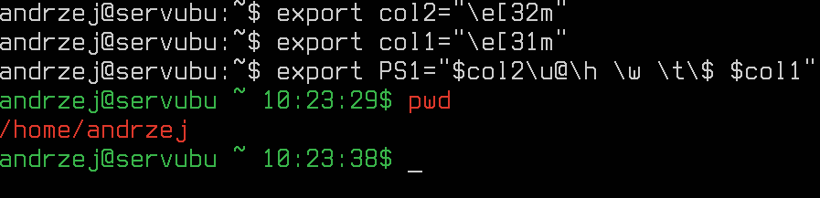
1. FTP + konto (podstawowe polecenia: get, put, mget, mput)
1. Piszemy ftp ftp.icm.edu.pl
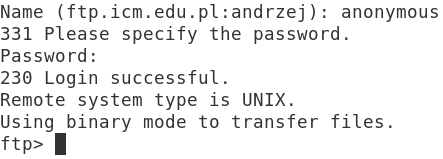
1. *sudo shutdown now* ( na koniec zajęć)
