Ćwiczenia 30 -- instalacja i konfiguracja IIS
1.  Zaloguj się na konto administrator.
2.  Uruchom menedżer serwera i sprawdź w pozycji serwer lokalny czy masz
    skonfigurowane obie karty.
> 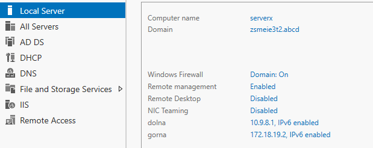
3.  Dodaj role: serwer sieci web (IIS), dodaj w kreatorze instalacji
    konfigurację dla **FTP**.
4.  Sprawdź czy usługa routingu i dostępu zdalnego jest
    nieskonfigurowana, powinno być tak:
> 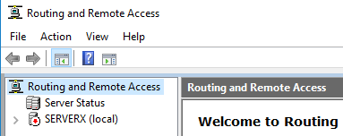
5.  Uruchom przystawkę Menedżer Serwera-\>Narzędzia-\>\'Menedżer
    internetowych usług informacyjnych (IIS)\'.
6.  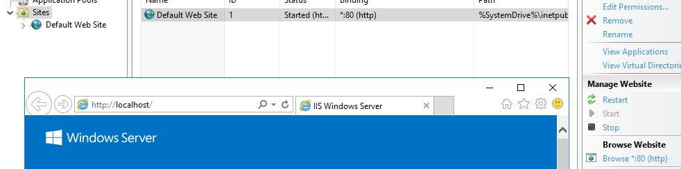
    Sprawdź czy działa główna strona: (
    klikamy po prawej Browse \*:80 (http))
7.  Sprawdź też adres 127.0.0.1
8.  Utwórz swoją **witrynę www** o następujących ustawieniach *(nie
    podawać nazwy hosta*:
    a)  ip: 10.9.8.1, port 80, podkatalog
        [c:\\Inetpub\\](../../../../../../c:/Inetpub/www_twojeimię)*www1_twojeimię)*
    b)  ip: 172.18.19.2, port 8088, podkatalog
        [c:\\Inetpub\\](../../../../../../c:/Inetpub/www_twojeimię)*www2_twojeimię*
    c)  ip: wszystkie nieprzypisane, port 85, podkatalog
        [c:\\ferie\\](../../../../../../c:/Inetpub/www_twojeimię)*www3_twojeimię
        **,** testujemy na wszystkich adresach ip*
    d)  https, ip 10.9.8.1 , port 443 podkatalog
        [c:\\XYZ\\](../../../../../../c:/Inetpub/www_twojeimię)*www4_twojeimię*
> 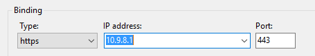
>
> *, gdzie XYZ oznacza kod klasy i grupy, wcześniej wygenerować
> samopodpisany certyfikat: IIS→Serwer→Certyfikaty serwera→Utwórz
> certyfikat z podpisem własnym*
>
> 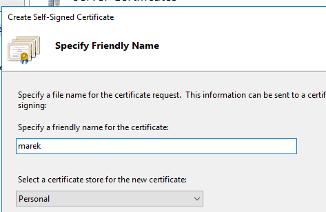
>
> 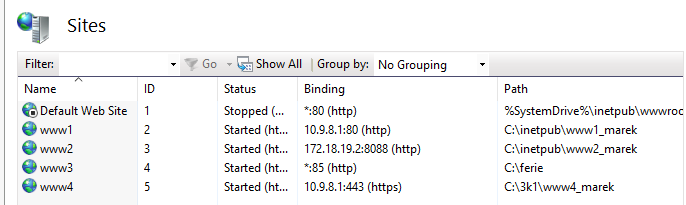
9.  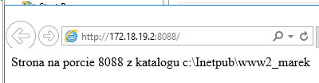
    Uruchom na **serwerze** przeglądarkę i
    sprawdź działanie swoich stron. Pamiętaj o włączaniu, zatrzymywaniu
    i uruchamianiu odpowiedniej witryny, którą chcesz sprawdzić.
> 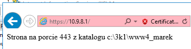
10. Dodaj domyślne nazwy stron zima.html i wiosna.html.
> 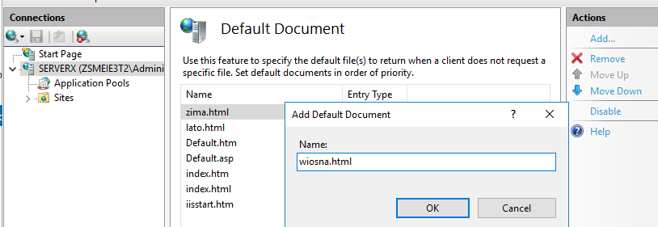
11. Zmień nazwy swoich plików index.html na powyższe, następnie
    przetestuj w przeglądarce.
12. Połącz się ze **stacji** i sprawdź działanie swoich witryn.
13. Sprawdź stan zapory dla połączeń przychodzących, Narzędzia -\> ...
    Tools -\>
> 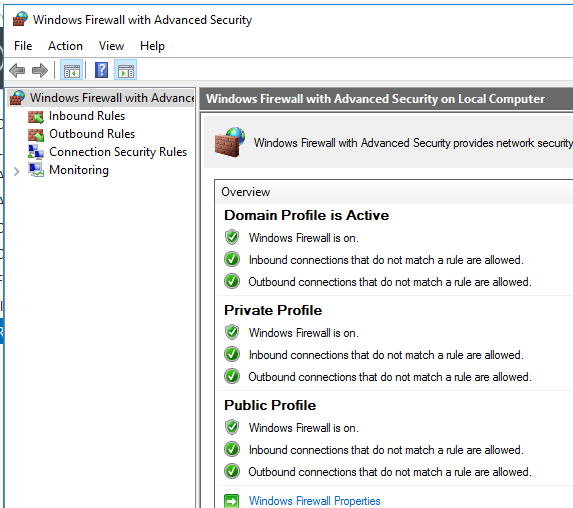
14. W katalogu
    [c:\\Inetpub\\](../../../../../../c:/Inetpub/%20ftp_twojeimię)
    utworzyć swoją witrynę ftp, o następujących ustawieniach:
    a)  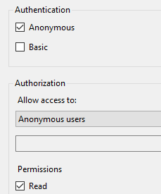
        ip: 10.9.8.1 port 21,
        [c:\\Inetpub\\](ftp://c:/Inetpub/) *ftp1_twojeimię (brak SSL),*
> *logowanie anonimowe tylko do odczytu ( wykonać get)*
>
> 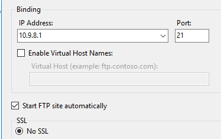
b)  ip: 172.18.19.2 port 23,
    [c:\\Inetpub\\](../../../../../../c:/Inetpub/%20ftp_twojeimię)
    *ftp2_twojeimię (brak SSL),*
> *logowanie anonimowe do odczytu i zapisu ( wykonać put i get)*
c)  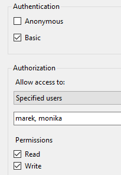
    ip: 10.9.8.1 port 21,
    [c:\\ftp_XYZ\\](../../../../../../c:/Inetpub/%20ftp_twojeimię)*ftp3_twojeimię*,
> gdzie XYZ oznacza kod klasy i grupy
>
> *(brak SSL),*
>
> *logowanie podstawowe na twoje konto z AD,*
>
> *do odczytu i zapisu ( wykonać put i get)*
d)  *ip: 10.9.8.1 port 2125,* [c:\\ftp_XYZ\\](ftp://c:/ftp_XYZ/)
    *ftp4_twojeimię (zezwalaj na SSL, wcześniej wygenerowany
    samopodpisany certyfikat: IIS→Serwer→Certyfikaty serwera→Utwórz
    certyfikat z podpisem własnym),*
> *logowanie podstawowe na twoje konto z AD,*
>
> *tryb do odczytu*
>
> Widok wszystkich witryn ftp:
>
> 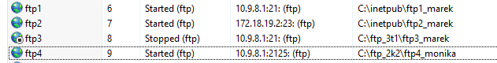
e)  umieść w katalogach witryn po dwa pliki
f)  do wszystkich witryn dodaj bannery ( przywitalny, transparentny i
    końcowy **minimum 20 znaków**)
> 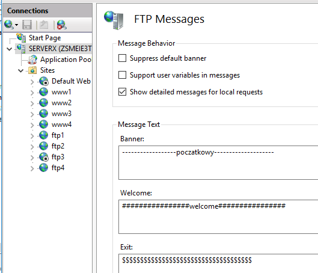
15. Uruchom wiersz poleceń i zaloguj się na serwer ftp na wszystkie
    adresy z serwera
np. cmd, potem wpisać ftp 10.9.8.1
16. 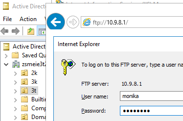
    Sprawdź działanie witryn ftp w
    przeglądarkach.
17. Połącz się ze **stacji** i sprawdź działanie swoich witryn **ftp** w
    przeglądarkach i wierszu poleceń.
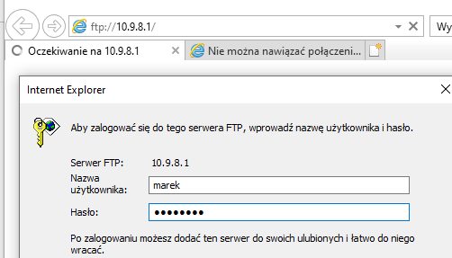
> 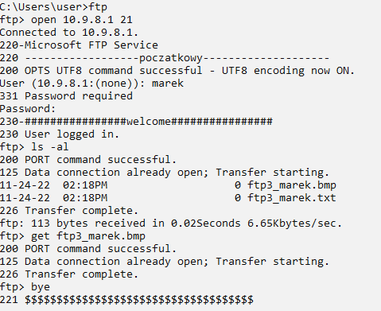
>
> 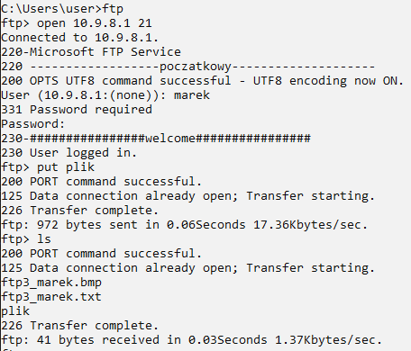
18. Dla wybranych dwóch witryn ftp
    a)  zmodyfikuj „reguły autoryzacji"
    b)  zmodyfikuj „uwierzytelnianie ftp"
19. 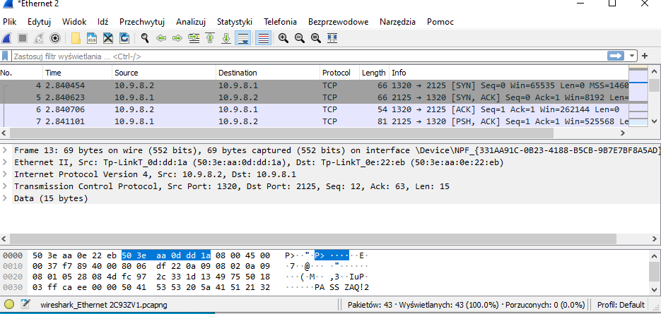
    Na stacji uruchom Wiresharka i
    przechwyć komunikację do twojej witryny www i ftp.
> 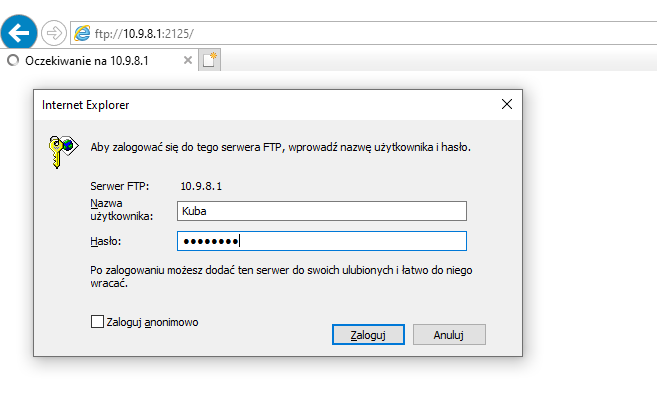
20. Połącz się ze stacji za pomocą VPN, instrukcja na teams. (nie
    podłączamy stacji do domeny!!!)
> 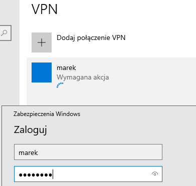
>
> 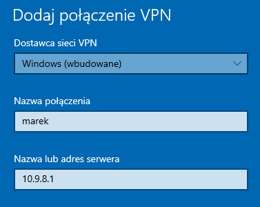
21.
> 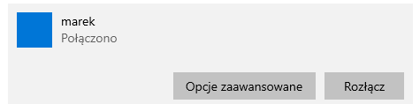
22. W katalogu
    [c:\\Inetpub\\](../../../../../../c:/Inetpub/www_twojeimię) utworzyć
    swoją *witrynę www* o następujących ustawieniach:
    a)  ip: 10.11.12.1 port 8089 dla połączenia VPN, podkatalog
        *www5_vpn_twojeimię*
    b)  ip: 10.11.12.1 port 8099 dla połączenia VPN, podkatalog
        www6_vpn_twojeimię
23. W katalogu
    [c:\\Inetpub\\](../../../../../../c:/Inetpub/%20ftp_twojeimię)
    utworzyć swoją *witrynę ftp* o następujących ustawieniach:
    a)  ip: 10.11.12.1 port 2122 dla połączenia VPN, podkatalog
        ***ftp5_vpn_twojeimię** (brak SSL),*
> *logowanie anonimowe*
>
> *do odczytu i zapisu*
>
> 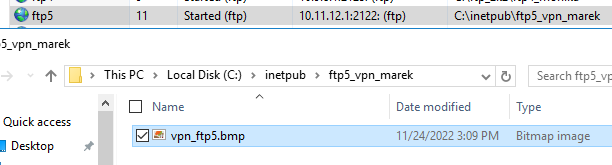
b)  *ip: 10.11.12.1 port 2124 dla połączenia VPN, podkatalog
    **ftp6_vpn_twojeimię** (zezwalaj na SSL),*
> *logowanie podstawowe na twoje konto z AD, tryb do odczytu i zapisu*
c)  *zmodyfikować „reguły autoryzacji" oraz „uwierzytelnianie ftp"*
d)  *do obu witryn dodaj wybrany banner ( przywitalny, transparentny lub
    końcowy **minimum 30 znaków**)*
<!-- -->
24. Połącz się ze stacji za pomocą VPN i sprawdź działanie swoich witryn
    www oraz ftp na oba adresy, jeżeli nie można się połączyć to włączyć
    regułę na firewallu serwera zezwalającą na połączenia.
> 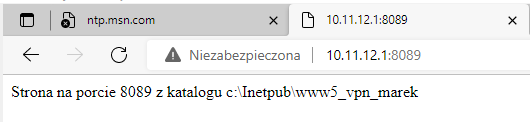
25. Na stacji uruchom Wiresharka i przechwyć komunikację do twojej
    witryny www i ftp.
26. Utwórz połączenie VPN ze stacji ubuntu desktop.
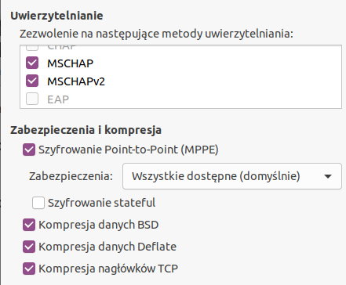
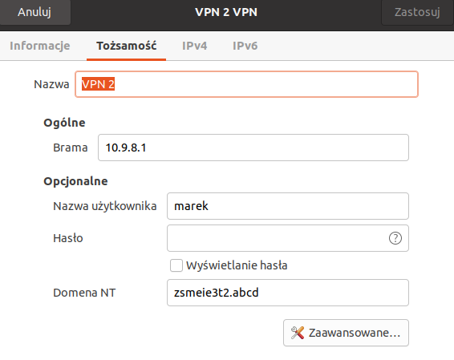
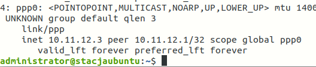
27. Sprawdź działanie swoich witryn www oraz ftp na oba adresy. (Ctrl+l)
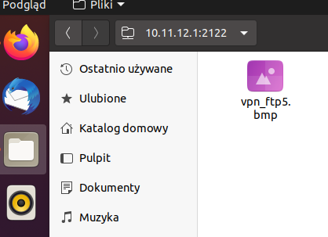
> 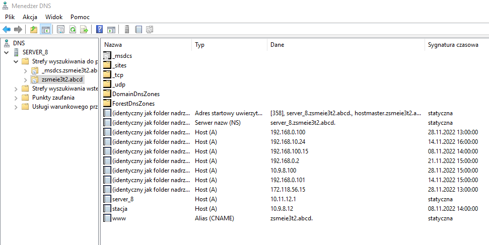
28. Wykonaj dodatkowe zadanie podane przez nauczyciela:
    a)  W DNS dodaj strefę przeszukiwania wstecz, następnie dodaj
        odpowiednie rekordy tak, aby można było odczytaj stronę www
        poprzez adres: [www.zsmeie.abcd](http://www.zsmeie.abcd/)
    b)  przekieruj porty na routerze tak, aby po wpisaniu na stacji
        adresu [http://50.50.50.1:8080](http://50.50.50.1:8080/)
> wyświetliła się strona z serwera 10.9.8.1:80.
>
> Wskazówki:
>
> Ustaw na routerze:
WAN: 50.50.50.1, z maską 24
> 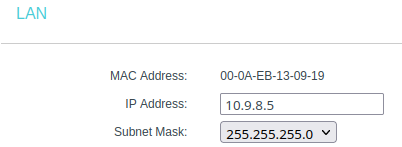
LAN: 10.9.8.5 z maską zgodną z kartą serwera
Na stacji: ip stacji, dolna karta: 50.50.50.2/24 z bramką 50.50.50.1
29. Dodatkowe zadanie.
30. Wyłączyć routing i dostęp zdalny
> 
31. Zresetuj ustawienia zapory na serwerze do ustawień domyślnych.
> 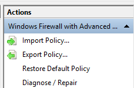
32. KONIEC.
