# Ćwiczenia 30 -- instalacja i konfiguracja IIS

1. Zaloguj się na konto administrator.

1. Uruchom menedżer serwera i sprawdź w pozycji serwer lokalny czy masz
    skonfigurowane obie karty.

   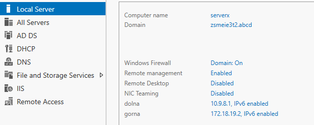

1. Dodaj role:

   serwer sieci web (IIS),

   dodaj w kreatorze instalacji konfigurację dla **FTP**.

1. Sprawdź czy usługa routingu i dostępu zdalnego jest
   nieskonfigurowana, powinno być tak:

   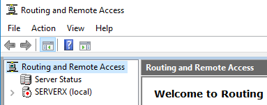

1. Uruchom przystawkę:

   ```text
   Menedżer Serwera->Narzędzia->Menedżer internetowych usług informacyjnych (IIS)
   ```

1. Sprawdź czy działa główna strona: (
   klikamy po prawej Browse \*:80 (http))

   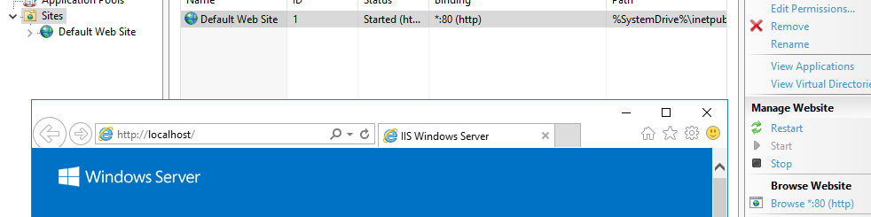

1. Sprawdź też adres 127.0.0.1

1. Utwórz swoją **witrynę www** o następujących ustawieniach *(nie
    podawać nazwy hosta*:

    - ip: 10.9.8.1, port 80, podkatalog
        c:\\Inetpub\\www1_twojeimię
    - ip: 172.18.19.2, port 8088, podkatalog
        c:\\Inetpub\\www2_twojeimię
    - ip: wszystkie nieprzypisane, port 85, podkatalog
        c:\\ferie\\www3_twojeimię
        **,** testujemy na wszystkich adresach ip*
    - https, ip 10.9.8.1 , port 443 podkatalog
        c:\\XYZ\\Inetpub\\www4_twojeimię

   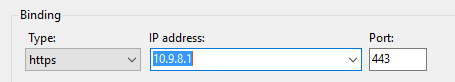

   *, gdzie XYZ oznacza kod klasy i grupy,

   wcześniej wygenerować
   samopodpisany certyfikat:

   ```text
   IIS→Serwer→Certyfikaty serwera→Utwórz

   ```

   certyfikat z podpisem własnym*

   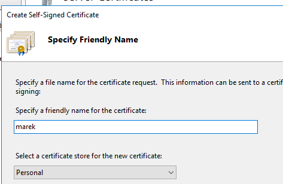

   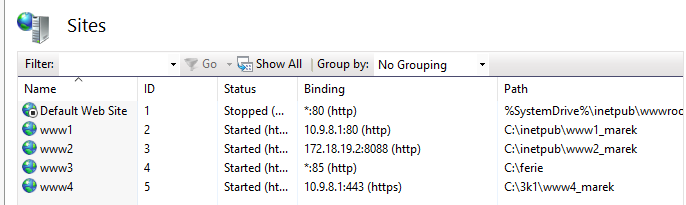

1. Uruchom na **serwerze** przeglądarkę i
   sprawdź działanie swoich stron. Pamiętaj o włączaniu, zatrzymywaniu
   i uruchamianiu odpowiedniej witryny, którą chcesz sprawdzić.

   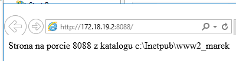

   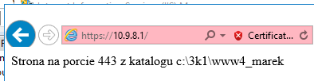

1. Dodaj domyślne nazwy stron zima.html i wiosna.html.

   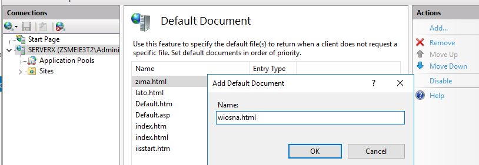

1. Zmień nazwy swoich plików index.html na powyższe, następnie
    przetestuj w przeglądarce.

1. Połącz się ze **stacji** i sprawdź działanie swoich witryn.

1. Sprawdź stan zapory na serwerze dla połączeń przychodzących, Narzędzia -\> ...
    Tools -\>

   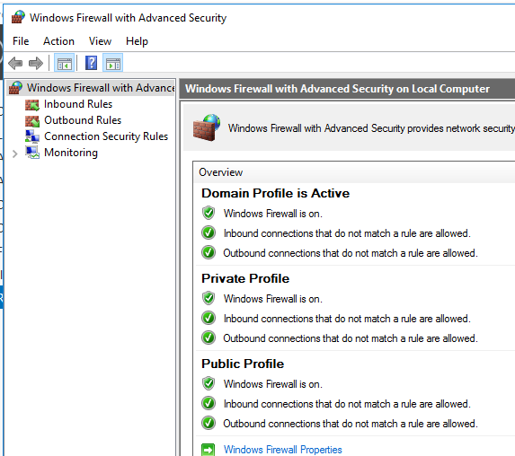

1. W katalogu c:\\Inetpub\\ftp_twojeimię
    utworzyć swoją witrynę ftp, o następujących ustawieniach:

    - ip: 10.9.8.1 port 21,

      c:\\Inetpub\\ftp1_twojeimię (brak SSL),

      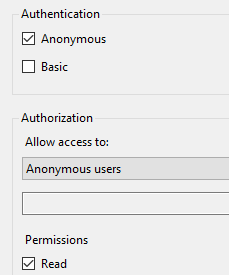

      *logowanie anonimowe tylko do odczytu ( wykonać get)*

      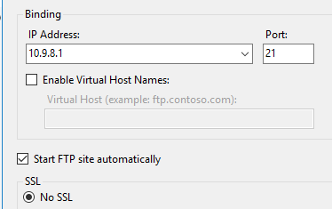

    - ip: 172.18.19.2 port 23,

      c:\\Inetpub\\ftp2_twojeimię (brak SSL),

      logowanie anonimowe do odczytu i zapisu
      wykonać put i get

      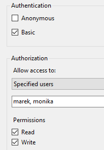

    - ip: 10.9.8.1 port 21,
      [c:\\ftp_XYZ\\](../../../../../../c:/Inetpub/%20ftp_twojeimię)*ftp3_twojeimię*,
      gdzie XYZ oznacza kod klasy i grupy

        *(brak SSL),*

        *logowanie podstawowe na twoje konto z AD,*

        *do odczytu i zapisu ( wykonać put i get)*

    - *ip: 10.9.8.1 port 2125,*
      c:\\ftp_XYZ\\
      *ftp4_twojeimię (zezwalaj na SSL, wcześniej wygenerowany
      samopodpisany certyfikat: IIS→Serwer→Certyfikaty serwera→Utwórz
      certyfikat z podpisem własnym),*

      *logowanie podstawowe na twoje konto z AD,*

       *tryb do odczytu*

       Widok wszystkich witryn ftp:

       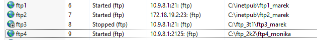

    - umieść w katalogach witryn po dwa pliki
    - do wszystkich witryn dodaj bannery ( przywitalny, transparentny i
      końcowy **minimum 20 znaków**)

      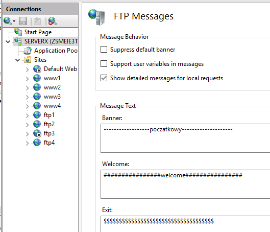

1. Uruchom wiersz poleceń i zaloguj się na serwer ftp na wszystkie
   adresy z serwera, np. cmd, potem wpisać

   ```bash
   ftp 10.9.8.1
   ```

1. Sprawdź działanie witryn ftp w
    przeglądarkach.

    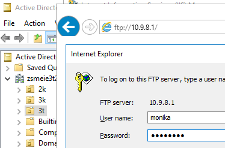

1. Połącz się ze **stacji** i sprawdź działanie swoich witryn **ftp** w
   przeglądarkach i wierszu poleceń.

   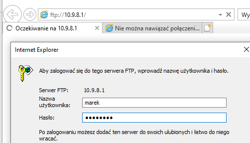

   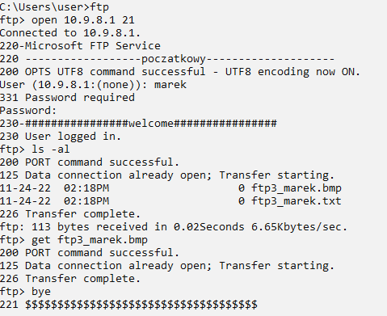

   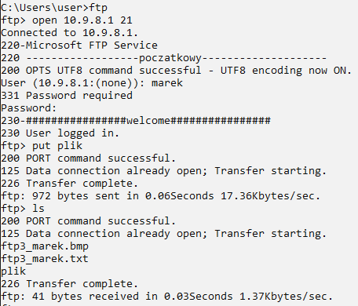

1. Dla wybranych dwóch witryn ftp

   - zmodyfikuj „reguły autoryzacji"
   - zmodyfikuj „uwierzytelnianie ftp"

1. Na stacji uruchom Wiresharka i
   przechwyć komunikację do twojej witryny www i ftp.

    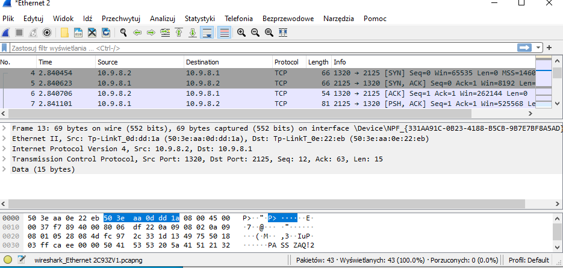

    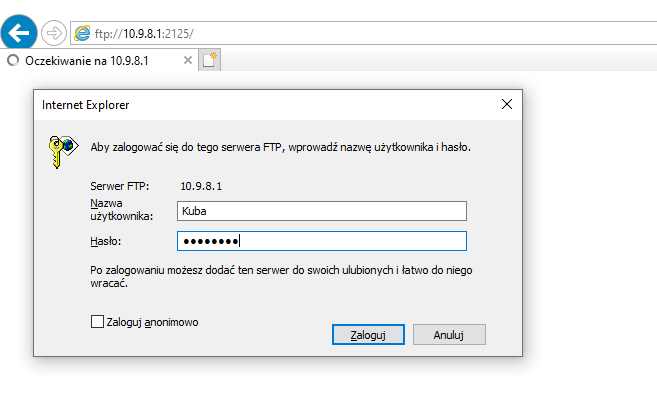

1. Połącz się ze stacji za pomocą VPN, instrukcja na teams. (nie
   podłączamy stacji do domeny!!!)

   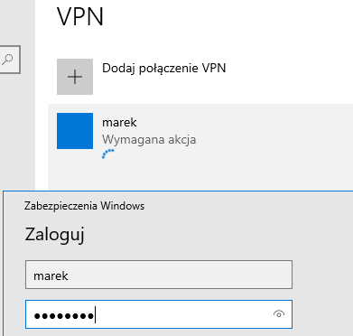

   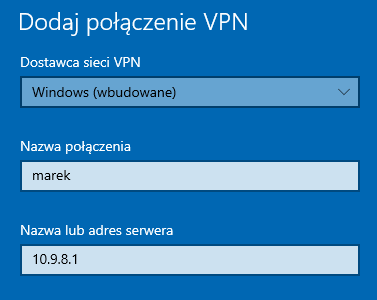

1. Ustanowienie połączenia VPN.

   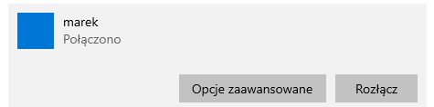

1. W katalogu c:\\Inetpub\\www_twojeimię\ utworzyć
   swoją *witrynę www* o następujących ustawieniach:

   - ip: 10.11.12.1 port 8089 dla połączenia VPN, podkatalog
     *www5_vpn_twojeimię*
   - ip: 10.11.12.1 port 8099 dla połączenia VPN, podkatalog
        www6_vpn_twojeimię

1. W katalogu c:\\Inetpub\\ftp_twojeimię
   utworzyć swoją *witrynę ftp* o następujących ustawieniach:

   - ip: 10.11.12.1 port 2122 dla połączenia VPN, podkatalog
     ***ftp5_vpn_twojeimię** (brak SSL),*

     *logowanie anonimowe*

     *do odczytu i zapisu*

     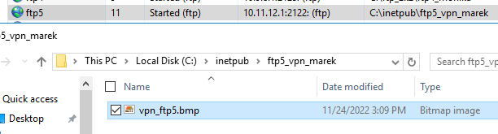

   - *ip: 10.11.12.1 port 2124 dla połączenia VPN,
     podkatalog **ftp6_vpn_twojeimię** (zezwalaj na SSL),*
     *logowanie podstawowe na twoje konto z AD,
     tryb do odczytu i zapisu*

   - *zmodyfikować „reguły autoryzacji" oraz „uwierzytelnianie ftp"*

   - *do obu witryn dodaj wybrany banner ( przywitalny, transparentny lub
    końcowy **minimum 30 znaków**)*

1. Połącz się ze stacji za pomocą VPN i sprawdź działanie swoich witryn
    www oraz ftp na oba adresy, jeżeli nie można się połączyć to włączyć
    regułę na firewallu serwera zezwalającą na połączenia.

   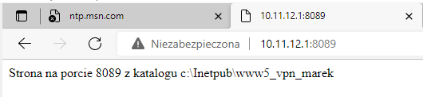

1. Na stacji uruchom Wiresharka i przechwyć komunikację do twojej
   witryny www i ftp.

1. Utwórz połączenie VPN ze stacji ubuntu desktop.

   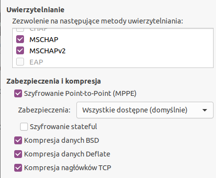

   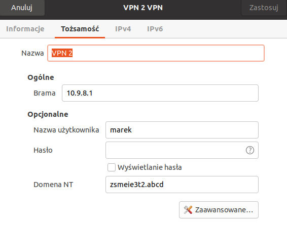

   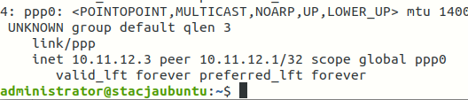

1. Sprawdź działanie swoich witryn www oraz ftp na oba adresy. (Ctrl+l)

   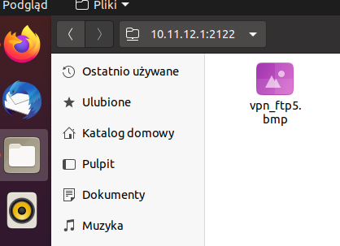

   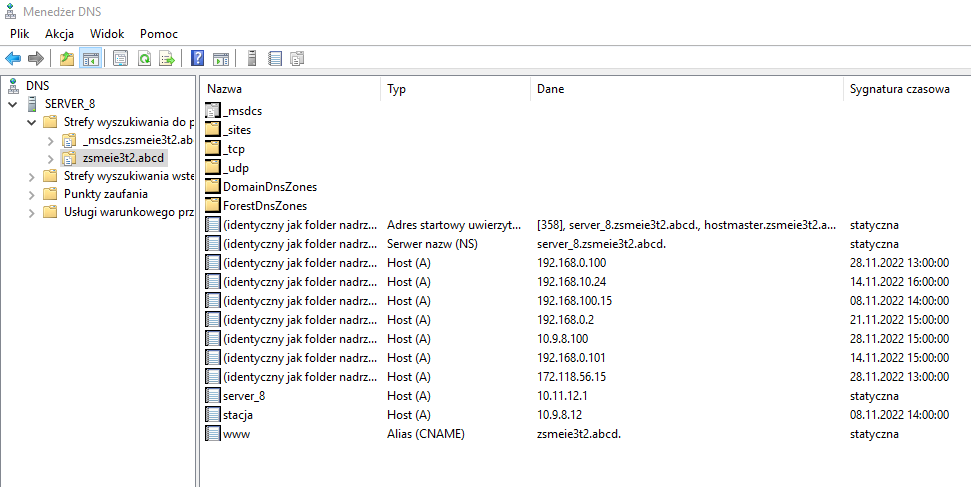

1. Wykonaj dodatkowe zadanie podane przez nauczyciela:

   - W DNS dodaj strefę przeszukiwania wstecz, następnie dodaj
     odpowiednie rekordy tak, aby można było odczytaj stronę www
     poprzez adres: [www.zsmeie.abcd](http://www.zsmeie.abcd/)

   - przekieruj porty na routerze tak, aby po wpisaniu na stacji
     adresu [http://50.50.50.1:8080](http://50.50.50.1:8080/)

     wyświetliła się strona z serwera 10.9.8.1:80.

     Wskazówki:

     Ustaw na routerze:

     WAN: 50.50.50.1, z maską 24

     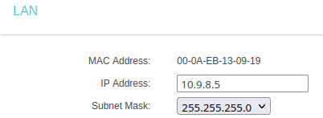

     LAN: 10.9.8.5 z maską zgodną z kartą serwera

     Na stacji: ip stacji, dolna karta: 50.50.50.2/24 z bramką 50.50.50.1

1. Dodatkowe zadanie.

1. Wyłączyć routing i dostęp zdalny

   

1. Zresetuj ustawienia zapory na serwerze do ustawień domyślnych.

   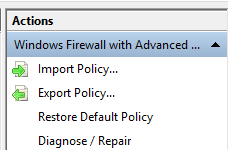

1. KONIEC.🔚
