# 🧩 Konfiguracja VPN  

**Windows 11 ↔ Windows Server 2022 (RRAS)**

---

## 📌 Cel

Celem ćwiczenia jest skonfigurowanie serwera VPN na systemie **Windows Server** oraz połączenia klienckiego na **Windows** z wykorzystaniem usługi **RRAS (Routing and Remote Access)**.

---

# 🖥️ 1. Instalacja roli VPN na serwerze

## 🔧 Dodawanie roli

1. Otwórz **Server Manager**
2. Wybierz:
   - `Manage` → `Add Roles and Features`
3. Tryb:
   - `Role-based or feature-based installation`
4. Wybierz serwer docelowy
5. Zaznacz rolę:
   - ✅ **Remote Access**

   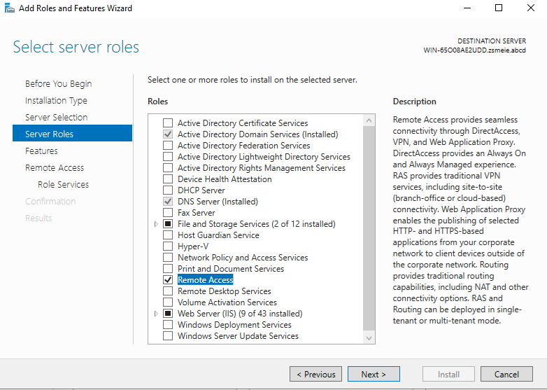

6. W sekcji usług roli zaznacz:
   - ✅ **DirectAccess and VPN (RAS)**

   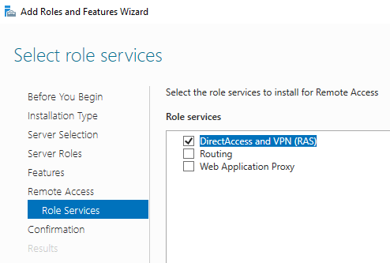

---

# ⚙️ 2. Konfiguracja RRAS

## 🚀 Uruchomienie kreatora

1. Otwórz:
   - `Tools` → **Routing and Remote Access**
2. Kliknij prawym przyciskiem na nazwie serwera:
   - `Configure and Enable Routing and Remote Access`

   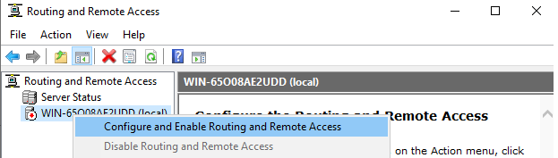

---

## 🧭 Wybór konfiguracji

1. Wybierz:
   - 🔘 **Remote access (dial-up or VPN)**

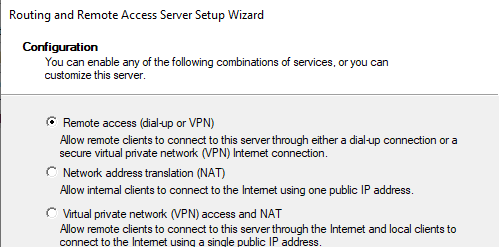

---

## 🌐 Wybór typu dostępu

1. Zaznacz:
   - ✅ **VPN**

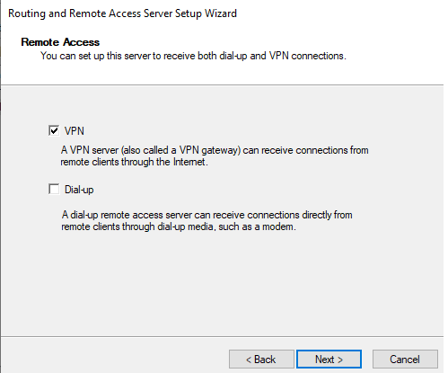

---

## 🌍 Konfiguracja interfejsu sieciowego

1. Wybierz interfejs podłączony do sieci (np. Internet / LAN)

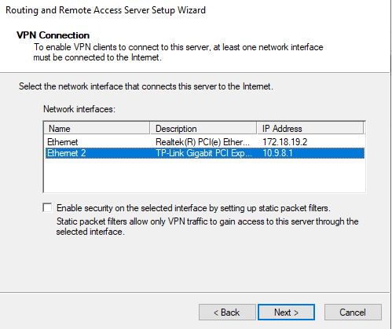

---

## 📡 Konfiguracja adresacji IP

1. Wybierz:
   - 🔘 `From a specified range of addresses`

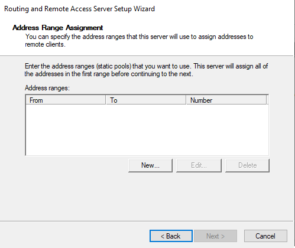

---

## 📊 Zakres adresów

- Start IP: `10.11.12.1`
- End IP: `10.11.12.5`

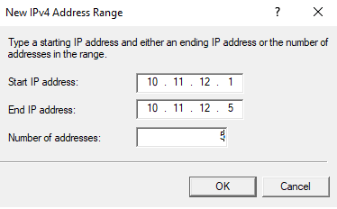

---

## 🔐 Uwierzytelnianie

1. Wybierz:
   - 🔘 `No, use Routing and Remote Access to authenticate connection requests`

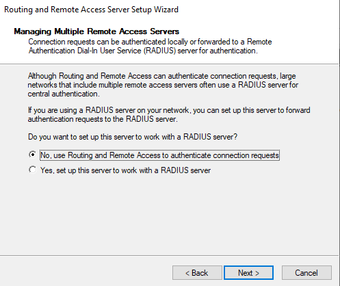

---

## ▶️ Zakończenie

1. Kliknij `OK`
2. Usługa RRAS zostanie uruchomiona

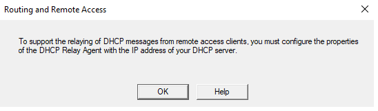

---

# 👤 4. Konfiguracja użytkownika (Active Directory)

## 🔐 Konto VPN

1. Otwórz:
   - **Active Directory Users and Computers**
2. Wybierz użytkownika:
   - `Marek`
3. Zakładka:
   - **Dial-in**
4. Ustaw:
   - ✅ **Allow access**

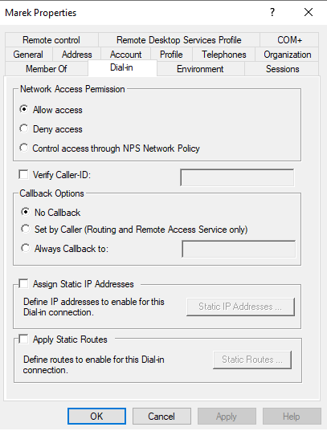

---

# 💻 5. Konfiguracja klienta VPN na Windows

## ➕ Dodanie połączenia VPN

1. Otwórz:
   - `Settings` → `Network & Internet` → `VPN`
2. Kliknij:
   - `Add VPN`

## 📋 Ustawienia

- Provider: `Windows (built-in)`
- Connection name: `VPN`
- Server name/IP: `<IP_SERWERA>`
- VPN type: `Automatic` / `PPTP` / `L2TP`
- Username: `Marek`
- Password: `<hasło>`

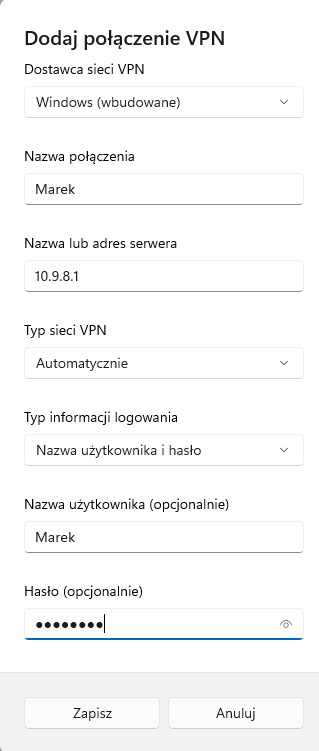

---

## 🔌 Połączenie

1. Kliknij `Connect`


---

# 🧪 6. Weryfikacja połączenia

## 📟 Stacja Windows

```bash
ipconfig /all 
```

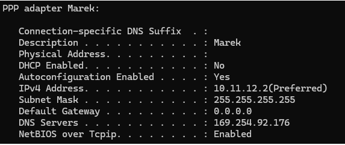

## Serwer Windows

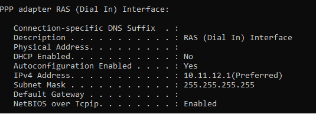

# KONIEC 🔚
