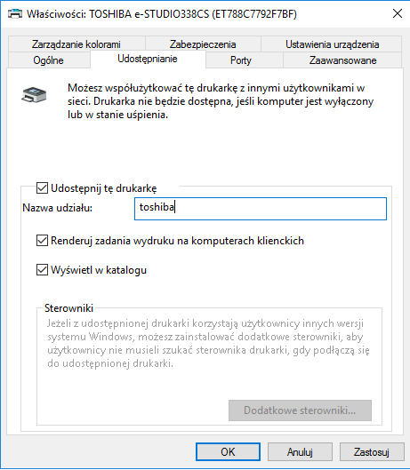
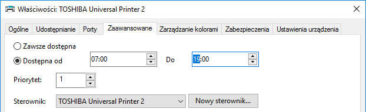
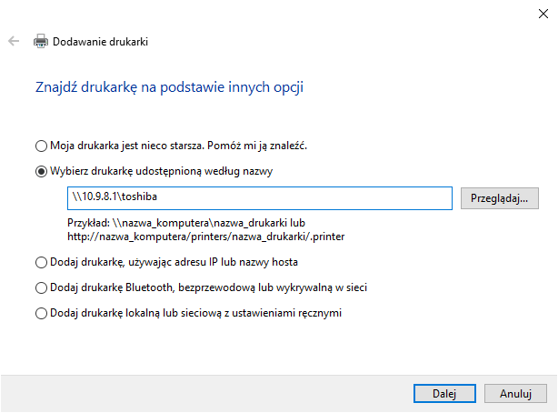

Ćwiczenia 31 -- instalacja usługi drukowania, udostępnianie drukarki
Uwaga: W virtualbox dodaj na serwerze kartę mostkową
1.  Zaloguj się na swoje konto administrator.
2.  Wyłącz konfigurację w przystawce Routing i dostęp zdalny.
3.  Usuń role: IIS oraz usługę drukowania.
4.  Obniż poziom kontrolera domeny.
5.  Skonfiguruj AD dla domeny: klasa.3xy
6.  Uruchom menedżer serwera i dodaj role: usługi drukowania i
    zarządzania dokumentami.
7.  W kreatorze dodaj pozycję: serwer wydruku.
8.  Po instalacji usługi, zaloguj się na stacji i ściągnij sterownik dla
    drukarki:
    **Kyocera FS - 1320D**
    **TOSHIBA e-STUDIO338CS**.
9.  Na serwerze przygotować witrynę ftp dla konta z AD w katalogu
    c:\\ftp_twoje_imię.
10. Rozpakować sterowniki, a następnie spakować do pliku exe i przesłać
    na serwer poprzez ftp.
11. Odłącz stację od internetu. ( wypnij kabel)
12. Dodaj stację do domeny.
13. Na serwerze: ustawiamy kartę sieciową górną na dhcp (**zapamiętaj
    jej konfigurację, zrób zdjęcie**)
14. Na serwerze otworzyć przystawkę:
**Zarządzanie drukowaniem** i dodać drukarkę z jej poziomu.
*Serwer wydruku → nazwa serwera → drukarki* ( prawy przycisk myszy dodaj
drukarkę)
15. W kreatorze wybierz pozycję:

dodaj drukarkę TCP/IP,
w drugim kroku podaj ip drukarki, dalej,
typ urządzenia: standardowy, dalej,
Zainstaluj nowy sterownik, dalej,
przycisk z dysku i wskazać sterownik.
**Nie drukować strony testowej z serwera!!!**

16. Udostępnij drukarkę oraz zaznacz pozycję pokaż w katalogu.
> 
17. Ustaw dostępność drukarki na 2 godziny(czas ćwiczeń), np. **od 7:00
    do 19:00**
> 
18. Na stacji dodaj drukarkę: w pozycji: znajdź drukarkę w katalogu na
    podstawie lokalizacji lub funkcji.
> 
19. Po instalacji wydrukuj stronę testową ze stacji!!!
> 
20. W podanej kolejności:
    a)  usuń drukarkę ze stacji
    b)  usuń drukarkę z serwera
    c)  usuń rolę Usługi drukowania i zarządzania dokumentami
    d)  usuń sterowniki drukarki z serwera i stacji
    e)  usuń witrynę ftp oraz jej katalog
21. Druga osoba realizuje ćwiczenia.
22. Na serwerze przywrócić ustawienia górnej karty sieciowej.
