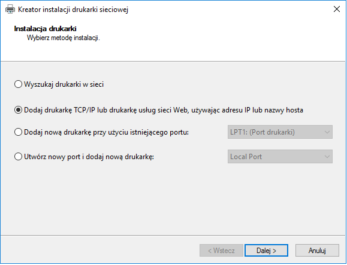
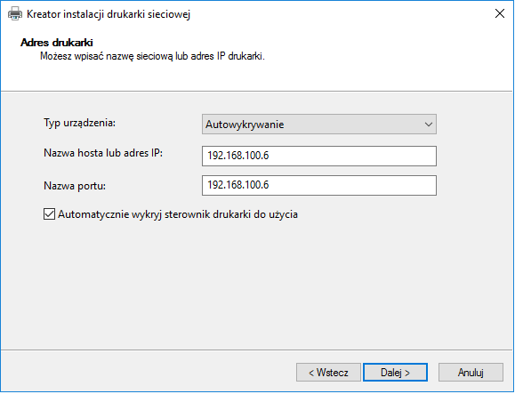
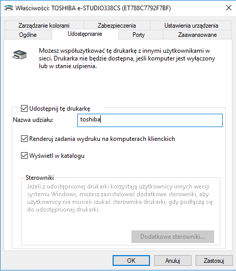
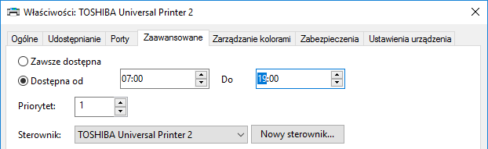
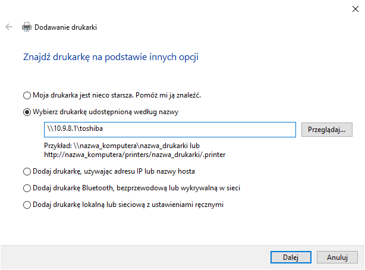
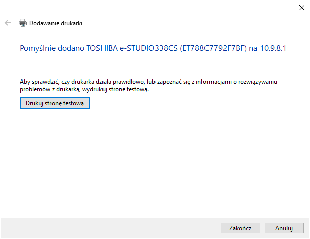

# Ćwiczenia 31 -- instalacja usługi drukowania, udostępnianie drukarki

💡Uwaga: W virtualbox dodaj na serwerze kartę mostkową

1. Zaloguj się na swoje konto administrator.

1. Wyłącz konfigurację w przystawce Routing i dostęp zdalny.

1. Usuń role: IIS oraz usługę drukowania.

1. Obniż poziom kontrolera domeny.

1. Skonfiguruj AD dla domeny: klasa.3xy

1. Uruchom menedżer serwera i dodaj role: usługi drukowania i
    zarządzania dokumentami.

1. W kreatorze dodaj pozycję: serwer wydruku.

1. Po instalacji usługi, zaloguj się na stacji i ściągnij sterownik dla
    drukarki:

    **Kyocera Ecosys PA4000x**

    **TOSHIBA e-STUDIO338CS**.

1. Na serwerze przygotować witrynę ftp dla konta z AD w katalogu

    `c:\ftp_twoje_imię`

1. Rozpakować sterowniki, a następnie spakować do pliku exe i przesłać
    na serwer poprzez ftp.

1. Odłącz stację od internetu. ( wypnij kabel)

1. Dodaj stację do domeny.

1. Na serwerze: ustawiamy kartę sieciową górną na dhcp (**zapamiętaj
    jej konfigurację, zrób zdjęcie**)

1. Na serwerze otworzyć przystawkę:

   **Zarządzanie drukowaniem** i dodać drukarkę z jej poziomu.

   ```text
   *Serwer wydruku → nazwa serwera → drukarki* ( prawy przycisk myszy dodaj
   drukarkę)
   ```

1. W kreatorze wybierz pozycję:

   

    dodaj drukarkę TCP/IP,
    w drugim kroku podaj ip drukarki, dalej,
    typ urządzenia: standardowy, dalej,
    Zainstaluj nowy sterownik, dalej,
    przycisk z dysku i wskazać sterownik.
    **Nie drukować strony testowej z serwera!!!**

   

1. Udostępnij drukarkę oraz zaznacz pozycję pokaż w katalogu.

   

1. Ustaw dostępność drukarki na 2 godziny (czas ćwiczeń), np. **od 7:00
    do 19:00**

   

1. Na stacji dodaj drukarkę: w pozycji: znajdź drukarkę w katalogu na
    podstawie lokalizacji lub funkcji.

   

1. Po instalacji wydrukuj stronę testową ze stacji!!!

   

1. W podanej kolejności:

    - usuń drukarkę ze stacji
    - usuń drukarkę z serwera
    - usuń rolę Usługi drukowania i zarządzania dokumentami
    - usuń sterowniki drukarki z serwera i stacji
    - usuń witrynę ftp oraz jej katalog

1. Druga osoba realizuje ćwiczenia.

1. Na serwerze przywrócić ustawienia górnej karty sieciowej.

1. KONIEC.🔚
