Ćwiczenia 32 -- Quota dyskowa
1.  Zaloguj się na swoje konto administrator.
2.  Uruchom menedżer serwera i dodaj role. Dodaj pozycję dla: menadżer
    zasobów serwera plików.
> 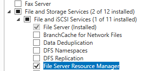
3.  Po instalacji uruchomić przystawkę: Narzędzia administracyjne →
    *Menadżer zasobów serwera plików(Tools-\>File Server Resource
    Manager)*
> 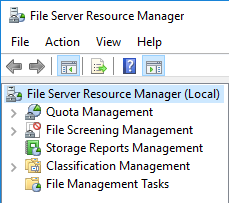
4.  Utworzyć nowe konto o nazwie **twoje_imię_quota** dla którego należy
    ustawić folder macierzysty (ścieżka
> UNC) na udostępniony, ukryty zasób sieciowy
> [c:\\przydziały_dyskowe](../../../../../E:/c:/przydziały_dyskowe) oraz
> zamapować pod literę dysku Q.
>
> 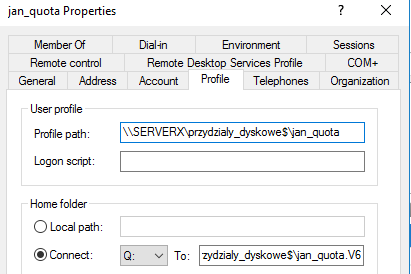
5.  Zalogować się na konto **twoje_imię_quota** i sprawdzić poprawność
    zamapowania dysku.
> 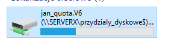
6.  Utwórz drugie konto tak jak w punktach poprzednich.
7.  Najpierw utwórz swój szablon np. 3k
> 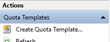
8.  W przystawcę *Menadżer zasobów serwera plików,* z lewej strony
    wybrać:
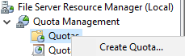
 Zarządzanie przydziałami→ Przydziały.
Następnie wybrać akcję: Utwórz przydział.
9.  Ścieżkę przydziału ustaw na katalog użytkownika z profilami czyli
    [c:\\przydziały_dyskowe](../../../../../E:/c:/przydziały_dyskowe)\\.
> Najpierw utwórz swój szablon np. 3k
>
> Zaznacz: Automatycznie zastosuj szablon i utwórz przydziały dla
> istniejących i nowych podfolderów. Ustaw:
a)  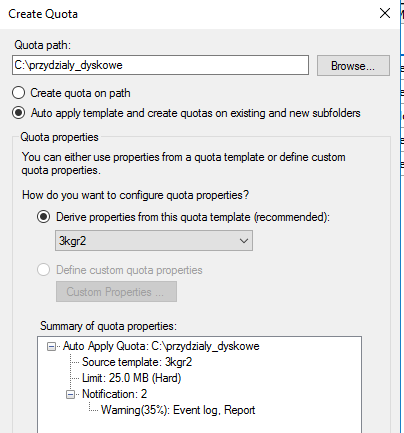
    limit na 25MB
b)  sztywny
c)  próg ostrzeżeń na 35%
d)  wyślij ostrzeżenie do dziennika zdarzeń
e)  generuj raporty: duże pliki, pliki według właściciela, użycie
    przydziału
f)  wyślij raport do użytkownika, który przekroczył próg
<!-- -->
10. Odśwież widok przydziałów w przystawce na serwerze.
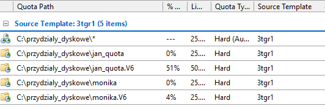
11. Będąc zalogowanym na koncie twoje_imię_quota
> 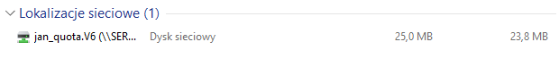
>
> spowoduj pojawienie się komunikatu o ostrzeżeniu.
>
> 
12. Sprawdź dzienniki zdarzeń.
> 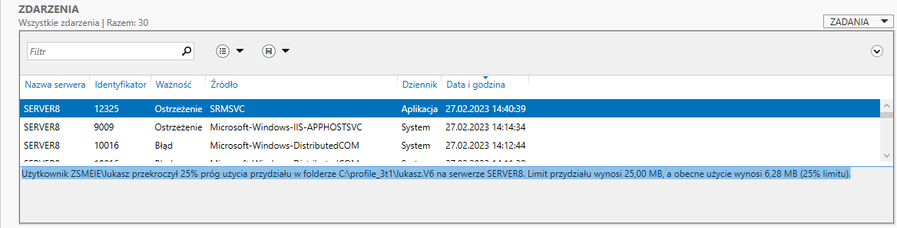
13. Będąc zalogowanym na koncie twoje_imię_quota spowoduj pojawienie się
    komunikatu o przekroczeniu limitu przydziału dysku.
14. Sprawdź dzienniki zdarzeń oraz raporty.
> 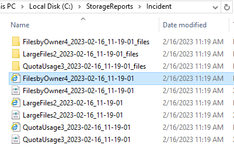
15. Sprawdź czy utworzyły się raporty
    %systemdrive%\\StorageReports\\Incident. Przejrzyj je.
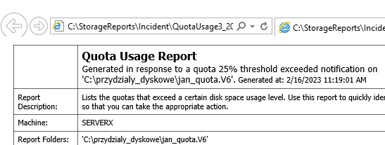
16. Dla pierwszego konta zmień przydział na 50MB, a drugiego próg
    ostrzeżeń na 60%.
> 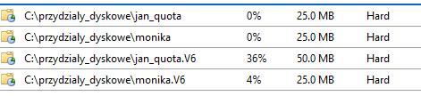
17. Powtórz poprzednie punkty, ale dla **przydziału elastycznego**,
    zmień próg ostrzeżeń na 75%.
18. Napisz skrypt, który wyświetli aktualne przydziały w systemie.
19. Napisz skrypt i sprawdź jego działanie, który ustawi limit na 100MB
    dla wybranego konta.
