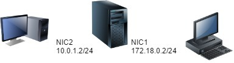
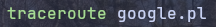
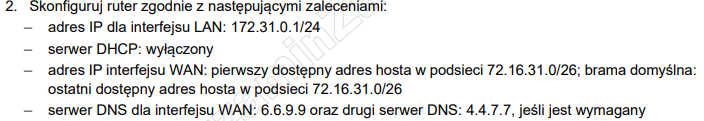
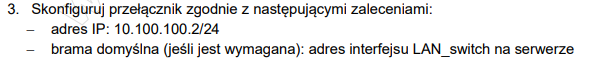
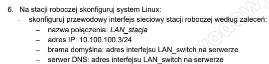
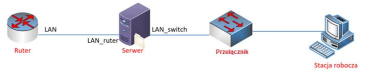
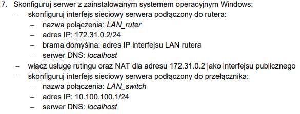
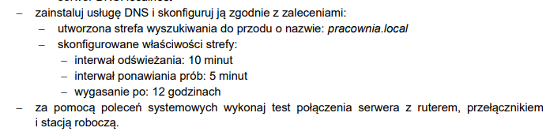

# Ćwiczenia 34 -- Routing i dostęp zdalny



1. Zaloguj się na swoje konto administrator.

1. Skonfiguruj serwer do roli routera.
   - Pierwszy interfejs o nazwie NIC1: ( dla sieci publicznej)
      - ip: 172.18.0.2
      - maska: 255.255.255.0
      - bramka: 172.18.0.1
      - DNS1: 8.8.8.8, DNS2: 8.8.4.4
    - Drugi interfejs o nazwie NIC2: ( dla sieci lokalnej )

      - ip: 10.0.1.2
      - maska: 255.255.255.0
      - bramka: brak
      - DNS1: brak

1. Zainstaluj rolę DHCP:

    - dla podsieci 10.0.1.0/24 z zakresu 10.0.1.11- 10.0.1.29
    - adres domeny nadrzędnej zsmeie.local
    - przydziel bramkę
    - przydziel DNS

1. Zainstaluj rolę: `Usługi zasad i dostępu sieciowego`, zaznaczyć: Usługi

        routing i dostępu zdalnego

    - uruchom kreator: `Konfiguruj i włącz routing i dostęp zdalny`,
    - translator adresów sieciowych
    - wybierz interfejs publiczny

1. Stację po lewej stronie serwera podłącz do interfejsu serwera
    odpowiadającego za sieć lokalną.
1. Na stacji ( lewej ) sprawdź czy nowe ustawienia sieci zostały pobrane z DHCP, jeśli nie to wyłącz i włącz kartę.

1. Wykonaj ping do bramki. Wykonaj screena.

   ```bash
   ping 10.0.1.2 
   ```

1. Wykonaj ping do drugiej karty serwera. Wykonaj screena.

   ```bash
   ping 172.18.0.2 
   ```

1. Na drugiej stacji ( po prawej stronie serwera ) wpisz adres z maską i bramką.

1. Następnie wykonaj ping do bramki, drugiej karty serwera oraz drugiej stacji.

1. Dodaj zakres 2 na serwerze DHCP dla stacji po prawej stronie serwera.

1. Sprawdź pingi z obu stacji.

1. Sprawdzić połączenie z użyciem tracert.

1. Zrealizuj powyższe ćwiczenie na linux.




---

## Zadanie egzaminacyjne

### zadanie 1 2024r. styczeń









