Ćwiczenia 35 -- kopie zapasowe - windows server 2019 Standard
1.  Zaloguj się na swoje konto administrator.
2.  Uruchom menedżer serwera → Zarządzaj -\> dodaj role, funkcje.
3.  W kreatorze w pozycji funkcje zaznacz: **kopia zapasowa systemu
    windows server**
> 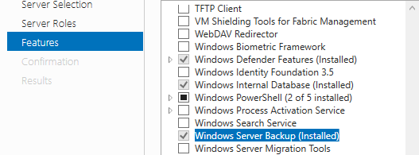
4.  Utworzyć profil mobilny w jednostce organizacyjnej o nazwie
    **kopie**.
> 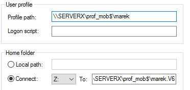
5.  Zalogować się na to konto na stacji.
6.  Na stacji utworzyć katalog „archiwum" i udostępnić go.
> 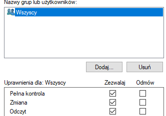
7.  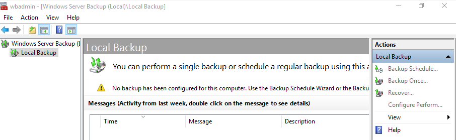
    Na serwerze: Narzędzia -\> Kopia zapasowa systemu
    Windows Server -\> jednorazowa kopia zapasowa (prawa strona akcje)
8.  Inne opcje-\> dalej -\> niestandardowa -\> dalej -\> dodaj elementy
    -\> wybrać jeden lub dwa niewielkie katalogi -\> dalej -\> zdalny
    folder udostępniony -\> podać lokalizacje
    [\\\\nazwa](../../../../../../../%5C%5Cnazwa)
    \_lub_ip_stacji\\nazwa_udziału → dalej → Kopia zapasowa
> 
>
> 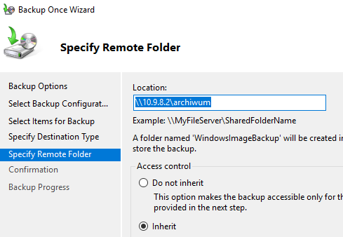
>
> 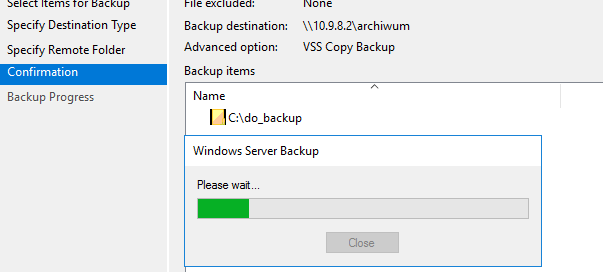
9.  Zweryfikuj na serwerze poprawność wykonania kopii:
> 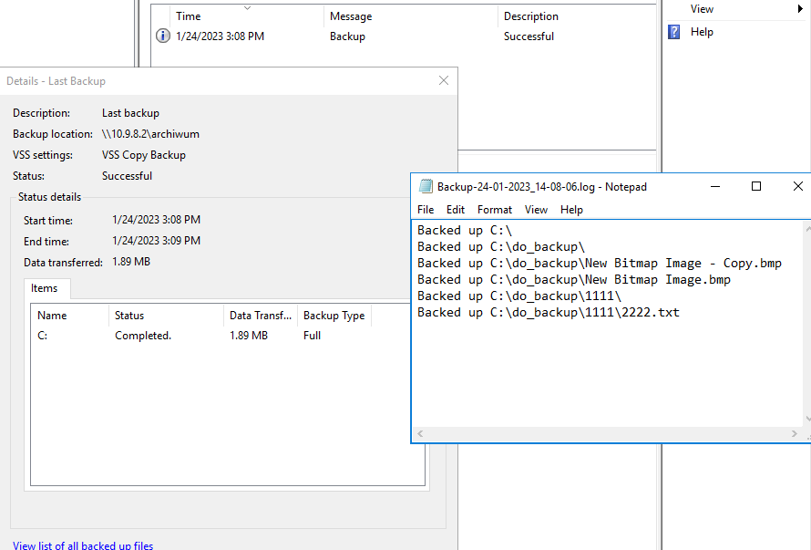
10. Zapisz plik z listą zarchiwizowanych katalogów i plików na pulpicie.
11. Zweryfikuj na stacji poprawność wykonanej kopii. Powinien powstać
    katalog WindowsImageBackup z podkatalogami. ( około 100MB)
> 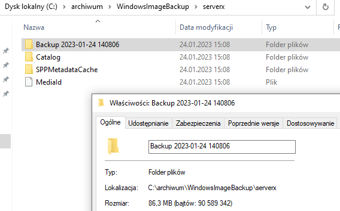
12. Spróbuj odtworzyć zawartość kopii.
> 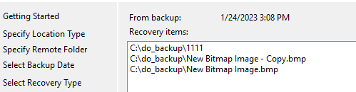
>
> 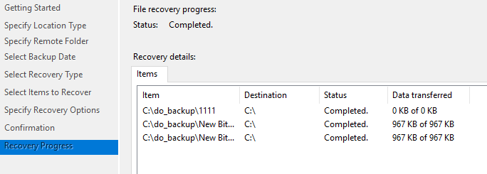
13. Przygotuj powyższą kopię według harmonogramu 1:00 i 11:00 godz. (
    dobierz godzinę ćwiczeń)
> 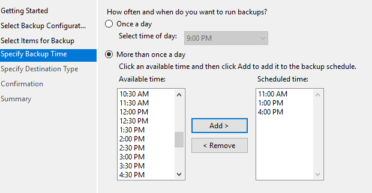
>
> 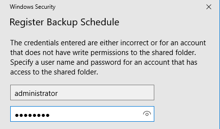
>
> 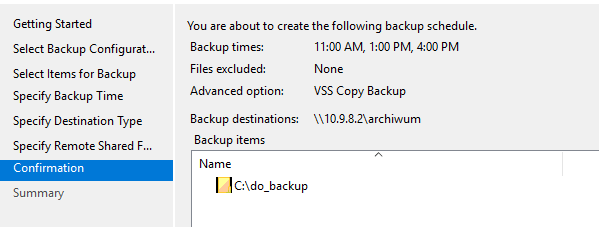
>
> 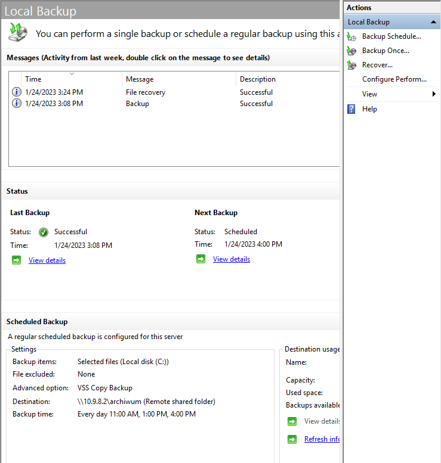
14. Sprawdzenie wykonania kopii za pomocą harmonogramu.
> 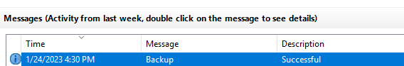
>
> 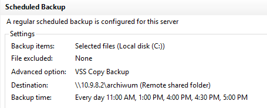
15. Wykonaj sprawdzenie kopii stanu systemu. (**kilka giga nie
    wykonujemy!!!**)
> 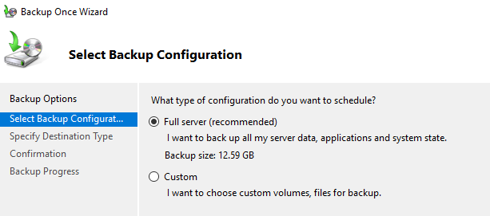
>
> 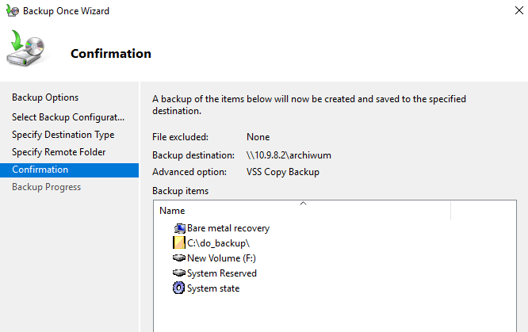
16. Wykonaj kopię z wykluczeniem wszystkich plików z rozszerzeniem txt.
17. KONIEC.
