# Ćwiczenia 35 -- kopie zapasowe - windows server 2019 Standard

1. Zaloguj się na swoje konto administrator.

1. Uruchom menedżer serwera → Zarządzaj -\> dodaj role, funkcje.

1. W kreatorze w pozycji funkcje zaznacz: **kopia zapasowa systemu
    windows server**

   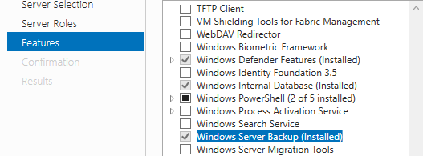

1. Utworzyć profil mobilny w jednostce organizacyjnej o nazwie
    **kopie**.

   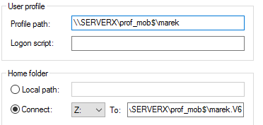

1. Zalogować się na to konto na stacji.
1. Na stacji utworzyć katalog „archiwum" i udostępnić go.

   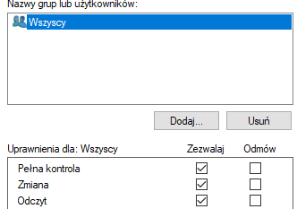

1. Na serwerze: Narzędzia -\> Kopia zapasowa systemu
    Windows Server -\> jednorazowa kopia zapasowa (prawa strona akcje)

   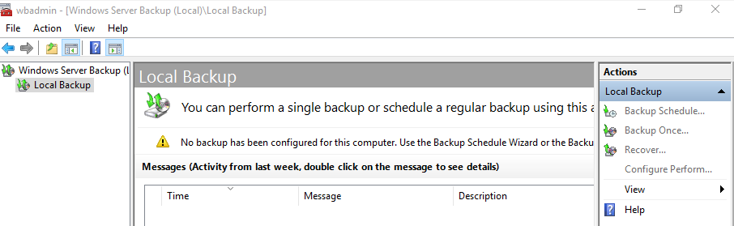

1. Inne opcje-\> dalej -\> niestandardowa -\> dalej -\> dodaj elementy
    -\> wybrać jeden lub dwa niewielkie katalogi -\> dalej -\> zdalny
    folder udostępniony -\> podać lokalizacje
    [\\\\nazwa](../../../../../../../%5C%5Cnazwa)
    \_lub_ip_stacji\\nazwa_udziału → dalej → Kopia zapasowa

   

   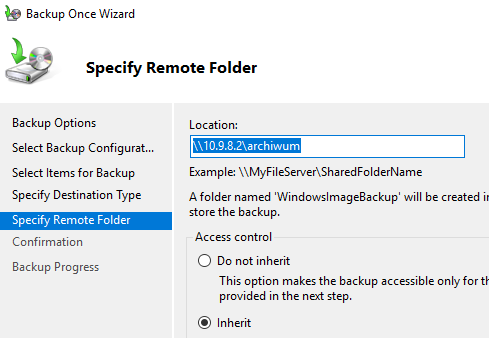

   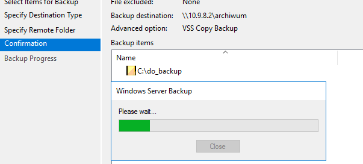

1. Zweryfikuj na serwerze poprawność wykonania kopii:

   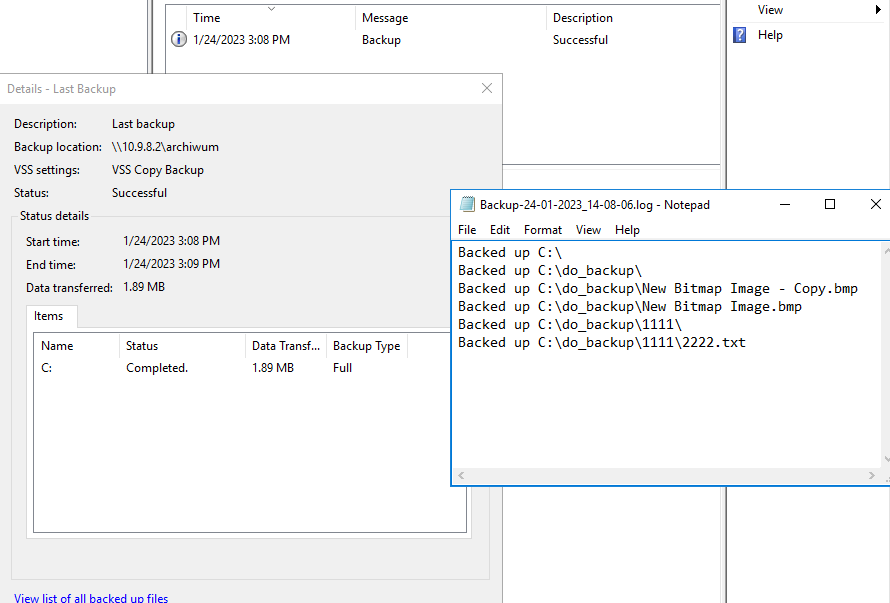

1. Zapisz plik z listą zarchiwizowanych katalogów i plików na pulpicie.
1. Zweryfikuj na stacji poprawność wykonanej kopii. Powinien powstać
    katalog WindowsImageBackup z podkatalogami. ( około 100MB)

   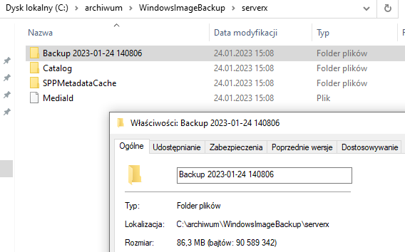

1. Spróbuj odtworzyć zawartość kopii.

   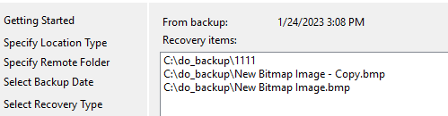

   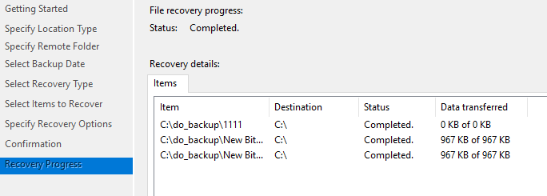

1. Przygotuj powyższą kopię według harmonogramu 1:00 i 11:00 godz. (
    dobierz godzinę ćwiczeń)

   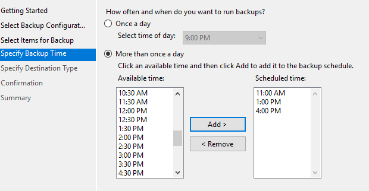

   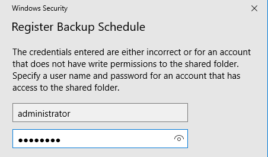

   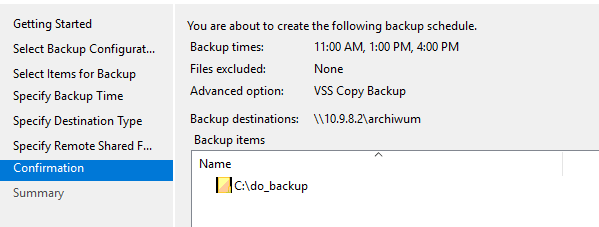

   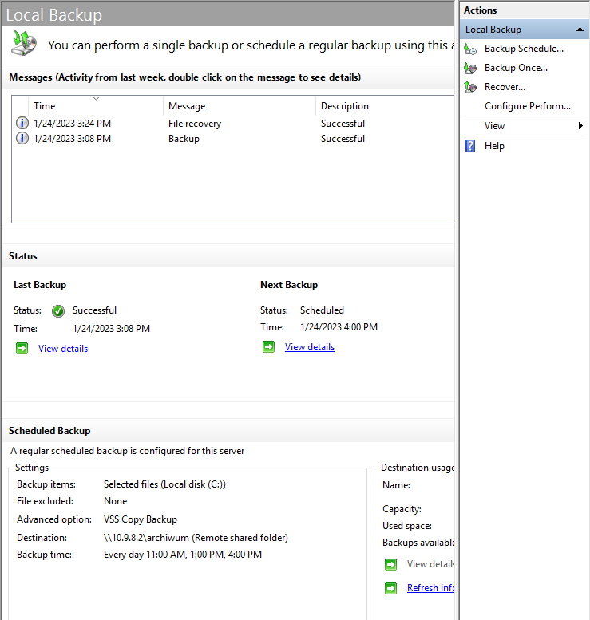

1. Sprawdzenie wykonania kopii za pomocą harmonogramu.

   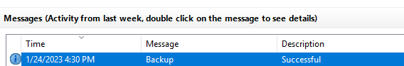

   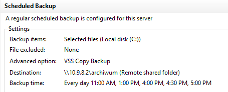

1. Wykonaj sprawdzenie kopii stanu systemu. (**kilka giga nie
    wykonujemy!!!**)

   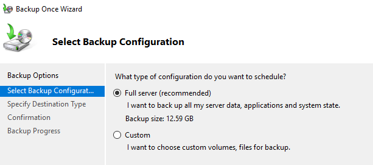

   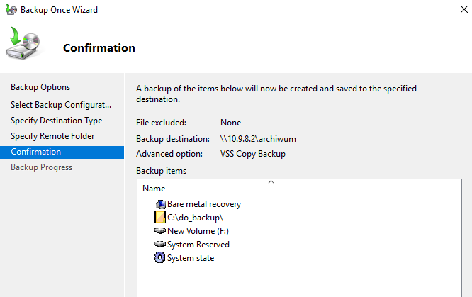

1. Wykonaj kopię z wykluczeniem wszystkich plików z rozszerzeniem txt.

1. KONIEC.🔚
