Ćwiczenia 28 -- instalacja i konfiguracja usługi DHCP
1.  Zaloguj się na serwerze na konto administrator.
2.  Sprawdź czy dolna karta sieciowa ma następującą konfigurację:
    a)  ip: 10.9.8.1/27
> brak bramki,
1 DNS 10.9.8.1
3.  Sprawdź na stacji ustawienia kart sieciowych w wierszu poleceń:
    ipconfig /all i polecenie route print.
4.  Sprawdź czy rola DHCP jest zainstalowana np. w Menedżerze Serwera.
5.  Zatrzymaj usługę DHCP, a następnie ją uruchom.

6.  Otwórz przystawkę DHCP z narzędzi (tools).
7.  Usuń istniejący zakres, a następnie utwórz nowy o nazwie twoje imię.
    **Nie dodawaj wykluczeń ani zastrzeżeń, ani serwera WINS.** Dodaj
    dwa adresy DNS. Czas dzierżawy 8 dni.

8.  Prawy klawisz myszy na zakresie i właściwości:
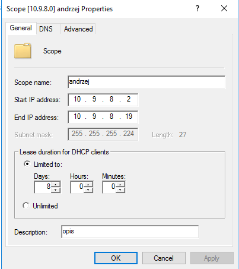
9.  Zaloguj się na stacji roboczej i ustaw **dla dolnej** karty
    pobieranie ustawień z serwera DHCP.
10. Sprawdź na stacji czy zostały pobrane ustawienia graficznie(prawy
    klawisz myszy na połączeniu sieciowym, wybieramy stan-\> szczegóły).
    W wierszu poleceń: ipconfig /all.
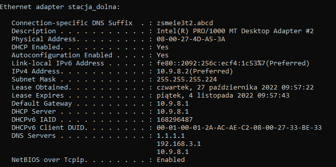
Sprawdź poprawność:
a)  ip
b)  maski
c)  czasu dzierżawy ( domyślny to 8 dni )
d)  bramki
e)  nazwy domeny
f)  serwera DHCP
g)  dwóch serwerów DNS
> 
11. Sprawdź na serwerze dzierżawy adresów:

12. Uruchom przystawkę DHCP z narzędzi administracyjnych i wprowadź w
    ustawieniach zastrzeżenie dla stacji roboczej ( **podaj opis: twoje
    imię, mac i adres IP**).
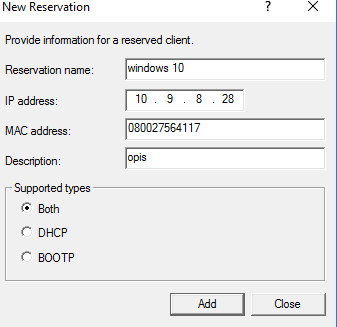
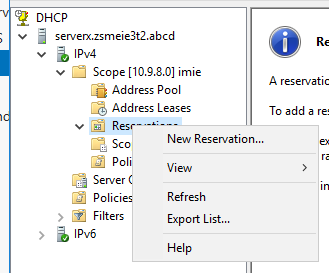
13. Sprawdź na stacji czy zostały pobrane ustawienia( należy programowo
    wyłączyć kartę, a następnie ją włączyć). Jeśli nie to wyłącz kartę,
    a następnie włącz ponownie.
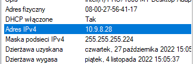
14. Na serwerze ustaw czas dzierżawy na 1 dzień 4 godziny i 35 minut.

15. Dodaj adres DNS tak, aby były 3 adresy. ( opcje zakresu)

16. Sprawdź czy na stacji czy zostały pobrane nowe ustawienia. . Jeśli
    nie to wyłącz kartę, a następnie włącz ponownie.
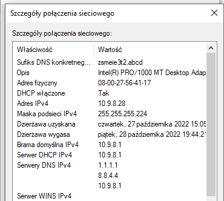
17. Usuń zastrzeżenie.
18. Wprowadź wykluczenie dla 1 adresu ip oraz dla zakresu złożonego z 3
    adresów.

19. Na serwerze ustaw czas dzierżawy na 3 dzień 3 godziny i 33 minut.
20. Zmień kolejność serwerów DNS.
21. Sprawdź czy na stacji windows czy zostały pobrane nowe ustawienia.
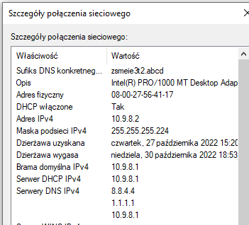
22. Sprawdź czy na stacji ubuntu czy zostały pobrane nowe ustawienia.
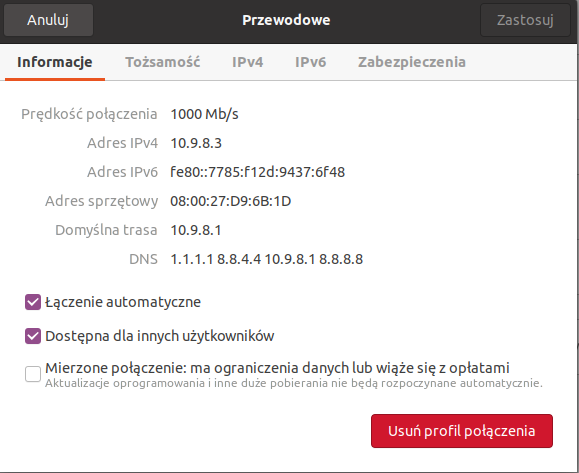
23. Komendą nmcli:

24. Wykonaj powyższe zadania dla stacji linux dla sieci, w której klient
    ma otrzymać adres 192.168.112.212/28.
25. Sprawdź bramkę i czas dzierżawy:
ip -c r , sprawdzenie bramki
sudo nmcli -f dhcp4 device show ( poszukać frazy: dhcp_lease_time
wyrażone w sekundach)
26. Wykonaj powyższe zadania dla stacji linux dla sieci, w której klient
    ma otrzymać adres 10.40.80.151/26.
27. Wykonaj zadanie wskazane przez nauczyciela. Uzyskaj konkretny adres
    ip bez rezerwacji.
28. Skonfiguruj zakres dla ipv6:
29. Ustaw kartę sieciową na adres:
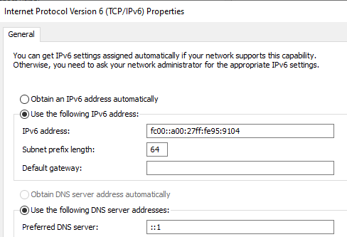
30. Utwórz zakres dla ipv6
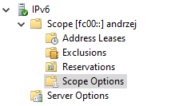
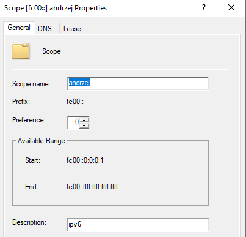
31. Dodaj DNS:
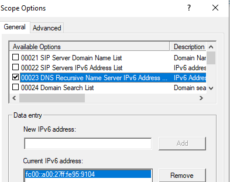
32. Sprawdź pobranie ustawień na stacjach linux i windows:
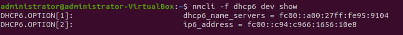
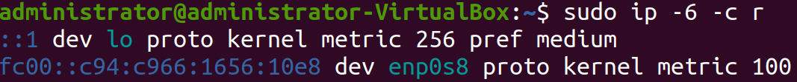
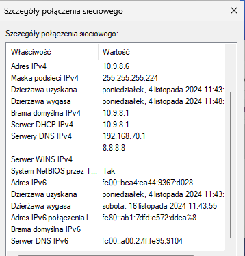
33. Widok dhcp:
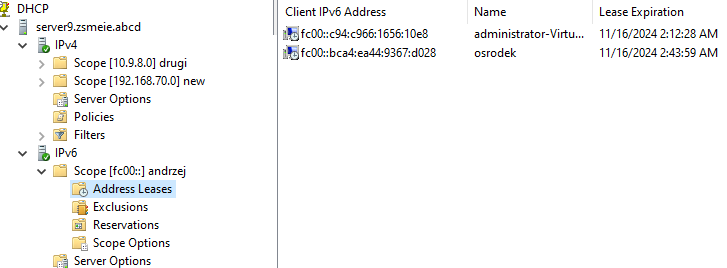
34. Wykonaj ćwiczenia dla komputera o podanym ip i masce:
    a)  203.0.113.237/28
    b)  192.0.2.85/29
    c)  10.11.12.172/26
    d)  192.168.0.235/28
    e)  172.19.17.88/27
    f)  10.40.80.114/29
    g)  192.168.11.46/30
    h)  172.20.30.126/25
35. Usuń zakres.
36. Nie usuwaj roli DHCP server.
37. KONIEC
