Ćwiczenia 4 -- Ubuntu serwer -- crontab, at
Zaloguj się na swoje konto imienXYZ, gdzie XYZ oznacza kod klasy i
grupy, np. jank3t1
Jeśli nie masz konta, sudo adduser imienXYZ
1.  Dodaj swoje konto do grupy sudo: *sudo usermod twoje_konto -G sudo*
2.  Sprawdzenie czy jesteśmy w grupie sudo: *id konto*
3.  Wydaj komendę na piątym terminal: man at
4.  Wydaj komendę na szóstym terminalu: info crontab
5.  Otwórz pomocniczo na czwartym terminal: cat /etc/crontab
6.  Otwórz stronę pomocy, np.: <https://crontab.guru/>
7.  Zainstaluj obsługę poczty: sudo apt install mailutils podaj tylko
    lokanie
8.  Sprawdzić pocztę komendą mail
9.  Z pomocą polecenia crontab zaplanuj:
<!-- -->
a)  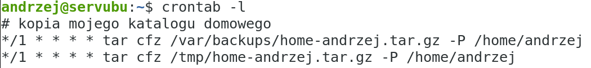
    Archiwizuj swój katalog domowy co 1
    minutę do katalogu /var/backups oraz /tmp z użyciem tara i gzipa
b)  Utwórz co 1 minutę podając dzień i miesiąc plik o nazwie
    plikcrontabtest w \~
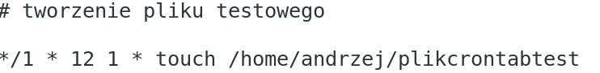
c)  Uruchom skrypt co 1 minutę w każdy dzień roboczy pobierający wycenę
    bitcoina ze strony: <https://api.coinbase.com>
> 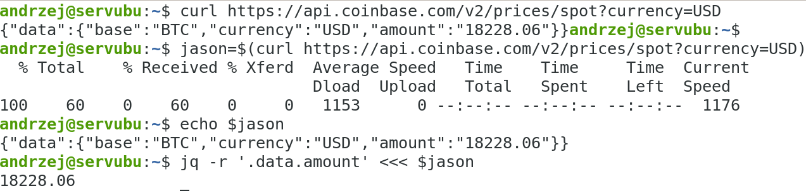
>
> 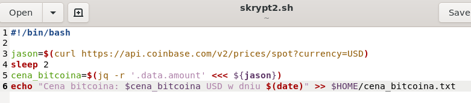
>
> 
>
> Efekt działania:
>
> 
d)  
    uruchomienie skryptu skrypt3.sh
    zbierającego statystyki pracy karty sieciowej z ostatnich 5 minut o
    zadanej godzinie, ale tylko w środy i piątki oraz w dniu ćwiczeń
> 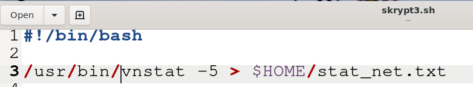
>
> Zadanie crona:
>
> 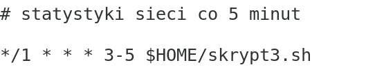
>
> Sprawdzenie:
>
> 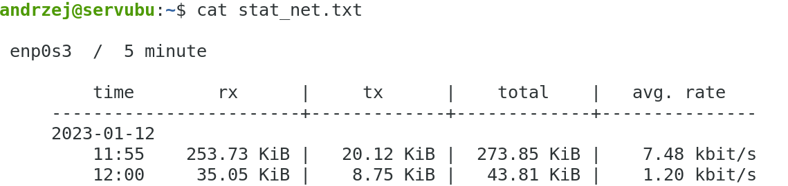
e)  uruchomienie skryptu skrypt4.sh zbierającego statystyki pracy karty
    sieciowej do pliku graficznego z ostatnich 5 minut o zadanej
    godzinie, ale tylko w środy i piątki oraz w dniu ćwiczeń
> 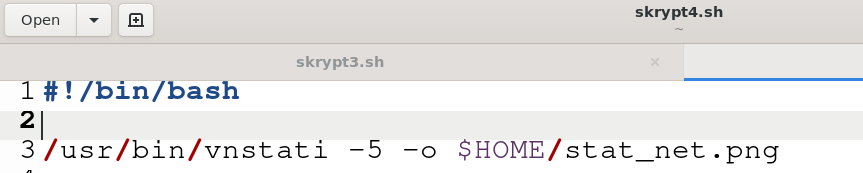
>
> 
>
> Sprawdzenie, ściągamy plik ze stacji windows programem winscp:
>
> 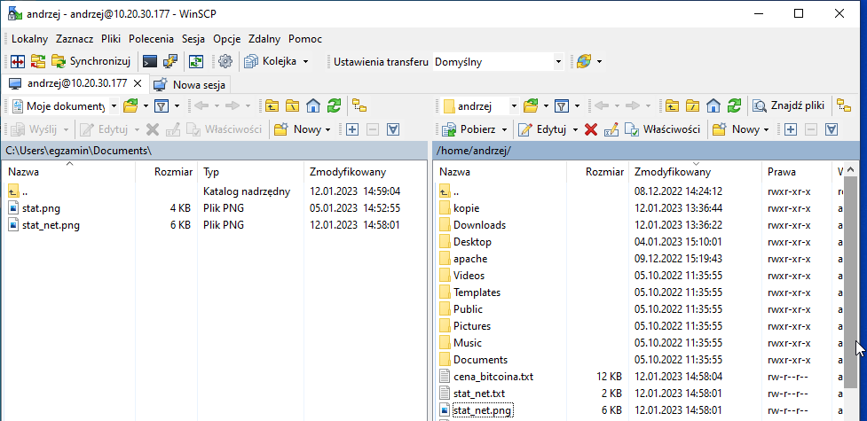
>
> Otworzyć plik w eksploratorze windows:
>
> 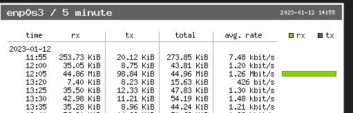
f)  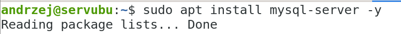
    uruchomienie skryptu arch_mysql.sh o
    zadanej godzinie, każdego 28 i 14 dnia miesiąca oraz w każdą środę,
    który wykona kopię zapasowa bazy mysql w katalogu /tmp.
> 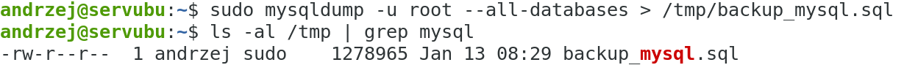
>
> 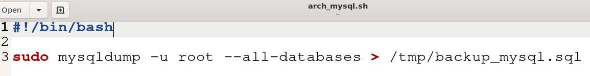
>
> 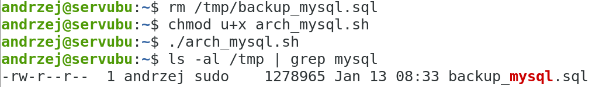
>
> 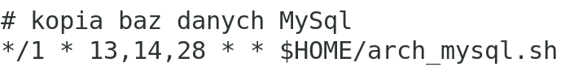
>
> 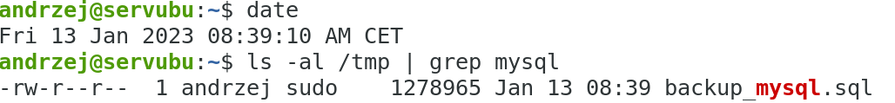
g)  uruchomienie skryptu restart.sh przy każdym restarcie serwera, który
    wyśle maila z powiadomieniem
h)  wyślij mail do siebie każdego dnia 5 minut po północy.
<!-- -->
10. Sprawdź zadania crontab wszystkich użytkowników
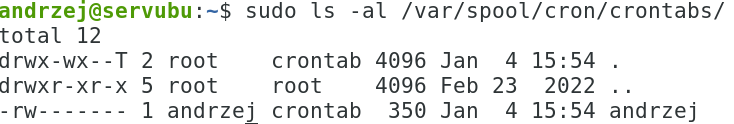
11. Z pomocą polecenia at zaplanuj zadania wykonane wcześniej dla crona.
12. 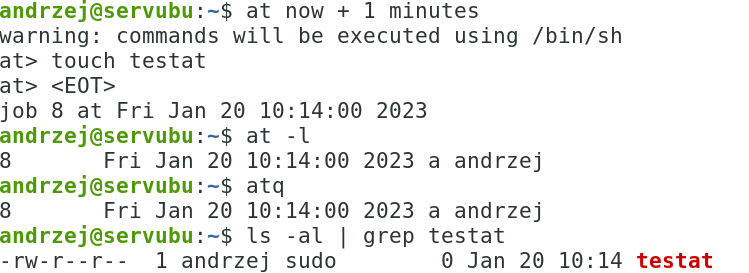
    Utwórz plik testat za 1 minutę:
13. Utwórz skrypt o nazwie arch.sh, który kopiuje zawartość katalogu
    \~/at_crontab/dane do katalogu \~/at_crontab/kopie.
14. 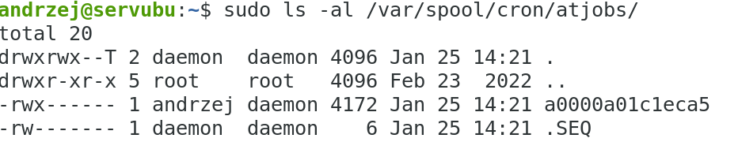
    Sprawdź zawartość katalogu
    /var/spool/cron/atjobs/
15. Utwórz skrypt o nazwie zmiana.sh, który zmieni nazwę pliku test2.txt
    na nowy.txt, przetestuj jego działanie, a następnie zaplanuj
    uruchomienie 22 i 23 grudnia, 5 minut po godzinie 12
16. Zaplanuj uruchomienie skryptu kom1.sh tylko w lutym, marcu,kwietniu
    i wrześniu o godzinie 11:30,
ale tylko we wtorki i czwartki.
17. Z pomocą polecenia at zaplanuj:
<!-- -->
a)  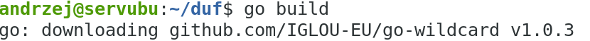
    
    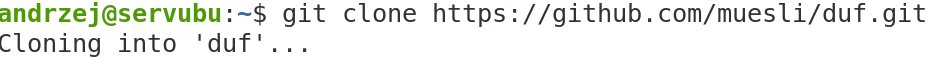
    utwórz skrypt o nazwie
    zajetosc_dysku.sh, który tworzy plik na dysku z raportem o zajętości
    miejsca na dysku. Przetestuj jego działanie, a następnie zaplanuj
    jego uruchomienie podając godzinę, minuty i dzień tygodnia.
    Wykorzystaj narzędzie duf.
> 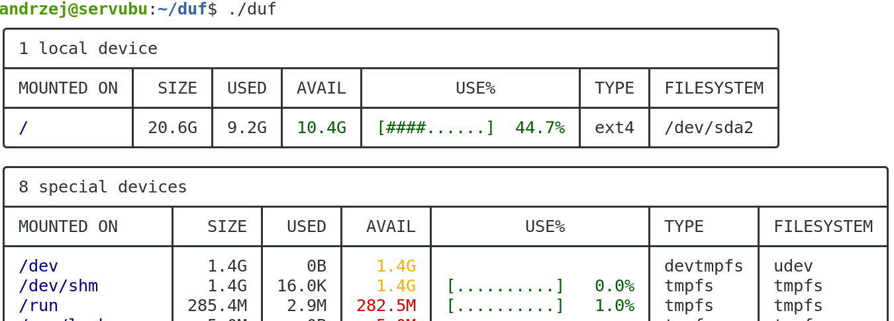
>
> Skrypt:
>
> 
>
> 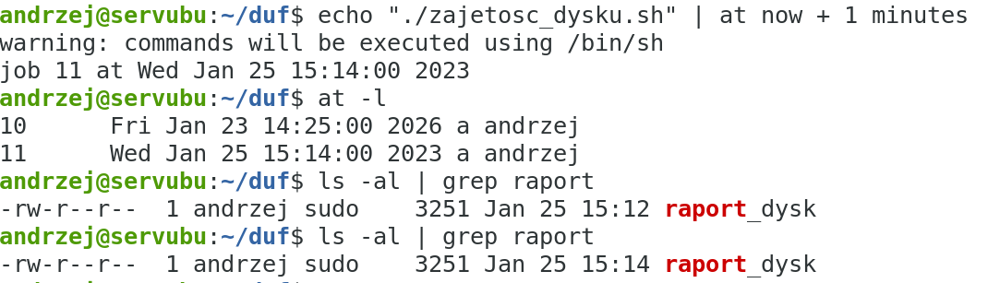
18. Sprawdź jakie prawa posiadają pliki at, crontab.
19. Zezwól na używanie polecenia at sobie, a zabroń używania go
    użytkownikowi Blazej.
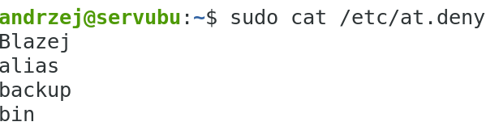
20. 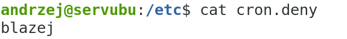
    Zezwól na używanie polecenia crontab sobie, a
    zabroń używania go użytkownikowi blazej.
> 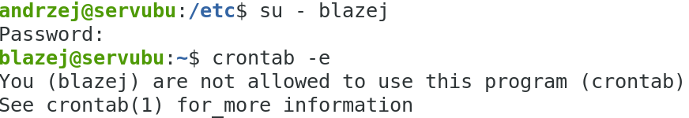
21. Dodatkowe zadania:
<!-- -->
a)  Wykonaj kopię zapasową bazy postgresql z pomocą crontab
> Instalacja: apt install postgresql -y
>
> 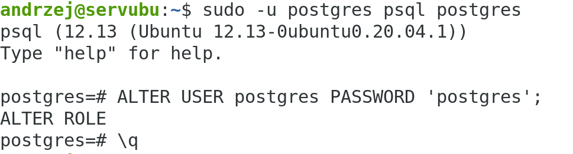
>
> 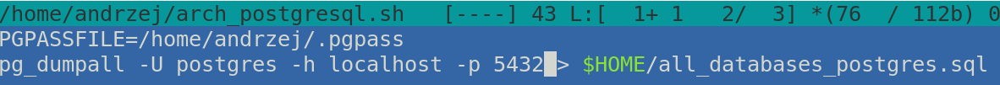
>
> Utworzenie pliku .pgpass:
>
> 
>
> Crontab:
>
> 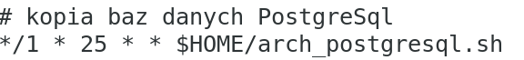
>
> 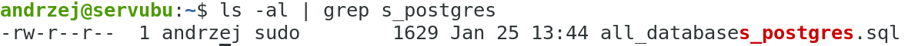
b)  Wykonaj kopię zapasową bazy MongoDB z pomocą at
c)  przetestuj polecenie at w Windows Server.
d)  inne podane przez nauczyciela
<!-- -->
22. *sudo poweroff* ( na koniec zajęć)
