# Ćwiczenia 4 -- Ubuntu serwer -- crontab, at

Zaloguj się na swoje konto `imienXYZ`, gdzie `XYZ` oznacza kod klasy i
grupy, np. jank3t1
Jeśli nie masz konta,

```bash
sudo adduser imienXYZ
```

1. Dodaj swoje konto do grupy sudo:

    ```bash
    sudo usermod twoje_konto -G sudo
    ```

    lub

    ```bash
    sudo adduser imienXYZ sudo
    ```

1. Sprawdzenie czy jesteśmy w grupie sudo:

   ```bash
   id konto
   ```

1. Wydaj komendę na piątym terminal:

   ```bash
   man at
   ```

1. Wydaj komendę na szóstym terminalu:

    ```bash
    info crontab
    ````

1. Otwórz pomocniczo na czwartym terminal:

    ```bash
    cat /etc/crontab
    ```

   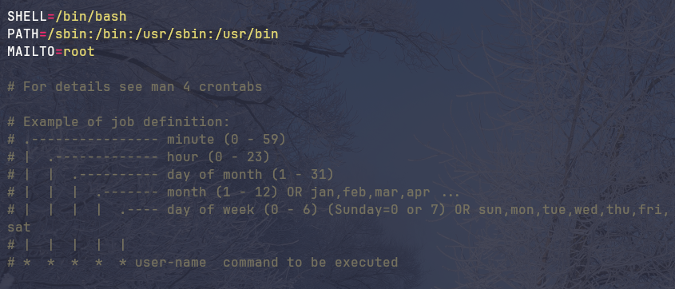

1. Otwórz stronę pomocy, np.: <https://crontab.guru/>

1. Zainstaluj obsługę poczty, podaj tylko lokanie:

    ```bash
    sudo apt install mailutils 
    ```

1. Sprawdzić pocztę komendą:

    ```bash
    mail
    ```

1. Z pomocą polecenia crontab zaplanuj:

    a)  Archiwizuj swój katalog domowy co 1
        minutę do katalogu ***/var/backups*** oraz ***/tmp*** z użyciem narzędzia `tar` i `gzip`.  
      Wybór edytora po `crontab -e` można powtórzyć poleceniem `select-editor`

    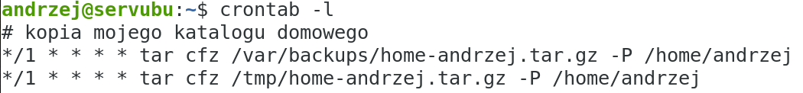

    b)  Utwórz co 1 minutę podając dzień i miesiąc plik o nazwie
        plikcrontabtest w \~

    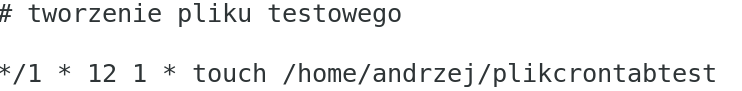

    c)  Uruchom skrypt co 1 minutę w każdy dzień roboczy pobierający wycenę
        bitcoina ze strony:

    <https://docs.cdp.coinbase.com/coinbase-app/track-apis/prices>

    ```bash
    curl https://api.coinbase.com/v2/prices/spot?currency=USD
    ```

    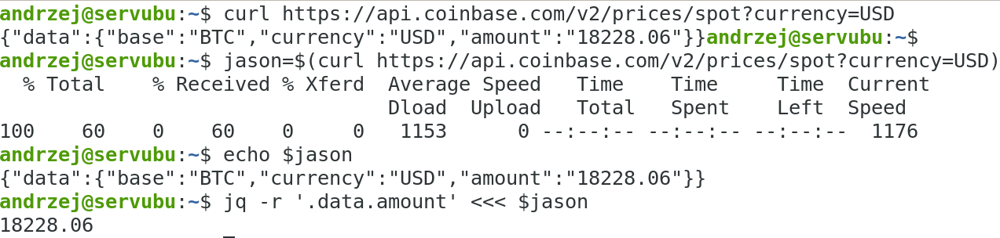

    ```bash
    jason=$(curl https://api.coinbase.com/v2/prices/spot\?currency\=USD)
    ```

    ```bash
    jq -r '.data.amount' <<< $jason
    ```

    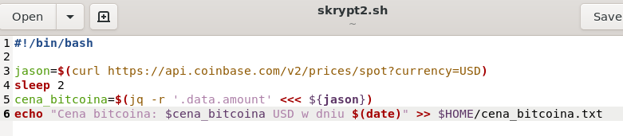

    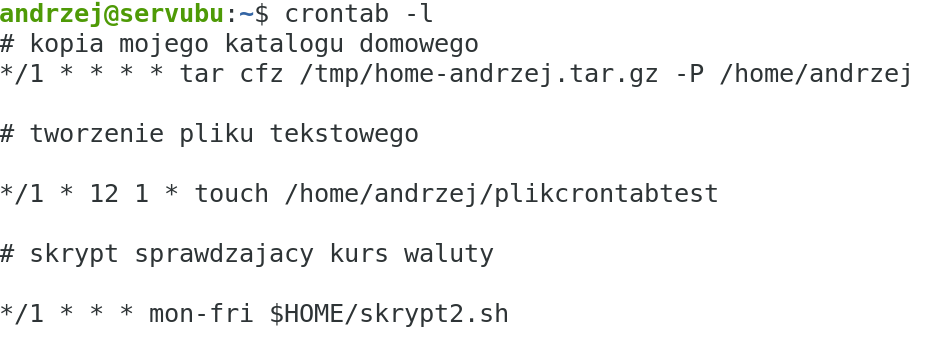

    Efekt działania:

    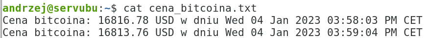
    d)  uruchomienie skryptu skrypt3.sh
        zbierającego statystyki pracy karty sieciowej z ostatnich 5 minut o
        zadanej godzinie, ale tylko w środy i piątki oraz w dniu ćwiczeń.  
        Najpierw zainstaluj potrzebne pakiety:

    ```bash
    sudo apt install vnstat vnstati -y
    ```

    

    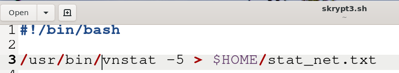

    Zadanie crona:

    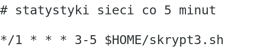

    Sprawdzenie:

    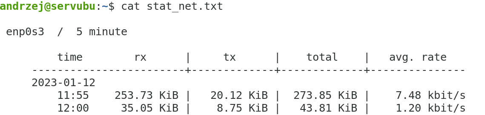

    e)  uruchomienie skryptu skrypt4.sh zbierającego statystyki pracy karty
        sieciowej do pliku graficznego z ostatnich 5 minut o zadanej
        godzinie, ale tylko w środy i piątki oraz w dniu ćwiczeń
    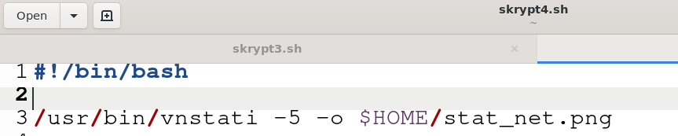

    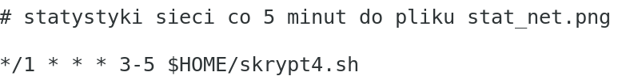

    Sprawdzenie, ściągamy plik ze stacji windows programem winscp:

    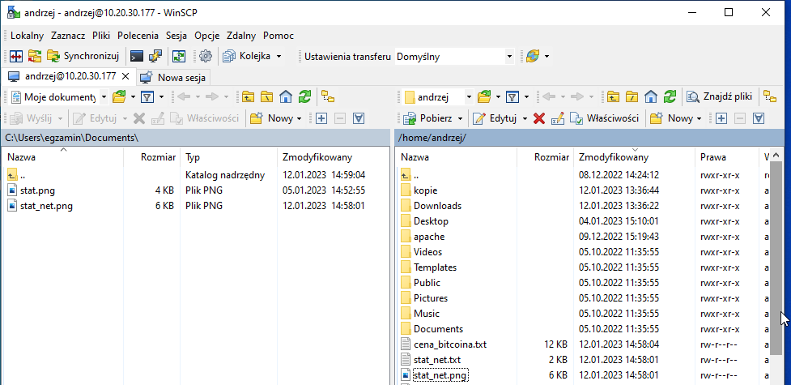

    Otworzyć plik w eksploratorze windows:

    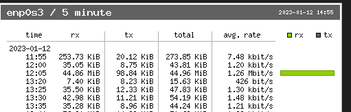

    f)  uruchomienie skryptu arch_mysql.sh o
        zadanej godzinie, każdego 28 i 14 dnia miesiąca oraz w każdą środę,
        który wykona kopię zapasowa bazy mysql w katalogu ***/tmp***.

    ```bash
    sudo apt install mysql-server -y
    ```

    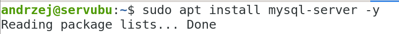

    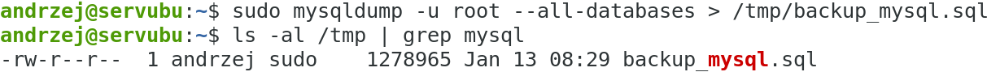

    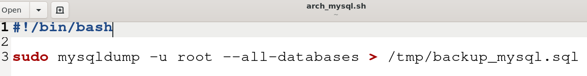

    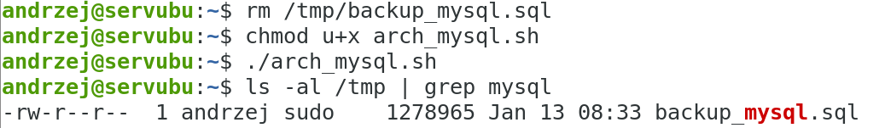

    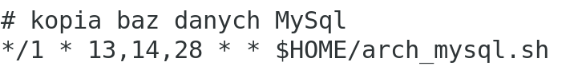

    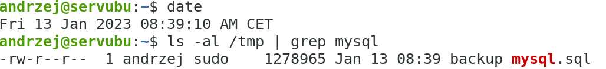

    g)  uruchomienie skryptu restart.sh przy każdym restarcie serwera, który
        wyśle maila z powiadomieniem  

    h)  wyślij mail do siebie każdego dnia 5 minut po północy.  

1. Sprawdź zadania crontab wszystkich użytkowników

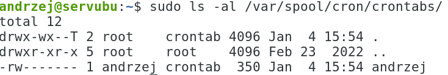

1. Z pomocą polecenia at zaplanuj zadania wykonane wcześniej dla crona.

2. Utwórz plik testat za 1 minutę:

    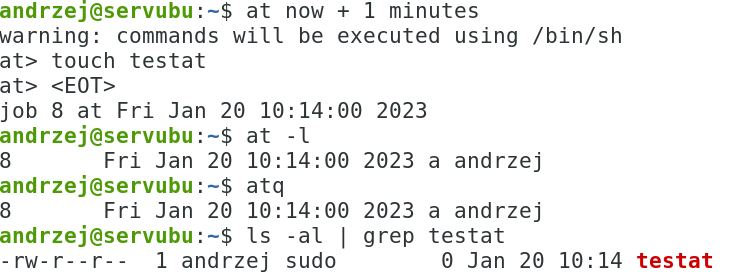

3. Utwórz skrypt o nazwie arch.sh, który kopiuje zawartość katalogu
    ***\~/at_crontab/dane*** do katalogu ***\~/at_crontab/kopie***.

4. Sprawdź zawartość katalogu ***/var/spool/cron/atjobs/***

    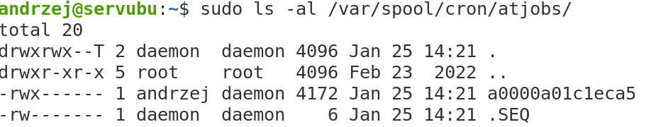

5. Utwórz skrypt o nazwie zmiana.sh, który zmieni nazwę pliku test2.txt
    na nowy.txt, przetestuj jego działanie, a następnie zaplanuj
    uruchomienie 22 i 23 grudnia, 5 minut po godzinie 12

6. Zaplanuj uruchomienie skryptu kom1.sh tylko w lutym, marcu,kwietniu
    i wrześniu o godzinie 11:30, ale tylko we wtorki i czwartki.

7. Z pomocą polecenia at zaplanuj:

a)  utwórz skrypt o nazwie
    zajetosc_dysku.sh, który tworzy plik na dysku z raportem o zajętości
    miejsca na dysku. Przetestuj jego działanie, a następnie zaplanuj
    jego uruchomienie podając godzinę, minuty i dzień tygodnia.
    Wykorzystaj narzędzie duf.
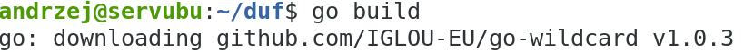

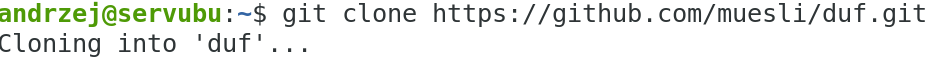

 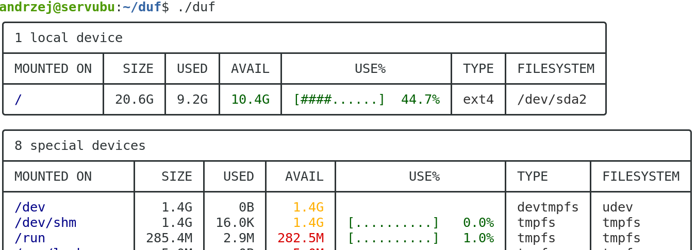

 Skrypt:

 

 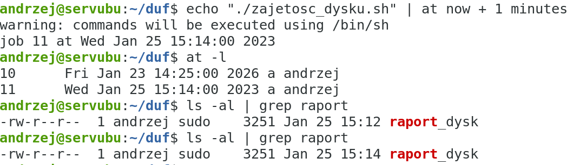

1. Sprawdź jakie prawa posiadają pliki at, crontab.

2. Zezwól na używanie polecenia at sobie, a zabroń używania go
    użytkownikowi Blazej.

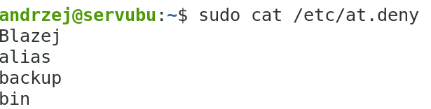

1. Zezwól na używanie polecenia crontab sobie, a
    zabroń używania go użytkownikowi blazej.
    
 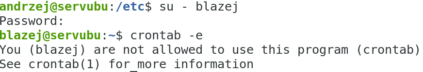

2. Dodatkowe zadania:  

a)  Wykonaj kopię zapasową bazy postgresql z pomocą crontab  
    Instalacja:

```bash
 sudo apt install postgresql -y
```

 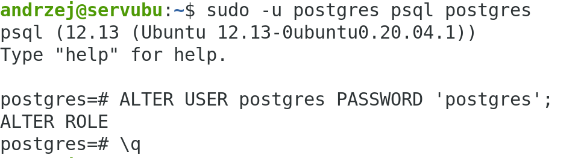

 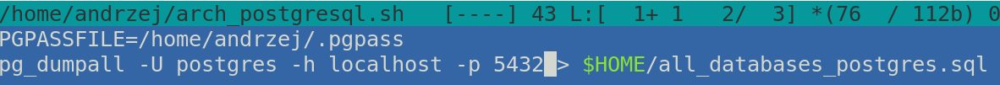

 Utworzenie pliku .pgpass:

 

 Crontab:

 

 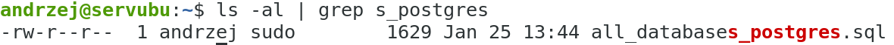

b)  Wykonaj kopię zapasową bazy MongoDB z pomocą at

c)  przetestuj polecenie at w Windows Server.

d)  inne podane przez nauczyciela

1. Na koniec zajęć 😃

```bash
 sudo poweroff
```
