Ćwiczenia 51 -- GP0, wdrażanie oprogramowania + pulpit zdalny
1.  Zaloguj się na konto administrator.
2.  W AD utwórz nową jednostkę organizacyjną o nazwie addapp.
3.  Dołącz stację do domeny.
4.  Przenieś komputer w AD do jednostki organizacyjnej addapp.
5.  Przenieś konto, na które logujesz się na stacji do jednostki
    organizacyjnej addapp.
> 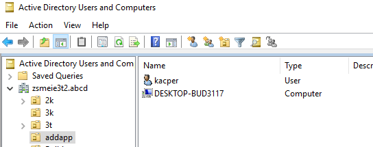
6.  Na dysku udostępnij folder o nazwie apps (udostępnianie
    zaawansowane) jako ukryty,
> obie zakładki: udostępnianie i zabezpieczenia.
>
> administratorzy domeny - pełna kontrola,
>
> użytkownicy uwierzytelnieni -- odczyt,
>
> wszyscy -zmiana(change).
>
> 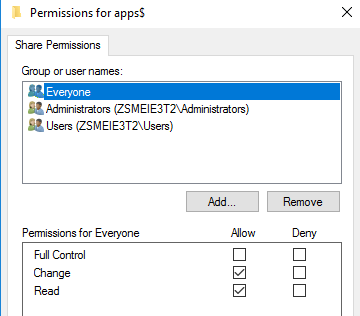
7.  Na stacji Ten komputer - \> Mapuj dysk sieciowy (
    [\\\\10.9.8.1\\apps\$](../../../../../../apps$) ) pod literę R:
8.  Ściągnąć instalkę teams ze strony:
    <https://learn.microsoft.com/en-us/microsoftteams/msi-deployment>
9.  Pobrany plik Teams_windows_x64.msi zapisz na zmapowanym dysku R.
10. Ściągnąć instalkę putty:
    <https://the.earth.li/~sgtatham/putty/latest/w64/putty-64bit-0.78-installer.msi>
11. Również zapisz plik msi na zmapowanym dysku R.
12. Otwórz przystawkę GPO Zarządzanie zasadami grupy.
> 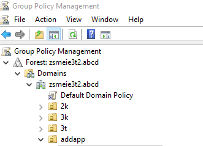
13. Dla jednostki addapp utwórz nowy obiekt zasad grup.
14. Podać nazwę instalacja oprogramowania. OK.
15. Po utworzeniu obiektu wybierz Edytuj.
> 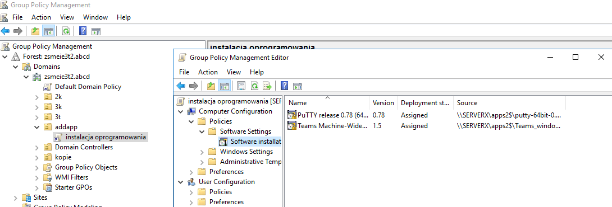
16. W nowo otwartym oknie:
Konfiguracja komputera -\> Zasady -\> Ustawienia oprogramowania -\>
Instalacja oprogramowania.
17. Następnie prawym klawiszem myszki i z rozwiniętego menu
    kontekstowego wybieramy Nowy -\> Pakiet.
18. Nazwa pliku, podajemy
    [\\\\nazwa_servera\\apps](../../../../../../apps) i wybieramy plik
    teams \...msi .
> 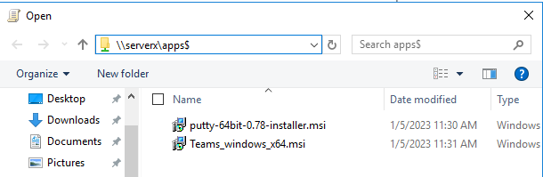
19. Rozmieszczenie oprogramowania: przypisany.
> 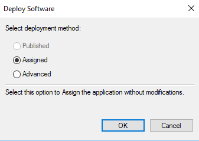
20. Analogicznie dla drugiego pakietu msi.
> 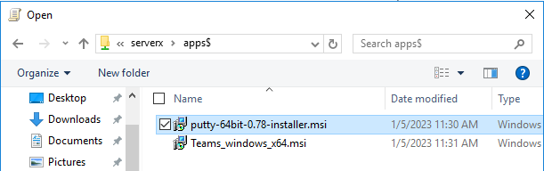
21. Finalnie:
> 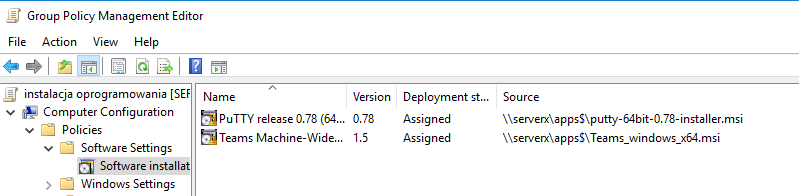
22. 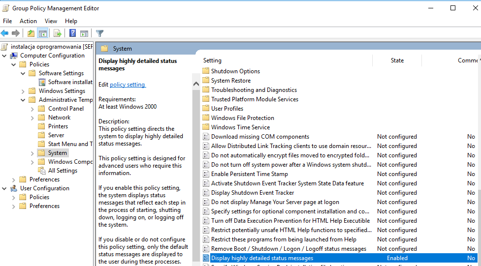
    Szablony administracyjne - \> System -
    \> Wyświetlaj bardzo szczegółowe komunikaty o stanie. Włącz.
23. Zamykamy okno edycji zasad.
24. 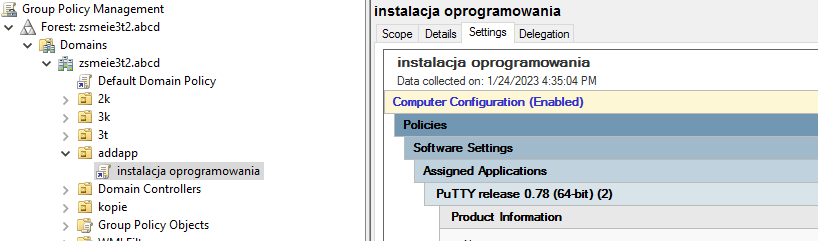
    Zapisz raport na pulpicie z utworzonych
    zasad.(Prawy klawisz myszy po prawej stronie na Settings)
25. Na stacji w cmd wpisujemy polecenie: gpupdate /force
> Serwer:
>
> 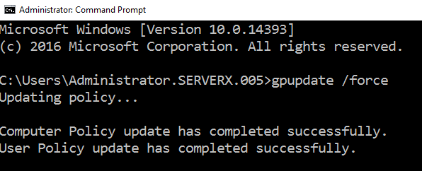
>
> Stacja:
>
> 
26. Po restarcie stacji sprawdzić czy oprogramowanie zostało
    zainstalowane.
> 
27. 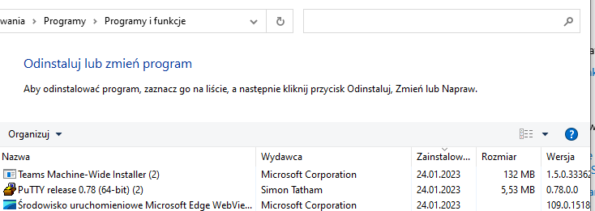
    Sprawdzenie oprogramowania:
28. Odłącz stację od domeny.
29. Przenieś komputer w AD z jednostki organizacyjnej addapp do
    kontenera Computers.
30. Zatrzymaj udostępnianie katalogu apps, następnie usuń ten folder.
31. Usunąć raport z pulpitu. Opróżnić kosz.
32. W przystawce GPO Group Policy Management usunąć obiekt „instalacja
    oprogramowania".
33. Dodatkowe ćwiczenie -- pulpit zdalny.
34. 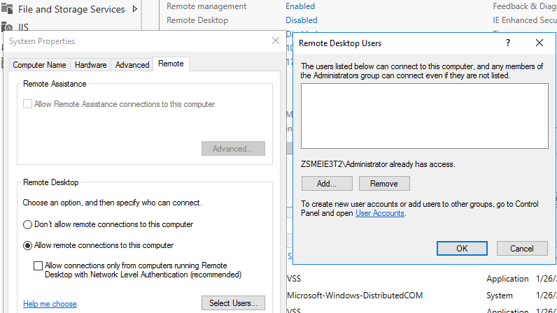
    Konfiguracja pulpitu zdalnego Server
    Manager -\> Local Server -\> Remote Desktop, klikamy na disabled
35. Na stacji windows. Po kliknięciu Podłącz podać hasło i odpowiedzieć
    twierdzącą w nowym oknie.
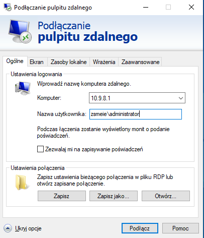
> 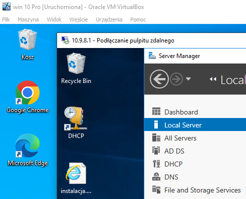
36. Wyłączyć pulpit zdalny.
37. KONIEC.
