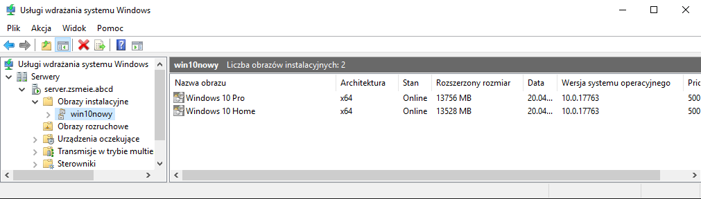
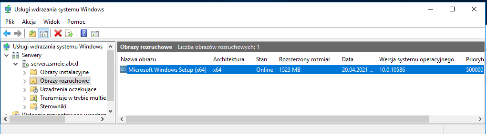
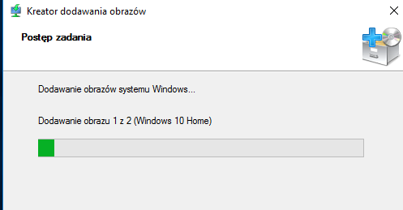
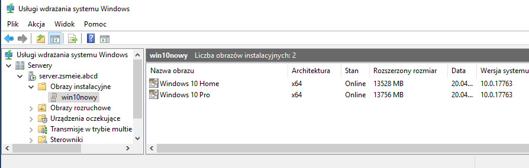
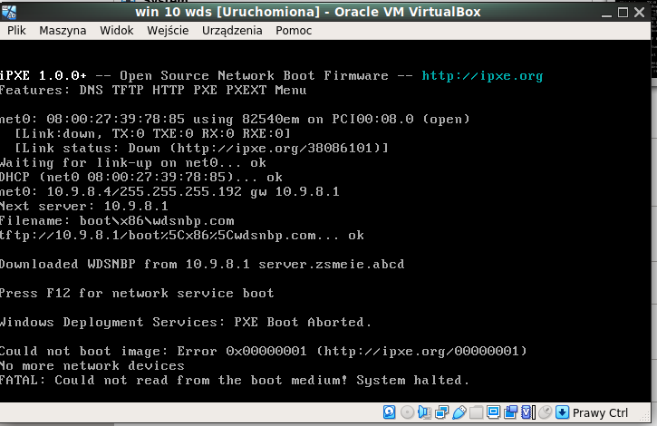
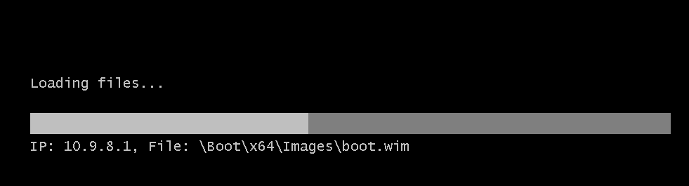
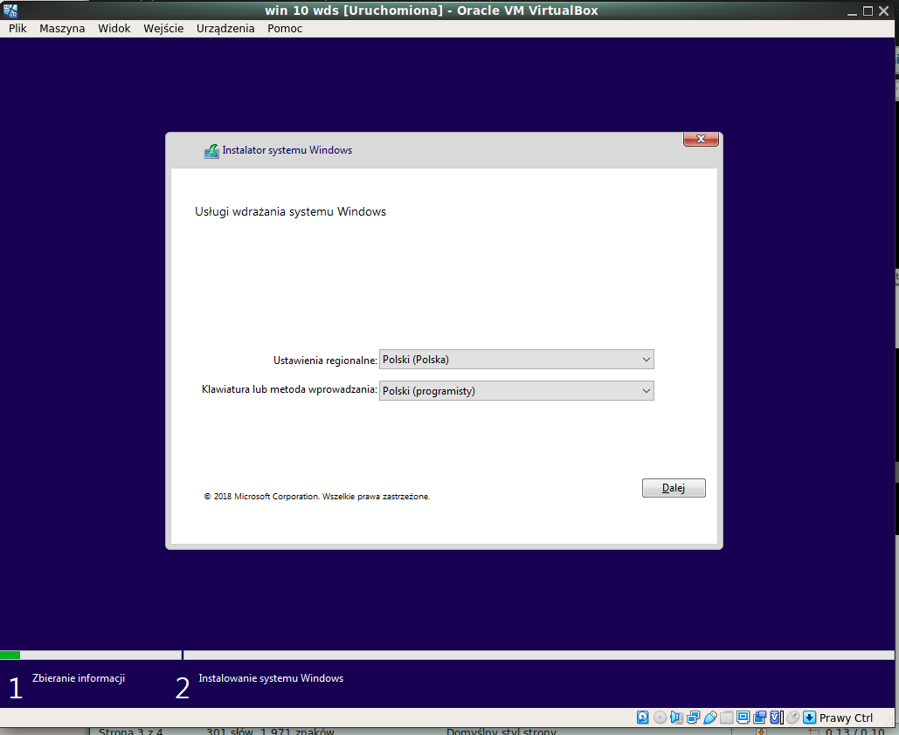
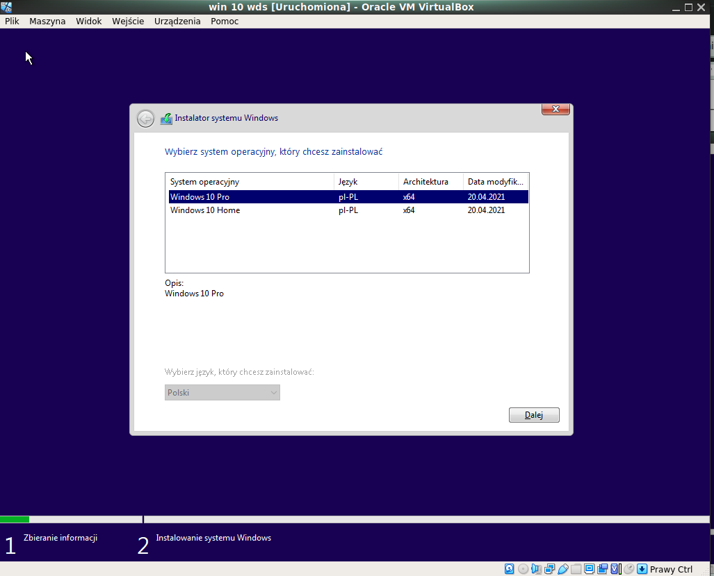
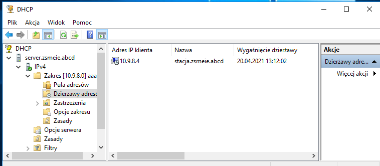
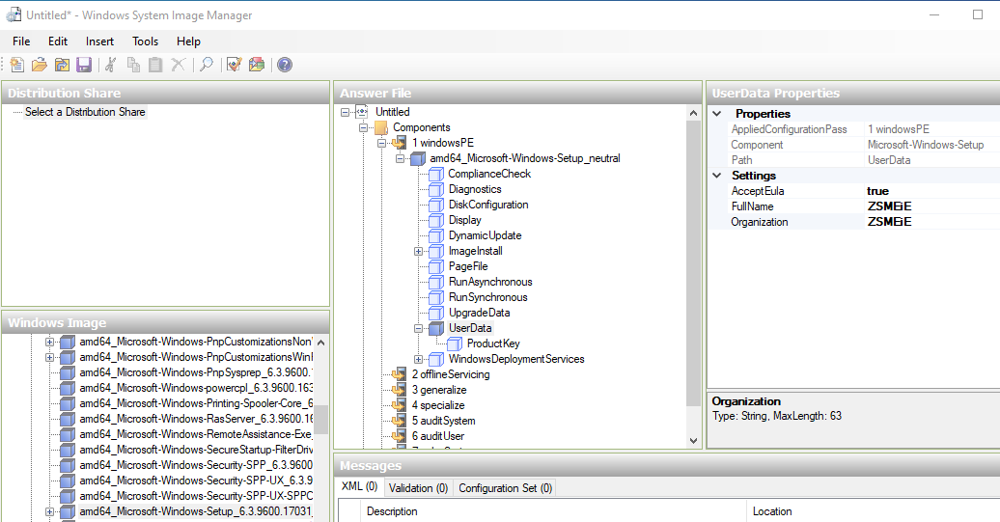

Ćwiczenia 52 -- Windows Deployment Services (WDS) -- Standalone Server
1.  Dodaj w VirtualBox drugi dysk dla Windows Server.(Pamięć- \> Dodaj
    nową pamięć - \> Dysk twardy, w nowym oknie: Create - \> VDI - \>
    dynamicznie przydzielany- \> 15GB - \> Utwórz - \> Choose)
2.  Zaloguj się na konto administrator.
3.  Uruchom diskmgmt.msc (Zarządzanie dyskami) i dodaj nowy dysk i
    sformatować na ntfs.
4.  Zainstaluj usługę Windows Deployment Services (WDS) Usługi wdrażania
    systemu Windows. Domyślne ustawienia(Serwer transportu i Serwer
    wdrażania).
5.  Sprawdź czy na serwerze są spełnione warunki:
    a)  jest zainstalowana usługa DHCP i działa
    b)  jest zainstalowana usługa DNS i działa
    c)  nowo dodany dysk zawiera partycję ntfs do przechowania obrazów
jeśli tak, to przejdź do następnego punktu
6.  Menedżer serwera - \> WDS - \> Windows Deployment Services
    Management Console lub
Narzędzia - \> Usługi wdrażania systemu Windows.
7.  Serwery - \> nazwa naszego serwera i prawy przycisk myszy
    'Skonfiguruj serwer'
    a)  Serwer zintegrowany z usługą Active Directory lub Serwer
        autonomiczny
    b)  lokalizacja folderu instalacji zdalnej, wskaż nową partycję np.
        [D:\\RemoteInstall](../../../../D:/RemoteInstall)
    c)  Serwer proxy DHCP, oba zaznaczone
    d)  ustawienia początkowe serwera PXE: odpowiadaj wszystkim
        komputerom klienckim (znanym i nieznanym)

8.  Włóż płytę instalacyjną lub plik iso(wówczas trzeba go rozpakować).
9.  Obrazy rozruchowe - \> dodaj obraz rozruchowy i podajemy lokalizację
    pliku obrazu systemu Windows boot.wim.

10. Obrazy instalacyjne - \> Add image group podać nazwę win10nowy
11. Na nowej pozycji win10nowy → Add install image (wskazać plik
    install.wim)

12. Stwórz nową maszynę wirtualną Windows 8 lub Windows 10 tylko z
    siecią wewnętrzną.
13. Uruchomić maszynę wirtualną i zabootować z sieci: (włąściwości
    serwery - \> zakładka boot, można zdjąć opcję wciśnij przycisk F12)

14.
> 
15. Sprawdź poprawność uruchamiania z sieci.

16. Poprawność połączenia z maszyna wirtualną:

17. Wykonaj nienadzorowaną instalację Windows 10 (Answer files
    (unattend.xml) Właściwości serwera - \> zakładka klient - \> Włącz
    instalację nienadzorowaną.
<https://learn.microsoft.com/en-us/windows-hardware/manufacture/desktop/update-windows-settings-and-scripts-create-your-own-answer-file-sxs?view=windows-11>
18. Zainstalować ADK:
    <https://learn.microsoft.com/en-us/windows-hardware/get-started/adk-install>
19. 
    Utworzyć plik odpowiedzi:
20. KONIEC.
