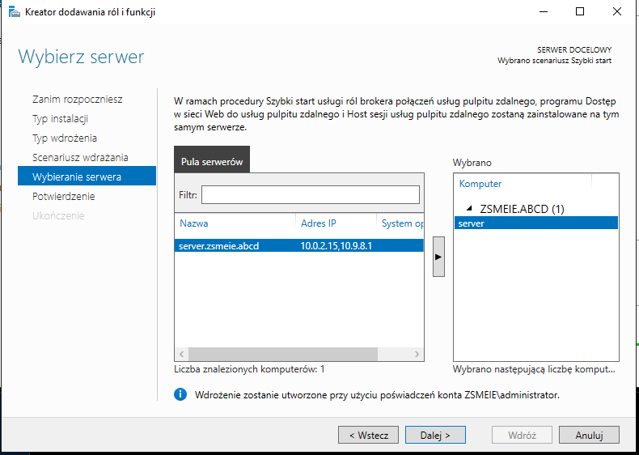
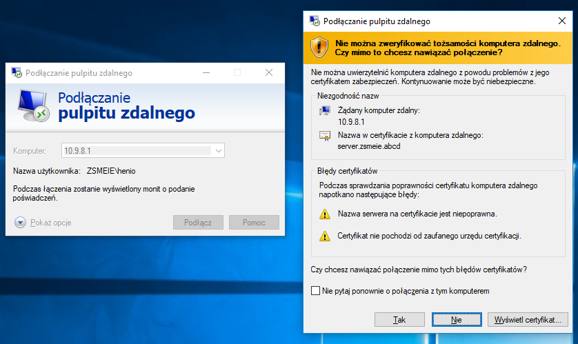
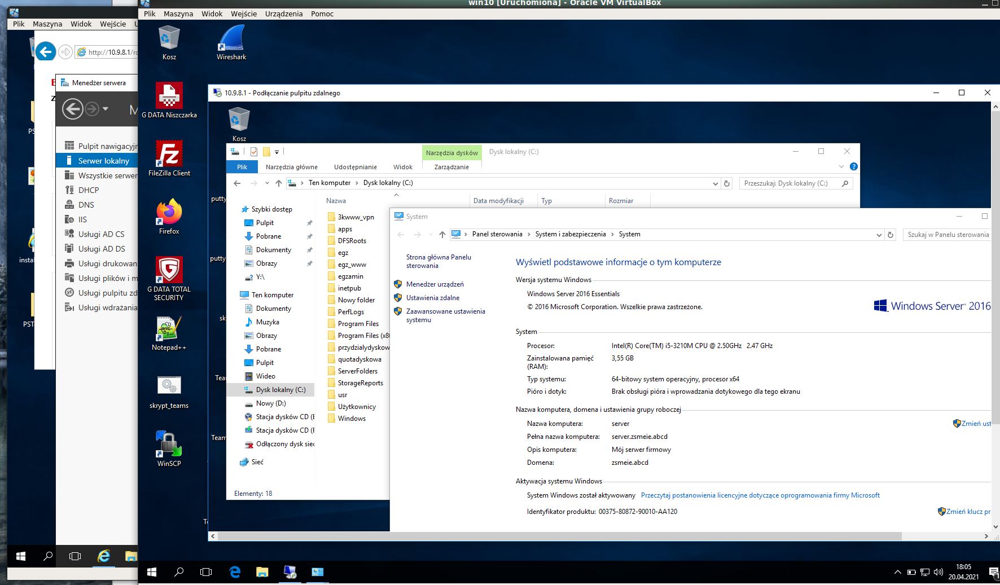
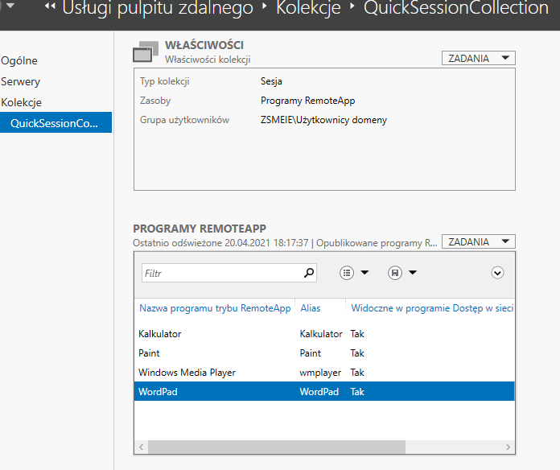

Ćwiczenia 53 -- Remote Desktop Services (RDS) Serwer terminali
1.  Zaloguj się na konto administrator.
2.  Otwórz:
    <https://docs.microsoft.com/en-us/windows-server/remote/remote-desktop-services/welcome-to-rds>
3.  Menedżer serwera - \> Zarządzaj - \> Dodaj role i funkcje - \>
    Instalacja usług pulpitu zdalnego - \> Szybki start - \> Wdrażanie
    pulpitu opartego na sesji
    
4.  Podsumowanie:
    
5.  Klikamy przycisk wdróż(Deploy).
6.  Po restarcie serwera poczekaj na dokończenie konfiguracji(kliknij w
    flagę) otwórz stronę <https://server.zsmeie.abcd/rdweb>
7.  Stwórz użytkownika o nazwie rdsuser w AD w jednostce organizacyjnej
    o nazwie RDS.
8.  Dodaj użytkownika rdsuser do grupy Remote Management Users.
9.  Odznacz pole: Zezwalaj na połączenia tylko z komputerów, na których
    Pulpit ....
10. Ze stacji, która jest podłączona do domeny logujemy się na konto
    rdsuser.
11. Następnie uruchamiamy 'Podłączanie pulpitu zdalnego'.
12. Podajemy ip servera.
    
13. Sprawdzamy właściwości na ten komputer.

14. Dla RemoteApp dodaj: Windows Media Player
    
15. KONIEC.
