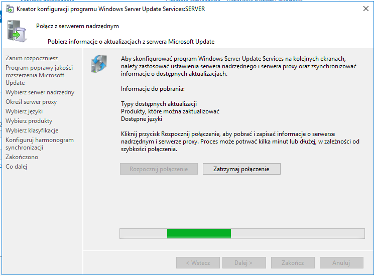
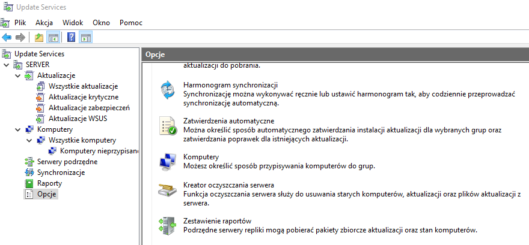

Ćwiczenia 54 -- Windows Server Update Services (WSUS)
1.  Zaloguj się na konto administrator.
2.  Otwórz:
    <https://docs.microsoft.com/en-us/windows-server/administration/windows-server-update-services/get-started/windows-server-update-services-wsus>
3.  Zainstaluj usługę.
4.  Menedżer serwera - \> Zarządzaj - \> Dodaj role i funkcje - \>
    Windows Server Update Services
5.  Po restarcie serwera dokończ konfigurację.
6.  Uruchom przystawkę: Narzędzia - \> Windows Server Update Services
    
7.  
8.  KONIEC.
