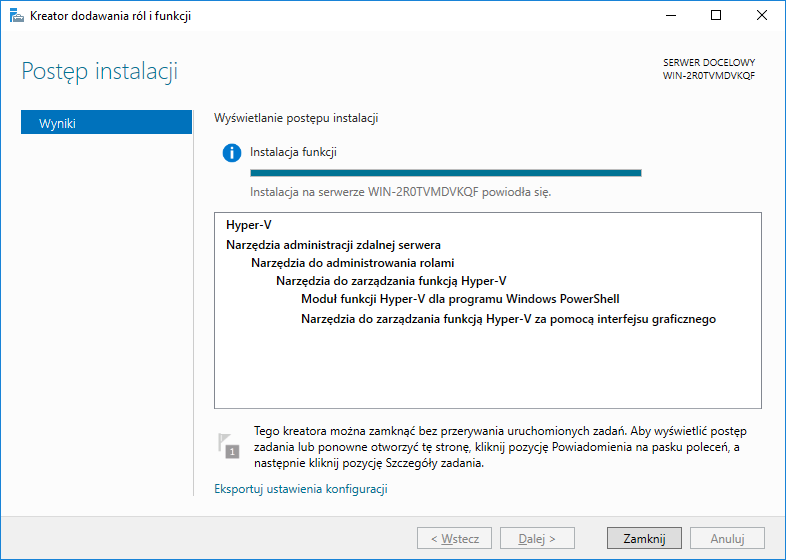
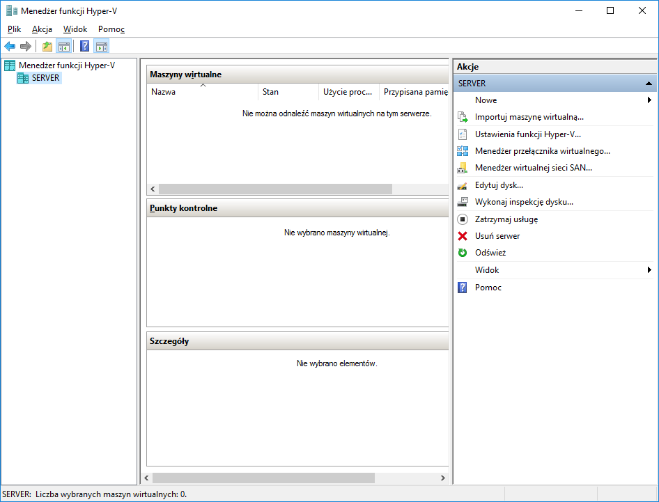
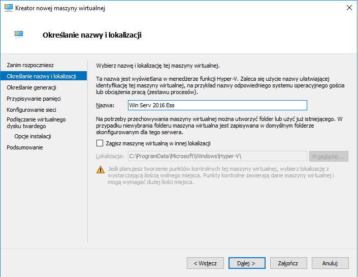
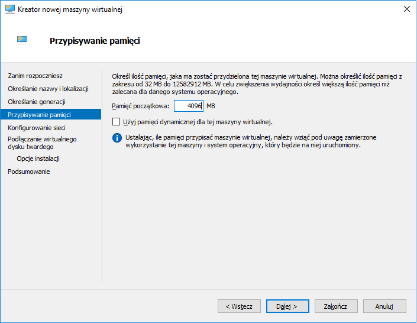
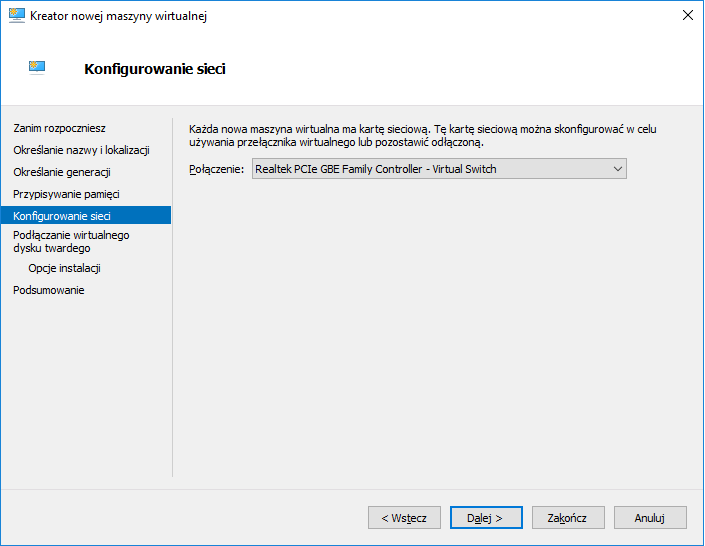
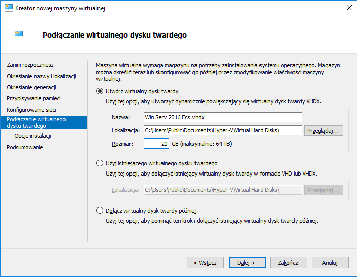
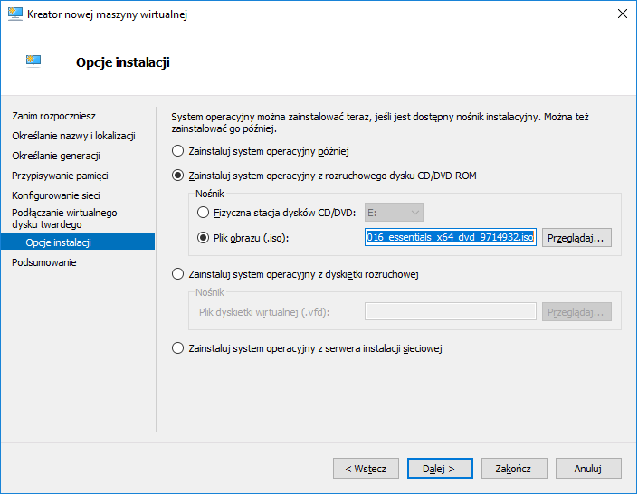
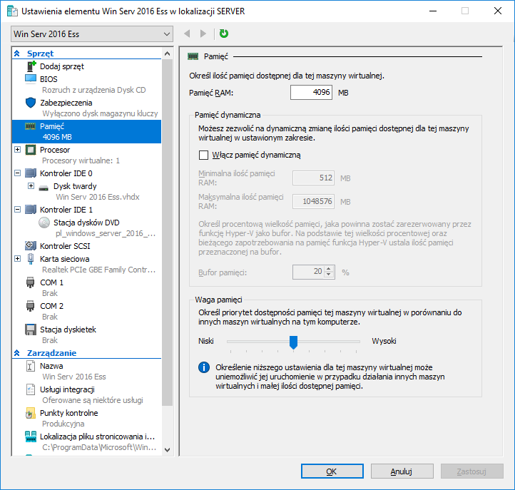
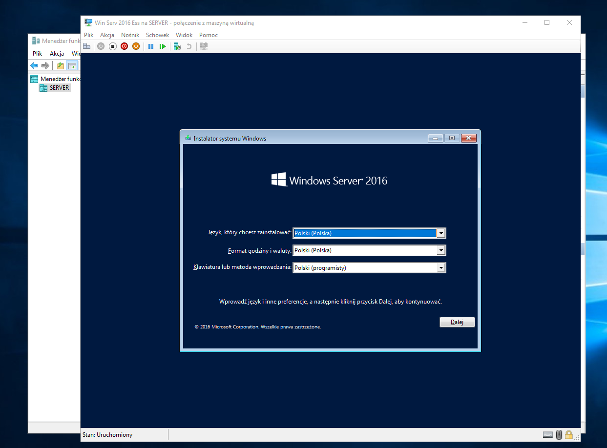

Ćwiczenia 55 -- Hyper-V
1.  Zaloguj się na konto administrator.
2.  Otwórz:
    <https://docs.microsoft.com/en-us/windows-server/virtualization/hyper-v/hyper-v-server-2016#:~:text=Microsoft%20Hyper%2DV%20Server%202016%20is%20a%20stand%2Dalone%20product,server%20utilization%20and%20reduce%20costs>.
3.  Zainstaluj rolę Hyper-V. Menedżer serwera - \> Zarządzaj - \> Dodaj
    usuń role

4.  Uruchom przystawkę Menedżer funkcji Hyper-V.

5.  Stwórz nową maszynę.

6.  Przypisanie pamięci.

7.  Konfigurowanie sieci.

8.  Podłączenie wirtualnego dysku twardego.

9.  Wybór nośnika instalacji.

10. Ustawienia wirtualnej maszyny.

11. Uruchom, następnie połącz.

12. Akcja - \> Alt + Ctrl +Del

13. KONIEC.
