Ćwiczenia 5 -- Ubuntu serwer -- tworzenie i modyfikacja konta
Zaloguj się na swoje konto imienXYZ, gdzie XYZ oznacza kod klasy i
grupy, np. jank3t1
Jeśli nie masz konta, sudo adduser imienXYZ
1.  Dodaj swoje konto do grupy sudo: *sudo usermod twoje_konto -G sudo*
2.  Sprawdzenie czy jesteśmy w grupie sudo: *id konto*
3.  Utwórz katalog \~/konta i przejdź do niego
4.  Założyć grupę www1 o numerze 765.
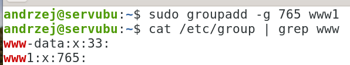
5.  Utworzyć jednym poleceniem konto o nazwie webadmin1 o następujących
    cechach:
<!-- -->
a)  powłoka sh
b)  katalog domowy /home/web/webadmin1
c)  komentarz: webmaster 1
d)  numer użytkownika (uid) równy 601
e)  grupa początkowa: users
f)  grupy dodatkowe: www1, sudo
<!-- -->
6.  Sprawdź czy konto powstało: id webadmin1, cat /etc/passwd.
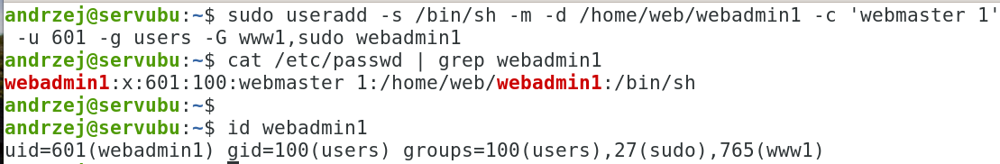
7.  Ustaw hasło dla webadmin1:
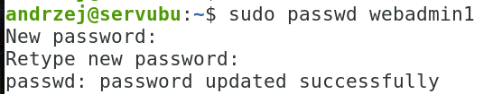
8.  Zaloguj się na konto webadmin1, wydaj komendy: pwd i ls -al. Wyloguj
    się.
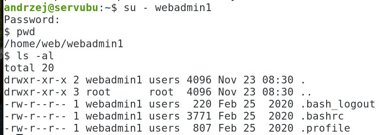
9.  Zmień powłokę użytkownika webadmin1 na bash, a następnie sprawdź
    modyfikację:
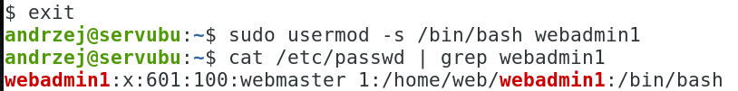
10. Zaloguj się na konto webadmin1, wydaj komendy: id oraz pwd. Wyloguj
    się.
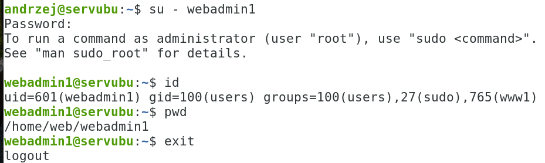
11. Sprawdzić, które powłoki są w systemie:
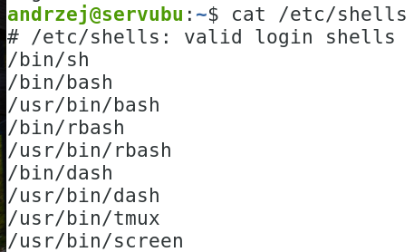
12. Sprawdź gdzie znajduje się powłoka nologin:

13. Zmień powłokę użytkownika webadmin1 na nologin. Spróbuj zalogować
    się na konto webadmin1.
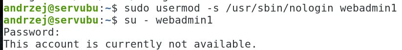
14. Zmień powłokę użytkownika webadmin1 na bash.
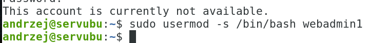
15. Usuń konto webadmin1 z systemu z jednoczesnym skasowaniem jego
    plików
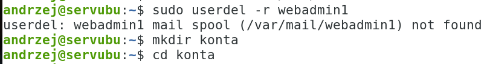
16. 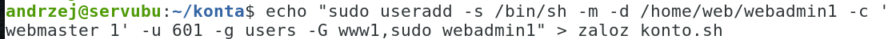
    Poprawne polecenie zakladające konto z wszystkimi
    parametrami zapisz do pliku zaloz_konto.sh
17. 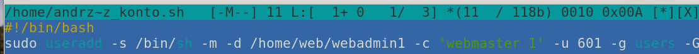
    Sprawdź zawartość pliku
    zaloz_konto.sh, dokonaj ewentualnie poprawki.
18. Sprawdź poprawność usunięcia konta.
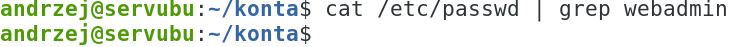
19. Nadaj prawo wykonania dla właściciela pliku zaloz_konto.sh.
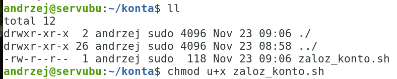
20. Uruchom skrypt zaloz_konto.sh poleceniem:

21. Sprawdź czy konto powstało: id webadmin1, cat /etc/passwd.
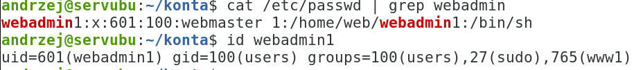
22. *sudo poweroff* ( na koniec zajęć)
