# Ćwiczenia 5 -- Ubuntu serwer -- tworzenie i modyfikacja konta

💡Zaloguj się na swoje konto imienXYZ, gdzie XYZ oznacza kod klasy i
grupy, np. jank3t1
Jeśli nie masz konta, sudo adduser imienXYZ

1. Dodaj swoje konto do grupy sudo: *

   ```bash
   sudo usermod twoje_konto -G sudo
   ```

1. Sprawdzenie czy jesteśmy w grupie sudo:

   ```bash
   id konto
   ```

1. Utwórz katalog \~/konta i przejdź do niego

1. Założyć grupę www1 o numerze 765.

   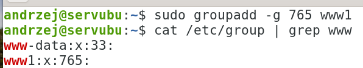

1. Utworzyć jednym poleceniem konto o nazwie webadmin1 o następujących
    cechach:

   - powłoka sh
   - katalog domowy /home/web/webadmin1
   - komentarz: webmaster 1
   - numer użytkownika (uid) równy 601
   - grupa początkowa: users
   - grupy dodatkowe: www1, sudo

1. Sprawdź czy konto powstało: id webadmin1, cat /etc/passwd.

   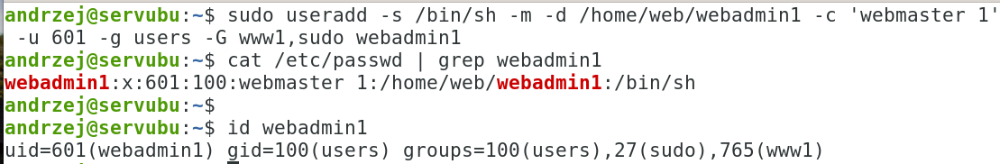

1. Ustaw hasło dla webadmin1:

   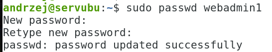

1. Zaloguj się na konto webadmin1, wydaj komendy: pwd i ls -al. Wyloguj
    się.

   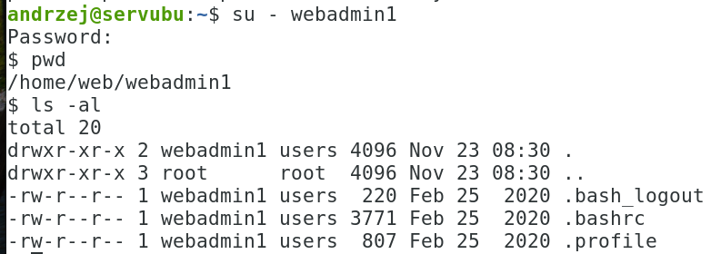

1. Zmień powłokę użytkownika webadmin1 na bash, a następnie sprawdź
    modyfikację:

   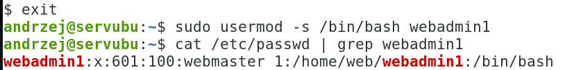

1. Zaloguj się na konto webadmin1, wydaj komendy: id oraz pwd. Wyloguj
    się.

   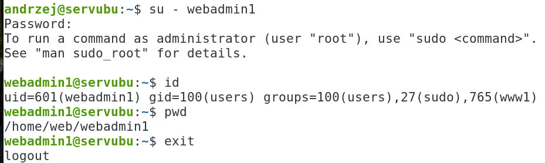

1. Sprawdzić, które powłoki są w systemie:

   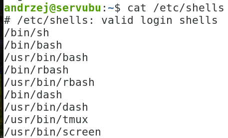

1. Sprawdź gdzie znajduje się powłoka nologin:

   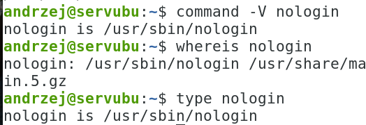

1. Zmień powłokę użytkownika webadmin1 na nologin. Spróbuj zalogować
    się na konto webadmin1.

   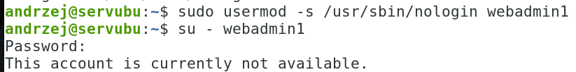

1. Zmień powłokę użytkownika webadmin1 na bash.

   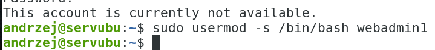

1. Usuń konto webadmin1 z systemu z jednoczesnym skasowaniem jego
    plików

   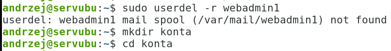

1. Poprawne polecenie zakladające konto z wszystkimi
    parametrami zapisz do pliku zaloz_konto.sh

   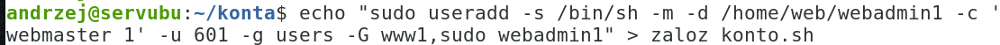

1. Sprawdź zawartość pliku
    zaloz_konto.sh, dokonaj ewentualnie poprawki.

   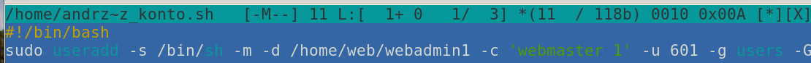

1. Sprawdź poprawność usunięcia konta.

   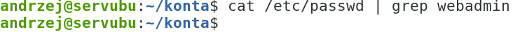

1. Nadaj prawo wykonania dla właściciela pliku zaloz_konto.sh.

   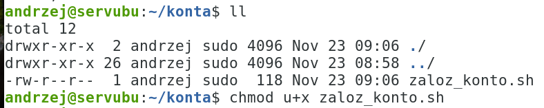

1. Uruchom skrypt zaloz_konto.sh poleceniem:

   

1. Sprawdź czy konto powstało: id webadmin1, cat /etc/passwd.

   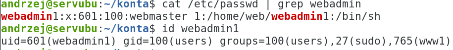

1. Na koniec zajęć:

   ```bash
   sudo poweroff
   ```
