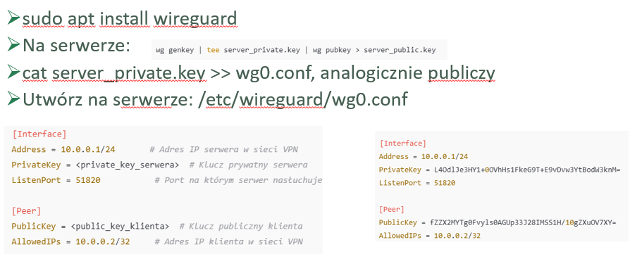
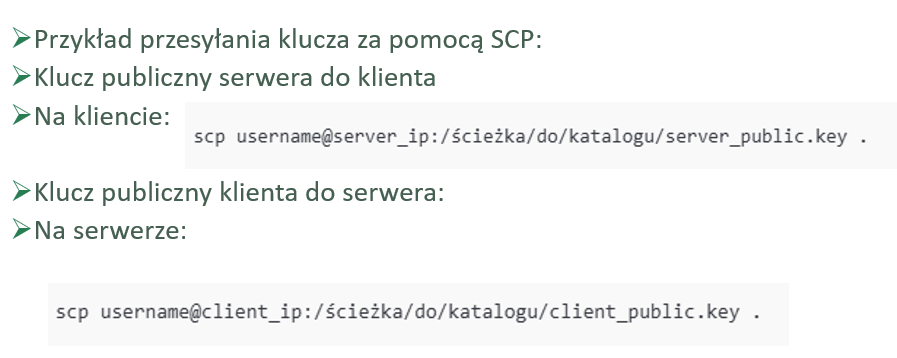
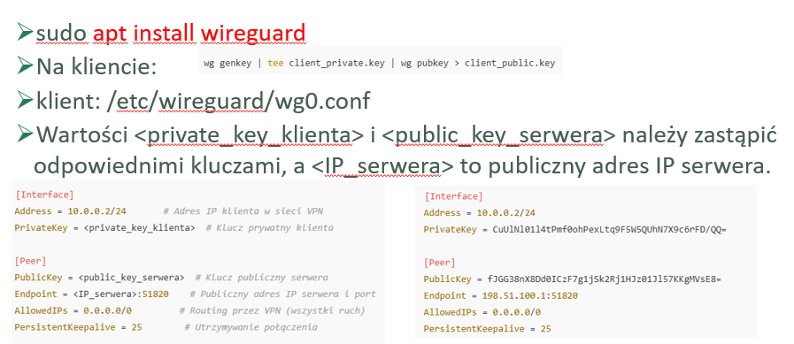
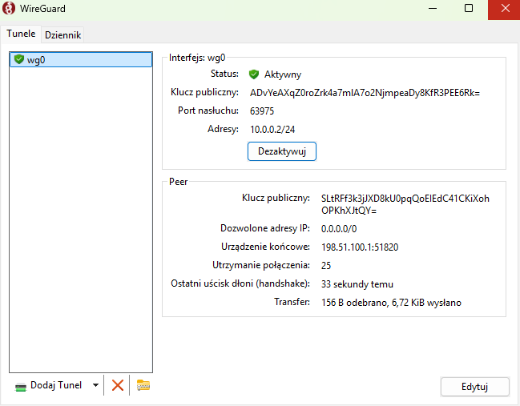
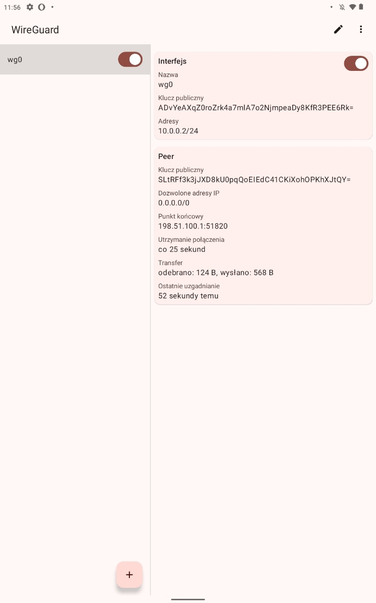
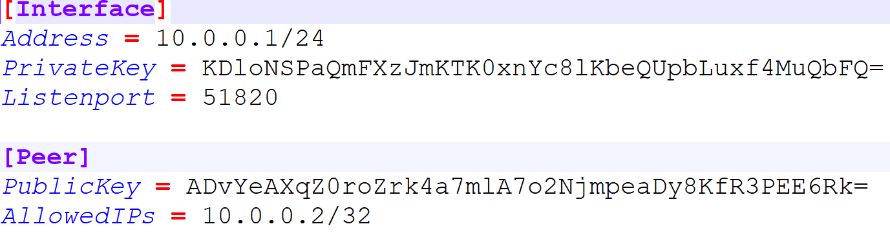
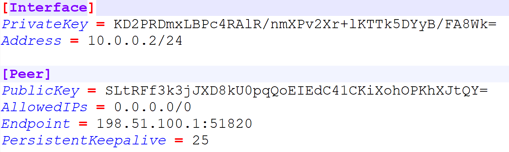

Ćwiczenia 61 -- instalacja i konfiguracja VPN - wireguard
1.  Zaloguj się na swoje konto w ubuntu server
2.  
    Instalacja WireGuard na serwerze:
3.  Uruchomienie wireguard i sprawdzenie stanu:
> 
4.  Przesłanie kluczy publicznych:
> 
5.  Instalacja WireGuard na kliencie ubuntu desktop:
> 
6.  Instalacja WireGuard na kliencie windows:
> 
7.  Instalacja WireGuard na kliencie android (tablet):
> 
8.  Przykład dla serwera:
> 
9.  Przykład dla klienta:

10. KONIEC
